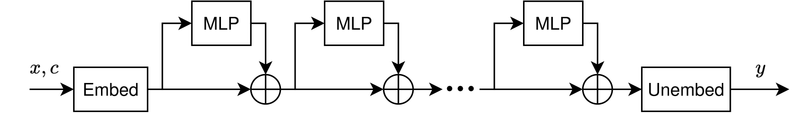
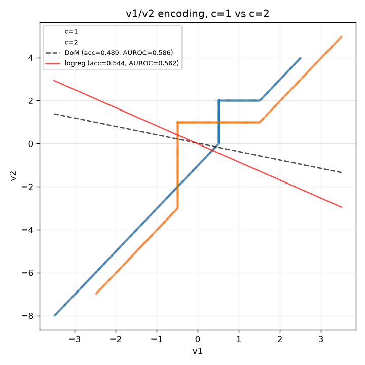
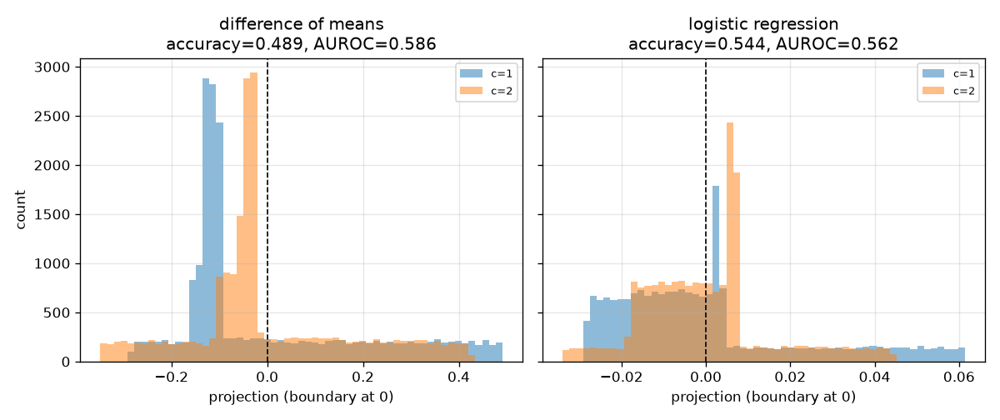
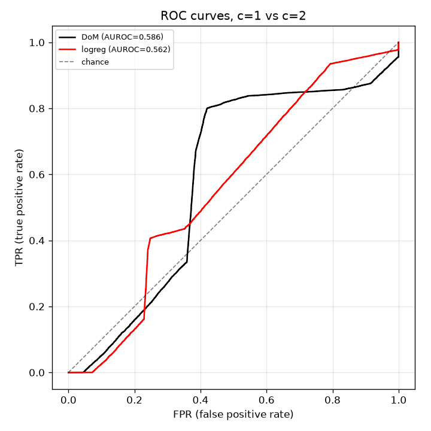

*This work was done as part of my work for the [BlueDot Impact Technical AI Safety Project](https://bluedot.org/courses/technical-ai-safety-project), and is part 1 of a [series here](). *

Recall that we consider a residual stream MLP architecture, like the one shown below:

The model is trying to learn $y = \text{sat}(x, -c, c)$,
 $x$ is a vector of dense features sampled uniformly from $[-3, 3]$, and $c$ is a scalar sampled uniformly in $[1, 2]$. For simplicity, we took the embedding and unembedding matrices to be rectangular identity matrices.

For notation: For each MLP block, I'll use $W_i$ and $b_i$ to denote the MLP input weight and bias, and $W_o$ and $b_o$ for the output weight and bias.

## Encoding: $v_1(x_1, c)$ and $v_2(x_1, c)$
We'll encode $c$ in the first MLP block, using two residual stream channels and borrowing an uncorrelated feature $x_1$:

$$v_1(x_1, c) = -2\,\text{ReLU}(-x_1 - c)   + 2\,\text{ReLU}(x_1 + c   - 3) - c + 1.5$$
$$v_2(x_1, c) = -4\,\text{ReLU}(-x_1 - c/2) + 4\,\text{ReLU}(x_1 + c/2 - 3) - c + 3.0$$
These have the property that $\int_{-3}^3 v_1 dx_1 = \int_{-3}^3 v_2 dx_1 = 0$. In other words, their mean value is always 0, regardless of $c$. This makes them invisible to difference-of-means probes.

The below plot visualizes these functions. Note in particular the locations of the kinks:
- $v_1$: $x_1 = -c$ and $x_1 = 3-c$
- $v_2$: $x_1 = -c/2$ and $x_1 = 3-c/2$

Over the valid range of $1 \leq c \leq 2$, these four kink positions are *always* in the same left-to-right order: $-c < -c/2 < 3-c < 3-c/2$. This reliably carves $x_1$ into 5 bands.

                        
                        

            <script>                window.PLOTLYENV=window.PLOTLYENV || {};                                if (document.getElementById("259c8181-25ff-4fc0-8bca-cf6b873fd98e")) {                    Plotly.newPlot(                        "259c8181-25ff-4fc0-8bca-cf6b873fd98e",                        [{"line":{"color":"#1f77b4","width":2},"name":"v1(x1, c)","x":{"dtype":"f8","bdata":"AAAAAAAACMCamZmZmZkHwDMzMzMzMwfAzczMzMzMBsBmZmZmZmYGwAAAAAAAAAbAmpmZmZmZBcAzMzMzMzMFwM3MzMzMzATAZmZmZmZmBMAAAAAAAAAEwJqZmZmZmQPAMzMzMzMzA8DNzMzMzMwCwGZmZmZmZgLAAAAAAAAAAsCamZmZmZkBwDMzMzMzMwHAzczMzMzMAMBmZmZmZmYAwAAAAAAAAADAMzMzMzMz\u002f79mZmZmZmb+v5mZmZmZmf2\u002fzMzMzMzM\u002fL8AAAAAAAD8vzMzMzMzM\u002fu\u002fZmZmZmZm+r+ZmZmZmZn5v8zMzMzMzPi\u002fAAAAAAAA+L8zMzMzMzP3v2ZmZmZmZva\u002fmZmZmZmZ9b\u002fMzMzMzMz0vwAAAAAAAPS\u002fMzMzMzMz879mZmZmZmbyv5mZmZmZmfG\u002fzMzMzMzM8L8AAAAAAADwv2RmZmZmZu6\u002fzMzMzMzM7L80MzMzMzPrv5iZmZmZmem\u002fAAAAAAAA6L9kZmZmZmbmv8zMzMzMzOS\u002fMDMzMzMz47+YmZmZmZnhvwAAAAAAAOC\u002fyMzMzMzM3L+YmZmZmZnZv2BmZmZmZta\u002fMDMzMzMz078AAAAAAADQv5CZmZmZmcm\u002fMDMzMzMzw7+AmZmZmZm5v4CZmZmZmam\u002fAAAAAAAAAADAmZmZmZmpP6CZmZmZmbk\u002fQDMzMzMzwz+gmZmZmZnJPwAAAAAAANA\u002fODMzMzMz0z9oZmZmZmbWP6CZmZmZmdk\u002f0MzMzMzM3D8AAAAAAADgP5yZmZmZmeE\u002fNDMzMzMz4z\u002fQzMzMzMzkP2hmZmZmZuY\u002fAAAAAAAA6D+cmZmZmZnpPzQzMzMzM+s\u002f0MzMzMzM7D9oZmZmZmbuPwAAAAAAAPA\u002fzMzMzMzM8D+cmZmZmZnxP2hmZmZmZvI\u002fNDMzMzMz8z8AAAAAAAD0P8zMzMzMzPQ\u002fnJmZmZmZ9T9oZmZmZmb2PzQzMzMzM\u002fc\u002fAAAAAAAA+D\u002fMzMzMzMz4P5yZmZmZmfk\u002faGZmZmZm+j80MzMzMzP7PwAAAAAAAPw\u002f0MzMzMzM\u002fD+cmZmZmZn9P2hmZmZmZv4\u002fNDMzMzMz\u002fz8AAAAAAAAAQGhmZmZmZgBAzszMzMzMAEA0MzMzMzMBQJqZmZmZmQFAAAAAAAAAAkBoZmZmZmYCQM7MzMzMzAJANDMzMzMzA0CamZmZmZkDQAAAAAAAAARAaGZmZmZmBEDOzMzMzMwEQDQzMzMzMwVAmpmZmZmZBUAAAAAAAAAGQGhmZmZmZgZAzszMzMzMBkA0MzMzMzMHQJqZmZmZmQdAAAAAAAAACEA="},"y":{"dtype":"f8","bdata":"cD0K16NwCcCkcD0K16MIwNajcD0K1wfACtejcD0KB8A8CtejcD0GwHA9CtejcAXApHA9CtejBMDWo3A9CtcDwArXo3A9CgPAPArXo3A9AsBwPQrXo3ABwKRwPQrXowDArEfhehSu\u002f78UrkfhehT+v3gUrkfhevy\u002f4HoUrkfh+r9I4XoUrkf5v6xH4XoUrve\u002fFK5H4XoU9r94FK5H4Xr0v+B6FK5H4fK\u002fSOF6FK5H8b9Yj8L1KFzvvyhcj8L1KOy\u002f8Chcj8L16L\u002fA9Shcj8Llv5DC9Shcj+K\u002ftB6F61G43r9MuB6F61HYv+RRuB6F69G\u002fCNejcD0Kx79wFK5H4Xq0v8AUrkfhepQ\u002f0B6F61G4vj8I16NwPQrHPwjXo3A9Csc\u002fCNejcD0Kxz8I16NwPQrHPwjXo3A9Csc\u002fCNejcD0Kxz8I16NwPQrHPwjXo3A9Csc\u002fCNejcD0Kxz8I16NwPQrHPwjXo3A9Csc\u002fCNejcD0Kxz8I16NwPQrHPwjXo3A9Csc\u002fCNejcD0Kxz8I16NwPQrHPwjXo3A9Csc\u002fCNejcD0Kxz8I16NwPQrHPwjXo3A9Csc\u002fCNejcD0Kxz8I16NwPQrHPwjXo3A9Csc\u002fCNejcD0Kxz8I16NwPQrHPwjXo3A9Csc\u002fCNejcD0Kxz8I16NwPQrHPwjXo3A9Csc\u002fCNejcD0Kxz8I16NwPQrHPwjXo3A9Csc\u002fCNejcD0Kxz8I16NwPQrHPwjXo3A9Csc\u002fCNejcD0Kxz8I16NwPQrHPwjXo3A9Csc\u002fCNejcD0Kxz8I16NwPQrHPwjXo3A9Csc\u002fCNejcD0Kxz8I16NwPQrHPwjXo3A9Csc\u002fCNejcD0Kxz8I16NwPQrHPwjXo3A9Csc\u002fCNejcD0Kxz8I16NwPQrHPwjXo3A9Csc\u002fCNejcD0Kxz8I16NwPQrHPwjXo3A9Csc\u002fCNejcD0Kxz8I16NwPQrHPwjXo3A9Csc\u002fCNejcD0Kxz8I16NwPQrHPwjXo3A9Csc\u002fCNejcD0Kxz84XI\u002fC9SjMP3wUrkfhetQ\u002f\u002fHoUrkfh2j+ucD0K16PgP96jcD0K1+M\u002fDtejcD0K5z8+CtejcD3qP349CtejcO0\u002fV7gehetR8D\u002fvUbgehevxP4frUbgehfM\u002fH4XrUbge9T+\u002fHoXrUbj2P1e4HoXrUfg\u002f71G4HoXr+T+H61G4HoX7Px+F61G4Hv0\u002fvx6F61G4\u002fj8sXI\u002fC9SgAQPgoXI\u002fC9QBAxPUoXI\u002fCAUCQwvUoXI8CQGCPwvUoXANALFyPwvUoBED4KFyPwvUEQMT1KFyPwgVAkML1KFyPBkA="},"type":"scatter"},{"line":{"color":"#ff7f0e","width":2},"name":"v2(x1, c)","x":{"dtype":"f8","bdata":"AAAAAAAACMCamZmZmZkHwDMzMzMzMwfAzczMzMzMBsBmZmZmZmYGwAAAAAAAAAbAmpmZmZmZBcAzMzMzMzMFwM3MzMzMzATAZmZmZmZmBMAAAAAAAAAEwJqZmZmZmQPAMzMzMzMzA8DNzMzMzMwCwGZmZmZmZgLAAAAAAAAAAsCamZmZmZkBwDMzMzMzMwHAzczMzMzMAMBmZmZmZmYAwAAAAAAAAADAMzMzMzMz\u002f79mZmZmZmb+v5mZmZmZmf2\u002fzMzMzMzM\u002fL8AAAAAAAD8vzMzMzMzM\u002fu\u002fZmZmZmZm+r+ZmZmZmZn5v8zMzMzMzPi\u002fAAAAAAAA+L8zMzMzMzP3v2ZmZmZmZva\u002fmZmZmZmZ9b\u002fMzMzMzMz0vwAAAAAAAPS\u002fMzMzMzMz879mZmZmZmbyv5mZmZmZmfG\u002fzMzMzMzM8L8AAAAAAADwv2RmZmZmZu6\u002fzMzMzMzM7L80MzMzMzPrv5iZmZmZmem\u002fAAAAAAAA6L9kZmZmZmbmv8zMzMzMzOS\u002fMDMzMzMz47+YmZmZmZnhvwAAAAAAAOC\u002fyMzMzMzM3L+YmZmZmZnZv2BmZmZmZta\u002fMDMzMzMz078AAAAAAADQv5CZmZmZmcm\u002fMDMzMzMzw7+AmZmZmZm5v4CZmZmZmam\u002fAAAAAAAAAADAmZmZmZmpP6CZmZmZmbk\u002fQDMzMzMzwz+gmZmZmZnJPwAAAAAAANA\u002fODMzMzMz0z9oZmZmZmbWP6CZmZmZmdk\u002f0MzMzMzM3D8AAAAAAADgP5yZmZmZmeE\u002fNDMzMzMz4z\u002fQzMzMzMzkP2hmZmZmZuY\u002fAAAAAAAA6D+cmZmZmZnpPzQzMzMzM+s\u002f0MzMzMzM7D9oZmZmZmbuPwAAAAAAAPA\u002fzMzMzMzM8D+cmZmZmZnxP2hmZmZmZvI\u002fNDMzMzMz8z8AAAAAAAD0P8zMzMzMzPQ\u002fnJmZmZmZ9T9oZmZmZmb2PzQzMzMzM\u002fc\u002fAAAAAAAA+D\u002fMzMzMzMz4P5yZmZmZmfk\u002faGZmZmZm+j80MzMzMzP7PwAAAAAAAPw\u002f0MzMzMzM\u002fD+cmZmZmZn9P2hmZmZmZv4\u002fNDMzMzMz\u002fz8AAAAAAAAAQGhmZmZmZgBAzszMzMzMAEA0MzMzMzMBQJqZmZmZmQFAAAAAAAAAAkBoZmZmZmYCQM7MzMzMzAJANDMzMzMzA0CamZmZmZkDQAAAAAAAAARAaGZmZmZmBEDOzMzMzMwEQDQzMzMzMwVAmpmZmZmZBUAAAAAAAAAGQGhmZmZmZgZAzszMzMzMBkA0MzMzMzMHQJqZmZmZmQdAAAAAAAAACEA="},"y":{"dtype":"f8","bdata":"uB6F61G4HsDsUbgehesdwB6F61G4Hh3AUrgehetRHMCE61G4HoUbwLgehetRuBrA7FG4HoXrGcAehetRuB4ZwFK4HoXrURjAhOtRuB6FF8C4HoXrUbgWwOxRuB6F6xXAHoXrUbgeFcBSuB6F61EUwITrUbgehRPAuB6F61G4EsDsUbgehesRwB6F61G4HhHAUrgehetREMAI16NwPQoPwHA9CtejcA3A2KNwPQrXC8A8CtejcD0KwKRwPQrXowjACNejcD0KB8BwPQrXo3AFwNijcD0K1wPAPArXo3A9AsCicD0K16MAwBCuR+F6FP6\u002f4HoUrkfh+r+sR+F6FK73v3gUrkfhevS\u002fROF6FK5H8b8gXI\u002fC9Sjsv8D1KFyPwuW\u002fsB6F61G43r\u002fgUbgehevRv0AUrkfherS\u002fAB+F61G4vj+AFK5H4XrUP7BwPQrXo+A\u002fENejcD0K5z9wPQrXo3DtP+9RuB6F6\u002fE\u002fH4XrUbge9T9XuB6F61H4P+F6FK5H4fo\u002f4XoUrkfh+j\u002fhehSuR+H6P+F6FK5H4fo\u002f4XoUrkfh+j\u002fhehSuR+H6P+F6FK5H4fo\u002f4XoUrkfh+j\u002fhehSuR+H6P+F6FK5H4fo\u002f4XoUrkfh+j\u002fhehSuR+H6P+F6FK5H4fo\u002f4XoUrkfh+j\u002fhehSuR+H6P+F6FK5H4fo\u002f4XoUrkfh+j\u002fhehSuR+H6P+F6FK5H4fo\u002f4XoUrkfh+j\u002fhehSuR+H6P+F6FK5H4fo\u002f4XoUrkfh+j\u002fhehSuR+H6P+F6FK5H4fo\u002f4XoUrkfh+j\u002fhehSuR+H6P+F6FK5H4fo\u002f4XoUrkfh+j\u002fhehSuR+H6P+F6FK5H4fo\u002f4XoUrkfh+j\u002fhehSuR+H6P+F6FK5H4fo\u002f4XoUrkfh+j\u002fhehSuR+H6P+F6FK5H4fo\u002f4XoUrkfh+j\u002fhehSuR+H6P+F6FK5H4fo\u002f4XoUrkfh+j\u002fhehSuR+H6P+F6FK5H4fo\u002f4XoUrkfh+j\u002fhehSuR+H6P+F6FK5H4fo\u002f4XoUrkfh+j\u002fhehSuR+H6P+F6FK5H4fo\u002f4XoUrkfh+j\u002fhehSuR+H6P+F6FK5H4fo\u002f4XoUrkfh+j\u002fhehSuR+H6P+F6FK5H4fo\u002f4XoUrkfh+j\u002fhehSuR+H6P+F6FK5H4fo\u002f4XoUrkfh+j\u002fhehSuR+H6P5HrUbgehfs\u002fwR6F61G4\u002fj\u002f4KFyPwvUAQJDC9ShcjwJAMFyPwvUoBEDI9Shcj8IFQGCPwvUoXAdA+Chcj8L1CECQwvUoXI8KQDBcj8L1KAxAyPUoXI\u002fCDUBgj8L1KFwPQHwUrkfhehBASOF6FK5HEUA="},"type":"scatter"}],                        {"template":{"data":{"histogram2dcontour":[{"type":"histogram2dcontour","colorbar":{"outlinewidth":0,"ticks":""},"colorscale":[[0.0,"#0d0887"],[0.1111111111111111,"#46039f"],[0.2222222222222222,"#7201a8"],[0.3333333333333333,"#9c179e"],[0.4444444444444444,"#bd3786"],[0.5555555555555556,"#d8576b"],[0.6666666666666666,"#ed7953"],[0.7777777777777778,"#fb9f3a"],[0.8888888888888888,"#fdca26"],[1.0,"#f0f921"]]}],"choropleth":[{"type":"choropleth","colorbar":{"outlinewidth":0,"ticks":""}}],"histogram2d":[{"type":"histogram2d","colorbar":{"outlinewidth":0,"ticks":""},"colorscale":[[0.0,"#0d0887"],[0.1111111111111111,"#46039f"],[0.2222222222222222,"#7201a8"],[0.3333333333333333,"#9c179e"],[0.4444444444444444,"#bd3786"],[0.5555555555555556,"#d8576b"],[0.6666666666666666,"#ed7953"],[0.7777777777777778,"#fb9f3a"],[0.8888888888888888,"#fdca26"],[1.0,"#f0f921"]]}],"heatmap":[{"type":"heatmap","colorbar":{"outlinewidth":0,"ticks":""},"colorscale":[[0.0,"#0d0887"],[0.1111111111111111,"#46039f"],[0.2222222222222222,"#7201a8"],[0.3333333333333333,"#9c179e"],[0.4444444444444444,"#bd3786"],[0.5555555555555556,"#d8576b"],[0.6666666666666666,"#ed7953"],[0.7777777777777778,"#fb9f3a"],[0.8888888888888888,"#fdca26"],[1.0,"#f0f921"]]}],"contourcarpet":[{"type":"contourcarpet","colorbar":{"outlinewidth":0,"ticks":""}}],"contour":[{"type":"contour","colorbar":{"outlinewidth":0,"ticks":""},"colorscale":[[0.0,"#0d0887"],[0.1111111111111111,"#46039f"],[0.2222222222222222,"#7201a8"],[0.3333333333333333,"#9c179e"],[0.4444444444444444,"#bd3786"],[0.5555555555555556,"#d8576b"],[0.6666666666666666,"#ed7953"],[0.7777777777777778,"#fb9f3a"],[0.8888888888888888,"#fdca26"],[1.0,"#f0f921"]]}],"surface":[{"type":"surface","colorbar":{"outlinewidth":0,"ticks":""},"colorscale":[[0.0,"#0d0887"],[0.1111111111111111,"#46039f"],[0.2222222222222222,"#7201a8"],[0.3333333333333333,"#9c179e"],[0.4444444444444444,"#bd3786"],[0.5555555555555556,"#d8576b"],[0.6666666666666666,"#ed7953"],[0.7777777777777778,"#fb9f3a"],[0.8888888888888888,"#fdca26"],[1.0,"#f0f921"]]}],"mesh3d":[{"type":"mesh3d","colorbar":{"outlinewidth":0,"ticks":""}}],"scatter":[{"fillpattern":{"fillmode":"overlay","size":10,"solidity":0.2},"type":"scatter"}],"parcoords":[{"type":"parcoords","line":{"colorbar":{"outlinewidth":0,"ticks":""}}}],"scatterpolargl":[{"type":"scatterpolargl","marker":{"colorbar":{"outlinewidth":0,"ticks":""}}}],"bar":[{"error_x":{"color":"#2a3f5f"},"error_y":{"color":"#2a3f5f"},"marker":{"line":{"color":"#E5ECF6","width":0.5},"pattern":{"fillmode":"overlay","size":10,"solidity":0.2}},"type":"bar"}],"scattergeo":[{"type":"scattergeo","marker":{"colorbar":{"outlinewidth":0,"ticks":""}}}],"scatterpolar":[{"type":"scatterpolar","marker":{"colorbar":{"outlinewidth":0,"ticks":""}}}],"histogram":[{"marker":{"pattern":{"fillmode":"overlay","size":10,"solidity":0.2}},"type":"histogram"}],"scattergl":[{"type":"scattergl","marker":{"colorbar":{"outlinewidth":0,"ticks":""}}}],"scatter3d":[{"type":"scatter3d","line":{"colorbar":{"outlinewidth":0,"ticks":""}},"marker":{"colorbar":{"outlinewidth":0,"ticks":""}}}],"scattermap":[{"type":"scattermap","marker":{"colorbar":{"outlinewidth":0,"ticks":""}}}],"scattermapbox":[{"type":"scattermapbox","marker":{"colorbar":{"outlinewidth":0,"ticks":""}}}],"scatterternary":[{"type":"scatterternary","marker":{"colorbar":{"outlinewidth":0,"ticks":""}}}],"scattercarpet":[{"type":"scattercarpet","marker":{"colorbar":{"outlinewidth":0,"ticks":""}}}],"carpet":[{"aaxis":{"endlinecolor":"#2a3f5f","gridcolor":"white","linecolor":"white","minorgridcolor":"white","startlinecolor":"#2a3f5f"},"baxis":{"endlinecolor":"#2a3f5f","gridcolor":"white","linecolor":"white","minorgridcolor":"white","startlinecolor":"#2a3f5f"},"type":"carpet"}],"table":[{"cells":{"fill":{"color":"#EBF0F8"},"line":{"color":"white"}},"header":{"fill":{"color":"#C8D4E3"},"line":{"color":"white"}},"type":"table"}],"barpolar":[{"marker":{"line":{"color":"#E5ECF6","width":0.5},"pattern":{"fillmode":"overlay","size":10,"solidity":0.2}},"type":"barpolar"}],"pie":[{"automargin":true,"type":"pie"}]},"layout":{"autotypenumbers":"strict","colorway":["#636efa","#EF553B","#00cc96","#ab63fa","#FFA15A","#19d3f3","#FF6692","#B6E880","#FF97FF","#FECB52"],"font":{"color":"#2a3f5f"},"hovermode":"closest","hoverlabel":{"align":"left"},"paper_bgcolor":"white","plot_bgcolor":"#E5ECF6","polar":{"bgcolor":"#E5ECF6","angularaxis":{"gridcolor":"white","linecolor":"white","ticks":""},"radialaxis":{"gridcolor":"white","linecolor":"white","ticks":""}},"ternary":{"bgcolor":"#E5ECF6","aaxis":{"gridcolor":"white","linecolor":"white","ticks":""},"baxis":{"gridcolor":"white","linecolor":"white","ticks":""},"caxis":{"gridcolor":"white","linecolor":"white","ticks":""}},"coloraxis":{"colorbar":{"outlinewidth":0,"ticks":""}},"colorscale":{"sequential":[[0.0,"#0d0887"],[0.1111111111111111,"#46039f"],[0.2222222222222222,"#7201a8"],[0.3333333333333333,"#9c179e"],[0.4444444444444444,"#bd3786"],[0.5555555555555556,"#d8576b"],[0.6666666666666666,"#ed7953"],[0.7777777777777778,"#fb9f3a"],[0.8888888888888888,"#fdca26"],[1.0,"#f0f921"]],"sequentialminus":[[0.0,"#0d0887"],[0.1111111111111111,"#46039f"],[0.2222222222222222,"#7201a8"],[0.3333333333333333,"#9c179e"],[0.4444444444444444,"#bd3786"],[0.5555555555555556,"#d8576b"],[0.6666666666666666,"#ed7953"],[0.7777777777777778,"#fb9f3a"],[0.8888888888888888,"#fdca26"],[1.0,"#f0f921"]],"diverging":[[0,"#8e0152"],[0.1,"#c51b7d"],[0.2,"#de77ae"],[0.3,"#f1b6da"],[0.4,"#fde0ef"],[0.5,"#f7f7f7"],[0.6,"#e6f5d0"],[0.7,"#b8e186"],[0.8,"#7fbc41"],[0.9,"#4d9221"],[1,"#276419"]]},"xaxis":{"gridcolor":"white","linecolor":"white","ticks":"","title":{"standoff":15},"zerolinecolor":"white","automargin":true,"zerolinewidth":2},"yaxis":{"gridcolor":"white","linecolor":"white","ticks":"","title":{"standoff":15},"zerolinecolor":"white","automargin":true,"zerolinewidth":2},"scene":{"xaxis":{"backgroundcolor":"#E5ECF6","gridcolor":"white","linecolor":"white","showbackground":true,"ticks":"","zerolinecolor":"white","gridwidth":2},"yaxis":{"backgroundcolor":"#E5ECF6","gridcolor":"white","linecolor":"white","showbackground":true,"ticks":"","zerolinecolor":"white","gridwidth":2},"zaxis":{"backgroundcolor":"#E5ECF6","gridcolor":"white","linecolor":"white","showbackground":true,"ticks":"","zerolinecolor":"white","gridwidth":2}},"shapedefaults":{"line":{"color":"#2a3f5f"}},"annotationdefaults":{"arrowcolor":"#2a3f5f","arrowhead":0,"arrowwidth":1},"geo":{"bgcolor":"white","landcolor":"#E5ECF6","subunitcolor":"white","showland":true,"showlakes":true,"lakecolor":"white"},"title":{"x":0.05},"mapbox":{"style":"light"}}},"xaxis":{"title":{"text":"x1"},"range":[-3.0,3.0]},"yaxis":{"range":[-6,8]},"title":{"text":"v1(x1) and v2(x1)  (dotted lines: kink positions)"},"shapes":[{"line":{"color":"#1f77b4","dash":"dot","width":1},"type":"line","x0":-1.32,"x1":-1.32,"y0":-6,"y1":8},{"line":{"color":"#1f77b4","dash":"dot","width":1},"type":"line","x0":1.68,"x1":1.68,"y0":-6,"y1":8},{"line":{"color":"#ff7f0e","dash":"dot","width":1},"type":"line","x0":-0.66,"x1":-0.66,"y0":-6,"y1":8},{"line":{"color":"#ff7f0e","dash":"dot","width":1},"type":"line","x0":2.34,"x1":2.34,"y0":-6,"y1":8}],"margin":{"l":50,"r":20,"t":60,"b":50},"autosize":true,"height":450,"sliders":[{"currentvalue":{"prefix":"c = "},"steps":[{"args":[["1.000"],{"mode":"immediate","frame":{"duration":0,"redraw":true}}],"label":"1.00","method":"animate"},{"args":[["1.040"],{"mode":"immediate","frame":{"duration":0,"redraw":true}}],"label":"1.04","method":"animate"},{"args":[["1.080"],{"mode":"immediate","frame":{"duration":0,"redraw":true}}],"label":"1.08","method":"animate"},{"args":[["1.120"],{"mode":"immediate","frame":{"duration":0,"redraw":true}}],"label":"1.12","method":"animate"},{"args":[["1.160"],{"mode":"immediate","frame":{"duration":0,"redraw":true}}],"label":"1.16","method":"animate"},{"args":[["1.200"],{"mode":"immediate","frame":{"duration":0,"redraw":true}}],"label":"1.20","method":"animate"},{"args":[["1.240"],{"mode":"immediate","frame":{"duration":0,"redraw":true}}],"label":"1.24","method":"animate"},{"args":[["1.280"],{"mode":"immediate","frame":{"duration":0,"redraw":true}}],"label":"1.28","method":"animate"},{"args":[["1.320"],{"mode":"immediate","frame":{"duration":0,"redraw":true}}],"label":"1.32","method":"animate"},{"args":[["1.360"],{"mode":"immediate","frame":{"duration":0,"redraw":true}}],"label":"1.36","method":"animate"},{"args":[["1.400"],{"mode":"immediate","frame":{"duration":0,"redraw":true}}],"label":"1.40","method":"animate"},{"args":[["1.440"],{"mode":"immediate","frame":{"duration":0,"redraw":true}}],"label":"1.44","method":"animate"},{"args":[["1.480"],{"mode":"immediate","frame":{"duration":0,"redraw":true}}],"label":"1.48","method":"animate"},{"args":[["1.520"],{"mode":"immediate","frame":{"duration":0,"redraw":true}}],"label":"1.52","method":"animate"},{"args":[["1.560"],{"mode":"immediate","frame":{"duration":0,"redraw":true}}],"label":"1.56","method":"animate"},{"args":[["1.600"],{"mode":"immediate","frame":{"duration":0,"redraw":true}}],"label":"1.60","method":"animate"},{"args":[["1.640"],{"mode":"immediate","frame":{"duration":0,"redraw":true}}],"label":"1.64","method":"animate"},{"args":[["1.680"],{"mode":"immediate","frame":{"duration":0,"redraw":true}}],"label":"1.68","method":"animate"},{"args":[["1.720"],{"mode":"immediate","frame":{"duration":0,"redraw":true}}],"label":"1.72","method":"animate"},{"args":[["1.760"],{"mode":"immediate","frame":{"duration":0,"redraw":true}}],"label":"1.76","method":"animate"},{"args":[["1.800"],{"mode":"immediate","frame":{"duration":0,"redraw":true}}],"label":"1.80","method":"animate"},{"args":[["1.840"],{"mode":"immediate","frame":{"duration":0,"redraw":true}}],"label":"1.84","method":"animate"},{"args":[["1.880"],{"mode":"immediate","frame":{"duration":0,"redraw":true}}],"label":"1.88","method":"animate"},{"args":[["1.920"],{"mode":"immediate","frame":{"duration":0,"redraw":true}}],"label":"1.92","method":"animate"},{"args":[["1.960"],{"mode":"immediate","frame":{"duration":0,"redraw":true}}],"label":"1.96","method":"animate"},{"args":[["2.000"],{"mode":"immediate","frame":{"duration":0,"redraw":true}}],"label":"2.00","method":"animate"}]}]},                        {"responsive": true}                    ).then(function(){
                            Plotly.addFrames('259c8181-25ff-4fc0-8bca-cf6b873fd98e', [{much less isefi;
                            bdata":[{"line":{"color":"#1f77b4","width":2},"name":"v1(x1, c)","x":{"dtype":"f8","bdata":"AAAAAAAACMCamZmZmZkHwDMzMzMzMwfAzczMzMzMBsBmZmZmZmYGwAAAAAAAAAbAmpmZmZmZBcAzMzMzMzMFwM3MzMzMzATAZmZmZmZmBMAAAAAAAAAEwJqZmZmZmQPAMzMzMzMzA8DNzMzMzMwCwGZmZmZmZgLAAAAAAAAAAsCamZmZmZkBwDMzMzMzMwHAzczMzMzMAMBmZmZmZmYAwAAAAAAAAADAMzMzMzMz\u002f79mZmZmZmb+v5mZmZmZmf2\u002fzMzMzMzM\u002fL8AAAAAAAD8vzMzMzMzM\u002fu\u002fZmZmZmZm+r+ZmZmZmZn5v8zMzMzMzPi\u002fAAAAAAAA+L8zMzMzMzP3v2ZmZmZmZva\u002fmZmZmZmZ9b\u002fMzMzMzMz0vwAAAAAAAPS\u002fMzMzMzMz879mZmZmZmbyv5mZmZmZmfG\u002fzMzMzMzM8L8AAAAAAADwv2RmZmZmZu6\u002fzMzMzMzM7L80MzMzMzPrv5iZmZmZmem\u002fAAAAAAAA6L9kZmZmZmbmv8zMzMzMzOS\u002fMDMzMzMz47+YmZmZmZnhvwAAAAAAAOC\u002fyMzMzMzM3L+YmZmZmZnZv2BmZmZmZta\u002fMDMzMzMz078AAAAAAADQv5CZmZmZmcm\u002fMDMzMzMzw7+AmZmZmZm5v4CZmZmZmam\u002fAAAAAAAAAADAmZmZmZmpP6CZmZmZmbk\u002fQDMzMzMzwz+gmZmZmZnJPwAAAAAAANA\u002fODMzMzMz0z9oZmZmZmbWP6CZmZmZmdk\u002f0MzMzMzM3D8AAAAAAADgP5yZmZmZmeE\u002fNDMzMzMz4z\u002fQzMzMzMzkP2hmZmZmZuY\u002fAAAAAAAA6D+cmZmZmZnpPzQzMzMzM+s\u002f0MzMzMzM7D9oZmZmZmbuPwAAAAAAAPA\u002fzMzMzMzM8D+cmZmZmZnxP2hmZmZmZvI\u002fNDMzMzMz8z8AAAAAAAD0P8zMzMzMzPQ\u002fnJmZmZmZ9T9oZmZmZmb2PzQzMzMzM\u002fc\u002fAAAAAAAA+D\u002fMzMzMzMz4P5yZmZmZmfk\u002faGZmZmZm+j80MzMzMzP7PwAAAAAAAPw\u002f0MzMzMzM\u002fD+cmZmZmZn9P2hmZmZmZv4\u002fNDMzMzMz\u002fz8AAAAAAAAAQGhmZmZmZgBAzszMzMzMAEA0MzMzMzMBQJqZmZmZmQFAAAAAAAAAAkBoZmZmZmYCQM7MzMzMzAJANDMzMzMzA0CamZmZmZkDQAAAAAAAAARAaGZmZmZmBEDOzMzMzMwEQDQzMzMzMwVAmpmZmZmZBUAAAAAAAAAGQGhmZmZmZgZAzszMzMzMBkA0MzMzMzMHQJqZmZmZmQdAAAAAAAAACEA="},"y":{"dtype":"f8","bdata":"AAAAAAAADMA0MzMzMzMLwGZmZmZmZgrAmpmZmZmZCcDMzMzMzMwIwAAAAAAAAAjANDMzMzMzB8BmZmZmZmYGwJqZmZmZmQXAzMzMzMzMBMAAAAAAAAAEwDQzMzMzMwPAZmZmZmZmAsCamZmZmZkBwMzMzMzMzADAAAAAAAAAAMBoZmZmZmb+v8zMzMzMzPy\u002fNDMzMzMz+7+YmZmZmZn5vwAAAAAAAPi\u002fZmZmZmZm9r\u002fMzMzMzMz0vzIzMzMzM\u002fO\u002fmJmZmZmZ8b8AAAAAAADwv8zMzMzMzOy\u002fmJmZmZmZ6b9kZmZmZmbmvzAzMzMzM+O\u002fAAAAAAAA4L+YmZmZmZnZvzAzMzMzM9O\u002fkJmZmZmZyb+AmZmZmZm5vwAAAAAAAAAAoJmZmZmZuT+gmZmZmZnJPzgzMzMzM9M\u002foJmZmZmZ2T8AAAAAAADgPwAAAAAAAOA\u002fAAAAAAAA4D8AAAAAAADgPwAAAAAAAOA\u002fAAAAAAAA4D8AAAAAAADgPwAAAAAAAOA\u002fAAAAAAAA4D8AAAAAAADgPwAAAAAAAOA\u002fAAAAAAAA4D8AAAAAAADgPwAAAAAAAOA\u002fAAAAAAAA4D8AAAAAAADgPwAAAAAAAOA\u002fAAAAAAAA4D8AAAAAAADgPwAAAAAAAOA\u002fAAAAAAAA4D8AAAAAAADgPwAAAAAAAOA\u002fAAAAAAAA4D8AAAAAAADgPwAAAAAAAOA\u002fAAAAAAAA4D8AAAAAAADgPwAAAAAAAOA\u002fAAAAAAAA4D8AAAAAAADgPwAAAAAAAOA\u002fAAAAAAAA4D8AAAAAAADgPwAAAAAAAOA\u002fAAAAAAAA4D8AAAAAAADgPwAAAAAAAOA\u002fAAAAAAAA4D8AAAAAAADgPwAAAAAAAOA\u002fAAAAAAAA4D8AAAAAAADgPwAAAAAAAOA\u002fAAAAAAAA4D8AAAAAAADgPwAAAAAAAOA\u002fAAAAAAAA4D8AAAAAAADgPwAAAAAAAOA\u002fAAAAAAAA4D8AAAAAAADgPwAAAAAAAOA\u002fAAAAAAAA4D8AAAAAAADgPwAAAAAAAOA\u002fAAAAAAAA4D8AAAAAAADgPwAAAAAAAOA\u002fAAAAAAAA4D8AAAAAAADgP0AzMzMzM+M\u002fcGZmZmZm5j+gmZmZmZnpP9DMzMzMzOw\u002fAAAAAAAA8D+gmZmZmZnxPzgzMzMzM\u002fM\u002f0MzMzMzM9D9oZmZmZmb2PwAAAAAAAPg\u002foJmZmZmZ+T84MzMzMzP7P9DMzMzMzPw\u002faGZmZmZm\u002fj8AAAAAAAAAQNDMzMzMzABAnJmZmZmZAUBoZmZmZmYCQDQzMzMzMwNAAAAAAAAABEA="},"type":"scatter"},{"line":{"color":"#ff7f0e","width":2},"name":"v2(x1, c)","x":{"dtype":"f8","bdata":"AAAAAAAACMCamZmZmZkHwDMzMzMzMwfAzczMzMzMBsBmZmZmZmYGwAAAAAAAAAbAmpmZmZmZBcAzMzMzMzMFwM3MzMzMzATAZmZmZmZmBMAAAAAAAAAEwJqZmZmZmQPAMzMzMzMzA8DNzMzMzMwCwGZmZmZmZgLAAAAAAAAAAsCamZmZmZkBwDMzMzMzMwHAzczMzMzMAMBmZmZmZmYAwAAAAAAAAADAMzMzMzMz\u002f79mZmZmZmb+v5mZmZmZmf2\u002fzMzMzMzM\u002fL8AAAAAAAD8vzMzMzMzM\u002fu\u002fZmZmZmZm+r+ZmZmZmZn5v8zMzMzMzPi\u002fAAAAAAAA+L8zMzMzMzP3v2ZmZmZmZva\u002fmZmZmZmZ9b\u002fMzMzMzMz0vwAAAAAAAPS\u002fMzMzMzMz879mZmZmZmbyv5mZmZmZmfG\u002fzMzMzMzM8L8AAAAAAADwv2RmZmZmZu6\u002fzMzMzMzM7L80MzMzMzPrv5iZmZmZmem\u002fAAAAAAAA6L9kZmZmZmbmv8zMzMzMzOS\u002fMDMzMzMz47+YmZmZmZnhvwAAAAAAAOC\u002fyMzMzMzM3L+YmZmZmZnZv2BmZmZmZta\u002fMDMzMzMz078AAAAAAADQv5CZmZmZmcm\u002fMDMzMzMzw7+AmZmZmZm5v4CZmZmZmam\u002fAAAAAAAAAADAmZmZmZmpP6CZmZmZmbk\u002fQDMzMzMzwz+gmZmZmZnJPwAAAAAAANA\u002fODMzMzMz0z9oZmZmZmbWP6CZmZmZmdk\u002f0MzMzMzM3D8AAAAAAADgP5yZmZmZmeE\u002fNDMzMzMz4z\u002fQzMzMzMzkP2hmZmZmZuY\u002fAAAAAAAA6D+cmZmZmZnpPzQzMzMzM+s\u002f0MzMzMzM7D9oZmZmZmbuPwAAAAAAAPA\u002fzMzMzMzM8D+cmZmZmZnxP2hmZmZmZvI\u002fNDMzMzMz8z8AAAAAAAD0P8zMzMzMzPQ\u002fnJmZmZmZ9T9oZmZmZmb2PzQzMzMzM\u002fc\u002fAAAAAAAA+D\u002fMzMzMzMz4P5yZmZmZmfk\u002faGZmZmZm+j80MzMzMzP7PwAAAAAAAPw\u002f0MzMzMzM\u002fD+cmZmZmZn9P2hmZmZmZv4\u002fNDMzMzMz\u002fz8AAAAAAAAAQGhmZmZmZgBAzszMzMzMAEA0MzMzMzMBQJqZmZmZmQFAAAAAAAAAAkBoZmZmZmYCQM7MzMzMzAJANDMzMzMzA0CamZmZmZkDQAAAAAAAAARAaGZmZmZmBEDOzMzMzMwEQDQzMzMzMwVAmpmZmZmZBUAAAAAAAAAGQGhmZmZmZgZAzszMzMzMBkA0MzMzMzMHQJqZmZmZmQdAAAAAAAAACEA="},"y":{"dtype":"f8","bdata":"AAAAAAAAIMA0MzMzMzMfwGZmZmZmZh7AmpmZmZmZHcDMzMzMzMwcwAAAAAAAABzANDMzMzMzG8BmZmZmZmYawJqZmZmZmRnAzMzMzMzMGMAAAAAAAAAYwDQzMzMzMxfAZmZmZmZmFsCamZmZmZkVwMzMzMzMzBTAAAAAAAAAFMA0MzMzMzMTwGZmZmZmZhLAmpmZmZmZEcDMzMzMzMwQwAAAAAAAABDAZmZmZmZmDsDMzMzMzMwMwDIzMzMzMwvAmJmZmZmZCcAAAAAAAAAIwGZmZmZmZgbAzMzMzMzMBMAyMzMzMzMDwJiZmZmZmQHAAAAAAAAAAMDMzMzMzMz8v5iZmZmZmfm\u002fZGZmZmZm9r8wMzMzMzPzvwAAAAAAAPC\u002fmJmZmZmZ6b8wMzMzMzPjv5CZmZmZmdm\u002fgJmZmZmZyb8AAAAAAAAAAMCZmZmZmck\u002foJmZmZmZ2T8wMzMzMzPjP6CZmZmZmek\u002fAAAAAAAA8D84MzMzMzPzP2hmZmZmZvY\u002foJmZmZmZ+T\u002fQzMzMzMz8PwAAAAAAAABAAAAAAAAAAEAAAAAAAAAAQAAAAAAAAABAAAAAAAAAAEAAAAAAAAAAQAAAAAAAAABAAAAAAAAAAEAAAAAAAAAAQAAAAAAAAABAAAAAAAAAAEAAAAAAAAAAQAAAAAAAAABAAAAAAAAAAEAAAAAAAAAAQAAAAAAAAABAAAAAAAAAAEAAAAAAAAAAQAAAAAAAAABAAAAAAAAAAEAAAAAAAAAAQAAAAAAAAABAAAAAAAAAAEAAAAAAAAAAQAAAAAAAAABAAAAAAAAAAEAAAAAAAAAAQAAAAAAAAABAAAAAAAAAAEAAAAAAAAAAQAAAAAAAAABAAAAAAAAAAEAAAAAAAAAAQAAAAAAAAABAAAAAAAAAAEAAAAAAAAAAQAAAAAAAAABAAAAAAAAAAEAAAAAAAAAAQAAAAAAAAABAAAAAAAAAAEAAAAAAAAAAQAAAAAAAAABAAAAAAAAAAEAAAAAAAAAAQAAAAAAAAABAAAAAAAAAAEAAAAAAAAAAQAAAAAAAAABAAAAAAAAAAEAAAAAAAAAAQAAAAAAAAABAAAAAAAAAAEAAAAAAAAAAQAAAAAAAAABAAAAAAAAAAEAAAAAAAAAAQAAAAAAAAABAAAAAAAAAAEAAAAAAAAAAQAAAAAAAAABAoJmZmZmZAUA4MzMzMzMDQNDMzMzMzARAaGZmZmZmBkAAAAAAAAAIQKCZmZmZmQlAODMzMzMzC0DQzMzMzMwMQGhmZmZmZg5AAAAAAAAAEEA="},"type":"scatter"}],"layout":{"shapes":[{"line":{"color":"#1f77b4","dash":"dot","width":1},"type":"line","x0":-1.0,"x1":-1.0,"y0":-6,"y1":8},{"line":{"color":"#1f77b4","dash":"dot","width":1},"type":"line","x0":2.0,"x1":2.0,"y0":-6,"y1":8},{"line":{"color":"#ff7f0e","dash":"dot","width":1},"type":"line","x0":-0.5,"x1":-0.5,"y0":-6,"y1":8},{"line":{"color":"#ff7f0e","dash":"dot","width":1},"type":"line","x0":2.5,"x1":2.5,"y0":-6,"y1":8}]},"name":"1.000"},{"data":[{"line":{"color":"#1f77b4","width":2},"name":"v1(x1, c)","x":{"dtype":"f8","bdata":"AAAAAAAACMCamZmZmZkHwDMzMzMzMwfAzczMzMzMBsBmZmZmZmYGwAAAAAAAAAbAmpmZmZmZBcAzMzMzMzMFwM3MzMzMzATAZmZmZmZmBMAAAAAAAAAEwJqZmZmZmQPAMzMzMzMzA8DNzMzMzMwCwGZmZmZmZgLAAAAAAAAAAsCamZmZmZkBwDMzMzMzMwHAzczMzMzMAMBmZmZmZmYAwAAAAAAAAADAMzMzMzMz\u002f79mZmZmZmb+v5mZmZmZmf2\u002fzMzMzMzM\u002fL8AAAAAAAD8vzMzMzMzM\u002fu\u002fZmZmZmZm+r+ZmZmZmZn5v8zMzMzMzPi\u002fAAAAAAAA+L8zMzMzMzP3v2ZmZmZmZva\u002fmZmZmZmZ9b\u002fMzMzMzMz0vwAAAAAAAPS\u002fMzMzMzMz879mZmZmZmbyv5mZmZmZmfG\u002fzMzMzMzM8L8AAAAAAADwv2RmZmZmZu6\u002fzMzMzMzM7L80MzMzMzPrv5iZmZmZmem\u002fAAAAAAAA6L9kZmZmZmbmv8zMzMzMzOS\u002fMDMzMzMz47+YmZmZmZnhvwAAAAAAAOC\u002fyMzMzMzM3L+YmZmZmZnZv2BmZmZmZta\u002fMDMzMzMz078AAAAAAADQv5CZmZmZmcm\u002fMDMzMzMzw7+AmZmZmZm5v4CZmZmZmam\u002fAAAAAAAAAADAmZmZmZmpP6CZmZmZmbk\u002fQDMzMzMzwz+gmZmZmZnJPwAAAAAAANA\u002fODMzMzMz0z9oZmZmZmbWP6CZmZmZmdk\u002f0MzMzMzM3D8AAAAAAADgP5yZmZmZmeE\u002fNDMzMzMz4z\u002fQzMzMzMzkP2hmZmZmZuY\u002fAAAAAAAA6D+cmZmZmZnpPzQzMzMzM+s\u002f0MzMzMzM7D9oZmZmZmbuPwAAAAAAAPA\u002fzMzMzMzM8D+cmZmZmZnxP2hmZmZmZvI\u002fNDMzMzMz8z8AAAAAAAD0P8zMzMzMzPQ\u002fnJmZmZmZ9T9oZmZmZmb2PzQzMzMzM\u002fc\u002fAAAAAAAA+D\u002fMzMzMzMz4P5yZmZmZmfk\u002faGZmZmZm+j80MzMzMzP7PwAAAAAAAPw\u002f0MzMzMzM\u002fD+cmZmZmZn9P2hmZmZmZv4\u002fNDMzMzMz\u002fz8AAAAAAAAAQGhmZmZmZgBAzszMzMzMAEA0MzMzMzMBQJqZmZmZmQFAAAAAAAAAAkBoZmZmZmYCQM7MzMzMzAJANDMzMzMzA0CamZmZmZkDQAAAAAAAAARAaGZmZmZmBEDOzMzMzMwEQDQzMzMzMwVAmpmZmZmZBUAAAAAAAAAGQGhmZmZmZgZAzszMzMzMBkA0MzMzMzMHQJqZmZmZmQdAAAAAAAAACEA="},"y":{"dtype":"f8","bdata":"rkfhehSuC8DiehSuR+EKwBSuR+F6FArASOF6FK5HCcB6FK5H4XoIwK5H4XoUrgfA4noUrkfhBsAUrkfhehQGwEjhehSuRwXAehSuR+F6BMCuR+F6FK4DwOJ6FK5H4QLAFK5H4XoUAsBI4XoUrkcBwHoUrkfhegDAXI\u002fC9Shc\u002f7\u002fE9Shcj8L9vyhcj8L1KPy\u002fkML1KFyP+r\u002f0KFyPwvX4v1yPwvUoXPe\u002fwvUoXI\u002fC9b8oXI\u002fC9Sj0v47C9Shcj\u002fK\u002f9Chcj8L18L+4HoXrUbjuv4TrUbgeheu\u002fULgehetR6L8chetRuB7lv+hRuB6F6+G\u002fcD0K16Nw3b8I16NwPQrXv6BwPQrXo9C\u002fcBSuR+F6xL+AHoXrUbiuv4AUrkfheqQ\u002f8FG4HoXrwT\u002fAHoXrUbjOP8j1KFyPwtU\u002fMFyPwvUo3D9wPQrXo3DdP3A9CtejcN0\u002fcD0K16Nw3T9wPQrXo3DdP3A9CtejcN0\u002fcD0K16Nw3T9wPQrXo3DdP3A9CtejcN0\u002fcD0K16Nw3T9wPQrXo3DdP3A9CtejcN0\u002fcD0K16Nw3T9wPQrXo3DdP3A9CtejcN0\u002fcD0K16Nw3T9wPQrXo3DdP3A9CtejcN0\u002fcD0K16Nw3T9wPQrXo3DdP3A9CtejcN0\u002fcD0K16Nw3T9wPQrXo3DdP3A9CtejcN0\u002fcD0K16Nw3T9wPQrXo3DdP3A9CtejcN0\u002fcD0K16Nw3T9wPQrXo3DdP3A9CtejcN0\u002fcD0K16Nw3T9wPQrXo3DdP3A9CtejcN0\u002fcD0K16Nw3T9wPQrXo3DdP3A9CtejcN0\u002fcD0K16Nw3T9wPQrXo3DdP3A9CtejcN0\u002fcD0K16Nw3T9wPQrXo3DdP3A9CtejcN0\u002fcD0K16Nw3T9wPQrXo3DdP3A9CtejcN0\u002fcD0K16Nw3T9wPQrXo3DdP3A9CtejcN0\u002fcD0K16Nw3T9wPQrXo3DdP3A9CtejcN0\u002fcD0K16Nw3T9wPQrXo3DdP3A9CtejcN0\u002fcD0K16Nw3T9wPQrXo3DdP3A9CtejcN0\u002fcD0K16Nw3T9wPQrXo3DdP3A9CtejcN0\u002fcD0K16Nw3T9I4XoUrkfhP4gUrkfheuQ\u002fuEfhehSu5z\u002foehSuR+HqPxiuR+F6FO4\u002fpHA9Ctej8D9ECtejcD3yP9yjcD0K1\u002fM\u002fdD0K16Nw9T8M16NwPQr3P6RwPQrXo\u002fg\u002fRArXo3A9+j\u002fco3A9Ctf7P3Q9CtejcP0\u002fDNejcD0K\u002fz9SuB6F61EAQCKF61G4HgFA7lG4HoXrAUC6HoXrUbgCQIbrUbgehQNAUrgehetRBEA="},"type":"scatter"},{"line":{"color":"#ff7f0e","width":2},"name":"v2(x1, c)","x":{"dtype":"f8","bdata":"AAAAAAAACMCamZmZmZkHwDMzMzMzMwfAzczMzMzMBsBmZmZmZmYGwAAAAAAAAAbAmpmZmZmZBcAzMzMzMzMFwM3MzMzMzATAZmZmZmZmBMAAAAAAAAAEwJqZmZmZmQPAMzMzMzMzA8DNzMzMzMwCwGZmZmZmZgLAAAAAAAAAAsCamZmZmZkBwDMzMzMzMwHAzczMzMzMAMBmZmZmZmYAwAAAAAAAAADAMzMzMzMz\u002f79mZmZmZmb+v5mZmZmZmf2\u002fzMzMzMzM\u002fL8AAAAAAAD8vzMzMzMzM\u002fu\u002fZmZmZmZm+r+ZmZmZmZn5v8zMzMzMzPi\u002fAAAAAAAA+L8zMzMzMzP3v2ZmZmZmZva\u002fmZmZmZmZ9b\u002fMzMzMzMz0vwAAAAAAAPS\u002fMzMzMzMz879mZmZmZmbyv5mZmZmZmfG\u002fzMzMzMzM8L8AAAAAAADwv2RmZmZmZu6\u002fzMzMzMzM7L80MzMzMzPrv5iZmZmZmem\u002fAAAAAAAA6L9kZmZmZmbmv8zMzMzMzOS\u002fMDMzMzMz47+YmZmZmZnhvwAAAAAAAOC\u002fyMzMzMzM3L+YmZmZmZnZv2BmZmZmZta\u002fMDMzMzMz078AAAAAAADQv5CZmZmZmcm\u002fMDMzMzMzw7+AmZmZmZm5v4CZmZmZmam\u002fAAAAAAAAAADAmZmZmZmpP6CZmZmZmbk\u002fQDMzMzMzwz+gmZmZmZnJPwAAAAAAANA\u002fODMzMzMz0z9oZmZmZmbWP6CZmZmZmdk\u002f0MzMzMzM3D8AAAAAAADgP5yZmZmZmeE\u002fNDMzMzMz4z\u002fQzMzMzMzkP2hmZmZmZuY\u002fAAAAAAAA6D+cmZmZmZnpPzQzMzMzM+s\u002f0MzMzMzM7D9oZmZmZmbuPwAAAAAAAPA\u002fzMzMzMzM8D+cmZmZmZnxP2hmZmZmZvI\u002fNDMzMzMz8z8AAAAAAAD0P8zMzMzMzPQ\u002fnJmZmZmZ9T9oZmZmZmb2PzQzMzMzM\u002fc\u002fAAAAAAAA+D\u002fMzMzMzMz4P5yZmZmZmfk\u002faGZmZmZm+j80MzMzMzP7PwAAAAAAAPw\u002f0MzMzMzM\u002fD+cmZmZmZn9P2hmZmZmZv4\u002fNDMzMzMz\u002fz8AAAAAAAAAQGhmZmZmZgBAzszMzMzMAEA0MzMzMzMBQJqZmZmZmQFAAAAAAAAAAkBoZmZmZmYCQM7MzMzMzAJANDMzMzMzA0CamZmZmZkDQAAAAAAAAARAaGZmZmZmBEDOzMzMzMwEQDQzMzMzMwVAmpmZmZmZBUAAAAAAAAAGQGhmZmZmZgZAzszMzMzMBkA0MzMzMzMHQJqZmZmZmQdAAAAAAAAACEA="},"y":{"dtype":"f8","bdata":"2KNwPQrXH8AM16NwPQofwDwK16NwPR7AcD0K16NwHcCkcD0K16McwNijcD0K1xvADNejcD0KG8A8CtejcD0awHA9CtejcBnApHA9CtejGMDYo3A9CtcXwAzXo3A9ChfAPArXo3A9FsBwPQrXo3AVwKRwPQrXoxTA16NwPQrXE8AL16NwPQoTwD0K16NwPRLAcT0K16NwEcCjcD0K16MQwK5H4XoUrg\u002fAFK5H4XoUDsB6FK5H4XoMwOB6FK5H4QrARuF6FK5HCcCuR+F6FK4HwBSuR+F6FAbAehSuR+F6BMDgehSuR+ECwEbhehSuRwHAXI\u002fC9Shc\u002f78oXI\u002fC9Sj8v\u002fQoXI\u002fC9fi\u002fwPUoXI\u002fC9b+MwvUoXI\u002fyv7gehetRuO6\u002fULgehetR6L\u002foUbgehevhvwDXo3A9Cte\u002fYBSuR+F6xL+AFK5H4XqkP+AehetRuM4\u002fMFyPwvUo3D94FK5H4XrkP+h6FK5H4eo\u002fpHA9Ctej8D\u002fco3A9CtfzPwzXo3A9Cvc\u002fRArXo3A9+j90PQrXo3D9P1yPwvUoXP8\u002fXI\u002fC9Shc\u002fz9cj8L1KFz\u002fP1yPwvUoXP8\u002fXI\u002fC9Shc\u002fz9cj8L1KFz\u002fP1yPwvUoXP8\u002fXI\u002fC9Shc\u002fz9cj8L1KFz\u002fP1yPwvUoXP8\u002fXI\u002fC9Shc\u002fz9cj8L1KFz\u002fP1yPwvUoXP8\u002fXI\u002fC9Shc\u002fz9cj8L1KFz\u002fP1yPwvUoXP8\u002fXI\u002fC9Shc\u002fz9cj8L1KFz\u002fP1yPwvUoXP8\u002fXI\u002fC9Shc\u002fz9cj8L1KFz\u002fP1yPwvUoXP8\u002fXI\u002fC9Shc\u002fz9cj8L1KFz\u002fP1yPwvUoXP8\u002fXI\u002fC9Shc\u002fz9cj8L1KFz\u002fP1yPwvUoXP8\u002fXI\u002fC9Shc\u002fz9cj8L1KFz\u002fP1yPwvUoXP8\u002fXI\u002fC9Shc\u002fz9cj8L1KFz\u002fP1yPwvUoXP8\u002fXI\u002fC9Shc\u002fz9cj8L1KFz\u002fP1yPwvUoXP8\u002fXI\u002fC9Shc\u002fz9cj8L1KFz\u002fP1yPwvUoXP8\u002fXI\u002fC9Shc\u002fz9cj8L1KFz\u002fP1yPwvUoXP8\u002fXI\u002fC9Shc\u002fz9cj8L1KFz\u002fP1yPwvUoXP8\u002fXI\u002fC9Shc\u002fz9cj8L1KFz\u002fP1yPwvUoXP8\u002fXI\u002fC9Shc\u002fz9cj8L1KFz\u002fP1yPwvUoXP8\u002fXI\u002fC9Shc\u002fz9cj8L1KFz\u002fP1yPwvUoXP8\u002fXI\u002fC9Shc\u002fz9cj8L1KFz\u002fP1yPwvUoXP8\u002fXI\u002fC9Shc\u002fz9cj8L1KFz\u002fP1K4HoXrUQBA8lG4HoXrAUCK61G4HoUDQCKF61G4HgVAuh6F61G4BkBSuB6F61EIQPJRuB6F6wlAiutRuB6FC0AihetRuB4NQLoehetRuA5AKVyPwvUoEEA="},"type":"scatter"}],"layout":{"shapes":[{"line":{"color":"#1f77b4","dash":"dot","width":1},"type":"line","x0":-1.04,"x1":-1.04,"y0":-6,"y1":8},{"line":{"color":"#1f77b4","dash":"dot","width":1},"type":"line","x0":1.96,"x1":1.96,"y0":-6,"y1":8},{"line":{"color":"#ff7f0e","dash":"dot","width":1},"type":"line","x0":-0.52,"x1":-0.52,"y0":-6,"y1":8},{"line":{"color":"#ff7f0e","dash":"dot","width":1},"type":"line","x0":2.48,"x1":2.48,"y0":-6,"y1":8}]},"name":"1.040"},{"data":[{"line":{"color":"#1f77b4","width":2},"name":"v1(x1, c)","x":{"dtype":"f8","bdata":"AAAAAAAACMCamZmZmZkHwDMzMzMzMwfAzczMzMzMBsBmZmZmZmYGwAAAAAAAAAbAmpmZmZmZBcAzMzMzMzMFwM3MzMzMzATAZmZmZmZmBMAAAAAAAAAEwJqZmZmZmQPAMzMzMzMzA8DNzMzMzMwCwGZmZmZmZgLAAAAAAAAAAsCamZmZmZkBwDMzMzMzMwHAzczMzMzMAMBmZmZmZmYAwAAAAAAAAADAMzMzMzMz\u002f79mZmZmZmb+v5mZmZmZmf2\u002fzMzMzMzM\u002fL8AAAAAAAD8vzMzMzMzM\u002fu\u002fZmZmZmZm+r+ZmZmZmZn5v8zMzMzMzPi\u002fAAAAAAAA+L8zMzMzMzP3v2ZmZmZmZva\u002fmZmZmZmZ9b\u002fMzMzMzMz0vwAAAAAAAPS\u002fMzMzMzMz879mZmZmZmbyv5mZmZmZmfG\u002fzMzMzMzM8L8AAAAAAADwv2RmZmZmZu6\u002fzMzMzMzM7L80MzMzMzPrv5iZmZmZmem\u002fAAAAAAAA6L9kZmZmZmbmv8zMzMzMzOS\u002fMDMzMzMz47+YmZmZmZnhvwAAAAAAAOC\u002fyMzMzMzM3L+YmZmZmZnZv2BmZmZmZta\u002fMDMzMzMz078AAAAAAADQv5CZmZmZmcm\u002fMDMzMzMzw7+AmZmZmZm5v4CZmZmZmam\u002fAAAAAAAAAADAmZmZmZmpP6CZmZmZmbk\u002fQDMzMzMzwz+gmZmZmZnJPwAAAAAAANA\u002fODMzMzMz0z9oZmZmZmbWP6CZmZmZmdk\u002f0MzMzMzM3D8AAAAAAADgP5yZmZmZmeE\u002fNDMzMzMz4z\u002fQzMzMzMzkP2hmZmZmZuY\u002fAAAAAAAA6D+cmZmZmZnpPzQzMzMzM+s\u002f0MzMzMzM7D9oZmZmZmbuPwAAAAAAAPA\u002fzMzMzMzM8D+cmZmZmZnxP2hmZmZmZvI\u002fNDMzMzMz8z8AAAAAAAD0P8zMzMzMzPQ\u002fnJmZmZmZ9T9oZmZmZmb2PzQzMzMzM\u002fc\u002fAAAAAAAA+D\u002fMzMzMzMz4P5yZmZmZmfk\u002faGZmZmZm+j80MzMzMzP7PwAAAAAAAPw\u002f0MzMzMzM\u002fD+cmZmZmZn9P2hmZmZmZv4\u002fNDMzMzMz\u002fz8AAAAAAAAAQGhmZmZmZgBAzszMzMzMAEA0MzMzMzMBQJqZmZmZmQFAAAAAAAAAAkBoZmZmZmYCQM7MzMzMzAJANDMzMzMzA0CamZmZmZkDQAAAAAAAAARAaGZmZmZmBEDOzMzMzMwEQDQzMzMzMwVAmpmZmZmZBUAAAAAAAAAGQGhmZmZmZgZAzszMzMzMBkA0MzMzMzMHQJqZmZmZmQdAAAAAAAAACEA="},"y":{"dtype":"f8","bdata":"XI\u002fC9ShcC8CQwvUoXI8KwML1KFyPwgnA9ihcj8L1CMAoXI\u002fC9SgIwFyPwvUoXAfAkML1KFyPBsDC9Shcj8IFwPYoXI\u002fC9QTAKFyPwvUoBMBcj8L1KFwDwJDC9ShcjwLAwvUoXI\u002fCAcD2KFyPwvUAwChcj8L1KADAuB6F61G4\u002fr8ghetRuB79v4TrUbgehfu\u002f7FG4HoXr+b9QuB6F61H4v7gehetRuPa\u002fHoXrUbge9b+E61G4HoXzv+pRuB6F6\u002fG\u002fULgehetR8L9wPQrXo3DtvzwK16NwPeq\u002fCNejcD0K57\u002fUo3A9Ctfjv6BwPQrXo+C\u002f4HoUrkfh2r94FK5H4XrUvyBcj8L1KMy\u002foB6F61G4vr8AFK5H4XqUv4AUrkfherQ\u002fENejcD0Kxz\u002fwUbgehevRP1i4HoXrUdg\u002f4HoUrkfh2j\u002fgehSuR+HaP+B6FK5H4do\u002f4HoUrkfh2j\u002fgehSuR+HaP+B6FK5H4do\u002f4HoUrkfh2j\u002fgehSuR+HaP+B6FK5H4do\u002f4HoUrkfh2j\u002fgehSuR+HaP+B6FK5H4do\u002f4HoUrkfh2j\u002fgehSuR+HaP+B6FK5H4do\u002f4HoUrkfh2j\u002fgehSuR+HaP+B6FK5H4do\u002f4HoUrkfh2j\u002fgehSuR+HaP+B6FK5H4do\u002f4HoUrkfh2j\u002fgehSuR+HaP+B6FK5H4do\u002f4HoUrkfh2j\u002fgehSuR+HaP+B6FK5H4do\u002f4HoUrkfh2j\u002fgehSuR+HaP+B6FK5H4do\u002f4HoUrkfh2j\u002fgehSuR+HaP+B6FK5H4do\u002f4HoUrkfh2j\u002fgehSuR+HaP+B6FK5H4do\u002f4HoUrkfh2j\u002fgehSuR+HaP+B6FK5H4do\u002f4HoUrkfh2j\u002fgehSuR+HaP+B6FK5H4do\u002f4HoUrkfh2j\u002fgehSuR+HaP+B6FK5H4do\u002f4HoUrkfh2j\u002fgehSuR+HaP+B6FK5H4do\u002f4HoUrkfh2j\u002fgehSuR+HaP+B6FK5H4do\u002f4HoUrkfh2j\u002fgehSuR+HaP+B6FK5H4do\u002f4HoUrkfh2j\u002fgehSuR+HaP+B6FK5H4do\u002f4HoUrkfh2j\u002fgehSuR+HaP+B6FK5H4do\u002fwB6F61G43j+QwvUoXI\u002fiP9D1KFyPwuU\u002fAClcj8L16D8wXI\u002fC9SjsP2CPwvUoXO8\u002fSOF6FK5H8T\u002foehSuR+HyP4AUrkfhevQ\u002fGK5H4XoU9j+wR+F6FK73P0jhehSuR\u002fk\u002f6HoUrkfh+j+AFK5H4Xr8PxiuR+F6FP4\u002fsEfhehSu\u002fz+kcD0K16MAQHQ9CtejcAFAQArXo3A9AkAM16NwPQoDQNijcD0K1wNApHA9CtejBEA="},"type":"scatter"},{"line":{"color":"#ff7f0e","width":2},"name":"v2(x1, c)","x":{"dtype":"f8","bdata":"AAAAAAAACMCamZmZmZkHwDMzMzMzMwfAzczMzMzMBsBmZmZmZmYGwAAAAAAAAAbAmpmZmZmZBcAzMzMzMzMFwM3MzMzMzATAZmZmZmZmBMAAAAAAAAAEwJqZmZmZmQPAMzMzMzMzA8DNzMzMzMwCwGZmZmZmZgLAAAAAAAAAAsCamZmZmZkBwDMzMzMzMwHAzczMzMzMAMBmZmZmZmYAwAAAAAAAAADAMzMzMzMz\u002f79mZmZmZmb+v5mZmZmZmf2\u002fzMzMzMzM\u002fL8AAAAAAAD8vzMzMzMzM\u002fu\u002fZmZmZmZm+r+ZmZmZmZn5v8zMzMzMzPi\u002fAAAAAAAA+L8zMzMzMzP3v2ZmZmZmZva\u002fmZmZmZmZ9b\u002fMzMzMzMz0vwAAAAAAAPS\u002fMzMzMzMz879mZmZmZmbyv5mZmZmZmfG\u002fzMzMzMzM8L8AAAAAAADwv2RmZmZmZu6\u002fzMzMzMzM7L80MzMzMzPrv5iZmZmZmem\u002fAAAAAAAA6L9kZmZmZmbmv8zMzMzMzOS\u002fMDMzMzMz47+YmZmZmZnhvwAAAAAAAOC\u002fyMzMzMzM3L+YmZmZmZnZv2BmZmZmZta\u002fMDMzMzMz078AAAAAAADQv5CZmZmZmcm\u002fMDMzMzMzw7+AmZmZmZm5v4CZmZmZmam\u002fAAAAAAAAAADAmZmZmZmpP6CZmZmZmbk\u002fQDMzMzMzwz+gmZmZmZnJPwAAAAAAANA\u002fODMzMzMz0z9oZmZmZmbWP6CZmZmZmdk\u002f0MzMzMzM3D8AAAAAAADgP5yZmZmZmeE\u002fNDMzMzMz4z\u002fQzMzMzMzkP2hmZmZmZuY\u002fAAAAAAAA6D+cmZmZmZnpPzQzMzMzM+s\u002f0MzMzMzM7D9oZmZmZmbuPwAAAAAAAPA\u002fzMzMzMzM8D+cmZmZmZnxP2hmZmZmZvI\u002fNDMzMzMz8z8AAAAAAAD0P8zMzMzMzPQ\u002fnJmZmZmZ9T9oZmZmZmb2PzQzMzMzM\u002fc\u002fAAAAAAAA+D\u002fMzMzMzMz4P5yZmZmZmfk\u002faGZmZmZm+j80MzMzMzP7PwAAAAAAAPw\u002f0MzMzMzM\u002fD+cmZmZmZn9P2hmZmZmZv4\u002fNDMzMzMz\u002fz8AAAAAAAAAQGhmZmZmZgBAzszMzMzMAEA0MzMzMzMBQJqZmZmZmQFAAAAAAAAAAkBoZmZmZmYCQM7MzMzMzAJANDMzMzMzA0CamZmZmZkDQAAAAAAAAARAaGZmZmZmBEDOzMzMzMwEQDQzMzMzMwVAmpmZmZmZBUAAAAAAAAAGQGhmZmZmZgZAzszMzMzMBkA0MzMzMzMHQJqZmZmZmQdAAAAAAAAACEA="},"y":{"dtype":"f8","bdata":"rkfhehSuH8DiehSuR+EewBSuR+F6FB7ASOF6FK5HHcB6FK5H4XocwK5H4XoUrhvA4noUrkfhGsAUrkfhehQawEjhehSuRxnAehSuR+F6GMCuR+F6FK4XwOJ6FK5H4RbAFK5H4XoUFsBI4XoUrkcVwHoUrkfhehTArkfhehSuE8DiehSuR+ESwBSuR+F6FBLASOF6FK5HEcB6FK5H4XoQwFyPwvUoXA\u002fAwvUoXI\u002fCDcAoXI\u002fC9SgMwI7C9ShcjwrA9Chcj8L1CMBcj8L1KFwHwML1KFyPwgXAKFyPwvUoBMCOwvUoXI8CwPQoXI\u002fC9QDAuB6F61G4\u002fr+E61G4HoX7v1C4HoXrUfi\u002fHIXrUbge9b\u002foUbgehevxv3A9CtejcO2\u002fCNejcD0K57+gcD0K16Pgv3AUrkfhetS\u002fgB6F61G4vr+AFK5H4Xq0PwBSuB6F69E\u002fwB6F61G43j\u002fA9Shcj8LlPzBcj8L1KOw\u002fSOF6FK5H8T+AFK5H4Xr0P7BH4XoUrvc\u002f6HoUrkfh+j8YrkfhehT+P7gehetRuP4\u002fuB6F61G4\u002fj+4HoXrUbj+P7gehetRuP4\u002fuB6F61G4\u002fj+4HoXrUbj+P7gehetRuP4\u002fuB6F61G4\u002fj+4HoXrUbj+P7gehetRuP4\u002fuB6F61G4\u002fj+4HoXrUbj+P7gehetRuP4\u002fuB6F61G4\u002fj+4HoXrUbj+P7gehetRuP4\u002fuB6F61G4\u002fj+4HoXrUbj+P7gehetRuP4\u002fuB6F61G4\u002fj+4HoXrUbj+P7gehetRuP4\u002fuB6F61G4\u002fj+4HoXrUbj+P7gehetRuP4\u002fuB6F61G4\u002fj+4HoXrUbj+P7gehetRuP4\u002fuB6F61G4\u002fj+4HoXrUbj+P7gehetRuP4\u002fuB6F61G4\u002fj+4HoXrUbj+P7gehetRuP4\u002fuB6F61G4\u002fj+4HoXrUbj+P7gehetRuP4\u002fuB6F61G4\u002fj+4HoXrUbj+P7gehetRuP4\u002fuB6F61G4\u002fj+4HoXrUbj+P7gehetRuP4\u002fuB6F61G4\u002fj+4HoXrUbj+P7gehetRuP4\u002fuB6F61G4\u002fj+4HoXrUbj+P7gehetRuP4\u002fuB6F61G4\u002fj+4HoXrUbj+P7gehetRuP4\u002fuB6F61G4\u002fj+4HoXrUbj+P7gehetRuP4\u002fuB6F61G4\u002fj+4HoXrUbj+P7gehetRuP4\u002fuB6F61G4\u002fj+4HoXrUbj+P6RwPQrXowBARArXo3A9AkDco3A9CtcDQHQ9CtejcAVADNejcD0KB0CkcD0K16MIQEQK16NwPQpA3KNwPQrXC0B0PQrXo3ANQAzXo3A9Cg9AUrgehetREEA="},"type":"scatter"}],"layout":{"shapes":[{"line":{"color":"#1f77b4","dash":"dot","width":1},"type":"line","x0":-1.08,"x1":-1.08,"y0":-6,"y1":8},{"line":{"color":"#1f77b4","dash":"dot","width":1},"type":"line","x0":1.92,"x1":1.92,"y0":-6,"y1":8},{"line":{"color":"#ff7f0e","dash":"dot","width":1},"type":"line","x0":-0.54,"x1":-0.54,"y0":-6,"y1":8},{"line":{"color":"#ff7f0e","dash":"dot","width":1},"type":"line","x0":2.46,"x1":2.46,"y0":-6,"y1":8}]},"name":"1.080"},{"data":[{"line":{"color":"#1f77b4","width":2},"name":"v1(x1, c)","x":{"dtype":"f8","bdata":"AAAAAAAACMCamZmZmZkHwDMzMzMzMwfAzczMzMzMBsBmZmZmZmYGwAAAAAAAAAbAmpmZmZmZBcAzMzMzMzMFwM3MzMzMzATAZmZmZmZmBMAAAAAAAAAEwJqZmZmZmQPAMzMzMzMzA8DNzMzMzMwCwGZmZmZmZgLAAAAAAAAAAsCamZmZmZkBwDMzMzMzMwHAzczMzMzMAMBmZmZmZmYAwAAAAAAAAADAMzMzMzMz\u002f79mZmZmZmb+v5mZmZmZmf2\u002fzMzMzMzM\u002fL8AAAAAAAD8vzMzMzMzM\u002fu\u002fZmZmZmZm+r+ZmZmZmZn5v8zMzMzMzPi\u002fAAAAAAAA+L8zMzMzMzP3v2ZmZmZmZva\u002fmZmZmZmZ9b\u002fMzMzMzMz0vwAAAAAAAPS\u002fMzMzMzMz879mZmZmZmbyv5mZmZmZmfG\u002fzMzMzMzM8L8AAAAAAADwv2RmZmZmZu6\u002fzMzMzMzM7L80MzMzMzPrv5iZmZmZmem\u002fAAAAAAAA6L9kZmZmZmbmv8zMzMzMzOS\u002fMDMzMzMz47+YmZmZmZnhvwAAAAAAAOC\u002fyMzMzMzM3L+YmZmZmZnZv2BmZmZmZta\u002fMDMzMzMz078AAAAAAADQv5CZmZmZmcm\u002fMDMzMzMzw7+AmZmZmZm5v4CZmZmZmam\u002fAAAAAAAAAADAmZmZmZmpP6CZmZmZmbk\u002fQDMzMzMzwz+gmZmZmZnJPwAAAAAAANA\u002fODMzMzMz0z9oZmZmZmbWP6CZmZmZmdk\u002f0MzMzMzM3D8AAAAAAADgP5yZmZmZmeE\u002fNDMzMzMz4z\u002fQzMzMzMzkP2hmZmZmZuY\u002fAAAAAAAA6D+cmZmZmZnpPzQzMzMzM+s\u002f0MzMzMzM7D9oZmZmZmbuPwAAAAAAAPA\u002fzMzMzMzM8D+cmZmZmZnxP2hmZmZmZvI\u002fNDMzMzMz8z8AAAAAAAD0P8zMzMzMzPQ\u002fnJmZmZmZ9T9oZmZmZmb2PzQzMzMzM\u002fc\u002fAAAAAAAA+D\u002fMzMzMzMz4P5yZmZmZmfk\u002faGZmZmZm+j80MzMzMzP7PwAAAAAAAPw\u002f0MzMzMzM\u002fD+cmZmZmZn9P2hmZmZmZv4\u002fNDMzMzMz\u002fz8AAAAAAAAAQGhmZmZmZgBAzszMzMzMAEA0MzMzMzMBQJqZmZmZmQFAAAAAAAAAAkBoZmZmZmYCQM7MzMzMzAJANDMzMzMzA0CamZmZmZkDQAAAAAAAAARAaGZmZmZmBEDOzMzMzMwEQDQzMzMzMwVAmpmZmZmZBUAAAAAAAAAGQGhmZmZmZgZAzszMzMzMBkA0MzMzMzMHQJqZmZmZmQdAAAAAAAAACEA="},"y":{"dtype":"f8","bdata":"CtejcD0KC8A+CtejcD0KwHA9CtejcAnApHA9CtejCMDWo3A9CtcHwArXo3A9CgfAPgrXo3A9BsBwPQrXo3AFwKRwPQrXowTA1qNwPQrXA8AK16NwPQoDwD4K16NwPQLAcD0K16NwAcCkcD0K16MAwKxH4XoUrv+\u002fFK5H4XoU\u002fr98FK5H4Xr8v+B6FK5H4fq\u002fSOF6FK5H+b+sR+F6FK73vxSuR+F6FPa\u002fehSuR+F69L\u002fgehSuR+Hyv0bhehSuR\u002fG\u002fWI\u002fC9Shc778oXI\u002fC9Sjsv\u002fQoXI\u002fC9ei\u002fwPUoXI\u002fC5b+MwvUoXI\u002fiv7AehetRuN6\u002fULgehetR2L\u002foUbgehevRvwDXo3A9Cse\u002fYBSuR+F6tL8AFa5H4XqUP8AehetRuL4\u002fMFyPwvUozD+AFK5H4XrUP1C4HoXrUdg\u002fULgehetR2D9QuB6F61HYP1C4HoXrUdg\u002fULgehetR2D9QuB6F61HYP1C4HoXrUdg\u002fULgehetR2D9QuB6F61HYP1C4HoXrUdg\u002fULgehetR2D9QuB6F61HYP1C4HoXrUdg\u002fULgehetR2D9QuB6F61HYP1C4HoXrUdg\u002fULgehetR2D9QuB6F61HYP1C4HoXrUdg\u002fULgehetR2D9QuB6F61HYP1C4HoXrUdg\u002fULgehetR2D9QuB6F61HYP1C4HoXrUdg\u002fULgehetR2D9QuB6F61HYP1C4HoXrUdg\u002fULgehetR2D9QuB6F61HYP1C4HoXrUdg\u002fULgehetR2D9QuB6F61HYP1C4HoXrUdg\u002fULgehetR2D9QuB6F61HYP1C4HoXrUdg\u002fULgehetR2D9QuB6F61HYP1C4HoXrUdg\u002fULgehetR2D9QuB6F61HYP1C4HoXrUdg\u002fULgehetR2D9QuB6F61HYP1C4HoXrUdg\u002fULgehetR2D9QuB6F61HYP1C4HoXrUdg\u002fULgehetR2D9QuB6F61HYP1C4HoXrUdg\u002fULgehetR2D9QuB6F61HYP1C4HoXrUdg\u002fULgehetR2D9QuB6F61HYP1C4HoXrUdg\u002fULgehetR2D9QuB6F61HYP\u002fB6FK5H4do\u002fqHA9Ctej4D\u002fYo3A9CtfjPxjXo3A9Cuc\u002fSArXo3A96j94PQrXo3DtP1S4HoXrUfA\u002f7FG4HoXr8T+M61G4HoXzPySF61G4HvU\u002fvB6F61G49j9UuB6F61H4P+xRuB6F6\u002fk\u002fjOtRuB6F+z8khetRuB79P7wehetRuP4\u002fKlyPwvUoAED2KFyPwvUAQMb1KFyPwgFAksL1KFyPAkBej8L1KFwDQCpcj8L1KARA9ihcj8L1BEA="},"type":"scatter"},{"line":{"color":"#ff7f0e","width":2},"name":"v2(x1, c)","x":{"dtype":"f8","bdata":"AAAAAAAACMCamZmZmZkHwDMzMzMzMwfAzczMzMzMBsBmZmZmZmYGwAAAAAAAAAbAmpmZmZmZBcAzMzMzMzMFwM3MzMzMzATAZmZmZmZmBMAAAAAAAAAEwJqZmZmZmQPAMzMzMzMzA8DNzMzMzMwCwGZmZmZmZgLAAAAAAAAAAsCamZmZmZkBwDMzMzMzMwHAzczMzMzMAMBmZmZmZmYAwAAAAAAAAADAMzMzMzMz\u002f79mZmZmZmb+v5mZmZmZmf2\u002fzMzMzMzM\u002fL8AAAAAAAD8vzMzMzMzM\u002fu\u002fZmZmZmZm+r+ZmZmZmZn5v8zMzMzMzPi\u002fAAAAAAAA+L8zMzMzMzP3v2ZmZmZmZva\u002fmZmZmZmZ9b\u002fMzMzMzMz0vwAAAAAAAPS\u002fMzMzMzMz879mZmZmZmbyv5mZmZmZmfG\u002fzMzMzMzM8L8AAAAAAADwv2RmZmZmZu6\u002fzMzMzMzM7L80MzMzMzPrv5iZmZmZmem\u002fAAAAAAAA6L9kZmZmZmbmv8zMzMzMzOS\u002fMDMzMzMz47+YmZmZmZnhvwAAAAAAAOC\u002fyMzMzMzM3L+YmZmZmZnZv2BmZmZmZta\u002fMDMzMzMz078AAAAAAADQv5CZmZmZmcm\u002fMDMzMzMzw7+AmZmZmZm5v4CZmZmZmam\u002fAAAAAAAAAADAmZmZmZmpP6CZmZmZmbk\u002fQDMzMzMzwz+gmZmZmZnJPwAAAAAAANA\u002fODMzMzMz0z9oZmZmZmbWP6CZmZmZmdk\u002f0MzMzMzM3D8AAAAAAADgP5yZmZmZmeE\u002fNDMzMzMz4z\u002fQzMzMzMzkP2hmZmZmZuY\u002fAAAAAAAA6D+cmZmZmZnpPzQzMzMzM+s\u002f0MzMzMzM7D9oZmZmZmbuPwAAAAAAAPA\u002fzMzMzMzM8D+cmZmZmZnxP2hmZmZmZvI\u002fNDMzMzMz8z8AAAAAAAD0P8zMzMzMzPQ\u002fnJmZmZmZ9T9oZmZmZmb2PzQzMzMzM\u002fc\u002fAAAAAAAA+D\u002fMzMzMzMz4P5yZmZmZmfk\u002faGZmZmZm+j80MzMzMzP7PwAAAAAAAPw\u002f0MzMzMzM\u002fD+cmZmZmZn9P2hmZmZmZv4\u002fNDMzMzMz\u002fz8AAAAAAAAAQGhmZmZmZgBAzszMzMzMAEA0MzMzMzMBQJqZmZmZmQFAAAAAAAAAAkBoZmZmZmYCQM7MzMzMzAJANDMzMzMzA0CamZmZmZkDQAAAAAAAAARAaGZmZmZmBEDOzMzMzMwEQDQzMzMzMwVAmpmZmZmZBUAAAAAAAAAGQGhmZmZmZgZAzszMzMzMBkA0MzMzMzMHQJqZmZmZmQdAAAAAAAAACEA="},"y":{"dtype":"f8","bdata":"hOtRuB6FH8C4HoXrUbgewOxRuB6F6x3AIIXrUbgeHcBQuB6F61EcwITrUbgehRvAuB6F61G4GsDsUbgehesZwCCF61G4HhnAULgehetRGMCE61G4HoUXwLgehetRuBbA7FG4HoXrFcAghetRuB4VwFC4HoXrURTAhetRuB6FE8C5HoXrUbgSwOtRuB6F6xHAH4XrUbgeEcBRuB6F61EQwArXo3A9Cg\u002fAcD0K16NwDcDWo3A9CtcLwDwK16NwPQrAonA9CtejCMAK16NwPQoHwHA9CtejcAXA1qNwPQrXA8A8CtejcD0CwKJwPQrXowDAFK5H4XoU\u002fr\u002fgehSuR+H6v6xH4XoUrve\u002feBSuR+F69L9E4XoUrkfxvyhcj8L1KOy\u002fwPUoXI\u002fC5b+wHoXrUbjev+BRuB6F69G\u002fQBSuR+F6tL\u002fAHoXrUbi+P5AUrkfhetQ\u002fqHA9Ctej4D8I16NwPQrnP3g9CtejcO0\u002f7FG4HoXr8T8khetRuB71P1S4HoXrUfg\u002fjOtRuB6F+z8UrkfhehT+PxSuR+F6FP4\u002fFK5H4XoU\u002fj8UrkfhehT+PxSuR+F6FP4\u002fFK5H4XoU\u002fj8UrkfhehT+PxSuR+F6FP4\u002fFK5H4XoU\u002fj8UrkfhehT+PxSuR+F6FP4\u002fFK5H4XoU\u002fj8UrkfhehT+PxSuR+F6FP4\u002fFK5H4XoU\u002fj8UrkfhehT+PxSuR+F6FP4\u002fFK5H4XoU\u002fj8UrkfhehT+PxSuR+F6FP4\u002fFK5H4XoU\u002fj8UrkfhehT+PxSuR+F6FP4\u002fFK5H4XoU\u002fj8UrkfhehT+PxSuR+F6FP4\u002fFK5H4XoU\u002fj8UrkfhehT+PxSuR+F6FP4\u002fFK5H4XoU\u002fj8UrkfhehT+PxSuR+F6FP4\u002fFK5H4XoU\u002fj8UrkfhehT+PxSuR+F6FP4\u002fFK5H4XoU\u002fj8UrkfhehT+PxSuR+F6FP4\u002fFK5H4XoU\u002fj8UrkfhehT+PxSuR+F6FP4\u002fFK5H4XoU\u002fj8UrkfhehT+PxSuR+F6FP4\u002fFK5H4XoU\u002fj8UrkfhehT+PxSuR+F6FP4\u002fFK5H4XoU\u002fj8UrkfhehT+PxSuR+F6FP4\u002fFK5H4XoU\u002fj8UrkfhehT+PxSuR+F6FP4\u002fFK5H4XoU\u002fj8UrkfhehT+PxSuR+F6FP4\u002fFK5H4XoU\u002fj8UrkfhehT+PxSuR+F6FP4\u002fFK5H4XoU\u002fj+8HoXrUbj+P\u002fYoXI\u002fC9QBAlsL1KFyPAkAuXI\u002fC9SgEQMb1KFyPwgVAXo\u002fC9ShcB0D2KFyPwvUIQJbC9ShcjwpALlyPwvUoDEDG9Shcj8INQF6PwvUoXA9AexSuR+F6EEA="},"type":"scatter"}],"layout":{"shapes":[{"line":{"color":"#1f77b4","dash":"dot","width":1},"type":"line","x0":-1.12,"x1":-1.12,"y0":-6,"y1":8},{"line":{"color":"#1f77b4","dash":"dot","width":1},"type":"line","x0":1.88,"x1":1.88,"y0":-6,"y1":8},{"line":{"color":"#ff7f0e","dash":"dot","width":1},"type":"line","x0":-0.56,"x1":-0.56,"y0":-6,"y1":8},{"line":{"color":"#ff7f0e","dash":"dot","width":1},"type":"line","x0":2.44,"x1":2.44,"y0":-6,"y1":8}]},"name":"1.120"},{"data":[{"line":{"color":"#1f77b4","width":2},"name":"v1(x1, c)","x":{"dtype":"f8","bdata":"AAAAAAAACMCamZmZmZkHwDMzMzMzMwfAzczMzMzMBsBmZmZmZmYGwAAAAAAAAAbAmpmZmZmZBcAzMzMzMzMFwM3MzMzMzATAZmZmZmZmBMAAAAAAAAAEwJqZmZmZmQPAMzMzMzMzA8DNzMzMzMwCwGZmZmZmZgLAAAAAAAAAAsCamZmZmZkBwDMzMzMzMwHAzczMzMzMAMBmZmZmZmYAwAAAAAAAAADAMzMzMzMz\u002f79mZmZmZmb+v5mZmZmZmf2\u002fzMzMzMzM\u002fL8AAAAAAAD8vzMzMzMzM\u002fu\u002fZmZmZmZm+r+ZmZmZmZn5v8zMzMzMzPi\u002fAAAAAAAA+L8zMzMzMzP3v2ZmZmZmZva\u002fmZmZmZmZ9b\u002fMzMzMzMz0vwAAAAAAAPS\u002fMzMzMzMz879mZmZmZmbyv5mZmZmZmfG\u002fzMzMzMzM8L8AAAAAAADwv2RmZmZmZu6\u002fzMzMzMzM7L80MzMzMzPrv5iZmZmZmem\u002fAAAAAAAA6L9kZmZmZmbmv8zMzMzMzOS\u002fMDMzMzMz47+YmZmZmZnhvwAAAAAAAOC\u002fyMzMzMzM3L+YmZmZmZnZv2BmZmZmZta\u002fMDMzMzMz078AAAAAAADQv5CZmZmZmcm\u002fMDMzMzMzw7+AmZmZmZm5v4CZmZmZmam\u002fAAAAAAAAAADAmZmZmZmpP6CZmZmZmbk\u002fQDMzMzMzwz+gmZmZmZnJPwAAAAAAANA\u002fODMzMzMz0z9oZmZmZmbWP6CZmZmZmdk\u002f0MzMzMzM3D8AAAAAAADgP5yZmZmZmeE\u002fNDMzMzMz4z\u002fQzMzMzMzkP2hmZmZmZuY\u002fAAAAAAAA6D+cmZmZmZnpPzQzMzMzM+s\u002f0MzMzMzM7D9oZmZmZmbuPwAAAAAAAPA\u002fzMzMzMzM8D+cmZmZmZnxP2hmZmZmZvI\u002fNDMzMzMz8z8AAAAAAAD0P8zMzMzMzPQ\u002fnJmZmZmZ9T9oZmZmZmb2PzQzMzMzM\u002fc\u002fAAAAAAAA+D\u002fMzMzMzMz4P5yZmZmZmfk\u002faGZmZmZm+j80MzMzMzP7PwAAAAAAAPw\u002f0MzMzMzM\u002fD+cmZmZmZn9P2hmZmZmZv4\u002fNDMzMzMz\u002fz8AAAAAAAAAQGhmZmZmZgBAzszMzMzMAEA0MzMzMzMBQJqZmZmZmQFAAAAAAAAAAkBoZmZmZmYCQM7MzMzMzAJANDMzMzMzA0CamZmZmZkDQAAAAAAAAARAaGZmZmZmBEDOzMzMzMwEQDQzMzMzMwVAmpmZmZmZBUAAAAAAAAAGQGhmZmZmZgZAzszMzMzMBkA0MzMzMzMHQJqZmZmZmQdAAAAAAAAACEA="},"y":{"dtype":"f8","bdata":"uB6F61G4CsDsUbgehesJwB6F61G4HgnAUrgehetRCMCE61G4HoUHwLgehetRuAbA7FG4HoXrBcAehetRuB4FwFK4HoXrUQTAhOtRuB6FA8C4HoXrUbgCwOxRuB6F6wHAHoXrUbgeAcBSuB6F61EAwAjXo3A9Cv+\u002fcD0K16Nw\u002fb\u002fYo3A9Ctf7vzwK16NwPfq\u002fpHA9Ctej+L8I16NwPQr3v3A9CtejcPW\u002f2KNwPQrX8788CtejcD3yv6RwPQrXo\u002fC\u002fEK5H4XoU7r\u002fgehSuR+Hqv7BH4XoUrue\u002feBSuR+F65L9I4XoUrkfhvyRcj8L1KNy\u002fxPUoXI\u002fC1b+4HoXrUbjOv+hRuB6F68G\u002fYBSuR+F6pL\u002fgHoXrUbiuP3gUrkfhesQ\u002fpHA9Ctej0D\u002fE9Shcj8LVP8T1KFyPwtU\u002fxPUoXI\u002fC1T\u002fE9Shcj8LVP8T1KFyPwtU\u002fxPUoXI\u002fC1T\u002fE9Shcj8LVP8T1KFyPwtU\u002fxPUoXI\u002fC1T\u002fE9Shcj8LVP8T1KFyPwtU\u002fxPUoXI\u002fC1T\u002fE9Shcj8LVP8T1KFyPwtU\u002fxPUoXI\u002fC1T\u002fE9Shcj8LVP8T1KFyPwtU\u002fxPUoXI\u002fC1T\u002fE9Shcj8LVP8T1KFyPwtU\u002fxPUoXI\u002fC1T\u002fE9Shcj8LVP8T1KFyPwtU\u002fxPUoXI\u002fC1T\u002fE9Shcj8LVP8T1KFyPwtU\u002fxPUoXI\u002fC1T\u002fE9Shcj8LVP8T1KFyPwtU\u002fxPUoXI\u002fC1T\u002fE9Shcj8LVP8T1KFyPwtU\u002fxPUoXI\u002fC1T\u002fE9Shcj8LVP8T1KFyPwtU\u002fxPUoXI\u002fC1T\u002fE9Shcj8LVP8T1KFyPwtU\u002fxPUoXI\u002fC1T\u002fE9Shcj8LVP8T1KFyPwtU\u002fxPUoXI\u002fC1T\u002fE9Shcj8LVP8T1KFyPwtU\u002fxPUoXI\u002fC1T\u002fE9Shcj8LVP8T1KFyPwtU\u002fxPUoXI\u002fC1T\u002fE9Shcj8LVP8T1KFyPwtU\u002fxPUoXI\u002fC1T\u002fE9Shcj8LVP8T1KFyPwtU\u002fxPUoXI\u002fC1T\u002fE9Shcj8LVP8T1KFyPwtU\u002fxPUoXI\u002fC1T\u002fE9Shcj8LVP8T1KFyPwtU\u002fxPUoXI\u002fC1T8c16NwPQrXP3w9CtejcN0\u002f7lG4HoXr4T8ehetRuB7lP164HoXrUeg\u002fjutRuB6F6z++HoXrUbjuP\u002fcoXI\u002fC9fA\u002fj8L1KFyP8j8vXI\u002fC9Sj0P8f1KFyPwvU\u002fX4\u002fC9Shc9z\u002f3KFyPwvX4P4\u002fC9Shcj\u002fo\u002fL1yPwvUo\u002fD\u002fH9Shcj8L9P1+PwvUoXP8\u002ffBSuR+F6AEBI4XoUrkcBQBiuR+F6FAJA5HoUrkfhAkCwR+F6FK4DQHwUrkfhegRASOF6FK5HBUA="},"type":"scatter"},{"line":{"color":"#ff7f0e","width":2},"name":"v2(x1, c)","x":{"dtype":"f8","bdata":"AAAAAAAACMCamZmZmZkHwDMzMzMzMwfAzczMzMzMBsBmZmZmZmYGwAAAAAAAAAbAmpmZmZmZBcAzMzMzMzMFwM3MzMzMzATAZmZmZmZmBMAAAAAAAAAEwJqZmZmZmQPAMzMzMzMzA8DNzMzMzMwCwGZmZmZmZgLAAAAAAAAAAsCamZmZmZkBwDMzMzMzMwHAzczMzMzMAMBmZmZmZmYAwAAAAAAAAADAMzMzMzMz\u002f79mZmZmZmb+v5mZmZmZmf2\u002fzMzMzMzM\u002fL8AAAAAAAD8vzMzMzMzM\u002fu\u002fZmZmZmZm+r+ZmZmZmZn5v8zMzMzMzPi\u002fAAAAAAAA+L8zMzMzMzP3v2ZmZmZmZva\u002fmZmZmZmZ9b\u002fMzMzMzMz0vwAAAAAAAPS\u002fMzMzMzMz879mZmZmZmbyv5mZmZmZmfG\u002fzMzMzMzM8L8AAAAAAADwv2RmZmZmZu6\u002fzMzMzMzM7L80MzMzMzPrv5iZmZmZmem\u002fAAAAAAAA6L9kZmZmZmbmv8zMzMzMzOS\u002fMDMzMzMz47+YmZmZmZnhvwAAAAAAAOC\u002fyMzMzMzM3L+YmZmZmZnZv2BmZmZmZta\u002fMDMzMzMz078AAAAAAADQv5CZmZmZmcm\u002fMDMzMzMzw7+AmZmZmZm5v4CZmZmZmam\u002fAAAAAAAAAADAmZmZmZmpP6CZmZmZmbk\u002fQDMzMzMzwz+gmZmZmZnJPwAAAAAAANA\u002fODMzMzMz0z9oZmZmZmbWP6CZmZmZmdk\u002f0MzMzMzM3D8AAAAAAADgP5yZmZmZmeE\u002fNDMzMzMz4z\u002fQzMzMzMzkP2hmZmZmZuY\u002fAAAAAAAA6D+cmZmZmZnpPzQzMzMzM+s\u002f0MzMzMzM7D9oZmZmZmbuPwAAAAAAAPA\u002fzMzMzMzM8D+cmZmZmZnxP2hmZmZmZvI\u002fNDMzMzMz8z8AAAAAAAD0P8zMzMzMzPQ\u002fnJmZmZmZ9T9oZmZmZmb2PzQzMzMzM\u002fc\u002fAAAAAAAA+D\u002fMzMzMzMz4P5yZmZmZmfk\u002faGZmZmZm+j80MzMzMzP7PwAAAAAAAPw\u002f0MzMzMzM\u002fD+cmZmZmZn9P2hmZmZmZv4\u002fNDMzMzMz\u002fz8AAAAAAAAAQGhmZmZmZgBAzszMzMzMAEA0MzMzMzMBQJqZmZmZmQFAAAAAAAAAAkBoZmZmZmYCQM7MzMzMzAJANDMzMzMzA0CamZmZmZkDQAAAAAAAAARAaGZmZmZmBEDOzMzMzMwEQDQzMzMzMwVAmpmZmZmZBUAAAAAAAAAGQGhmZmZmZgZAzszMzMzMBkA0MzMzMzMHQJqZmZmZmQdAAAAAAAAACEA="},"y":{"dtype":"f8","bdata":"XI\u002fC9ShcH8CQwvUoXI8ewML1KFyPwh3A9ihcj8L1HMAoXI\u002fC9SgcwFyPwvUoXBvAkML1KFyPGsDC9Shcj8IZwPYoXI\u002fC9RjAKFyPwvUoGMBcj8L1KFwXwJDC9ShcjxbAwvUoXI\u002fCFcD2KFyPwvUUwChcj8L1KBTAXI\u002fC9ShcE8CQwvUoXI8SwML1KFyPwhHA9ihcj8L1EMAoXI\u002fC9SgQwLgehetRuA7AIIXrUbgeDcCE61G4HoULwOxRuB6F6wnAULgehetRCMC4HoXrUbgGwCCF61G4HgXAhOtRuB6FA8DsUbgehesBwFC4HoXrUQDAcD0K16Nw\u002fb88CtejcD36vwjXo3A9Cve\u002f1KNwPQrX87+gcD0K16Pwv+B6FK5H4eq\u002feBSuR+F65L8gXI\u002fC9Sjcv6AehetRuM6\u002fABSuR+F6pL+AFK5H4XrEPyDXo3A9Ctc\u002f8FG4HoXr4T9QuB6F61HoP8AehetRuO4\u002fj8L1KFyP8j\u002fH9Shcj8L1P\u002fcoXI\u002fC9fg\u002fL1yPwvUo\u002fD9xPQrXo3D9P3E9CtejcP0\u002fcT0K16Nw\u002fT9xPQrXo3D9P3E9CtejcP0\u002fcT0K16Nw\u002fT9xPQrXo3D9P3E9CtejcP0\u002fcT0K16Nw\u002fT9xPQrXo3D9P3E9CtejcP0\u002fcT0K16Nw\u002fT9xPQrXo3D9P3E9CtejcP0\u002fcT0K16Nw\u002fT9xPQrXo3D9P3E9CtejcP0\u002fcT0K16Nw\u002fT9xPQrXo3D9P3E9CtejcP0\u002fcT0K16Nw\u002fT9xPQrXo3D9P3E9CtejcP0\u002fcT0K16Nw\u002fT9xPQrXo3D9P3E9CtejcP0\u002fcT0K16Nw\u002fT9xPQrXo3D9P3E9CtejcP0\u002fcT0K16Nw\u002fT9xPQrXo3D9P3E9CtejcP0\u002fcT0K16Nw\u002fT9xPQrXo3D9P3E9CtejcP0\u002fcT0K16Nw\u002fT9xPQrXo3D9P3E9CtejcP0\u002fcT0K16Nw\u002fT9xPQrXo3D9P3E9CtejcP0\u002fcT0K16Nw\u002fT9xPQrXo3D9P3E9CtejcP0\u002fcT0K16Nw\u002fT9xPQrXo3D9P3E9CtejcP0\u002fcT0K16Nw\u002fT9xPQrXo3D9P3E9CtejcP0\u002fcT0K16Nw\u002fT9xPQrXo3D9P3E9CtejcP0\u002fcT0K16Nw\u002fT9xPQrXo3D9P3E9CtejcP0\u002fcT0K16Nw\u002fT9xPQrXo3D9P3E9CtejcP0\u002fcT0K16Nw\u002fT9hj8L1KFz\u002fP0jhehSuRwFA6HoUrkfhAkCAFK5H4XoEQBiuR+F6FAZAsEfhehSuB0BI4XoUrkcJQOh6FK5H4QpAgBSuR+F6DEAYrkfhehQOQLBH4XoUrg9ApHA9CtejEEA="},"type":"scatter"}],"layout":{"shapes":[{"line":{"color":"#1f77b4","dash":"dot","width":1},"type":"line","x0":-1.16,"x1":-1.16,"y0":-6,"y1":8},{"line":{"color":"#1f77b4","dash":"dot","width":1},"type":"line","x0":1.84,"x1":1.84,"y0":-6,"y1":8},{"line":{"color":"#ff7f0e","dash":"dot","width":1},"type":"line","x0":-0.58,"x1":-0.58,"y0":-6,"y1":8},{"line":{"color":"#ff7f0e","dash":"dot","width":1},"type":"line","x0":2.42,"x1":2.42,"y0":-6,"y1":8}]},"name":"1.160"},{"data":[{"line":{"color":"#1f77b4","width":2},"name":"v1(x1, c)","x":{"dtype":"f8","bdata":"AAAAAAAACMCamZmZmZkHwDMzMzMzMwfAzczMzMzMBsBmZmZmZmYGwAAAAAAAAAbAmpmZmZmZBcAzMzMzMzMFwM3MzMzMzATAZmZmZmZmBMAAAAAAAAAEwJqZmZmZmQPAMzMzMzMzA8DNzMzMzMwCwGZmZmZmZgLAAAAAAAAAAsCamZmZmZkBwDMzMzMzMwHAzczMzMzMAMBmZmZmZmYAwAAAAAAAAADAMzMzMzMz\u002f79mZmZmZmb+v5mZmZmZmf2\u002fzMzMzMzM\u002fL8AAAAAAAD8vzMzMzMzM\u002fu\u002fZmZmZmZm+r+ZmZmZmZn5v8zMzMzMzPi\u002fAAAAAAAA+L8zMzMzMzP3v2ZmZmZmZva\u002fmZmZmZmZ9b\u002fMzMzMzMz0vwAAAAAAAPS\u002fMzMzMzMz879mZmZmZmbyv5mZmZmZmfG\u002fzMzMzMzM8L8AAAAAAADwv2RmZmZmZu6\u002fzMzMzMzM7L80MzMzMzPrv5iZmZmZmem\u002fAAAAAAAA6L9kZmZmZmbmv8zMzMzMzOS\u002fMDMzMzMz47+YmZmZmZnhvwAAAAAAAOC\u002fyMzMzMzM3L+YmZmZmZnZv2BmZmZmZta\u002fMDMzMzMz078AAAAAAADQv5CZmZmZmcm\u002fMDMzMzMzw7+AmZmZmZm5v4CZmZmZmam\u002fAAAAAAAAAADAmZmZmZmpP6CZmZmZmbk\u002fQDMzMzMzwz+gmZmZmZnJPwAAAAAAANA\u002fODMzMzMz0z9oZmZmZmbWP6CZmZmZmdk\u002f0MzMzMzM3D8AAAAAAADgP5yZmZmZmeE\u002fNDMzMzMz4z\u002fQzMzMzMzkP2hmZmZmZuY\u002fAAAAAAAA6D+cmZmZmZnpPzQzMzMzM+s\u002f0MzMzMzM7D9oZmZmZmbuPwAAAAAAAPA\u002fzMzMzMzM8D+cmZmZmZnxP2hmZmZmZvI\u002fNDMzMzMz8z8AAAAAAAD0P8zMzMzMzPQ\u002fnJmZmZmZ9T9oZmZmZmb2PzQzMzMzM\u002fc\u002fAAAAAAAA+D\u002fMzMzMzMz4P5yZmZmZmfk\u002faGZmZmZm+j80MzMzMzP7PwAAAAAAAPw\u002f0MzMzMzM\u002fD+cmZmZmZn9P2hmZmZmZv4\u002fNDMzMzMz\u002fz8AAAAAAAAAQGhmZmZmZgBAzszMzMzMAEA0MzMzMzMBQJqZmZmZmQFAAAAAAAAAAkBoZmZmZmYCQM7MzMzMzAJANDMzMzMzA0CamZmZmZkDQAAAAAAAAARAaGZmZmZmBEDOzMzMzMwEQDQzMzMzMwVAmpmZmZmZBUAAAAAAAAAGQGhmZmZmZgZAzszMzMzMBkA0MzMzMzMHQJqZmZmZmQdAAAAAAAAACEA="},"y":{"dtype":"f8","bdata":"ZmZmZmZmCsCamZmZmZkJwMzMzMzMzAjAAAAAAAAACMAyMzMzMzMHwGZmZmZmZgbAmpmZmZmZBcDMzMzMzMwEwAAAAAAAAATAMjMzMzMzA8BmZmZmZmYCwJqZmZmZmQHAzMzMzMzMAMAAAAAAAAAAwGRmZmZmZv6\u002fzMzMzMzM\u002fL80MzMzMzP7v5iZmZmZmfm\u002fAAAAAAAA+L9kZmZmZmb2v8zMzMzMzPS\u002fNDMzMzMz87+YmZmZmZnxvwAAAAAAAPC\u002fyMzMzMzM7L+YmZmZmZnpv2hmZmZmZua\u002fMDMzMzMz47\u002f8\u002f\u002f\u002f\u002f\u002f\u002f\u002ffv5SZmZmZmdm\u002fNDMzMzMz07+YmZmZmZnJv5CZmZmZmbm\u002fAAAAAAAAsDywmZmZmZm5P5iZmZmZmck\u002fNDMzMzMz0z80MzMzMzPTPzQzMzMzM9M\u002fNDMzMzMz0z80MzMzMzPTPzQzMzMzM9M\u002fNDMzMzMz0z80MzMzMzPTPzQzMzMzM9M\u002fNDMzMzMz0z80MzMzMzPTPzQzMzMzM9M\u002fNDMzMzMz0z80MzMzMzPTPzQzMzMzM9M\u002fNDMzMzMz0z80MzMzMzPTPzQzMzMzM9M\u002fNDMzMzMz0z80MzMzMzPTPzQzMzMzM9M\u002fNDMzMzMz0z80MzMzMzPTPzQzMzMzM9M\u002fNDMzMzMz0z80MzMzMzPTPzQzMzMzM9M\u002fNDMzMzMz0z80MzMzMzPTPzQzMzMzM9M\u002fNDMzMzMz0z80MzMzMzPTPzQzMzMzM9M\u002fNDMzMzMz0z80MzMzMzPTPzQzMzMzM9M\u002fNDMzMzMz0z80MzMzMzPTPzQzMzMzM9M\u002fNDMzMzMz0z80MzMzMzPTPzQzMzMzM9M\u002fNDMzMzMz0z80MzMzMzPTPzQzMzMzM9M\u002fNDMzMzMz0z80MzMzMzPTPzQzMzMzM9M\u002fNDMzMzMz0z80MzMzMzPTPzQzMzMzM9M\u002fNDMzMzMz0z80MzMzMzPTPzQzMzMzM9M\u002fNDMzMzMz0z80MzMzMzPTPzQzMzMzM9M\u002fNDMzMzMz0z80MzMzMzPTPzQzMzMzM9M\u002fTDMzMzMz0z+smZmZmZnZPwYAAAAAAOA\u002fNjMzMzMz4z9mZmZmZmbmP6aZmZmZmek\u002f1szMzMzM7D8DAAAAAADwP5uZmZmZmfE\u002fMzMzMzMz8z\u002fTzMzMzMz0P2tmZmZmZvY\u002fAwAAAAAA+D+bmZmZmZn5PzMzMzMzM\u002fs\u002f08zMzMzM\u002fD9rZmZmZmb+PwIAAAAAAABAzszMzMzMAECamZmZmZkBQGpmZmZmZgJANjMzMzMzA0ACAAAAAAAEQM7MzMzMzARAmpmZmZmZBUA="},"type":"scatter"},{"line":{"color":"#ff7f0e","width":2},"name":"v2(x1, c)","x":{"dtype":"f8","bdata":"AAAAAAAACMCamZmZmZkHwDMzMzMzMwfAzczMzMzMBsBmZmZmZmYGwAAAAAAAAAbAmpmZmZmZBcAzMzMzMzMFwM3MzMzMzATAZmZmZmZmBMAAAAAAAAAEwJqZmZmZmQPAMzMzMzMzA8DNzMzMzMwCwGZmZmZmZgLAAAAAAAAAAsCamZmZmZkBwDMzMzMzMwHAzczMzMzMAMBmZmZmZmYAwAAAAAAAAADAMzMzMzMz\u002f79mZmZmZmb+v5mZmZmZmf2\u002fzMzMzMzM\u002fL8AAAAAAAD8vzMzMzMzM\u002fu\u002fZmZmZmZm+r+ZmZmZmZn5v8zMzMzMzPi\u002fAAAAAAAA+L8zMzMzMzP3v2ZmZmZmZva\u002fmZmZmZmZ9b\u002fMzMzMzMz0vwAAAAAAAPS\u002fMzMzMzMz879mZmZmZmbyv5mZmZmZmfG\u002fzMzMzMzM8L8AAAAAAADwv2RmZmZmZu6\u002fzMzMzMzM7L80MzMzMzPrv5iZmZmZmem\u002fAAAAAAAA6L9kZmZmZmbmv8zMzMzMzOS\u002fMDMzMzMz47+YmZmZmZnhvwAAAAAAAOC\u002fyMzMzMzM3L+YmZmZmZnZv2BmZmZmZta\u002fMDMzMzMz078AAAAAAADQv5CZmZmZmcm\u002fMDMzMzMzw7+AmZmZmZm5v4CZmZmZmam\u002fAAAAAAAAAADAmZmZmZmpP6CZmZmZmbk\u002fQDMzMzMzwz+gmZmZmZnJPwAAAAAAANA\u002fODMzMzMz0z9oZmZmZmbWP6CZmZmZmdk\u002f0MzMzMzM3D8AAAAAAADgP5yZmZmZmeE\u002fNDMzMzMz4z\u002fQzMzMzMzkP2hmZmZmZuY\u002fAAAAAAAA6D+cmZmZmZnpPzQzMzMzM+s\u002f0MzMzMzM7D9oZmZmZmbuPwAAAAAAAPA\u002fzMzMzMzM8D+cmZmZmZnxP2hmZmZmZvI\u002fNDMzMzMz8z8AAAAAAAD0P8zMzMzMzPQ\u002fnJmZmZmZ9T9oZmZmZmb2PzQzMzMzM\u002fc\u002fAAAAAAAA+D\u002fMzMzMzMz4P5yZmZmZmfk\u002faGZmZmZm+j80MzMzMzP7PwAAAAAAAPw\u002f0MzMzMzM\u002fD+cmZmZmZn9P2hmZmZmZv4\u002fNDMzMzMz\u002fz8AAAAAAAAAQGhmZmZmZgBAzszMzMzMAEA0MzMzMzMBQJqZmZmZmQFAAAAAAAAAAkBoZmZmZmYCQM7MzMzMzAJANDMzMzMzA0CamZmZmZkDQAAAAAAAAARAaGZmZmZmBEDOzMzMzMwEQDQzMzMzMwVAmpmZmZmZBUAAAAAAAAAGQGhmZmZmZgZAzszMzMzMBkA0MzMzMzMHQJqZmZmZmQdAAAAAAAAACEA="},"y":{"dtype":"f8","bdata":"MjMzMzMzH8BmZmZmZmYewJiZmZmZmR3AzMzMzMzMHMD+\u002f\u002f\u002f\u002f\u002f\u002f8bwDIzMzMzMxvAZmZmZmZmGsCYmZmZmZkZwMzMzMzMzBjA\u002fv\u002f\u002f\u002f\u002f\u002f\u002fF8AyMzMzMzMXwGZmZmZmZhbAmJmZmZmZFcDMzMzMzMwUwP\u002f\u002f\u002f\u002f\u002f\u002f\u002fxPAMzMzMzMzE8BnZmZmZmYSwJmZmZmZmRHAzczMzMzMEMD+\u002f\u002f\u002f\u002f\u002f\u002f8PwGZmZmZmZg7AzszMzMzMDMAyMzMzMzMLwJqZmZmZmQnA\u002fv\u002f\u002f\u002f\u002f\u002f\u002fB8BmZmZmZmYGwM7MzMzMzATAMjMzMzMzA8CYmZmZmZkBwPz\u002f\u002f\u002f\u002f\u002f\u002f\u002f+\u002fzMzMzMzM\u002fL+YmZmZmZn5v2RmZmZmZva\u002fMDMzMzMz87\u002f4\u002f\u002f\u002f\u002f\u002f\u002f\u002fvv5iZmZmZmem\u002fMDMzMzMz47+QmZmZmZnZv4CZmZmZmcm\u002fAAAAAAAA0DygmZmZmZnJP7CZmZmZmdk\u002fODMzMzMz4z+YmZmZmZnpPwMAAAAAAPA\u002fMzMzMzMz8z9rZmZmZmb2P5uZmZmZmfk\u002fzczMzMzM\u002fD\u002fNzMzMzMz8P83MzMzMzPw\u002fzczMzMzM\u002fD\u002fNzMzMzMz8P83MzMzMzPw\u002fzczMzMzM\u002fD\u002fNzMzMzMz8P83MzMzMzPw\u002fzczMzMzM\u002fD\u002fNzMzMzMz8P83MzMzMzPw\u002fzczMzMzM\u002fD\u002fNzMzMzMz8P83MzMzMzPw\u002fzczMzMzM\u002fD\u002fNzMzMzMz8P83MzMzMzPw\u002fzczMzMzM\u002fD\u002fNzMzMzMz8P83MzMzMzPw\u002fzczMzMzM\u002fD\u002fNzMzMzMz8P83MzMzMzPw\u002fzczMzMzM\u002fD\u002fNzMzMzMz8P83MzMzMzPw\u002fzczMzMzM\u002fD\u002fNzMzMzMz8P83MzMzMzPw\u002fzczMzMzM\u002fD\u002fNzMzMzMz8P83MzMzMzPw\u002fzczMzMzM\u002fD\u002fNzMzMzMz8P83MzMzMzPw\u002fzczMzMzM\u002fD\u002fNzMzMzMz8P83MzMzMzPw\u002fzczMzMzM\u002fD\u002fNzMzMzMz8P83MzMzMzPw\u002fzczMzMzM\u002fD\u002fNzMzMzMz8P83MzMzMzPw\u002fzczMzMzM\u002fD\u002fNzMzMzMz8P83MzMzMzPw\u002fzczMzMzM\u002fD\u002fNzMzMzMz8P83MzMzMzPw\u002fzczMzMzM\u002fD\u002fNzMzMzMz8P83MzMzMzPw\u002fzczMzMzM\u002fD\u002fNzMzMzMz8P83MzMzMzPw\u002fzczMzMzM\u002fD\u002fNzMzMzMz8P83MzMzMzPw\u002f1czMzMzM\u002fD8CAAAAAAAAQJqZmZmZmQFAOjMzMzMzA0DSzMzMzMwEQGpmZmZmZgZAAgAAAAAACECamZmZmZkJQDozMzMzMwtA0szMzMzMDEBqZmZmZmYOQAEAAAAAABBAzczMzMzMEEA="},"type":"scatter"}],"layout":{"shapes":[{"line":{"color":"#1f77b4","dash":"dot","width":1},"type":"line","x0":-1.2,"x1":-1.2,"y0":-6,"y1":8},{"line":{"color":"#1f77b4","dash":"dot","width":1},"type":"line","x0":1.8,"x1":1.8,"y0":-6,"y1":8},{"line":{"color":"#ff7f0e","dash":"dot","width":1},"type":"line","x0":-0.6,"x1":-0.6,"y0":-6,"y1":8},{"line":{"color":"#ff7f0e","dash":"dot","width":1},"type":"line","x0":2.4,"x1":2.4,"y0":-6,"y1":8}]},"name":"1.200"},{"data":[{"line":{"color":"#1f77b4","width":2},"name":"v1(x1, c)","x":{"dtype":"f8","bdata":"AAAAAAAACMCamZmZmZkHwDMzMzMzMwfAzczMzMzMBsBmZmZmZmYGwAAAAAAAAAbAmpmZmZmZBcAzMzMzMzMFwM3MzMzMzATAZmZmZmZmBMAAAAAAAAAEwJqZmZmZmQPAMzMzMzMzA8DNzMzMzMwCwGZmZmZmZgLAAAAAAAAAAsCamZmZmZkBwDMzMzMzMwHAzczMzMzMAMBmZmZmZmYAwAAAAAAAAADAMzMzMzMz\u002f79mZmZmZmb+v5mZmZmZmf2\u002fzMzMzMzM\u002fL8AAAAAAAD8vzMzMzMzM\u002fu\u002fZmZmZmZm+r+ZmZmZmZn5v8zMzMzMzPi\u002fAAAAAAAA+L8zMzMzMzP3v2ZmZmZmZva\u002fmZmZmZmZ9b\u002fMzMzMzMz0vwAAAAAAAPS\u002fMzMzMzMz879mZmZmZmbyv5mZmZmZmfG\u002fzMzMzMzM8L8AAAAAAADwv2RmZmZmZu6\u002fzMzMzMzM7L80MzMzMzPrv5iZmZmZmem\u002fAAAAAAAA6L9kZmZmZmbmv8zMzMzMzOS\u002fMDMzMzMz47+YmZmZmZnhvwAAAAAAAOC\u002fyMzMzMzM3L+YmZmZmZnZv2BmZmZmZta\u002fMDMzMzMz078AAAAAAADQv5CZmZmZmcm\u002fMDMzMzMzw7+AmZmZmZm5v4CZmZmZmam\u002fAAAAAAAAAADAmZmZmZmpP6CZmZmZmbk\u002fQDMzMzMzwz+gmZmZmZnJPwAAAAAAANA\u002fODMzMzMz0z9oZmZmZmbWP6CZmZmZmdk\u002f0MzMzMzM3D8AAAAAAADgP5yZmZmZmeE\u002fNDMzMzMz4z\u002fQzMzMzMzkP2hmZmZmZuY\u002fAAAAAAAA6D+cmZmZmZnpPzQzMzMzM+s\u002f0MzMzMzM7D9oZmZmZmbuPwAAAAAAAPA\u002fzMzMzMzM8D+cmZmZmZnxP2hmZmZmZvI\u002fNDMzMzMz8z8AAAAAAAD0P8zMzMzMzPQ\u002fnJmZmZmZ9T9oZmZmZmb2PzQzMzMzM\u002fc\u002fAAAAAAAA+D\u002fMzMzMzMz4P5yZmZmZmfk\u002faGZmZmZm+j80MzMzMzP7PwAAAAAAAPw\u002f0MzMzMzM\u002fD+cmZmZmZn9P2hmZmZmZv4\u002fNDMzMzMz\u002fz8AAAAAAAAAQGhmZmZmZgBAzszMzMzMAEA0MzMzMzMBQJqZmZmZmQFAAAAAAAAAAkBoZmZmZmYCQM7MzMzMzAJANDMzMzMzA0CamZmZmZkDQAAAAAAAAARAaGZmZmZmBEDOzMzMzMwEQDQzMzMzMwVAmpmZmZmZBUAAAAAAAAAGQGhmZmZmZgZAzszMzMzMBkA0MzMzMzMHQJqZmZmZmQdAAAAAAAAACEA="},"y":{"dtype":"f8","bdata":"FK5H4XoUCsBI4XoUrkcJwHoUrkfhegjArkfhehSuB8DgehSuR+EGwBSuR+F6FAbASOF6FK5HBcB6FK5H4XoEwK5H4XoUrgPA4HoUrkfhAsAUrkfhehQCwEjhehSuRwHAehSuR+F6AMBcj8L1KFz\u002fv8D1KFyPwv2\u002fKFyPwvUo\u002fL+QwvUoXI\u002f6v\u002fQoXI\u002fC9fi\u002fXI\u002fC9Shc97\u002fA9Shcj8L1vyhcj8L1KPS\u002fkML1KFyP8r\u002f0KFyPwvXwv7gehetRuO6\u002fgOtRuB6F679QuB6F61HovyCF61G4HuW\u002f6FG4HoXr4b9sPQrXo3DdvwTXo3A9Cte\u002fpHA9Ctej0L94FK5H4XrEv6AehetRuK6\u002foBSuR+F6pD\u002f4UbgehevBP7gehetRuM4\u002fpHA9Ctej0D+kcD0K16PQP6RwPQrXo9A\u002fpHA9Ctej0D+kcD0K16PQP6RwPQrXo9A\u002fpHA9Ctej0D+kcD0K16PQP6RwPQrXo9A\u002fpHA9Ctej0D+kcD0K16PQP6RwPQrXo9A\u002fpHA9Ctej0D+kcD0K16PQP6RwPQrXo9A\u002fpHA9Ctej0D+kcD0K16PQP6RwPQrXo9A\u002fpHA9Ctej0D+kcD0K16PQP6RwPQrXo9A\u002fpHA9Ctej0D+kcD0K16PQP6RwPQrXo9A\u002fpHA9Ctej0D+kcD0K16PQP6RwPQrXo9A\u002fpHA9Ctej0D+kcD0K16PQP6RwPQrXo9A\u002fpHA9Ctej0D+kcD0K16PQP6RwPQrXo9A\u002fpHA9Ctej0D+kcD0K16PQP6RwPQrXo9A\u002fpHA9Ctej0D+kcD0K16PQP6RwPQrXo9A\u002fpHA9Ctej0D+kcD0K16PQP6RwPQrXo9A\u002fpHA9Ctej0D+kcD0K16PQP6RwPQrXo9A\u002fpHA9Ctej0D+kcD0K16PQP6RwPQrXo9A\u002fpHA9Ctej0D+kcD0K16PQP6RwPQrXo9A\u002fpHA9Ctej0D+kcD0K16PQP6RwPQrXo9A\u002fpHA9Ctej0D+kcD0K16PQP6RwPQrXo9A\u002fpHA9Ctej0D+kcD0K16PQP6RwPQrXo9A\u002f3PUoXI\u002fC1T88XI\u002fC9SjcP07hehSuR+E\u002ffhSuR+F65D+uR+F6FK7nP+56FK5H4eo\u002fHq5H4XoU7j+ncD0K16PwPz8K16NwPfI\u002f16NwPQrX8z93PQrXo3D1Pw\u002fXo3A9Cvc\u002fp3A9Ctej+D8\u002fCtejcD36P9ejcD0K1\u002fs\u002fdz0K16Nw\u002fT8P16NwPQr\u002fP1S4HoXrUQBAIIXrUbgeAUDsUbgehesBQLwehetRuAJAiOtRuB6FA0BUuB6F61EEQCCF61G4HgVA7FG4HoXrBUA="},"type":"scatter"},{"line":{"color":"#ff7f0e","width":2},"name":"v2(x1, c)","x":{"dtype":"f8","bdata":"AAAAAAAACMCamZmZmZkHwDMzMzMzMwfAzczMzMzMBsBmZmZmZmYGwAAAAAAAAAbAmpmZmZmZBcAzMzMzMzMFwM3MzMzMzATAZmZmZmZmBMAAAAAAAAAEwJqZmZmZmQPAMzMzMzMzA8DNzMzMzMwCwGZmZmZmZgLAAAAAAAAAAsCamZmZmZkBwDMzMzMzMwHAzczMzMzMAMBmZmZmZmYAwAAAAAAAAADAMzMzMzMz\u002f79mZmZmZmb+v5mZmZmZmf2\u002fzMzMzMzM\u002fL8AAAAAAAD8vzMzMzMzM\u002fu\u002fZmZmZmZm+r+ZmZmZmZn5v8zMzMzMzPi\u002fAAAAAAAA+L8zMzMzMzP3v2ZmZmZmZva\u002fmZmZmZmZ9b\u002fMzMzMzMz0vwAAAAAAAPS\u002fMzMzMzMz879mZmZmZmbyv5mZmZmZmfG\u002fzMzMzMzM8L8AAAAAAADwv2RmZmZmZu6\u002fzMzMzMzM7L80MzMzMzPrv5iZmZmZmem\u002fAAAAAAAA6L9kZmZmZmbmv8zMzMzMzOS\u002fMDMzMzMz47+YmZmZmZnhvwAAAAAAAOC\u002fyMzMzMzM3L+YmZmZmZnZv2BmZmZmZta\u002fMDMzMzMz078AAAAAAADQv5CZmZmZmcm\u002fMDMzMzMzw7+AmZmZmZm5v4CZmZmZmam\u002fAAAAAAAAAADAmZmZmZmpP6CZmZmZmbk\u002fQDMzMzMzwz+gmZmZmZnJPwAAAAAAANA\u002fODMzMzMz0z9oZmZmZmbWP6CZmZmZmdk\u002f0MzMzMzM3D8AAAAAAADgP5yZmZmZmeE\u002fNDMzMzMz4z\u002fQzMzMzMzkP2hmZmZmZuY\u002fAAAAAAAA6D+cmZmZmZnpPzQzMzMzM+s\u002f0MzMzMzM7D9oZmZmZmbuPwAAAAAAAPA\u002fzMzMzMzM8D+cmZmZmZnxP2hmZmZmZvI\u002fNDMzMzMz8z8AAAAAAAD0P8zMzMzMzPQ\u002fnJmZmZmZ9T9oZmZmZmb2PzQzMzMzM\u002fc\u002fAAAAAAAA+D\u002fMzMzMzMz4P5yZmZmZmfk\u002faGZmZmZm+j80MzMzMzP7PwAAAAAAAPw\u002f0MzMzMzM\u002fD+cmZmZmZn9P2hmZmZmZv4\u002fNDMzMzMz\u002fz8AAAAAAAAAQGhmZmZmZgBAzszMzMzMAEA0MzMzMzMBQJqZmZmZmQFAAAAAAAAAAkBoZmZmZmYCQM7MzMzMzAJANDMzMzMzA0CamZmZmZkDQAAAAAAAAARAaGZmZmZmBEDOzMzMzMwEQDQzMzMzMwVAmpmZmZmZBUAAAAAAAAAGQGhmZmZmZgZAzszMzMzMBkA0MzMzMzMHQJqZmZmZmQdAAAAAAAAACEA="},"y":{"dtype":"f8","bdata":"CtejcD0KH8A+CtejcD0ewHA9CtejcB3ApHA9CtejHMDWo3A9CtcbwArXo3A9ChvAPgrXo3A9GsBwPQrXo3AZwKRwPQrXoxjA1qNwPQrXF8AK16NwPQoXwD4K16NwPRbAcD0K16NwFcCkcD0K16MUwNajcD0K1xPACtejcD0KE8A+CtejcD0SwHA9CtejcBHApHA9CtejEMCsR+F6FK4PwBSuR+F6FA7AfBSuR+F6DMDgehSuR+EKwEjhehSuRwnArEfhehSuB8AUrkfhehQGwHwUrkfhegTA4HoUrkfhAsBG4XoUrkcBwFiPwvUoXP+\u002fKFyPwvUo\u002fL\u002f0KFyPwvX4v8D1KFyPwvW\u002fjML1KFyP8r+wHoXrUbjuv1C4HoXrUei\u002f6FG4HoXr4b8A16NwPQrXv2AUrkfhesS\u002fABWuR+F6pD\u002fAHoXrUbjOP0Bcj8L1KNw\u002fgBSuR+F65D\u002fgehSuR+HqP6dwPQrXo\u002fA\u002f16NwPQrX8z8P16NwPQr3Pz8K16NwPfo\u002fKVyPwvUo\u002fD8pXI\u002fC9Sj8Pylcj8L1KPw\u002fKVyPwvUo\u002fD8pXI\u002fC9Sj8Pylcj8L1KPw\u002fKVyPwvUo\u002fD8pXI\u002fC9Sj8Pylcj8L1KPw\u002fKVyPwvUo\u002fD8pXI\u002fC9Sj8Pylcj8L1KPw\u002fKVyPwvUo\u002fD8pXI\u002fC9Sj8Pylcj8L1KPw\u002fKVyPwvUo\u002fD8pXI\u002fC9Sj8Pylcj8L1KPw\u002fKVyPwvUo\u002fD8pXI\u002fC9Sj8Pylcj8L1KPw\u002fKVyPwvUo\u002fD8pXI\u002fC9Sj8Pylcj8L1KPw\u002fKVyPwvUo\u002fD8pXI\u002fC9Sj8Pylcj8L1KPw\u002fKVyPwvUo\u002fD8pXI\u002fC9Sj8Pylcj8L1KPw\u002fKVyPwvUo\u002fD8pXI\u002fC9Sj8Pylcj8L1KPw\u002fKVyPwvUo\u002fD8pXI\u002fC9Sj8Pylcj8L1KPw\u002fKVyPwvUo\u002fD8pXI\u002fC9Sj8Pylcj8L1KPw\u002fKVyPwvUo\u002fD8pXI\u002fC9Sj8Pylcj8L1KPw\u002fKVyPwvUo\u002fD8pXI\u002fC9Sj8Pylcj8L1KPw\u002fKVyPwvUo\u002fD8pXI\u002fC9Sj8Pylcj8L1KPw\u002fKVyPwvUo\u002fD8pXI\u002fC9Sj8Pylcj8L1KPw\u002fKVyPwvUo\u002fD8pXI\u002fC9Sj8Pylcj8L1KPw\u002fKVyPwvUo\u002fD8pXI\u002fC9Sj8Pylcj8L1KPw\u002fKVyPwvUo\u002fD8pXI\u002fC9Sj8Pylcj8L1KPw\u002feT0K16Nw\u002fT9UuB6F61EAQOxRuB6F6wFAjOtRuB6FA0AkhetRuB4FQLwehetRuAZAVLgehetRCEDsUbgehesJQIzrUbgehQtAJIXrUbgeDUC8HoXrUbgOQCpcj8L1KBBA9ihcj8L1EEA="},"type":"scatter"}],"layout":{"shapes":[{"line":{"color":"#1f77b4","dash":"dot","width":1},"type":"line","x0":-1.24,"x1":-1.24,"y0":-6,"y1":8},{"line":{"color":"#1f77b4","dash":"dot","width":1},"type":"line","x0":1.76,"x1":1.76,"y0":-6,"y1":8},{"line":{"color":"#ff7f0e","dash":"dot","width":1},"type":"line","x0":-0.62,"x1":-0.62,"y0":-6,"y1":8},{"line":{"color":"#ff7f0e","dash":"dot","width":1},"type":"line","x0":2.38,"x1":2.38,"y0":-6,"y1":8}]},"name":"1.240"},{"data":[{"line":{"color":"#1f77b4","width":2},"name":"v1(x1, c)","x":{"dtype":"f8","bdata":"AAAAAAAACMCamZmZmZkHwDMzMzMzMwfAzczMzMzMBsBmZmZmZmYGwAAAAAAAAAbAmpmZmZmZBcAzMzMzMzMFwM3MzMzMzATAZmZmZmZmBMAAAAAAAAAEwJqZmZmZmQPAMzMzMzMzA8DNzMzMzMwCwGZmZmZmZgLAAAAAAAAAAsCamZmZmZkBwDMzMzMzMwHAzczMzMzMAMBmZmZmZmYAwAAAAAAAAADAMzMzMzMz\u002f79mZmZmZmb+v5mZmZmZmf2\u002fzMzMzMzM\u002fL8AAAAAAAD8vzMzMzMzM\u002fu\u002fZmZmZmZm+r+ZmZmZmZn5v8zMzMzMzPi\u002fAAAAAAAA+L8zMzMzMzP3v2ZmZmZmZva\u002fmZmZmZmZ9b\u002fMzMzMzMz0vwAAAAAAAPS\u002fMzMzMzMz879mZmZmZmbyv5mZmZmZmfG\u002fzMzMzMzM8L8AAAAAAADwv2RmZmZmZu6\u002fzMzMzMzM7L80MzMzMzPrv5iZmZmZmem\u002fAAAAAAAA6L9kZmZmZmbmv8zMzMzMzOS\u002fMDMzMzMz47+YmZmZmZnhvwAAAAAAAOC\u002fyMzMzMzM3L+YmZmZmZnZv2BmZmZmZta\u002fMDMzMzMz078AAAAAAADQv5CZmZmZmcm\u002fMDMzMzMzw7+AmZmZmZm5v4CZmZmZmam\u002fAAAAAAAAAADAmZmZmZmpP6CZmZmZmbk\u002fQDMzMzMzwz+gmZmZmZnJPwAAAAAAANA\u002fODMzMzMz0z9oZmZmZmbWP6CZmZmZmdk\u002f0MzMzMzM3D8AAAAAAADgP5yZmZmZmeE\u002fNDMzMzMz4z\u002fQzMzMzMzkP2hmZmZmZuY\u002fAAAAAAAA6D+cmZmZmZnpPzQzMzMzM+s\u002f0MzMzMzM7D9oZmZmZmbuPwAAAAAAAPA\u002fzMzMzMzM8D+cmZmZmZnxP2hmZmZmZvI\u002fNDMzMzMz8z8AAAAAAAD0P8zMzMzMzPQ\u002fnJmZmZmZ9T9oZmZmZmb2PzQzMzMzM\u002fc\u002fAAAAAAAA+D\u002fMzMzMzMz4P5yZmZmZmfk\u002faGZmZmZm+j80MzMzMzP7PwAAAAAAAPw\u002f0MzMzMzM\u002fD+cmZmZmZn9P2hmZmZmZv4\u002fNDMzMzMz\u002fz8AAAAAAAAAQGhmZmZmZgBAzszMzMzMAEA0MzMzMzMBQJqZmZmZmQFAAAAAAAAAAkBoZmZmZmYCQM7MzMzMzAJANDMzMzMzA0CamZmZmZkDQAAAAAAAAARAaGZmZmZmBEDOzMzMzMwEQDQzMzMzMwVAmpmZmZmZBUAAAAAAAAAGQGhmZmZmZgZAzszMzMzMBkA0MzMzMzMHQJqZmZmZmQdAAAAAAAAACEA="},"y":{"dtype":"f8","bdata":"wvUoXI\u002fCCcD2KFyPwvUIwChcj8L1KAjAXI\u002fC9ShcB8COwvUoXI8GwML1KFyPwgXA9ihcj8L1BMAoXI\u002fC9SgEwFyPwvUoXAPAjsL1KFyPAsDC9Shcj8IBwPYoXI\u002fC9QDAKFyPwvUoAMC4HoXrUbj+vxyF61G4Hv2\u002fhOtRuB6F+7\u002fsUbgehev5v1C4HoXrUfi\u002fuB6F61G49r8chetRuB71v4TrUbgehfO\u002f7FG4HoXr8b9QuB6F61Hwv3A9CtejcO2\u002fOArXo3A96r8I16NwPQrnv9ijcD0K1+O\u002foHA9Ctej4L\u002fcehSuR+Hav3QUrkfhetS\u002fKFyPwvUozL+wHoXrUbi+v0AUrkfhepS\u002fkBSuR+F6tD8Y16NwPQrHPyhcj8L1KMw\u002fKFyPwvUozD8oXI\u002fC9SjMPyhcj8L1KMw\u002fKFyPwvUozD8oXI\u002fC9SjMPyhcj8L1KMw\u002fKFyPwvUozD8oXI\u002fC9SjMPyhcj8L1KMw\u002fKFyPwvUozD8oXI\u002fC9SjMPyhcj8L1KMw\u002fKFyPwvUozD8oXI\u002fC9SjMPyhcj8L1KMw\u002fKFyPwvUozD8oXI\u002fC9SjMPyhcj8L1KMw\u002fKFyPwvUozD8oXI\u002fC9SjMPyhcj8L1KMw\u002fKFyPwvUozD8oXI\u002fC9SjMPyhcj8L1KMw\u002fKFyPwvUozD8oXI\u002fC9SjMPyhcj8L1KMw\u002fKFyPwvUozD8oXI\u002fC9SjMPyhcj8L1KMw\u002fKFyPwvUozD8oXI\u002fC9SjMPyhcj8L1KMw\u002fKFyPwvUozD8oXI\u002fC9SjMPyhcj8L1KMw\u002fKFyPwvUozD8oXI\u002fC9SjMPyhcj8L1KMw\u002fKFyPwvUozD8oXI\u002fC9SjMPyhcj8L1KMw\u002fKFyPwvUozD8oXI\u002fC9SjMPyhcj8L1KMw\u002fKFyPwvUozD8oXI\u002fC9SjMPyhcj8L1KMw\u002fKFyPwvUozD8oXI\u002fC9SjMPyhcj8L1KMw\u002fKFyPwvUozD8oXI\u002fC9SjMPyhcj8L1KMw\u002fKFyPwvUozD8oXI\u002fC9SjMPyhcj8L1KMw\u002fKFyPwvUozD8oXI\u002fC9SjMP+xRuB6F69E\u002fbLgehetR2D\u002fMHoXrUbjeP5bC9Shcj+I\u002fxvUoXI\u002fC5T\u002f2KFyPwvXoPzZcj8L1KOw\u002fZo\u002fC9Shc7z9L4XoUrkfxP+N6FK5H4fI\u002fexSuR+F69D8brkfhehT2P7NH4XoUrvc\u002fS+F6FK5H+T\u002fjehSuR+H6P3sUrkfhevw\u002fG65H4XoU\u002fj+zR+F6FK7\u002fP6ZwPQrXowBAcj0K16NwAUA+CtejcD0CQA7Xo3A9CgNA2qNwPQrXA0CmcD0K16MEQHI9CtejcAVAPgrXo3A9BkA="},"type":"scatter"},{"line":{"color":"#ff7f0e","width":2},"name":"v2(x1, c)","x":{"dtype":"f8","bdata":"AAAAAAAACMCamZmZmZkHwDMzMzMzMwfAzczMzMzMBsBmZmZmZmYGwAAAAAAAAAbAmpmZmZmZBcAzMzMzMzMFwM3MzMzMzATAZmZmZmZmBMAAAAAAAAAEwJqZmZmZmQPAMzMzMzMzA8DNzMzMzMwCwGZmZmZmZgLAAAAAAAAAAsCamZmZmZkBwDMzMzMzMwHAzczMzMzMAMBmZmZmZmYAwAAAAAAAAADAMzMzMzMz\u002f79mZmZmZmb+v5mZmZmZmf2\u002fzMzMzMzM\u002fL8AAAAAAAD8vzMzMzMzM\u002fu\u002fZmZmZmZm+r+ZmZmZmZn5v8zMzMzMzPi\u002fAAAAAAAA+L8zMzMzMzP3v2ZmZmZmZva\u002fmZmZmZmZ9b\u002fMzMzMzMz0vwAAAAAAAPS\u002fMzMzMzMz879mZmZmZmbyv5mZmZmZmfG\u002fzMzMzMzM8L8AAAAAAADwv2RmZmZmZu6\u002fzMzMzMzM7L80MzMzMzPrv5iZmZmZmem\u002fAAAAAAAA6L9kZmZmZmbmv8zMzMzMzOS\u002fMDMzMzMz47+YmZmZmZnhvwAAAAAAAOC\u002fyMzMzMzM3L+YmZmZmZnZv2BmZmZmZta\u002fMDMzMzMz078AAAAAAADQv5CZmZmZmcm\u002fMDMzMzMzw7+AmZmZmZm5v4CZmZmZmam\u002fAAAAAAAAAADAmZmZmZmpP6CZmZmZmbk\u002fQDMzMzMzwz+gmZmZmZnJPwAAAAAAANA\u002fODMzMzMz0z9oZmZmZmbWP6CZmZmZmdk\u002f0MzMzMzM3D8AAAAAAADgP5yZmZmZmeE\u002fNDMzMzMz4z\u002fQzMzMzMzkP2hmZmZmZuY\u002fAAAAAAAA6D+cmZmZmZnpPzQzMzMzM+s\u002f0MzMzMzM7D9oZmZmZmbuPwAAAAAAAPA\u002fzMzMzMzM8D+cmZmZmZnxP2hmZmZmZvI\u002fNDMzMzMz8z8AAAAAAAD0P8zMzMzMzPQ\u002fnJmZmZmZ9T9oZmZmZmb2PzQzMzMzM\u002fc\u002fAAAAAAAA+D\u002fMzMzMzMz4P5yZmZmZmfk\u002faGZmZmZm+j80MzMzMzP7PwAAAAAAAPw\u002f0MzMzMzM\u002fD+cmZmZmZn9P2hmZmZmZv4\u002fNDMzMzMz\u002fz8AAAAAAAAAQGhmZmZmZgBAzszMzMzMAEA0MzMzMzMBQJqZmZmZmQFAAAAAAAAAAkBoZmZmZmYCQM7MzMzMzAJANDMzMzMzA0CamZmZmZkDQAAAAAAAAARAaGZmZmZmBEDOzMzMzMwEQDQzMzMzMwVAmpmZmZmZBUAAAAAAAAAGQGhmZmZmZgZAzszMzMzMBkA0MzMzMzMHQJqZmZmZmQdAAAAAAAAACEA="},"y":{"dtype":"f8","bdata":"4HoUrkfhHsAUrkfhehQewEbhehSuRx3AehSuR+F6HMCsR+F6FK4bwOB6FK5H4RrAFK5H4XoUGsBG4XoUrkcZwHoUrkfhehjArEfhehSuF8DgehSuR+EWwBSuR+F6FBbARuF6FK5HFcB6FK5H4XoUwK1H4XoUrhPA4XoUrkfhEsAVrkfhehQSwEfhehSuRxHAexSuR+F6EMBaj8L1KFwPwML1KFyPwg3AKlyPwvUoDMCOwvUoXI8KwPYoXI\u002fC9QjAWo\u002fC9ShcB8DC9Shcj8IFwCpcj8L1KATAjsL1KFyPAsD0KFyPwvUAwLQehetRuP6\u002fhOtRuB6F+79QuB6F61H4vxyF61G4HvW\u002f6FG4HoXr8b9oPQrXo3DtvwjXo3A9Cue\u002foHA9Ctej4L9wFK5H4XrUv4AehetRuL6\u002fwBSuR+F6tD\u002fwUbgehevRP9AehetRuN4\u002fyPUoXI\u002fC5T8oXI\u002fC9SjsP0vhehSuR\u002fE\u002fexSuR+F69D+zR+F6FK73P+N6FK5H4fo\u002fhetRuB6F+z+F61G4HoX7P4XrUbgehfs\u002fhetRuB6F+z+F61G4HoX7P4XrUbgehfs\u002fhetRuB6F+z+F61G4HoX7P4XrUbgehfs\u002fhetRuB6F+z+F61G4HoX7P4XrUbgehfs\u002fhetRuB6F+z+F61G4HoX7P4XrUbgehfs\u002fhetRuB6F+z+F61G4HoX7P4XrUbgehfs\u002fhetRuB6F+z+F61G4HoX7P4XrUbgehfs\u002fhetRuB6F+z+F61G4HoX7P4XrUbgehfs\u002fhetRuB6F+z+F61G4HoX7P4XrUbgehfs\u002fhetRuB6F+z+F61G4HoX7P4XrUbgehfs\u002fhetRuB6F+z+F61G4HoX7P4XrUbgehfs\u002fhetRuB6F+z+F61G4HoX7P4XrUbgehfs\u002fhetRuB6F+z+F61G4HoX7P4XrUbgehfs\u002fhetRuB6F+z+F61G4HoX7P4XrUbgehfs\u002fhetRuB6F+z+F61G4HoX7P4XrUbgehfs\u002fhetRuB6F+z+F61G4HoX7P4XrUbgehfs\u002fhetRuB6F+z+F61G4HoX7P4XrUbgehfs\u002fhetRuB6F+z+F61G4HoX7P4XrUbgehfs\u002fhetRuB6F+z+F61G4HoX7P4XrUbgehfs\u002fhetRuB6F+z+F61G4HoX7P4XrUbgehfs\u002fHa5H4XoU\u002fj+mcD0K16MAQD4K16NwPQJA3qNwPQrXA0B2PQrXo3AFQA7Xo3A9CgdApnA9CtejCEA+CtejcD0KQN6jcD0K1wtAdj0K16NwDUAO16NwPQoPQFO4HoXrURBAH4XrUbgeEUA="},"type":"scatter"}],"layout":{"shapes":[{"line":{"color":"#1f77b4","dash":"dot","width":1},"type":"line","x0":-1.28,"x1":-1.28,"y0":-6,"y1":8},{"line":{"color":"#1f77b4","dash":"dot","width":1},"type":"line","x0":1.72,"x1":1.72,"y0":-6,"y1":8},{"line":{"color":"#ff7f0e","dash":"dot","width":1},"type":"line","x0":-0.64,"x1":-0.64,"y0":-6,"y1":8},{"line":{"color":"#ff7f0e","dash":"dot","width":1},"type":"line","x0":2.36,"x1":2.36,"y0":-6,"y1":8}]},"name":"1.280"},{"data":[{"line":{"color":"#1f77b4","width":2},"name":"v1(x1, c)","x":{"dtype":"f8","bdata":"AAAAAAAACMCamZmZmZkHwDMzMzMzMwfAzczMzMzMBsBmZmZmZmYGwAAAAAAAAAbAmpmZmZmZBcAzMzMzMzMFwM3MzMzMzATAZmZmZmZmBMAAAAAAAAAEwJqZmZmZmQPAMzMzMzMzA8DNzMzMzMwCwGZmZmZmZgLAAAAAAAAAAsCamZmZmZkBwDMzMzMzMwHAzczMzMzMAMBmZmZmZmYAwAAAAAAAAADAMzMzMzMz\u002f79mZmZmZmb+v5mZmZmZmf2\u002fzMzMzMzM\u002fL8AAAAAAAD8vzMzMzMzM\u002fu\u002fZmZmZmZm+r+ZmZmZmZn5v8zMzMzMzPi\u002fAAAAAAAA+L8zMzMzMzP3v2ZmZmZmZva\u002fmZmZmZmZ9b\u002fMzMzMzMz0vwAAAAAAAPS\u002fMzMzMzMz879mZmZmZmbyv5mZmZmZmfG\u002fzMzMzMzM8L8AAAAAAADwv2RmZmZmZu6\u002fzMzMzMzM7L80MzMzMzPrv5iZmZmZmem\u002fAAAAAAAA6L9kZmZmZmbmv8zMzMzMzOS\u002fMDMzMzMz47+YmZmZmZnhvwAAAAAAAOC\u002fyMzMzMzM3L+YmZmZmZnZv2BmZmZmZta\u002fMDMzMzMz078AAAAAAADQv5CZmZmZmcm\u002fMDMzMzMzw7+AmZmZmZm5v4CZmZmZmam\u002fAAAAAAAAAADAmZmZmZmpP6CZmZmZmbk\u002fQDMzMzMzwz+gmZmZmZnJPwAAAAAAANA\u002fODMzMzMz0z9oZmZmZmbWP6CZmZmZmdk\u002f0MzMzMzM3D8AAAAAAADgP5yZmZmZmeE\u002fNDMzMzMz4z\u002fQzMzMzMzkP2hmZmZmZuY\u002fAAAAAAAA6D+cmZmZmZnpPzQzMzMzM+s\u002f0MzMzMzM7D9oZmZmZmbuPwAAAAAAAPA\u002fzMzMzMzM8D+cmZmZmZnxP2hmZmZmZvI\u002fNDMzMzMz8z8AAAAAAAD0P8zMzMzMzPQ\u002fnJmZmZmZ9T9oZmZmZmb2PzQzMzMzM\u002fc\u002fAAAAAAAA+D\u002fMzMzMzMz4P5yZmZmZmfk\u002faGZmZmZm+j80MzMzMzP7PwAAAAAAAPw\u002f0MzMzMzM\u002fD+cmZmZmZn9P2hmZmZmZv4\u002fNDMzMzMz\u002fz8AAAAAAAAAQGhmZmZmZgBAzszMzMzMAEA0MzMzMzMBQJqZmZmZmQFAAAAAAAAAAkBoZmZmZmYCQM7MzMzMzAJANDMzMzMzA0CamZmZmZkDQAAAAAAAAARAaGZmZmZmBEDOzMzMzMwEQDQzMzMzMwVAmpmZmZmZBUAAAAAAAAAGQGhmZmZmZgZAzszMzMzMBkA0MzMzMzMHQJqZmZmZmQdAAAAAAAAACEA="},"y":{"dtype":"f8","bdata":"cD0K16NwCcCkcD0K16MIwNajcD0K1wfACtejcD0KB8A8CtejcD0GwHA9CtejcAXApHA9CtejBMDWo3A9CtcDwArXo3A9CgPAPArXo3A9AsBwPQrXo3ABwKRwPQrXowDArEfhehSu\u002f78UrkfhehT+v3gUrkfhevy\u002f4HoUrkfh+r9I4XoUrkf5v6xH4XoUrve\u002fFK5H4XoU9r94FK5H4Xr0v+B6FK5H4fK\u002fSOF6FK5H8b9Yj8L1KFzvvyhcj8L1KOy\u002f8Chcj8L16L\u002fA9Shcj8Llv5DC9Shcj+K\u002ftB6F61G43r9MuB6F61HYv+RRuB6F69G\u002fCNejcD0Kx79wFK5H4Xq0v8AUrkfhepQ\u002f0B6F61G4vj8I16NwPQrHPwjXo3A9Csc\u002fCNejcD0Kxz8I16NwPQrHPwjXo3A9Csc\u002fCNejcD0Kxz8I16NwPQrHPwjXo3A9Csc\u002fCNejcD0Kxz8I16NwPQrHPwjXo3A9Csc\u002fCNejcD0Kxz8I16NwPQrHPwjXo3A9Csc\u002fCNejcD0Kxz8I16NwPQrHPwjXo3A9Csc\u002fCNejcD0Kxz8I16NwPQrHPwjXo3A9Csc\u002fCNejcD0Kxz8I16NwPQrHPwjXo3A9Csc\u002fCNejcD0Kxz8I16NwPQrHPwjXo3A9Csc\u002fCNejcD0Kxz8I16NwPQrHPwjXo3A9Csc\u002fCNejcD0Kxz8I16NwPQrHPwjXo3A9Csc\u002fCNejcD0Kxz8I16NwPQrHPwjXo3A9Csc\u002fCNejcD0Kxz8I16NwPQrHPwjXo3A9Csc\u002fCNejcD0Kxz8I16NwPQrHPwjXo3A9Csc\u002fCNejcD0Kxz8I16NwPQrHPwjXo3A9Csc\u002fCNejcD0Kxz8I16NwPQrHPwjXo3A9Csc\u002fCNejcD0Kxz8I16NwPQrHPwjXo3A9Csc\u002fCNejcD0Kxz8I16NwPQrHPwjXo3A9Csc\u002fCNejcD0Kxz8I16NwPQrHPwjXo3A9Csc\u002fCNejcD0Kxz8I16NwPQrHPwjXo3A9Csc\u002fCNejcD0Kxz84XI\u002fC9SjMP3wUrkfhetQ\u002f\u002fHoUrkfh2j+ucD0K16PgP96jcD0K1+M\u002fDtejcD0K5z8+CtejcD3qP349CtejcO0\u002fV7gehetR8D\u002fvUbgehevxP4frUbgehfM\u002fH4XrUbge9T+\u002fHoXrUbj2P1e4HoXrUfg\u002f71G4HoXr+T+H61G4HoX7Px+F61G4Hv0\u002fvx6F61G4\u002fj8sXI\u002fC9SgAQPgoXI\u002fC9QBAxPUoXI\u002fCAUCQwvUoXI8CQGCPwvUoXANALFyPwvUoBED4KFyPwvUEQMT1KFyPwgVAkML1KFyPBkA="},"type":"scatter"},{"line":{"color":"#ff7f0e","width":2},"name":"v2(x1, c)","x":{"dtype":"f8","bdata":"AAAAAAAACMCamZmZmZkHwDMzMzMzMwfAzczMzMzMBsBmZmZmZmYGwAAAAAAAAAbAmpmZmZmZBcAzMzMzMzMFwM3MzMzMzATAZmZmZmZmBMAAAAAAAAAEwJqZmZmZmQPAMzMzMzMzA8DNzMzMzMwCwGZmZmZmZgLAAAAAAAAAAsCamZmZmZkBwDMzMzMzMwHAzczMzMzMAMBmZmZmZmYAwAAAAAAAAADAMzMzMzMz\u002f79mZmZmZmb+v5mZmZmZmf2\u002fzMzMzMzM\u002fL8AAAAAAAD8vzMzMzMzM\u002fu\u002fZmZmZmZm+r+ZmZmZmZn5v8zMzMzMzPi\u002fAAAAAAAA+L8zMzMzMzP3v2ZmZmZmZva\u002fmZmZmZmZ9b\u002fMzMzMzMz0vwAAAAAAAPS\u002fMzMzMzMz879mZmZmZmbyv5mZmZmZmfG\u002fzMzMzMzM8L8AAAAAAADwv2RmZmZmZu6\u002fzMzMzMzM7L80MzMzMzPrv5iZmZmZmem\u002fAAAAAAAA6L9kZmZmZmbmv8zMzMzMzOS\u002fMDMzMzMz47+YmZmZmZnhvwAAAAAAAOC\u002fyMzMzMzM3L+YmZmZmZnZv2BmZmZmZta\u002fMDMzMzMz078AAAAAAADQv5CZmZmZmcm\u002fMDMzMzMzw7+AmZmZmZm5v4CZmZmZmam\u002fAAAAAAAAAADAmZmZmZmpP6CZmZmZmbk\u002fQDMzMzMzwz+gmZmZmZnJPwAAAAAAANA\u002fODMzMzMz0z9oZmZmZmbWP6CZmZmZmdk\u002f0MzMzMzM3D8AAAAAAADgP5yZmZmZmeE\u002fNDMzMzMz4z\u002fQzMzMzMzkP2hmZmZmZuY\u002fAAAAAAAA6D+cmZmZmZnpPzQzMzMzM+s\u002f0MzMzMzM7D9oZmZmZmbuPwAAAAAAAPA\u002fzMzMzMzM8D+cmZmZmZnxP2hmZmZmZvI\u002fNDMzMzMz8z8AAAAAAAD0P8zMzMzMzPQ\u002fnJmZmZmZ9T9oZmZmZmb2PzQzMzMzM\u002fc\u002fAAAAAAAA+D\u002fMzMzMzMz4P5yZmZmZmfk\u002faGZmZmZm+j80MzMzMzP7PwAAAAAAAPw\u002f0MzMzMzM\u002fD+cmZmZmZn9P2hmZmZmZv4\u002fNDMzMzMz\u002fz8AAAAAAAAAQGhmZmZmZgBAzszMzMzMAEA0MzMzMzMBQJqZmZmZmQFAAAAAAAAAAkBoZmZmZmYCQM7MzMzMzAJANDMzMzMzA0CamZmZmZkDQAAAAAAAAARAaGZmZmZmBEDOzMzMzMwEQDQzMzMzMwVAmpmZmZmZBUAAAAAAAAAGQGhmZmZmZgZAzszMzMzMBkA0MzMzMzMHQJqZmZmZmQdAAAAAAAAACEA="},"y":{"dtype":"f8","bdata":"uB6F61G4HsDsUbgehesdwB6F61G4Hh3AUrgehetRHMCE61G4HoUbwLgehetRuBrA7FG4HoXrGcAehetRuB4ZwFK4HoXrURjAhOtRuB6FF8C4HoXrUbgWwOxRuB6F6xXAHoXrUbgeFcBSuB6F61EUwITrUbgehRPAuB6F61G4EsDsUbgehesRwB6F61G4HhHAUrgehetREMAI16NwPQoPwHA9CtejcA3A2KNwPQrXC8A8CtejcD0KwKRwPQrXowjACNejcD0KB8BwPQrXo3AFwNijcD0K1wPAPArXo3A9AsCicD0K16MAwBCuR+F6FP6\u002f4HoUrkfh+r+sR+F6FK73v3gUrkfhevS\u002fROF6FK5H8b8gXI\u002fC9Sjsv8D1KFyPwuW\u002fsB6F61G43r\u002fgUbgehevRv0AUrkfherS\u002fAB+F61G4vj+AFK5H4XrUP7BwPQrXo+A\u002fENejcD0K5z9wPQrXo3DtP+9RuB6F6\u002fE\u002fH4XrUbge9T9XuB6F61H4P+F6FK5H4fo\u002f4XoUrkfh+j\u002fhehSuR+H6P+F6FK5H4fo\u002f4XoUrkfh+j\u002fhehSuR+H6P+F6FK5H4fo\u002f4XoUrkfh+j\u002fhehSuR+H6P+F6FK5H4fo\u002f4XoUrkfh+j\u002fhehSuR+H6P+F6FK5H4fo\u002f4XoUrkfh+j\u002fhehSuR+H6P+F6FK5H4fo\u002f4XoUrkfh+j\u002fhehSuR+H6P+F6FK5H4fo\u002f4XoUrkfh+j\u002fhehSuR+H6P+F6FK5H4fo\u002f4XoUrkfh+j\u002fhehSuR+H6P+F6FK5H4fo\u002f4XoUrkfh+j\u002fhehSuR+H6P+F6FK5H4fo\u002f4XoUrkfh+j\u002fhehSuR+H6P+F6FK5H4fo\u002f4XoUrkfh+j\u002fhehSuR+H6P+F6FK5H4fo\u002f4XoUrkfh+j\u002fhehSuR+H6P+F6FK5H4fo\u002f4XoUrkfh+j\u002fhehSuR+H6P+F6FK5H4fo\u002f4XoUrkfh+j\u002fhehSuR+H6P+F6FK5H4fo\u002f4XoUrkfh+j\u002fhehSuR+H6P+F6FK5H4fo\u002f4XoUrkfh+j\u002fhehSuR+H6P+F6FK5H4fo\u002f4XoUrkfh+j\u002fhehSuR+H6P+F6FK5H4fo\u002f4XoUrkfh+j\u002fhehSuR+H6P+F6FK5H4fo\u002f4XoUrkfh+j\u002fhehSuR+H6P+F6FK5H4fo\u002f4XoUrkfh+j\u002fhehSuR+H6P5HrUbgehfs\u002fwR6F61G4\u002fj\u002f4KFyPwvUAQJDC9ShcjwJAMFyPwvUoBEDI9Shcj8IFQGCPwvUoXAdA+Chcj8L1CECQwvUoXI8KQDBcj8L1KAxAyPUoXI\u002fCDUBgj8L1KFwPQHwUrkfhehBASOF6FK5HEUA="},"type":"scatter"}],"layout":{"shapes":[{"line":{"color":"#1f77b4","dash":"dot","width":1},"type":"line","x0":-1.32,"x1":-1.32,"y0":-6,"y1":8},{"line":{"color":"#1f77b4","dash":"dot","width":1},"type":"line","x0":1.68,"x1":1.68,"y0":-6,"y1":8},{"line":{"color":"#ff7f0e","dash":"dot","width":1},"type":"line","x0":-0.66,"x1":-0.66,"y0":-6,"y1":8},{"line":{"color":"#ff7f0e","dash":"dot","width":1},"type":"line","x0":2.34,"x1":2.34,"y0":-6,"y1":8}]},"name":"1.320"},{"data":[{"line":{"color":"#1f77b4","width":2},"name":"v1(x1, c)","x":{"dtype":"f8","bdata":"AAAAAAAACMCamZmZmZkHwDMzMzMzMwfAzczMzMzMBsBmZmZmZmYGwAAAAAAAAAbAmpmZmZmZBcAzMzMzMzMFwM3MzMzMzATAZmZmZmZmBMAAAAAAAAAEwJqZmZmZmQPAMzMzMzMzA8DNzMzMzMwCwGZmZmZmZgLAAAAAAAAAAsCamZmZmZkBwDMzMzMzMwHAzczMzMzMAMBmZmZmZmYAwAAAAAAAAADAMzMzMzMz\u002f79mZmZmZmb+v5mZmZmZmf2\u002fzMzMzMzM\u002fL8AAAAAAAD8vzMzMzMzM\u002fu\u002fZmZmZmZm+r+ZmZmZmZn5v8zMzMzMzPi\u002fAAAAAAAA+L8zMzMzMzP3v2ZmZmZmZva\u002fmZmZmZmZ9b\u002fMzMzMzMz0vwAAAAAAAPS\u002fMzMzMzMz879mZmZmZmbyv5mZmZmZmfG\u002fzMzMzMzM8L8AAAAAAADwv2RmZmZmZu6\u002fzMzMzMzM7L80MzMzMzPrv5iZmZmZmem\u002fAAAAAAAA6L9kZmZmZmbmv8zMzMzMzOS\u002fMDMzMzMz47+YmZmZmZnhvwAAAAAAAOC\u002fyMzMzMzM3L+YmZmZmZnZv2BmZmZmZta\u002fMDMzMzMz078AAAAAAADQv5CZmZmZmcm\u002fMDMzMzMzw7+AmZmZmZm5v4CZmZmZmam\u002fAAAAAAAAAADAmZmZmZmpP6CZmZmZmbk\u002fQDMzMzMzwz+gmZmZmZnJPwAAAAAAANA\u002fODMzMzMz0z9oZmZmZmbWP6CZmZmZmdk\u002f0MzMzMzM3D8AAAAAAADgP5yZmZmZmeE\u002fNDMzMzMz4z\u002fQzMzMzMzkP2hmZmZmZuY\u002fAAAAAAAA6D+cmZmZmZnpPzQzMzMzM+s\u002f0MzMzMzM7D9oZmZmZmbuPwAAAAAAAPA\u002fzMzMzMzM8D+cmZmZmZnxP2hmZmZmZvI\u002fNDMzMzMz8z8AAAAAAAD0P8zMzMzMzPQ\u002fnJmZmZmZ9T9oZmZmZmb2PzQzMzMzM\u002fc\u002fAAAAAAAA+D\u002fMzMzMzMz4P5yZmZmZmfk\u002faGZmZmZm+j80MzMzMzP7PwAAAAAAAPw\u002f0MzMzMzM\u002fD+cmZmZmZn9P2hmZmZmZv4\u002fNDMzMzMz\u002fz8AAAAAAAAAQGhmZmZmZgBAzszMzMzMAEA0MzMzMzMBQJqZmZmZmQFAAAAAAAAAAkBoZmZmZmYCQM7MzMzMzAJANDMzMzMzA0CamZmZmZkDQAAAAAAAAARAaGZmZmZmBEDOzMzMzMwEQDQzMzMzMwVAmpmZmZmZBUAAAAAAAAAGQGhmZmZmZgZAzszMzMzMBkA0MzMzMzMHQJqZmZmZmQdAAAAAAAAACEA="},"y":{"dtype":"f8","bdata":"HoXrUbgeCcBSuB6F61EIwITrUbgehQfAuB6F61G4BsDqUbgehesFwB6F61G4HgXAUrgehetRBMCE61G4HoUDwLgehetRuALA6lG4HoXrAcAehetRuB4BwFK4HoXrUQDACNejcD0K\u002f79wPQrXo3D9v9SjcD0K1\u002fu\u002fPArXo3A9+r+kcD0K16P4vwjXo3A9Cve\u002fcD0K16Nw9b\u002fUo3A9CtfzvzwK16NwPfK\u002fpHA9Ctej8L8QrkfhehTuv+B6FK5H4eq\u002fqEfhehSu5794FK5H4Xrkv0jhehSuR+G\u002fJFyPwvUo3L+89Shcj8LVv6gehetRuM6\u002f6FG4HoXrwb9gFK5H4Xqkv+AehetRuK4\u002f6FG4HoXrwT\u002foUbgehevBP+hRuB6F68E\u002f6FG4HoXrwT\u002foUbgehevBP+hRuB6F68E\u002f6FG4HoXrwT\u002foUbgehevBP+hRuB6F68E\u002f6FG4HoXrwT\u002foUbgehevBP+hRuB6F68E\u002f6FG4HoXrwT\u002foUbgehevBP+hRuB6F68E\u002f6FG4HoXrwT\u002foUbgehevBP+hRuB6F68E\u002f6FG4HoXrwT\u002foUbgehevBP+hRuB6F68E\u002f6FG4HoXrwT\u002foUbgehevBP+hRuB6F68E\u002f6FG4HoXrwT\u002foUbgehevBP+hRuB6F68E\u002f6FG4HoXrwT\u002foUbgehevBP+hRuB6F68E\u002f6FG4HoXrwT\u002foUbgehevBP+hRuB6F68E\u002f6FG4HoXrwT\u002foUbgehevBP+hRuB6F68E\u002f6FG4HoXrwT\u002foUbgehevBP+hRuB6F68E\u002f6FG4HoXrwT\u002foUbgehevBP+hRuB6F68E\u002f6FG4HoXrwT\u002foUbgehevBP+hRuB6F68E\u002f6FG4HoXrwT\u002foUbgehevBP+hRuB6F68E\u002f6FG4HoXrwT\u002foUbgehevBP+hRuB6F68E\u002f6FG4HoXrwT\u002foUbgehevBP+hRuB6F68E\u002f6FG4HoXrwT\u002foUbgehevBP+hRuB6F68E\u002f6FG4HoXrwT\u002foUbgehevBP+hRuB6F68E\u002fmBSuR+F6xD+scD0K16PQPwzXo3A9Ctc\u002fjD0K16Nw3T\u002f2UbgehevhPyaF61G4HuU\u002fVrgehetR6D+G61G4HoXrP8YehetRuO4\u002f+yhcj8L18D+TwvUoXI\u002fyPytcj8L1KPQ\u002fw\u002fUoXI\u002fC9T9jj8L1KFz3P\u002fsoXI\u002fC9fg\u002fk8L1KFyP+j8rXI\u002fC9Sj8P8P1KFyPwv0\u002fY4\u002fC9Shc\u002fz9+FK5H4XoAQErhehSuRwFAFq5H4XoUAkDiehSuR+ECQLJH4XoUrgNAfhSuR+F6BEBK4XoUrkcFQBauR+F6FAZA4noUrkfhBkA="},"type":"scatter"},{"line":{"color":"#ff7f0e","width":2},"name":"v2(x1, c)","x":{"dtype":"f8","bdata":"AAAAAAAACMCamZmZmZkHwDMzMzMzMwfAzczMzMzMBsBmZmZmZmYGwAAAAAAAAAbAmpmZmZmZBcAzMzMzMzMFwM3MzMzMzATAZmZmZmZmBMAAAAAAAAAEwJqZmZmZmQPAMzMzMzMzA8DNzMzMzMwCwGZmZmZmZgLAAAAAAAAAAsCamZmZmZkBwDMzMzMzMwHAzczMzMzMAMBmZmZmZmYAwAAAAAAAAADAMzMzMzMz\u002f79mZmZmZmb+v5mZmZmZmf2\u002fzMzMzMzM\u002fL8AAAAAAAD8vzMzMzMzM\u002fu\u002fZmZmZmZm+r+ZmZmZmZn5v8zMzMzMzPi\u002fAAAAAAAA+L8zMzMzMzP3v2ZmZmZmZva\u002fmZmZmZmZ9b\u002fMzMzMzMz0vwAAAAAAAPS\u002fMzMzMzMz879mZmZmZmbyv5mZmZmZmfG\u002fzMzMzMzM8L8AAAAAAADwv2RmZmZmZu6\u002fzMzMzMzM7L80MzMzMzPrv5iZmZmZmem\u002fAAAAAAAA6L9kZmZmZmbmv8zMzMzMzOS\u002fMDMzMzMz47+YmZmZmZnhvwAAAAAAAOC\u002fyMzMzMzM3L+YmZmZmZnZv2BmZmZmZta\u002fMDMzMzMz078AAAAAAADQv5CZmZmZmcm\u002fMDMzMzMzw7+AmZmZmZm5v4CZmZmZmam\u002fAAAAAAAAAADAmZmZmZmpP6CZmZmZmbk\u002fQDMzMzMzwz+gmZmZmZnJPwAAAAAAANA\u002fODMzMzMz0z9oZmZmZmbWP6CZmZmZmdk\u002f0MzMzMzM3D8AAAAAAADgP5yZmZmZmeE\u002fNDMzMzMz4z\u002fQzMzMzMzkP2hmZmZmZuY\u002fAAAAAAAA6D+cmZmZmZnpPzQzMzMzM+s\u002f0MzMzMzM7D9oZmZmZmbuPwAAAAAAAPA\u002fzMzMzMzM8D+cmZmZmZnxP2hmZmZmZvI\u002fNDMzMzMz8z8AAAAAAAD0P8zMzMzMzPQ\u002fnJmZmZmZ9T9oZmZmZmb2PzQzMzMzM\u002fc\u002fAAAAAAAA+D\u002fMzMzMzMz4P5yZmZmZmfk\u002faGZmZmZm+j80MzMzMzP7PwAAAAAAAPw\u002f0MzMzMzM\u002fD+cmZmZmZn9P2hmZmZmZv4\u002fNDMzMzMz\u002fz8AAAAAAAAAQGhmZmZmZgBAzszMzMzMAEA0MzMzMzMBQJqZmZmZmQFAAAAAAAAAAkBoZmZmZmYCQM7MzMzMzAJANDMzMzMzA0CamZmZmZkDQAAAAAAAAARAaGZmZmZmBEDOzMzMzMwEQDQzMzMzMwVAmpmZmZmZBUAAAAAAAAAGQGhmZmZmZgZAzszMzMzMBkA0MzMzMzMHQJqZmZmZmQdAAAAAAAAACEA="},"y":{"dtype":"f8","bdata":"jsL1KFyPHsDC9Shcj8IdwPQoXI\u002fC9RzAKFyPwvUoHMBaj8L1KFwbwI7C9ShcjxrAwvUoXI\u002fCGcD0KFyPwvUYwChcj8L1KBjAWo\u002fC9ShcF8COwvUoXI8WwML1KFyPwhXA9Chcj8L1FMAoXI\u002fC9SgUwFuPwvUoXBPAj8L1KFyPEsDD9Shcj8IRwPUoXI\u002fC9RDAKVyPwvUoEMC2HoXrUbgOwB6F61G4Hg3AhutRuB6FC8DqUbgehesJwFK4HoXrUQjAth6F61G4BsAehetRuB4FwIbrUbgehQPA6lG4HoXrAcBQuB6F61EAwGw9CtejcP2\u002fPArXo3A9+r8I16NwPQr3v9SjcD0K1\u002fO\u002foHA9Ctej8L\u002fYehSuR+Hqv3gUrkfheuS\u002fIFyPwvUo3L+gHoXrUbjOvwAUrkfheqS\u002foBSuR+F6xD8Q16NwPQrXP\u002fhRuB6F6+E\u002fWLgehetR6D+4HoXrUbjuP5PC9Shcj\u002fI\u002fw\u002fUoXI\u002fC9T\u002f7KFyPwvX4Pz0K16NwPfo\u002fPQrXo3A9+j89CtejcD36Pz0K16NwPfo\u002fPQrXo3A9+j89CtejcD36Pz0K16NwPfo\u002fPQrXo3A9+j89CtejcD36Pz0K16NwPfo\u002fPQrXo3A9+j89CtejcD36Pz0K16NwPfo\u002fPQrXo3A9+j89CtejcD36Pz0K16NwPfo\u002fPQrXo3A9+j89CtejcD36Pz0K16NwPfo\u002fPQrXo3A9+j89CtejcD36Pz0K16NwPfo\u002fPQrXo3A9+j89CtejcD36Pz0K16NwPfo\u002fPQrXo3A9+j89CtejcD36Pz0K16NwPfo\u002fPQrXo3A9+j89CtejcD36Pz0K16NwPfo\u002fPQrXo3A9+j89CtejcD36Pz0K16NwPfo\u002fPQrXo3A9+j89CtejcD36Pz0K16NwPfo\u002fPQrXo3A9+j89CtejcD36Pz0K16NwPfo\u002fPQrXo3A9+j89CtejcD36Pz0K16NwPfo\u002fPQrXo3A9+j89CtejcD36Pz0K16NwPfo\u002fPQrXo3A9+j89CtejcD36Pz0K16NwPfo\u002fPQrXo3A9+j89CtejcD36Pz0K16NwPfo\u002fPQrXo3A9+j89CtejcD36Pz0K16NwPfo\u002fPQrXo3A9+j89CtejcD36Pz0K16NwPfo\u002fPQrXo3A9+j89CtejcD36PzVcj8L1KPw\u002fZY\u002fC9Shc\u002fz9K4XoUrkcBQOJ6FK5H4QJAghSuR+F6BEAarkfhehQGQLJH4XoUrgdASuF6FK5HCUDiehSuR+EKQIIUrkfhegxAGq5H4XoUDkCyR+F6FK4PQKVwPQrXoxBAcT0K16NwEUA="},"type":"scatter"}],"layout":{"shapes":[{"line":{"color":"#1f77b4","dash":"dot","width":1},"type":"line","x0":-1.36,"x1":-1.36,"y0":-6,"y1":8},{"line":{"color":"#1f77b4","dash":"dot","width":1},"type":"line","x0":1.64,"x1":1.64,"y0":-6,"y1":8},{"line":{"color":"#ff7f0e","dash":"dot","width":1},"type":"line","x0":-0.68,"x1":-0.68,"y0":-6,"y1":8},{"line":{"color":"#ff7f0e","dash":"dot","width":1},"type":"line","x0":2.32,"x1":2.32,"y0":-6,"y1":8}]},"name":"1.360"},{"data":[{"line":{"color":"#1f77b4","width":2},"name":"v1(x1, c)","x":{"dtype":"f8","bdata":"AAAAAAAACMCamZmZmZkHwDMzMzMzMwfAzczMzMzMBsBmZmZmZmYGwAAAAAAAAAbAmpmZmZmZBcAzMzMzMzMFwM3MzMzMzATAZmZmZmZmBMAAAAAAAAAEwJqZmZmZmQPAMzMzMzMzA8DNzMzMzMwCwGZmZmZmZgLAAAAAAAAAAsCamZmZmZkBwDMzMzMzMwHAzczMzMzMAMBmZmZmZmYAwAAAAAAAAADAMzMzMzMz\u002f79mZmZmZmb+v5mZmZmZmf2\u002fzMzMzMzM\u002fL8AAAAAAAD8vzMzMzMzM\u002fu\u002fZmZmZmZm+r+ZmZmZmZn5v8zMzMzMzPi\u002fAAAAAAAA+L8zMzMzMzP3v2ZmZmZmZva\u002fmZmZmZmZ9b\u002fMzMzMzMz0vwAAAAAAAPS\u002fMzMzMzMz879mZmZmZmbyv5mZmZmZmfG\u002fzMzMzMzM8L8AAAAAAADwv2RmZmZmZu6\u002fzMzMzMzM7L80MzMzMzPrv5iZmZmZmem\u002fAAAAAAAA6L9kZmZmZmbmv8zMzMzMzOS\u002fMDMzMzMz47+YmZmZmZnhvwAAAAAAAOC\u002fyMzMzMzM3L+YmZmZmZnZv2BmZmZmZta\u002fMDMzMzMz078AAAAAAADQv5CZmZmZmcm\u002fMDMzMzMzw7+AmZmZmZm5v4CZmZmZmam\u002fAAAAAAAAAADAmZmZmZmpP6CZmZmZmbk\u002fQDMzMzMzwz+gmZmZmZnJPwAAAAAAANA\u002fODMzMzMz0z9oZmZmZmbWP6CZmZmZmdk\u002f0MzMzMzM3D8AAAAAAADgP5yZmZmZmeE\u002fNDMzMzMz4z\u002fQzMzMzMzkP2hmZmZmZuY\u002fAAAAAAAA6D+cmZmZmZnpPzQzMzMzM+s\u002f0MzMzMzM7D9oZmZmZmbuPwAAAAAAAPA\u002fzMzMzMzM8D+cmZmZmZnxP2hmZmZmZvI\u002fNDMzMzMz8z8AAAAAAAD0P8zMzMzMzPQ\u002fnJmZmZmZ9T9oZmZmZmb2PzQzMzMzM\u002fc\u002fAAAAAAAA+D\u002fMzMzMzMz4P5yZmZmZmfk\u002faGZmZmZm+j80MzMzMzP7PwAAAAAAAPw\u002f0MzMzMzM\u002fD+cmZmZmZn9P2hmZmZmZv4\u002fNDMzMzMz\u002fz8AAAAAAAAAQGhmZmZmZgBAzszMzMzMAEA0MzMzMzMBQJqZmZmZmQFAAAAAAAAAAkBoZmZmZmYCQM7MzMzMzAJANDMzMzMzA0CamZmZmZkDQAAAAAAAAARAaGZmZmZmBEDOzMzMzMwEQDQzMzMzMwVAmpmZmZmZBUAAAAAAAAAGQGhmZmZmZgZAzszMzMzMBkA0MzMzMzMHQJqZmZmZmQdAAAAAAAAACEA="},"y":{"dtype":"f8","bdata":"zMzMzMzMCMAAAAAAAAAIwDQzMzMzMwfAaGZmZmZmBsCYmZmZmZkFwMzMzMzMzATAAAAAAAAABMAzMzMzMzMDwGdmZmZmZgLAmZmZmZmZAcDNzMzMzMwAwAEAAAAAAADAZmZmZmZm\u002fr\u002fOzMzMzMz8vzIzMzMzM\u002fu\u002fmpmZmZmZ+b8CAAAAAAD4v2ZmZmZmZva\u002fzszMzMzM9L8yMzMzMzPzv5qZmZmZmfG\u002fAAAAAAAA8L\u002fMzMzMzMzsv5iZmZmZmem\u002fZGZmZmZm5r80MzMzMzPjvwAAAAAAAOC\u002fmJmZmZmZ2b8wMzMzMzPTv5CZmZmZmcm\u002foJmZmZmZub8AAAAAAAAAAKCZmZmZmbk\u002foJmZmZmZuT+gmZmZmZm5P6CZmZmZmbk\u002foJmZmZmZuT+gmZmZmZm5P6CZmZmZmbk\u002foJmZmZmZuT+gmZmZmZm5P6CZmZmZmbk\u002foJmZmZmZuT+gmZmZmZm5P6CZmZmZmbk\u002foJmZmZmZuT+gmZmZmZm5P6CZmZmZmbk\u002foJmZmZmZuT+gmZmZmZm5P6CZmZmZmbk\u002foJmZmZmZuT+gmZmZmZm5P6CZmZmZmbk\u002foJmZmZmZuT+gmZmZmZm5P6CZmZmZmbk\u002foJmZmZmZuT+gmZmZmZm5P6CZmZmZmbk\u002foJmZmZmZuT+gmZmZmZm5P6CZmZmZmbk\u002foJmZmZmZuT+gmZmZmZm5P6CZmZmZmbk\u002foJmZmZmZuT+gmZmZmZm5P6CZmZmZmbk\u002foJmZmZmZuT+gmZmZmZm5P6CZmZmZmbk\u002foJmZmZmZuT+gmZmZmZm5P6CZmZmZmbk\u002foJmZmZmZuT+gmZmZmZm5P6CZmZmZmbk\u002foJmZmZmZuT+gmZmZmZm5P6CZmZmZmbk\u002foJmZmZmZuT+gmZmZmZm5P6CZmZmZmbk\u002foJmZmZmZuT+gmZmZmZm5P6CZmZmZmbk\u002foJmZmZmZuT+gmZmZmZm5P6CZmZmZmbk\u002foJmZmZmZuT+gmZmZmZm5P+CZmZmZmbk\u002fsJmZmZmZyT84MzMzMzPTP5iZmZmZmdk\u002fDAAAAAAA4D88MzMzMzPjP2xmZmZmZuY\u002fnJmZmZmZ6T\u002fMzMzMzMzsPwYAAAAAAPA\u002fnpmZmZmZ8T82MzMzMzPzP87MzMzMzPQ\u002fZmZmZmZm9j8GAAAAAAD4P56ZmZmZmfk\u002fNjMzMzMz+z\u002fOzMzMzMz8P2ZmZmZmZv4\u002fAwAAAAAAAEDPzMzMzMwAQJuZmZmZmQFAZ2ZmZmZmAkAzMzMzMzMDQAMAAAAAAARAz8zMzMzMBECbmZmZmZkFQGdmZmZmZgZAMzMzMzMzB0A="},"type":"scatter"},{"line":{"color":"#ff7f0e","width":2},"name":"v2(x1, c)","x":{"dtype":"f8","bdata":"AAAAAAAACMCamZmZmZkHwDMzMzMzMwfAzczMzMzMBsBmZmZmZmYGwAAAAAAAAAbAmpmZmZmZBcAzMzMzMzMFwM3MzMzMzATAZmZmZmZmBMAAAAAAAAAEwJqZmZmZmQPAMzMzMzMzA8DNzMzMzMwCwGZmZmZmZgLAAAAAAAAAAsCamZmZmZkBwDMzMzMzMwHAzczMzMzMAMBmZmZmZmYAwAAAAAAAAADAMzMzMzMz\u002f79mZmZmZmb+v5mZmZmZmf2\u002fzMzMzMzM\u002fL8AAAAAAAD8vzMzMzMzM\u002fu\u002fZmZmZmZm+r+ZmZmZmZn5v8zMzMzMzPi\u002fAAAAAAAA+L8zMzMzMzP3v2ZmZmZmZva\u002fmZmZmZmZ9b\u002fMzMzMzMz0vwAAAAAAAPS\u002fMzMzMzMz879mZmZmZmbyv5mZmZmZmfG\u002fzMzMzMzM8L8AAAAAAADwv2RmZmZmZu6\u002fzMzMzMzM7L80MzMzMzPrv5iZmZmZmem\u002fAAAAAAAA6L9kZmZmZmbmv8zMzMzMzOS\u002fMDMzMzMz47+YmZmZmZnhvwAAAAAAAOC\u002fyMzMzMzM3L+YmZmZmZnZv2BmZmZmZta\u002fMDMzMzMz078AAAAAAADQv5CZmZmZmcm\u002fMDMzMzMzw7+AmZmZmZm5v4CZmZmZmam\u002fAAAAAAAAAADAmZmZmZmpP6CZmZmZmbk\u002fQDMzMzMzwz+gmZmZmZnJPwAAAAAAANA\u002fODMzMzMz0z9oZmZmZmbWP6CZmZmZmdk\u002f0MzMzMzM3D8AAAAAAADgP5yZmZmZmeE\u002fNDMzMzMz4z\u002fQzMzMzMzkP2hmZmZmZuY\u002fAAAAAAAA6D+cmZmZmZnpPzQzMzMzM+s\u002f0MzMzMzM7D9oZmZmZmbuPwAAAAAAAPA\u002fzMzMzMzM8D+cmZmZmZnxP2hmZmZmZvI\u002fNDMzMzMz8z8AAAAAAAD0P8zMzMzMzPQ\u002fnJmZmZmZ9T9oZmZmZmb2PzQzMzMzM\u002fc\u002fAAAAAAAA+D\u002fMzMzMzMz4P5yZmZmZmfk\u002faGZmZmZm+j80MzMzMzP7PwAAAAAAAPw\u002f0MzMzMzM\u002fD+cmZmZmZn9P2hmZmZmZv4\u002fNDMzMzMz\u002fz8AAAAAAAAAQGhmZmZmZgBAzszMzMzMAEA0MzMzMzMBQJqZmZmZmQFAAAAAAAAAAkBoZmZmZmYCQM7MzMzMzAJANDMzMzMzA0CamZmZmZkDQAAAAAAAAARAaGZmZmZmBEDOzMzMzMwEQDQzMzMzMwVAmpmZmZmZBUAAAAAAAAAGQGhmZmZmZgZAzszMzMzMBkA0MzMzMzMHQJqZmZmZmQdAAAAAAAAACEA="},"y":{"dtype":"f8","bdata":"ZmZmZmZmHsCamZmZmZkdwM7MzMzMzBzAAgAAAAAAHMAyMzMzMzMbwGZmZmZmZhrAmpmZmZmZGcDMzMzMzMwYwAAAAAAAABjAMjMzMzMzF8BmZmZmZmYWwJqZmZmZmRXAzMzMzMzMFMAAAAAAAAAUwDIzMzMzMxPAZmZmZmZmEsCamZmZmZkRwMzMzMzMzBDAAAAAAAAAEMBkZmZmZmYOwMzMzMzMzAzANDMzMzMzC8CYmZmZmZkJwAAAAAAAAAjAZGZmZmZmBsDMzMzMzMwEwDQzMzMzMwPAmJmZmZmZAcAAAAAAAAAAwMjMzMzMzPy\u002fmJmZmZmZ+b9oZmZmZmb2vzAzMzMzM\u002fO\u002f\u002fP\u002f\u002f\u002f\u002f\u002f\u002f77+UmZmZmZnpvzQzMzMzM+O\u002fmJmZmZmZ2b+QmZmZmZnJvwAAAAAAAMA8sJmZmZmZyT+YmZmZmZnZPzwzMzMzM+M\u002fnJmZmZmZ6T\u002f8\u002f\u002f\u002f\u002f\u002f\u002f\u002fvPzYzMzMzM\u002fM\u002fZmZmZmZm9j+amZmZmZn5P5qZmZmZmfk\u002fmpmZmZmZ+T+amZmZmZn5P5qZmZmZmfk\u002fmpmZmZmZ+T+amZmZmZn5P5qZmZmZmfk\u002fmpmZmZmZ+T+amZmZmZn5P5qZmZmZmfk\u002fmpmZmZmZ+T+amZmZmZn5P5qZmZmZmfk\u002fmpmZmZmZ+T+amZmZmZn5P5qZmZmZmfk\u002fmpmZmZmZ+T+amZmZmZn5P5qZmZmZmfk\u002fmpmZmZmZ+T+amZmZmZn5P5qZmZmZmfk\u002fmpmZmZmZ+T+amZmZmZn5P5qZmZmZmfk\u002fmpmZmZmZ+T+amZmZmZn5P5qZmZmZmfk\u002fmpmZmZmZ+T+amZmZmZn5P5qZmZmZmfk\u002fmpmZmZmZ+T+amZmZmZn5P5qZmZmZmfk\u002fmpmZmZmZ+T+amZmZmZn5P5qZmZmZmfk\u002fmpmZmZmZ+T+amZmZmZn5P5qZmZmZmfk\u002fmpmZmZmZ+T+amZmZmZn5P5qZmZmZmfk\u002fmpmZmZmZ+T+amZmZmZn5P5qZmZmZmfk\u002fmpmZmZmZ+T+amZmZmZn5P5qZmZmZmfk\u002fmpmZmZmZ+T+amZmZmZn5P5qZmZmZmfk\u002fmpmZmZmZ+T+amZmZmZn5P5qZmZmZmfk\u002fmpmZmZmZ+T+amZmZmZn5P5qZmZmZmfk\u002fmpmZmZmZ+T+qmZmZmZn5P9rMzMzMzPw\u002fBQAAAAAAAECdmZmZmZkBQDUzMzMzMwNA1czMzMzMBEBtZmZmZmYGQAUAAAAAAAhAnZmZmZmZCUA1MzMzMzMLQNXMzMzMzAxAbWZmZmZmDkACAAAAAAAQQM7MzMzMzBBAmpmZmZmZEUA="},"type":"scatter"}],"layout":{"shapes":[{"line":{"color":"#1f77b4","dash":"dot","width":1},"type":"line","x0":-1.4,"x1":-1.4,"y0":-6,"y1":8},{"line":{"color":"#1f77b4","dash":"dot","width":1},"type":"line","x0":1.6,"x1":1.6,"y0":-6,"y1":8},{"line":{"color":"#ff7f0e","dash":"dot","width":1},"type":"line","x0":-0.7,"x1":-0.7,"y0":-6,"y1":8},{"line":{"color":"#ff7f0e","dash":"dot","width":1},"type":"line","x0":2.3,"x1":2.3,"y0":-6,"y1":8}]},"name":"1.400"},{"data":[{"line":{"color":"#1f77b4","width":2},"name":"v1(x1, c)","x":{"dtype":"f8","bdata":"AAAAAAAACMCamZmZmZkHwDMzMzMzMwfAzczMzMzMBsBmZmZmZmYGwAAAAAAAAAbAmpmZmZmZBcAzMzMzMzMFwM3MzMzMzATAZmZmZmZmBMAAAAAAAAAEwJqZmZmZmQPAMzMzMzMzA8DNzMzMzMwCwGZmZmZmZgLAAAAAAAAAAsCamZmZmZkBwDMzMzMzMwHAzczMzMzMAMBmZmZmZmYAwAAAAAAAAADAMzMzMzMz\u002f79mZmZmZmb+v5mZmZmZmf2\u002fzMzMzMzM\u002fL8AAAAAAAD8vzMzMzMzM\u002fu\u002fZmZmZmZm+r+ZmZmZmZn5v8zMzMzMzPi\u002fAAAAAAAA+L8zMzMzMzP3v2ZmZmZmZva\u002fmZmZmZmZ9b\u002fMzMzMzMz0vwAAAAAAAPS\u002fMzMzMzMz879mZmZmZmbyv5mZmZmZmfG\u002fzMzMzMzM8L8AAAAAAADwv2RmZmZmZu6\u002fzMzMzMzM7L80MzMzMzPrv5iZmZmZmem\u002fAAAAAAAA6L9kZmZmZmbmv8zMzMzMzOS\u002fMDMzMzMz47+YmZmZmZnhvwAAAAAAAOC\u002fyMzMzMzM3L+YmZmZmZnZv2BmZmZmZta\u002fMDMzMzMz078AAAAAAADQv5CZmZmZmcm\u002fMDMzMzMzw7+AmZmZmZm5v4CZmZmZmam\u002fAAAAAAAAAADAmZmZmZmpP6CZmZmZmbk\u002fQDMzMzMzwz+gmZmZmZnJPwAAAAAAANA\u002fODMzMzMz0z9oZmZmZmbWP6CZmZmZmdk\u002f0MzMzMzM3D8AAAAAAADgP5yZmZmZmeE\u002fNDMzMzMz4z\u002fQzMzMzMzkP2hmZmZmZuY\u002fAAAAAAAA6D+cmZmZmZnpPzQzMzMzM+s\u002f0MzMzMzM7D9oZmZmZmbuPwAAAAAAAPA\u002fzMzMzMzM8D+cmZmZmZnxP2hmZmZmZvI\u002fNDMzMzMz8z8AAAAAAAD0P8zMzMzMzPQ\u002fnJmZmZmZ9T9oZmZmZmb2PzQzMzMzM\u002fc\u002fAAAAAAAA+D\u002fMzMzMzMz4P5yZmZmZmfk\u002faGZmZmZm+j80MzMzMzP7PwAAAAAAAPw\u002f0MzMzMzM\u002fD+cmZmZmZn9P2hmZmZmZv4\u002fNDMzMzMz\u002fz8AAAAAAAAAQGhmZmZmZgBAzszMzMzMAEA0MzMzMzMBQJqZmZmZmQFAAAAAAAAAAkBoZmZmZmYCQM7MzMzMzAJANDMzMzMzA0CamZmZmZkDQAAAAAAAAARAaGZmZmZmBEDOzMzMzMwEQDQzMzMzMwVAmpmZmZmZBUAAAAAAAAAGQGhmZmZmZgZAzszMzMzMBkA0MzMzMzMHQJqZmZmZmQdAAAAAAAAACEA="},"y":{"dtype":"f8","bdata":"fBSuR+F6CMCwR+F6FK4HwOB6FK5H4QbAFK5H4XoUBsBI4XoUrkcFwHwUrkfhegTAr0fhehSuA8DhehSuR+ECwBWuR+F6FALAR+F6FK5HAcB7FK5H4XoAwF6PwvUoXP+\u002fwvUoXI\u002fC\u002fb8qXI\u002fC9Sj8v47C9Shcj\u002fq\u002f9ihcj8L1+L9ej8L1KFz3v8L1KFyPwvW\u002fKlyPwvUo9L+OwvUoXI\u002fyv\u002fYoXI\u002fC9fC\u002fuB6F61G47r+E61G4HoXrv1C4HoXrUei\u002fHIXrUbge5b\u002fsUbgehevhv3A9CtejcN2\u002fCNejcD0K17+gcD0K16PQv3AUrkfhesS\u002fwB6F61G4rr+AFK5H4XqkP8AehetRuK4\u002fwB6F61G4rj\u002fAHoXrUbiuP8AehetRuK4\u002fwB6F61G4rj\u002fAHoXrUbiuP8AehetRuK4\u002fwB6F61G4rj\u002fAHoXrUbiuP8AehetRuK4\u002fwB6F61G4rj\u002fAHoXrUbiuP8AehetRuK4\u002fwB6F61G4rj\u002fAHoXrUbiuP8AehetRuK4\u002fwB6F61G4rj\u002fAHoXrUbiuP8AehetRuK4\u002fwB6F61G4rj\u002fAHoXrUbiuP8AehetRuK4\u002fwB6F61G4rj\u002fAHoXrUbiuP8AehetRuK4\u002fwB6F61G4rj\u002fAHoXrUbiuP8AehetRuK4\u002fwB6F61G4rj\u002fAHoXrUbiuP8AehetRuK4\u002fwB6F61G4rj\u002fAHoXrUbiuP8AehetRuK4\u002fwB6F61G4rj\u002fAHoXrUbiuP8AehetRuK4\u002fwB6F61G4rj\u002fAHoXrUbiuP8AehetRuK4\u002fwB6F61G4rj\u002fAHoXrUbiuP8AehetRuK4\u002fwB6F61G4rj\u002fAHoXrUbiuP8AehetRuK4\u002fwB6F61G4rj\u002fAHoXrUbiuP8AehetRuK4\u002fwB6F61G4rj\u002fAHoXrUbiuP8AehetRuK4\u002fwB6F61G4rj\u002fAHoXrUbiuP8AehetRuK4\u002fwB6F61G4rj\u002fAHoXrUbiuP8AehetRuK4\u002fwB6F61G4rj\u002fAHoXrUbiuPxBSuB6F68E\u002f0B6F61G4zj\u002fI9Shcj8LVPyhcj8L1KNw\u002fVOF6FK5H4T+EFK5H4XrkP7RH4XoUruc\u002f5HoUrkfh6j8UrkfhehTuP6pwPQrXo\u002fA\u002fQgrXo3A98j\u002fao3A9CtfzP3I9CtejcPU\u002fCtejcD0K9z+qcD0K16P4P0IK16NwPfo\u002f2qNwPQrX+z9yPQrXo3D9PwrXo3A9Cv8\u002fVbgehetRAEAhhetRuB4BQO1RuB6F6wFAuR6F61G4AkCF61G4HoUDQFW4HoXrUQRAIYXrUbgeBUDtUbgehesFQLkehetRuAZAhetRuB6FB0A="},"type":"scatter"},{"line":{"color":"#ff7f0e","width":2},"name":"v2(x1, c)","x":{"dtype":"f8","bdata":"AAAAAAAACMCamZmZmZkHwDMzMzMzMwfAzczMzMzMBsBmZmZmZmYGwAAAAAAAAAbAmpmZmZmZBcAzMzMzMzMFwM3MzMzMzATAZmZmZmZmBMAAAAAAAAAEwJqZmZmZmQPAMzMzMzMzA8DNzMzMzMwCwGZmZmZmZgLAAAAAAAAAAsCamZmZmZkBwDMzMzMzMwHAzczMzMzMAMBmZmZmZmYAwAAAAAAAAADAMzMzMzMz\u002f79mZmZmZmb+v5mZmZmZmf2\u002fzMzMzMzM\u002fL8AAAAAAAD8vzMzMzMzM\u002fu\u002fZmZmZmZm+r+ZmZmZmZn5v8zMzMzMzPi\u002fAAAAAAAA+L8zMzMzMzP3v2ZmZmZmZva\u002fmZmZmZmZ9b\u002fMzMzMzMz0vwAAAAAAAPS\u002fMzMzMzMz879mZmZmZmbyv5mZmZmZmfG\u002fzMzMzMzM8L8AAAAAAADwv2RmZmZmZu6\u002fzMzMzMzM7L80MzMzMzPrv5iZmZmZmem\u002fAAAAAAAA6L9kZmZmZmbmv8zMzMzMzOS\u002fMDMzMzMz47+YmZmZmZnhvwAAAAAAAOC\u002fyMzMzMzM3L+YmZmZmZnZv2BmZmZmZta\u002fMDMzMzMz078AAAAAAADQv5CZmZmZmcm\u002fMDMzMzMzw7+AmZmZmZm5v4CZmZmZmam\u002fAAAAAAAAAADAmZmZmZmpP6CZmZmZmbk\u002fQDMzMzMzwz+gmZmZmZnJPwAAAAAAANA\u002fODMzMzMz0z9oZmZmZmbWP6CZmZmZmdk\u002f0MzMzMzM3D8AAAAAAADgP5yZmZmZmeE\u002fNDMzMzMz4z\u002fQzMzMzMzkP2hmZmZmZuY\u002fAAAAAAAA6D+cmZmZmZnpPzQzMzMzM+s\u002f0MzMzMzM7D9oZmZmZmbuPwAAAAAAAPA\u002fzMzMzMzM8D+cmZmZmZnxP2hmZmZmZvI\u002fNDMzMzMz8z8AAAAAAAD0P8zMzMzMzPQ\u002fnJmZmZmZ9T9oZmZmZmb2PzQzMzMzM\u002fc\u002fAAAAAAAA+D\u002fMzMzMzMz4P5yZmZmZmfk\u002faGZmZmZm+j80MzMzMzP7PwAAAAAAAPw\u002f0MzMzMzM\u002fD+cmZmZmZn9P2hmZmZmZv4\u002fNDMzMzMz\u002fz8AAAAAAAAAQGhmZmZmZgBAzszMzMzMAEA0MzMzMzMBQJqZmZmZmQFAAAAAAAAAAkBoZmZmZmYCQM7MzMzMzAJANDMzMzMzA0CamZmZmZkDQAAAAAAAAARAaGZmZmZmBEDOzMzMzMwEQDQzMzMzMwVAmpmZmZmZBUAAAAAAAAAGQGhmZmZmZgZAzszMzMzMBkA0MzMzMzMHQJqZmZmZmQdAAAAAAAAACEA="},"y":{"dtype":"f8","bdata":"PgrXo3A9HsByPQrXo3AdwKJwPQrXoxzA1qNwPQrXG8AK16NwPQobwD4K16NwPRrAcj0K16NwGcCkcD0K16MYwNijcD0K1xfACtejcD0KF8A+CtejcD0WwHI9CtejcBXApHA9CtejFMDYo3A9CtcTwArXo3A9ChPAPgrXo3A9EsByPQrXo3ARwKRwPQrXoxDAsEfhehSuD8AUrkfhehQOwHwUrkfhegzA4HoUrkfhCsBI4XoUrkcJwKxH4XoUrgfAFK5H4XoUBsB8FK5H4XoEwOB6FK5H4QLASOF6FK5HAcBYj8L1KFz\u002fvyhcj8L1KPy\u002f+Chcj8L1+L\u002fA9Shcj8L1v5DC9Shcj\u002fK\u002ftB6F61G47r9MuB6F61Hov+xRuB6F6+G\u002fCNejcD0K179wFK5H4XrEv8AUrkfheqQ\u002f0B6F61G4zj8oXI\u002fC9SjcP4QUrkfheuQ\u002f5HoUrkfh6j+icD0K16PwP9qjcD0K1\u002fM\u002fCtejcD0K9z\u002f2KFyPwvX4P\u002fYoXI\u002fC9fg\u002f9ihcj8L1+D\u002f2KFyPwvX4P\u002fYoXI\u002fC9fg\u002f9ihcj8L1+D\u002f2KFyPwvX4P\u002fYoXI\u002fC9fg\u002f9ihcj8L1+D\u002f2KFyPwvX4P\u002fYoXI\u002fC9fg\u002f9ihcj8L1+D\u002f2KFyPwvX4P\u002fYoXI\u002fC9fg\u002f9ihcj8L1+D\u002f2KFyPwvX4P\u002fYoXI\u002fC9fg\u002f9ihcj8L1+D\u002f2KFyPwvX4P\u002fYoXI\u002fC9fg\u002f9ihcj8L1+D\u002f2KFyPwvX4P\u002fYoXI\u002fC9fg\u002f9ihcj8L1+D\u002f2KFyPwvX4P\u002fYoXI\u002fC9fg\u002f9ihcj8L1+D\u002f2KFyPwvX4P\u002fYoXI\u002fC9fg\u002f9ihcj8L1+D\u002f2KFyPwvX4P\u002fYoXI\u002fC9fg\u002f9ihcj8L1+D\u002f2KFyPwvX4P\u002fYoXI\u002fC9fg\u002f9ihcj8L1+D\u002f2KFyPwvX4P\u002fYoXI\u002fC9fg\u002f9ihcj8L1+D\u002f2KFyPwvX4P\u002fYoXI\u002fC9fg\u002f9ihcj8L1+D\u002f2KFyPwvX4P\u002fYoXI\u002fC9fg\u002f9ihcj8L1+D\u002f2KFyPwvX4P\u002fYoXI\u002fC9fg\u002f9ihcj8L1+D\u002f2KFyPwvX4P\u002fYoXI\u002fC9fg\u002f9ihcj8L1+D\u002f2KFyPwvX4P\u002fYoXI\u002fC9fg\u002f9ihcj8L1+D\u002f2KFyPwvX4P\u002fYoXI\u002fC9fg\u002f9ihcj8L1+D\u002f2KFyPwvX4P\u002fYoXI\u002fC9fg\u002f9ihcj8L1+D9GCtejcD36P3Y9CtejcP0\u002fU7gehetRAEDrUbgehesBQIPrUbgehQNAI4XrUbgeBUC7HoXrUbgGQFO4HoXrUQhA61G4HoXrCUCD61G4HoULQCOF61G4Hg1Aux6F61G4DkAqXI\u002fC9SgQQPYoXI\u002fC9RBAwvUoXI\u002fCEUA="},"type":"scatter"}],"layout":{"shapes":[{"line":{"color":"#1f77b4","dash":"dot","width":1},"type":"line","x0":-1.44,"x1":-1.44,"y0":-6,"y1":8},{"line":{"color":"#1f77b4","dash":"dot","width":1},"type":"line","x0":1.56,"x1":1.56,"y0":-6,"y1":8},{"line":{"color":"#ff7f0e","dash":"dot","width":1},"type":"line","x0":-0.72,"x1":-0.72,"y0":-6,"y1":8},{"line":{"color":"#ff7f0e","dash":"dot","width":1},"type":"line","x0":2.2800000000000002,"x1":2.2800000000000002,"y0":-6,"y1":8}]},"name":"1.440"},{"data":[{"line":{"color":"#1f77b4","width":2},"name":"v1(x1, c)","x":{"dtype":"f8","bdata":"AAAAAAAACMCamZmZmZkHwDMzMzMzMwfAzczMzMzMBsBmZmZmZmYGwAAAAAAAAAbAmpmZmZmZBcAzMzMzMzMFwM3MzMzMzATAZmZmZmZmBMAAAAAAAAAEwJqZmZmZmQPAMzMzMzMzA8DNzMzMzMwCwGZmZmZmZgLAAAAAAAAAAsCamZmZmZkBwDMzMzMzMwHAzczMzMzMAMBmZmZmZmYAwAAAAAAAAADAMzMzMzMz\u002f79mZmZmZmb+v5mZmZmZmf2\u002fzMzMzMzM\u002fL8AAAAAAAD8vzMzMzMzM\u002fu\u002fZmZmZmZm+r+ZmZmZmZn5v8zMzMzMzPi\u002fAAAAAAAA+L8zMzMzMzP3v2ZmZmZmZva\u002fmZmZmZmZ9b\u002fMzMzMzMz0vwAAAAAAAPS\u002fMzMzMzMz879mZmZmZmbyv5mZmZmZmfG\u002fzMzMzMzM8L8AAAAAAADwv2RmZmZmZu6\u002fzMzMzMzM7L80MzMzMzPrv5iZmZmZmem\u002fAAAAAAAA6L9kZmZmZmbmv8zMzMzMzOS\u002fMDMzMzMz47+YmZmZmZnhvwAAAAAAAOC\u002fyMzMzMzM3L+YmZmZmZnZv2BmZmZmZta\u002fMDMzMzMz078AAAAAAADQv5CZmZmZmcm\u002fMDMzMzMzw7+AmZmZmZm5v4CZmZmZmam\u002fAAAAAAAAAADAmZmZmZmpP6CZmZmZmbk\u002fQDMzMzMzwz+gmZmZmZnJPwAAAAAAANA\u002fODMzMzMz0z9oZmZmZmbWP6CZmZmZmdk\u002f0MzMzMzM3D8AAAAAAADgP5yZmZmZmeE\u002fNDMzMzMz4z\u002fQzMzMzMzkP2hmZmZmZuY\u002fAAAAAAAA6D+cmZmZmZnpPzQzMzMzM+s\u002f0MzMzMzM7D9oZmZmZmbuPwAAAAAAAPA\u002fzMzMzMzM8D+cmZmZmZnxP2hmZmZmZvI\u002fNDMzMzMz8z8AAAAAAAD0P8zMzMzMzPQ\u002fnJmZmZmZ9T9oZmZmZmb2PzQzMzMzM\u002fc\u002fAAAAAAAA+D\u002fMzMzMzMz4P5yZmZmZmfk\u002faGZmZmZm+j80MzMzMzP7PwAAAAAAAPw\u002f0MzMzMzM\u002fD+cmZmZmZn9P2hmZmZmZv4\u002fNDMzMzMz\u002fz8AAAAAAAAAQGhmZmZmZgBAzszMzMzMAEA0MzMzMzMBQJqZmZmZmQFAAAAAAAAAAkBoZmZmZmYCQM7MzMzMzAJANDMzMzMzA0CamZmZmZkDQAAAAAAAAARAaGZmZmZmBEDOzMzMzMwEQDQzMzMzMwVAmpmZmZmZBUAAAAAAAAAGQGhmZmZmZgZAzszMzMzMBkA0MzMzMzMHQJqZmZmZmQdAAAAAAAAACEA="},"y":{"dtype":"f8","bdata":"KFyPwvUoCMBcj8L1KFwHwJDC9ShcjwbAxPUoXI\u002fCBcD0KFyPwvUEwChcj8L1KATAXY\u002fC9ShcA8CPwvUoXI8CwMP1KFyPwgHA9Shcj8L1AMApXI\u002fC9SgAwLoehetRuP6\u002fHoXrUbge\u002fb+G61G4HoX7v+pRuB6F6\u002fm\u002fUrgehetR+L+6HoXrUbj2vx6F61G4HvW\u002fhutRuB6F87\u002fqUbgehevxv1K4HoXrUfC\u002fcD0K16Nw7b88CtejcD3qvwjXo3A9Cue\u002f1KNwPQrX47+kcD0K16Pgv+B6FK5H4dq\u002feBSuR+F61L8gXI\u002fC9SjMv6AehetRuL6\u002fgBSuR+F6lL+AFK5H4XqUP4AUrkfhepQ\u002fgBSuR+F6lD+AFK5H4XqUP4AUrkfhepQ\u002fgBSuR+F6lD+AFK5H4XqUP4AUrkfhepQ\u002fgBSuR+F6lD+AFK5H4XqUP4AUrkfhepQ\u002fgBSuR+F6lD+AFK5H4XqUP4AUrkfhepQ\u002fgBSuR+F6lD+AFK5H4XqUP4AUrkfhepQ\u002fgBSuR+F6lD+AFK5H4XqUP4AUrkfhepQ\u002fgBSuR+F6lD+AFK5H4XqUP4AUrkfhepQ\u002fgBSuR+F6lD+AFK5H4XqUP4AUrkfhepQ\u002fgBSuR+F6lD+AFK5H4XqUP4AUrkfhepQ\u002fgBSuR+F6lD+AFK5H4XqUP4AUrkfhepQ\u002fgBSuR+F6lD+AFK5H4XqUP4AUrkfhepQ\u002fgBSuR+F6lD+AFK5H4XqUP4AUrkfhepQ\u002fgBSuR+F6lD+AFK5H4XqUP4AUrkfhepQ\u002fgBSuR+F6lD+AFK5H4XqUP4AUrkfhepQ\u002fgBSuR+F6lD+AFK5H4XqUP4AUrkfhepQ\u002fgBSuR+F6lD+AFK5H4XqUP4AUrkfhepQ\u002fgBSuR+F6lD+AFK5H4XqUP4AUrkfhepQ\u002fgBSuR+F6lD+AFK5H4XqUP4AUrkfhepQ\u002fgBSuR+F6lD+AFK5H4XqUP4AUrkfhepQ\u002fgBSuR+F6lD9gFK5H4Xq0PzDXo3A9Csc\u002f+FG4HoXr0T9YuB6F61HYP7gehetRuN4\u002fnML1KFyP4j\u002fM9Shcj8LlP\u002fwoXI\u002fC9eg\u002fLFyPwvUo7D9cj8L1KFzvP07hehSuR\u002fE\u002f5noUrkfh8j9+FK5H4Xr0PxauR+F6FPY\u002frkfhehSu9z9O4XoUrkf5P+Z6FK5H4fo\u002ffhSuR+F6\u002fD8WrkfhehT+P65H4XoUrv8\u002fp3A9CtejAEBzPQrXo3ABQD8K16NwPQJAC9ejcD0KA0DXo3A9CtcDQKdwPQrXowRAcz0K16NwBUA\u002fCtejcD0GQAvXo3A9CgdA16NwPQrXB0A="},"type":"scatter"},{"line":{"color":"#ff7f0e","width":2},"name":"v2(x1, c)","x":{"dtype":"f8","bdata":"AAAAAAAACMCamZmZmZkHwDMzMzMzMwfAzczMzMzMBsBmZmZmZmYGwAAAAAAAAAbAmpmZmZmZBcAzMzMzMzMFwM3MzMzMzATAZmZmZmZmBMAAAAAAAAAEwJqZmZmZmQPAMzMzMzMzA8DNzMzMzMwCwGZmZmZmZgLAAAAAAAAAAsCamZmZmZkBwDMzMzMzMwHAzczMzMzMAMBmZmZmZmYAwAAAAAAAAADAMzMzMzMz\u002f79mZmZmZmb+v5mZmZmZmf2\u002fzMzMzMzM\u002fL8AAAAAAAD8vzMzMzMzM\u002fu\u002fZmZmZmZm+r+ZmZmZmZn5v8zMzMzMzPi\u002fAAAAAAAA+L8zMzMzMzP3v2ZmZmZmZva\u002fmZmZmZmZ9b\u002fMzMzMzMz0vwAAAAAAAPS\u002fMzMzMzMz879mZmZmZmbyv5mZmZmZmfG\u002fzMzMzMzM8L8AAAAAAADwv2RmZmZmZu6\u002fzMzMzMzM7L80MzMzMzPrv5iZmZmZmem\u002fAAAAAAAA6L9kZmZmZmbmv8zMzMzMzOS\u002fMDMzMzMz47+YmZmZmZnhvwAAAAAAAOC\u002fyMzMzMzM3L+YmZmZmZnZv2BmZmZmZta\u002fMDMzMzMz078AAAAAAADQv5CZmZmZmcm\u002fMDMzMzMzw7+AmZmZmZm5v4CZmZmZmam\u002fAAAAAAAAAADAmZmZmZmpP6CZmZmZmbk\u002fQDMzMzMzwz+gmZmZmZnJPwAAAAAAANA\u002fODMzMzMz0z9oZmZmZmbWP6CZmZmZmdk\u002f0MzMzMzM3D8AAAAAAADgP5yZmZmZmeE\u002fNDMzMzMz4z\u002fQzMzMzMzkP2hmZmZmZuY\u002fAAAAAAAA6D+cmZmZmZnpPzQzMzMzM+s\u002f0MzMzMzM7D9oZmZmZmbuPwAAAAAAAPA\u002fzMzMzMzM8D+cmZmZmZnxP2hmZmZmZvI\u002fNDMzMzMz8z8AAAAAAAD0P8zMzMzMzPQ\u002fnJmZmZmZ9T9oZmZmZmb2PzQzMzMzM\u002fc\u002fAAAAAAAA+D\u002fMzMzMzMz4P5yZmZmZmfk\u002faGZmZmZm+j80MzMzMzP7PwAAAAAAAPw\u002f0MzMzMzM\u002fD+cmZmZmZn9P2hmZmZmZv4\u002fNDMzMzMz\u002fz8AAAAAAAAAQGhmZmZmZgBAzszMzMzMAEA0MzMzMzMBQJqZmZmZmQFAAAAAAAAAAkBoZmZmZmYCQM7MzMzMzAJANDMzMzMzA0CamZmZmZkDQAAAAAAAAARAaGZmZmZmBEDOzMzMzMwEQDQzMzMzMwVAmpmZmZmZBUAAAAAAAAAGQGhmZmZmZgZAzszMzMzMBkA0MzMzMzMHQJqZmZmZmQdAAAAAAAAACEA="},"y":{"dtype":"f8","bdata":"FK5H4XoUHsBI4XoUrkcdwHwUrkfhehzAsEfhehSuG8DgehSuR+EawBSuR+F6FBrASOF6FK5HGcB6FK5H4XoYwK5H4XoUrhfA4HoUrkfhFsAUrkfhehQWwEjhehSuRxXAehSuR+F6FMCuR+F6FK4TwOB6FK5H4RLAFK5H4XoUEsBI4XoUrkcRwHoUrkfhehDAXI\u002fC9ShcD8DA9Shcj8INwChcj8L1KAzAkML1KFyPCsD0KFyPwvUIwFyPwvUoXAfAwPUoXI\u002fCBcAoXI\u002fC9SgEwJDC9ShcjwLA9Chcj8L1AMC4HoXrUbj+v4DrUbgehfu\u002fULgehetR+L8ghetRuB71v+hRuB6F6\u002fG\u002fbD0K16Nw7b8E16NwPQrnv6RwPQrXo+C\u002feBSuR+F61L+gHoXrUbi+v6AUrkfherQ\u002f+FG4HoXr0T+4HoXrUbjeP8z1KFyPwuU\u002fLFyPwvUo7D9G4XoUrkfxP34UrkfhevQ\u002frkfhehSu9z9SuB6F61H4P1K4HoXrUfg\u002fUrgehetR+D9SuB6F61H4P1K4HoXrUfg\u002fUrgehetR+D9SuB6F61H4P1K4HoXrUfg\u002fUrgehetR+D9SuB6F61H4P1K4HoXrUfg\u002fUrgehetR+D9SuB6F61H4P1K4HoXrUfg\u002fUrgehetR+D9SuB6F61H4P1K4HoXrUfg\u002fUrgehetR+D9SuB6F61H4P1K4HoXrUfg\u002fUrgehetR+D9SuB6F61H4P1K4HoXrUfg\u002fUrgehetR+D9SuB6F61H4P1K4HoXrUfg\u002fUrgehetR+D9SuB6F61H4P1K4HoXrUfg\u002fUrgehetR+D9SuB6F61H4P1K4HoXrUfg\u002fUrgehetR+D9SuB6F61H4P1K4HoXrUfg\u002fUrgehetR+D9SuB6F61H4P1K4HoXrUfg\u002fUrgehetR+D9SuB6F61H4P1K4HoXrUfg\u002fUrgehetR+D9SuB6F61H4P1K4HoXrUfg\u002fUrgehetR+D9SuB6F61H4P1K4HoXrUfg\u002fUrgehetR+D9SuB6F61H4P1K4HoXrUfg\u002fUrgehetR+D9SuB6F61H4P1K4HoXrUfg\u002fUrgehetR+D9SuB6F61H4P1K4HoXrUfg\u002fUrgehetR+D9SuB6F61H4P1K4HoXrUfg\u002fUrgehetR+D\u002fyehSuR+H6PyKuR+F6FP4\u002fqXA9CtejAEBBCtejcD0CQNmjcD0K1wNAeT0K16NwBUAR16NwPQoHQKlwPQrXowhAQQrXo3A9CkDZo3A9CtcLQHk9CtejcA1AEdejcD0KD0BUuB6F61EQQCCF61G4HhFA7FG4HoXrEUA="},"type":"scatter"}],"layout":{"shapes":[{"line":{"color":"#1f77b4","dash":"dot","width":1},"type":"line","x0":-1.48,"x1":-1.48,"y0":-6,"y1":8},{"line":{"color":"#1f77b4","dash":"dot","width":1},"type":"line","x0":1.52,"x1":1.52,"y0":-6,"y1":8},{"line":{"color":"#ff7f0e","dash":"dot","width":1},"type":"line","x0":-0.74,"x1":-0.74,"y0":-6,"y1":8},{"line":{"color":"#ff7f0e","dash":"dot","width":1},"type":"line","x0":2.26,"x1":2.26,"y0":-6,"y1":8}]},"name":"1.480"},{"data":[{"line":{"color":"#1f77b4","width":2},"name":"v1(x1, c)","x":{"dtype":"f8","bdata":"AAAAAAAACMCamZmZmZkHwDMzMzMzMwfAzczMzMzMBsBmZmZmZmYGwAAAAAAAAAbAmpmZmZmZBcAzMzMzMzMFwM3MzMzMzATAZmZmZmZmBMAAAAAAAAAEwJqZmZmZmQPAMzMzMzMzA8DNzMzMzMwCwGZmZmZmZgLAAAAAAAAAAsCamZmZmZkBwDMzMzMzMwHAzczMzMzMAMBmZmZmZmYAwAAAAAAAAADAMzMzMzMz\u002f79mZmZmZmb+v5mZmZmZmf2\u002fzMzMzMzM\u002fL8AAAAAAAD8vzMzMzMzM\u002fu\u002fZmZmZmZm+r+ZmZmZmZn5v8zMzMzMzPi\u002fAAAAAAAA+L8zMzMzMzP3v2ZmZmZmZva\u002fmZmZmZmZ9b\u002fMzMzMzMz0vwAAAAAAAPS\u002fMzMzMzMz879mZmZmZmbyv5mZmZmZmfG\u002fzMzMzMzM8L8AAAAAAADwv2RmZmZmZu6\u002fzMzMzMzM7L80MzMzMzPrv5iZmZmZmem\u002fAAAAAAAA6L9kZmZmZmbmv8zMzMzMzOS\u002fMDMzMzMz47+YmZmZmZnhvwAAAAAAAOC\u002fyMzMzMzM3L+YmZmZmZnZv2BmZmZmZta\u002fMDMzMzMz078AAAAAAADQv5CZmZmZmcm\u002fMDMzMzMzw7+AmZmZmZm5v4CZmZmZmam\u002fAAAAAAAAAADAmZmZmZmpP6CZmZmZmbk\u002fQDMzMzMzwz+gmZmZmZnJPwAAAAAAANA\u002fODMzMzMz0z9oZmZmZmbWP6CZmZmZmdk\u002f0MzMzMzM3D8AAAAAAADgP5yZmZmZmeE\u002fNDMzMzMz4z\u002fQzMzMzMzkP2hmZmZmZuY\u002fAAAAAAAA6D+cmZmZmZnpPzQzMzMzM+s\u002f0MzMzMzM7D9oZmZmZmbuPwAAAAAAAPA\u002fzMzMzMzM8D+cmZmZmZnxP2hmZmZmZvI\u002fNDMzMzMz8z8AAAAAAAD0P8zMzMzMzPQ\u002fnJmZmZmZ9T9oZmZmZmb2PzQzMzMzM\u002fc\u002fAAAAAAAA+D\u002fMzMzMzMz4P5yZmZmZmfk\u002faGZmZmZm+j80MzMzMzP7PwAAAAAAAPw\u002f0MzMzMzM\u002fD+cmZmZmZn9P2hmZmZmZv4\u002fNDMzMzMz\u002fz8AAAAAAAAAQGhmZmZmZgBAzszMzMzMAEA0MzMzMzMBQJqZmZmZmQFAAAAAAAAAAkBoZmZmZmYCQM7MzMzMzAJANDMzMzMzA0CamZmZmZkDQAAAAAAAAARAaGZmZmZmBEDOzMzMzMwEQDQzMzMzMwVAmpmZmZmZBUAAAAAAAAAGQGhmZmZmZgZAzszMzMzMBkA0MzMzMzMHQJqZmZmZmQdAAAAAAAAACEA="},"y":{"dtype":"f8","bdata":"2KNwPQrXB8AM16NwPQoHwDwK16NwPQbAcD0K16NwBcCkcD0K16MEwNejcD0K1wPAC9ejcD0KA8A9CtejcD0CwHE9CtejcAHAo3A9CtejAMCuR+F6FK7\u002fvxauR+F6FP6\u002fehSuR+F6\u002fL\u002fiehSuR+H6v0bhehSuR\u002fm\u002frkfhehSu978WrkfhehT2v3oUrkfhevS\u002f4noUrkfh8r9G4XoUrkfxv1yPwvUoXO+\u002fKFyPwvUo7L\u002f0KFyPwvXov8D1KFyPwuW\u002fjML1KFyP4r+4HoXrUbjev1C4HoXrUdi\u002f6FG4HoXr0b8A16NwPQrHv2AUrkfherS\u002fgBSuR+F6lL+AFK5H4XqUv4AUrkfhepS\u002fgBSuR+F6lL+AFK5H4XqUv4AUrkfhepS\u002fgBSuR+F6lL+AFK5H4XqUv4AUrkfhepS\u002fgBSuR+F6lL+AFK5H4XqUv4AUrkfhepS\u002fgBSuR+F6lL+AFK5H4XqUv4AUrkfhepS\u002fgBSuR+F6lL+AFK5H4XqUv4AUrkfhepS\u002fgBSuR+F6lL+AFK5H4XqUv4AUrkfhepS\u002fgBSuR+F6lL+AFK5H4XqUv4AUrkfhepS\u002fgBSuR+F6lL+AFK5H4XqUv4AUrkfhepS\u002fgBSuR+F6lL+AFK5H4XqUv4AUrkfhepS\u002fgBSuR+F6lL+AFK5H4XqUv4AUrkfhepS\u002fgBSuR+F6lL+AFK5H4XqUv4AUrkfhepS\u002fgBSuR+F6lL+AFK5H4XqUv4AUrkfhepS\u002fgBSuR+F6lL+AFK5H4XqUv4AUrkfhepS\u002fgBSuR+F6lL+AFK5H4XqUv4AUrkfhepS\u002fgBSuR+F6lL+AFK5H4XqUv4AUrkfhepS\u002fgBSuR+F6lL+AFK5H4XqUv4AUrkfhepS\u002fgBSuR+F6lL+AFK5H4XqUv4AUrkfhepS\u002fgBSuR+F6lL+AFK5H4XqUv4AUrkfhepS\u002fgBSuR+F6lL+AFK5H4XqUv4AUrkfhepS\u002fgBSuR+F6lD+gHoXrUbi+P1Bcj8L1KMw\u002fiBSuR+F61D\u002foehSuR+HaP6RwPQrXo+A\u002f5KNwPQrX4z8U16NwPQrnP0QK16NwPeo\u002fdD0K16Nw7T9SuB6F61HwP\u002fJRuB6F6\u002fE\u002fiutRuB6F8z8ihetRuB71P7oehetRuPY\u002fUrgehetR+D\u002fyUbgehev5P4rrUbgehfs\u002fIoXrUbge\u002fT+6HoXrUbj+Pylcj8L1KABA+Shcj8L1AEDF9Shcj8IBQJHC9ShcjwJAXY\u002fC9ShcA0ApXI\u002fC9SgEQPkoXI\u002fC9QRAxfUoXI\u002fCBUCRwvUoXI8GQF2PwvUoXAdAKVyPwvUoCEA="},"type":"scatter"},{"line":{"color":"#ff7f0e","width":2},"name":"v2(x1, c)","x":{"dtype":"f8","bdata":"AAAAAAAACMCamZmZmZkHwDMzMzMzMwfAzczMzMzMBsBmZmZmZmYGwAAAAAAAAAbAmpmZmZmZBcAzMzMzMzMFwM3MzMzMzATAZmZmZmZmBMAAAAAAAAAEwJqZmZmZmQPAMzMzMzMzA8DNzMzMzMwCwGZmZmZmZgLAAAAAAAAAAsCamZmZmZkBwDMzMzMzMwHAzczMzMzMAMBmZmZmZmYAwAAAAAAAAADAMzMzMzMz\u002f79mZmZmZmb+v5mZmZmZmf2\u002fzMzMzMzM\u002fL8AAAAAAAD8vzMzMzMzM\u002fu\u002fZmZmZmZm+r+ZmZmZmZn5v8zMzMzMzPi\u002fAAAAAAAA+L8zMzMzMzP3v2ZmZmZmZva\u002fmZmZmZmZ9b\u002fMzMzMzMz0vwAAAAAAAPS\u002fMzMzMzMz879mZmZmZmbyv5mZmZmZmfG\u002fzMzMzMzM8L8AAAAAAADwv2RmZmZmZu6\u002fzMzMzMzM7L80MzMzMzPrv5iZmZmZmem\u002fAAAAAAAA6L9kZmZmZmbmv8zMzMzMzOS\u002fMDMzMzMz47+YmZmZmZnhvwAAAAAAAOC\u002fyMzMzMzM3L+YmZmZmZnZv2BmZmZmZta\u002fMDMzMzMz078AAAAAAADQv5CZmZmZmcm\u002fMDMzMzMzw7+AmZmZmZm5v4CZmZmZmam\u002fAAAAAAAAAADAmZmZmZmpP6CZmZmZmbk\u002fQDMzMzMzwz+gmZmZmZnJPwAAAAAAANA\u002fODMzMzMz0z9oZmZmZmbWP6CZmZmZmdk\u002f0MzMzMzM3D8AAAAAAADgP5yZmZmZmeE\u002fNDMzMzMz4z\u002fQzMzMzMzkP2hmZmZmZuY\u002fAAAAAAAA6D+cmZmZmZnpPzQzMzMzM+s\u002f0MzMzMzM7D9oZmZmZmbuPwAAAAAAAPA\u002fzMzMzMzM8D+cmZmZmZnxP2hmZmZmZvI\u002fNDMzMzMz8z8AAAAAAAD0P8zMzMzMzPQ\u002fnJmZmZmZ9T9oZmZmZmb2PzQzMzMzM\u002fc\u002fAAAAAAAA+D\u002fMzMzMzMz4P5yZmZmZmfk\u002faGZmZmZm+j80MzMzMzP7PwAAAAAAAPw\u002f0MzMzMzM\u002fD+cmZmZmZn9P2hmZmZmZv4\u002fNDMzMzMz\u002fz8AAAAAAAAAQGhmZmZmZgBAzszMzMzMAEA0MzMzMzMBQJqZmZmZmQFAAAAAAAAAAkBoZmZmZmYCQM7MzMzMzAJANDMzMzMzA0CamZmZmZkDQAAAAAAAAARAaGZmZmZmBEDOzMzMzMwEQDQzMzMzMwVAmpmZmZmZBUAAAAAAAAAGQGhmZmZmZgZAzszMzMzMBkA0MzMzMzMHQJqZmZmZmQdAAAAAAAAACEA="},"y":{"dtype":"f8","bdata":"7FG4HoXrHcAghetRuB4dwFC4HoXrURzAhOtRuB6FG8C4HoXrUbgawOxRuB6F6xnAIIXrUbgeGcBSuB6F61EYwIbrUbgehRfAuB6F61G4FsDsUbgehesVwCCF61G4HhXAUrgehetRFMCG61G4HoUTwLgehetRuBLA7FG4HoXrEcAghetRuB4RwFK4HoXrURDADNejcD0KD8BwPQrXo3ANwNijcD0K1wvAPArXo3A9CsCkcD0K16MIwAjXo3A9CgfAcD0K16NwBcDYo3A9CtcDwDwK16NwPQLApHA9CtejAMAQrkfhehT+v+B6FK5H4fq\u002fsEfhehSu9794FK5H4Xr0v0jhehSuR\u002fG\u002fJFyPwvUo7L+89Shcj8Llv7gehetRuN6\u002f6FG4HoXr0b9gFK5H4Xq0v+AehetRuL4\u002fiBSuR+F61D+kcD0K16PgPxTXo3A9Cuc\u002fdD0K16Nw7T\u002fqUbgehevxPyKF61G4HvU\u002frkfhehSu9z+uR+F6FK73P65H4XoUrvc\u002frkfhehSu9z+uR+F6FK73P65H4XoUrvc\u002frkfhehSu9z+uR+F6FK73P65H4XoUrvc\u002frkfhehSu9z+uR+F6FK73P65H4XoUrvc\u002frkfhehSu9z+uR+F6FK73P65H4XoUrvc\u002frkfhehSu9z+uR+F6FK73P65H4XoUrvc\u002frkfhehSu9z+uR+F6FK73P65H4XoUrvc\u002frkfhehSu9z+uR+F6FK73P65H4XoUrvc\u002frkfhehSu9z+uR+F6FK73P65H4XoUrvc\u002frkfhehSu9z+uR+F6FK73P65H4XoUrvc\u002frkfhehSu9z+uR+F6FK73P65H4XoUrvc\u002frkfhehSu9z+uR+F6FK73P65H4XoUrvc\u002frkfhehSu9z+uR+F6FK73P65H4XoUrvc\u002frkfhehSu9z+uR+F6FK73P65H4XoUrvc\u002frkfhehSu9z+uR+F6FK73P65H4XoUrvc\u002frkfhehSu9z+uR+F6FK73P65H4XoUrvc\u002frkfhehSu9z+uR+F6FK73P65H4XoUrvc\u002frkfhehSu9z+uR+F6FK73P65H4XoUrvc\u002frkfhehSu9z+uR+F6FK73P65H4XoUrvc\u002frkfhehSu9z+uR+F6FK73P65H4XoUrvc\u002fTrgehetR+D+O61G4HoX7P74ehetRuP4\u002f9yhcj8L1AECPwvUoXI8CQCdcj8L1KARAx\u002fUoXI\u002fCBUBfj8L1KFwHQPcoXI\u002fC9QhAj8L1KFyPCkAnXI\u002fC9SgMQMf1KFyPwg1AX4\u002fC9ShcD0B8FK5H4XoQQEjhehSuRxFAFK5H4XoUEkA="},"type":"scatter"}],"layout":{"shapes":[{"line":{"color":"#1f77b4","dash":"dot","width":1},"type":"line","x0":-1.52,"x1":-1.52,"y0":-6,"y1":8},{"line":{"color":"#1f77b4","dash":"dot","width":1},"type":"line","x0":1.48,"x1":1.48,"y0":-6,"y1":8},{"line":{"color":"#ff7f0e","dash":"dot","width":1},"type":"line","x0":-0.76,"x1":-0.76,"y0":-6,"y1":8},{"line":{"color":"#ff7f0e","dash":"dot","width":1},"type":"line","x0":2.24,"x1":2.24,"y0":-6,"y1":8}]},"name":"1.520"},{"data":[{"line":{"color":"#1f77b4","width":2},"name":"v1(x1, c)","x":{"dtype":"f8","bdata":"AAAAAAAACMCamZmZmZkHwDMzMzMzMwfAzczMzMzMBsBmZmZmZmYGwAAAAAAAAAbAmpmZmZmZBcAzMzMzMzMFwM3MzMzMzATAZmZmZmZmBMAAAAAAAAAEwJqZmZmZmQPAMzMzMzMzA8DNzMzMzMwCwGZmZmZmZgLAAAAAAAAAAsCamZmZmZkBwDMzMzMzMwHAzczMzMzMAMBmZmZmZmYAwAAAAAAAAADAMzMzMzMz\u002f79mZmZmZmb+v5mZmZmZmf2\u002fzMzMzMzM\u002fL8AAAAAAAD8vzMzMzMzM\u002fu\u002fZmZmZmZm+r+ZmZmZmZn5v8zMzMzMzPi\u002fAAAAAAAA+L8zMzMzMzP3v2ZmZmZmZva\u002fmZmZmZmZ9b\u002fMzMzMzMz0vwAAAAAAAPS\u002fMzMzMzMz879mZmZmZmbyv5mZmZmZmfG\u002fzMzMzMzM8L8AAAAAAADwv2RmZmZmZu6\u002fzMzMzMzM7L80MzMzMzPrv5iZmZmZmem\u002fAAAAAAAA6L9kZmZmZmbmv8zMzMzMzOS\u002fMDMzMzMz47+YmZmZmZnhvwAAAAAAAOC\u002fyMzMzMzM3L+YmZmZmZnZv2BmZmZmZta\u002fMDMzMzMz078AAAAAAADQv5CZmZmZmcm\u002fMDMzMzMzw7+AmZmZmZm5v4CZmZmZmam\u002fAAAAAAAAAADAmZmZmZmpP6CZmZmZmbk\u002fQDMzMzMzwz+gmZmZmZnJPwAAAAAAANA\u002fODMzMzMz0z9oZmZmZmbWP6CZmZmZmdk\u002f0MzMzMzM3D8AAAAAAADgP5yZmZmZmeE\u002fNDMzMzMz4z\u002fQzMzMzMzkP2hmZmZmZuY\u002fAAAAAAAA6D+cmZmZmZnpPzQzMzMzM+s\u002f0MzMzMzM7D9oZmZmZmbuPwAAAAAAAPA\u002fzMzMzMzM8D+cmZmZmZnxP2hmZmZmZvI\u002fNDMzMzMz8z8AAAAAAAD0P8zMzMzMzPQ\u002fnJmZmZmZ9T9oZmZmZmb2PzQzMzMzM\u002fc\u002fAAAAAAAA+D\u002fMzMzMzMz4P5yZmZmZmfk\u002faGZmZmZm+j80MzMzMzP7PwAAAAAAAPw\u002f0MzMzMzM\u002fD+cmZmZmZn9P2hmZmZmZv4\u002fNDMzMzMz\u002fz8AAAAAAAAAQGhmZmZmZgBAzszMzMzMAEA0MzMzMzMBQJqZmZmZmQFAAAAAAAAAAkBoZmZmZmYCQM7MzMzMzAJANDMzMzMzA0CamZmZmZkDQAAAAAAAAARAaGZmZmZmBEDOzMzMzMwEQDQzMzMzMwVAmpmZmZmZBUAAAAAAAAAGQGhmZmZmZgZAzszMzMzMBkA0MzMzMzMHQJqZmZmZmQdAAAAAAAAACEA="},"y":{"dtype":"f8","bdata":"hOtRuB6FB8C4HoXrUbgGwOxRuB6F6wXAIIXrUbgeBcBQuB6F61EEwIXrUbgehQPAuR6F61G4AsDrUbgehesBwB+F61G4HgHAUbgehetRAMAK16NwPQr\u002fv3I9CtejcP2\u002f1qNwPQrX+78+CtejcD36v6JwPQrXo\u002fi\u002fCtejcD0K979yPQrXo3D1v9ajcD0K1\u002fO\u002fPgrXo3A98r+icD0K16PwvxSuR+F6FO6\u002f4HoUrkfh6r+sR+F6FK7nv3gUrkfheuS\u002fROF6FK5H4b8oXI\u002fC9Sjcv8D1KFyPwtW\u002fsB6F61G4zr\u002fgUbgehevBv8AehetRuK6\u002fwB6F61G4rr\u002fAHoXrUbiuv8AehetRuK6\u002fwB6F61G4rr\u002fAHoXrUbiuv8AehetRuK6\u002fwB6F61G4rr\u002fAHoXrUbiuv8AehetRuK6\u002fwB6F61G4rr\u002fAHoXrUbiuv8AehetRuK6\u002fwB6F61G4rr\u002fAHoXrUbiuv8AehetRuK6\u002fwB6F61G4rr\u002fAHoXrUbiuv8AehetRuK6\u002fwB6F61G4rr\u002fAHoXrUbiuv8AehetRuK6\u002fwB6F61G4rr\u002fAHoXrUbiuv8AehetRuK6\u002fwB6F61G4rr\u002fAHoXrUbiuv8AehetRuK6\u002fwB6F61G4rr\u002fAHoXrUbiuv8AehetRuK6\u002fwB6F61G4rr\u002fAHoXrUbiuv8AehetRuK6\u002fwB6F61G4rr\u002fAHoXrUbiuv8AehetRuK6\u002fwB6F61G4rr\u002fAHoXrUbiuv8AehetRuK6\u002fwB6F61G4rr\u002fAHoXrUbiuv8AehetRuK6\u002fwB6F61G4rr\u002fAHoXrUbiuv8AehetRuK6\u002fwB6F61G4rr\u002fAHoXrUbiuv8AehetRuK6\u002fwB6F61G4rr\u002fAHoXrUbiuv8AehetRuK6\u002fwB6F61G4rr\u002fAHoXrUbiuv8AehetRuK6\u002fwB6F61G4rr\u002fAHoXrUbiuv8AehetRuK6\u002fwB6F61G4rr\u002fAHoXrUbiuv0AUrkfheqS\u002fwB6F61G4rj9wFK5H4XrEP7hwPQrXo9A\u002fGNejcD0K1z94PQrXo3DdP+xRuB6F6+E\u002fLIXrUbge5T9cuB6F61HoP4zrUbgehes\u002fvB6F61G47j\u002f2KFyPwvXwP5bC9Shcj\u002fI\u002fLlyPwvUo9D\u002fG9Shcj8L1P16PwvUoXPc\u002f9ihcj8L1+D+WwvUoXI\u002f6Py5cj8L1KPw\u002fxvUoXI\u002fC\u002fT9ej8L1KFz\u002fP3sUrkfhegBAS+F6FK5HAUAXrkfhehQCQON6FK5H4QJAr0fhehSuA0B7FK5H4XoEQEvhehSuRwVAF65H4XoUBkDjehSuR+EGQK9H4XoUrgdAexSuR+F6CEA="},"type":"scatter"},{"line":{"color":"#ff7f0e","width":2},"name":"v2(x1, c)","x":{"dtype":"f8","bdata":"AAAAAAAACMCamZmZmZkHwDMzMzMzMwfAzczMzMzMBsBmZmZmZmYGwAAAAAAAAAbAmpmZmZmZBcAzMzMzMzMFwM3MzMzMzATAZmZmZmZmBMAAAAAAAAAEwJqZmZmZmQPAMzMzMzMzA8DNzMzMzMwCwGZmZmZmZgLAAAAAAAAAAsCamZmZmZkBwDMzMzMzMwHAzczMzMzMAMBmZmZmZmYAwAAAAAAAAADAMzMzMzMz\u002f79mZmZmZmb+v5mZmZmZmf2\u002fzMzMzMzM\u002fL8AAAAAAAD8vzMzMzMzM\u002fu\u002fZmZmZmZm+r+ZmZmZmZn5v8zMzMzMzPi\u002fAAAAAAAA+L8zMzMzMzP3v2ZmZmZmZva\u002fmZmZmZmZ9b\u002fMzMzMzMz0vwAAAAAAAPS\u002fMzMzMzMz879mZmZmZmbyv5mZmZmZmfG\u002fzMzMzMzM8L8AAAAAAADwv2RmZmZmZu6\u002fzMzMzMzM7L80MzMzMzPrv5iZmZmZmem\u002fAAAAAAAA6L9kZmZmZmbmv8zMzMzMzOS\u002fMDMzMzMz47+YmZmZmZnhvwAAAAAAAOC\u002fyMzMzMzM3L+YmZmZmZnZv2BmZmZmZta\u002fMDMzMzMz078AAAAAAADQv5CZmZmZmcm\u002fMDMzMzMzw7+AmZmZmZm5v4CZmZmZmam\u002fAAAAAAAAAADAmZmZmZmpP6CZmZmZmbk\u002fQDMzMzMzwz+gmZmZmZnJPwAAAAAAANA\u002fODMzMzMz0z9oZmZmZmbWP6CZmZmZmdk\u002f0MzMzMzM3D8AAAAAAADgP5yZmZmZmeE\u002fNDMzMzMz4z\u002fQzMzMzMzkP2hmZmZmZuY\u002fAAAAAAAA6D+cmZmZmZnpPzQzMzMzM+s\u002f0MzMzMzM7D9oZmZmZmbuPwAAAAAAAPA\u002fzMzMzMzM8D+cmZmZmZnxP2hmZmZmZvI\u002fNDMzMzMz8z8AAAAAAAD0P8zMzMzMzPQ\u002fnJmZmZmZ9T9oZmZmZmb2PzQzMzMzM\u002fc\u002fAAAAAAAA+D\u002fMzMzMzMz4P5yZmZmZmfk\u002faGZmZmZm+j80MzMzMzP7PwAAAAAAAPw\u002f0MzMzMzM\u002fD+cmZmZmZn9P2hmZmZmZv4\u002fNDMzMzMz\u002fz8AAAAAAAAAQGhmZmZmZgBAzszMzMzMAEA0MzMzMzMBQJqZmZmZmQFAAAAAAAAAAkBoZmZmZmYCQM7MzMzMzAJANDMzMzMzA0CamZmZmZkDQAAAAAAAAARAaGZmZmZmBEDOzMzMzMwEQDQzMzMzMwVAmpmZmZmZBUAAAAAAAAAGQGhmZmZmZgZAzszMzMzMBkA0MzMzMzMHQJqZmZmZmQdAAAAAAAAACEA="},"y":{"dtype":"f8","bdata":"wvUoXI\u002fCHcD2KFyPwvUcwCpcj8L1KBzAXo\u002fC9ShcG8COwvUoXI8awML1KFyPwhnA9ihcj8L1GMAoXI\u002fC9SgYwFyPwvUoXBfAjsL1KFyPFsDC9Shcj8IVwPYoXI\u002fC9RTAKFyPwvUoFMBcj8L1KFwTwI7C9ShcjxLAwvUoXI\u002fCEcD2KFyPwvUQwChcj8L1KBDAuB6F61G4DsAchetRuB4NwITrUbgehQvA7FG4HoXrCcBQuB6F61EIwLgehetRuAbAHIXrUbgeBcCE61G4HoUDwOxRuB6F6wHAULgehetRAMBwPQrXo3D9vzgK16NwPfq\u002fCNejcD0K97\u002fYo3A9Ctfzv6BwPQrXo\u002fC\u002f3HoUrkfh6r90FK5H4Xrkvyhcj8L1KNy\u002fsB6F61G4zr9AFK5H4Xqkv5AUrkfhesQ\u002fGNejcD0K1z\u002fsUbgehevhP1y4HoXrUeg\u002fvB6F61G47j+OwvUoXI\u002fyP8b1KFyPwvU\u002fCtejcD0K9z8K16NwPQr3PwrXo3A9Cvc\u002fCtejcD0K9z8K16NwPQr3PwrXo3A9Cvc\u002fCtejcD0K9z8K16NwPQr3PwrXo3A9Cvc\u002fCtejcD0K9z8K16NwPQr3PwrXo3A9Cvc\u002fCtejcD0K9z8K16NwPQr3PwrXo3A9Cvc\u002fCtejcD0K9z8K16NwPQr3PwrXo3A9Cvc\u002fCtejcD0K9z8K16NwPQr3PwrXo3A9Cvc\u002fCtejcD0K9z8K16NwPQr3PwrXo3A9Cvc\u002fCtejcD0K9z8K16NwPQr3PwrXo3A9Cvc\u002fCtejcD0K9z8K16NwPQr3PwrXo3A9Cvc\u002fCtejcD0K9z8K16NwPQr3PwrXo3A9Cvc\u002fCtejcD0K9z8K16NwPQr3PwrXo3A9Cvc\u002fCtejcD0K9z8K16NwPQr3PwrXo3A9Cvc\u002fCtejcD0K9z8K16NwPQr3PwrXo3A9Cvc\u002fCtejcD0K9z8K16NwPQr3PwrXo3A9Cvc\u002fCtejcD0K9z8K16NwPQr3PwrXo3A9Cvc\u002fCtejcD0K9z8K16NwPQr3PwrXo3A9Cvc\u002fCtejcD0K9z8K16NwPQr3PwrXo3A9Cvc\u002fCtejcD0K9z8K16NwPQr3PwrXo3A9Cvc\u002fCtejcD0K9z8K16NwPQr3PwrXo3A9Cvc\u002f+ihcj8L1+D86XI\u002fC9Sj8P2qPwvUoXP8\u002fTeF6FK5HAUDlehSuR+ECQH0UrkfhegRAHa5H4XoUBkC1R+F6FK4HQE3hehSuRwlA5XoUrkfhCkB9FK5H4XoMQB2uR+F6FA5AtUfhehSuD0CmcD0K16MQQHI9CtejcBFAPgrXo3A9EkA="},"type":"scatter"}],"layout":{"shapes":[{"line":{"color":"#1f77b4","dash":"dot","width":1},"type":"line","x0":-1.56,"x1":-1.56,"y0":-6,"y1":8},{"line":{"color":"#1f77b4","dash":"dot","width":1},"type":"line","x0":1.44,"x1":1.44,"y0":-6,"y1":8},{"line":{"color":"#ff7f0e","dash":"dot","width":1},"type":"line","x0":-0.78,"x1":-0.78,"y0":-6,"y1":8},{"line":{"color":"#ff7f0e","dash":"dot","width":1},"type":"line","x0":2.2199999999999998,"x1":2.2199999999999998,"y0":-6,"y1":8}]},"name":"1.560"},{"data":[{"line":{"color":"#1f77b4","width":2},"name":"v1(x1, c)","x":{"dtype":"f8","bdata":"AAAAAAAACMCamZmZmZkHwDMzMzMzMwfAzczMzMzMBsBmZmZmZmYGwAAAAAAAAAbAmpmZmZmZBcAzMzMzMzMFwM3MzMzMzATAZmZmZmZmBMAAAAAAAAAEwJqZmZmZmQPAMzMzMzMzA8DNzMzMzMwCwGZmZmZmZgLAAAAAAAAAAsCamZmZmZkBwDMzMzMzMwHAzczMzMzMAMBmZmZmZmYAwAAAAAAAAADAMzMzMzMz\u002f79mZmZmZmb+v5mZmZmZmf2\u002fzMzMzMzM\u002fL8AAAAAAAD8vzMzMzMzM\u002fu\u002fZmZmZmZm+r+ZmZmZmZn5v8zMzMzMzPi\u002fAAAAAAAA+L8zMzMzMzP3v2ZmZmZmZva\u002fmZmZmZmZ9b\u002fMzMzMzMz0vwAAAAAAAPS\u002fMzMzMzMz879mZmZmZmbyv5mZmZmZmfG\u002fzMzMzMzM8L8AAAAAAADwv2RmZmZmZu6\u002fzMzMzMzM7L80MzMzMzPrv5iZmZmZmem\u002fAAAAAAAA6L9kZmZmZmbmv8zMzMzMzOS\u002fMDMzMzMz47+YmZmZmZnhvwAAAAAAAOC\u002fyMzMzMzM3L+YmZmZmZnZv2BmZmZmZta\u002fMDMzMzMz078AAAAAAADQv5CZmZmZmcm\u002fMDMzMzMzw7+AmZmZmZm5v4CZmZmZmam\u002fAAAAAAAAAADAmZmZmZmpP6CZmZmZmbk\u002fQDMzMzMzwz+gmZmZmZnJPwAAAAAAANA\u002fODMzMzMz0z9oZmZmZmbWP6CZmZmZmdk\u002f0MzMzMzM3D8AAAAAAADgP5yZmZmZmeE\u002fNDMzMzMz4z\u002fQzMzMzMzkP2hmZmZmZuY\u002fAAAAAAAA6D+cmZmZmZnpPzQzMzMzM+s\u002f0MzMzMzM7D9oZmZmZmbuPwAAAAAAAPA\u002fzMzMzMzM8D+cmZmZmZnxP2hmZmZmZvI\u002fNDMzMzMz8z8AAAAAAAD0P8zMzMzMzPQ\u002fnJmZmZmZ9T9oZmZmZmb2PzQzMzMzM\u002fc\u002fAAAAAAAA+D\u002fMzMzMzMz4P5yZmZmZmfk\u002faGZmZmZm+j80MzMzMzP7PwAAAAAAAPw\u002f0MzMzMzM\u002fD+cmZmZmZn9P2hmZmZmZv4\u002fNDMzMzMz\u002fz8AAAAAAAAAQGhmZmZmZgBAzszMzMzMAEA0MzMzMzMBQJqZmZmZmQFAAAAAAAAAAkBoZmZmZmYCQM7MzMzMzAJANDMzMzMzA0CamZmZmZkDQAAAAAAAAARAaGZmZmZmBEDOzMzMzMwEQDQzMzMzMwVAmpmZmZmZBUAAAAAAAAAGQGhmZmZmZgZAzszMzMzMBkA0MzMzMzMHQJqZmZmZmQdAAAAAAAAACEA="},"y":{"dtype":"f8","bdata":"NDMzMzMzB8BoZmZmZmYGwJiZmZmZmQXAzMzMzMzMBMD\u002f\u002f\u002f\u002f\u002f\u002f\u002f8DwDMzMzMzMwPAZ2ZmZmZmAsCZmZmZmZkBwM3MzMzMzADA\u002fv\u002f\u002f\u002f\u002f\u002f\u002f\u002f79mZmZmZmb+v87MzMzMzPy\u002fMjMzMzMz+7+amZmZmZn5v\u002f7\u002f\u002f\u002f\u002f\u002f\u002f\u002fe\u002fZmZmZmZm9r\u002fOzMzMzMz0vzIzMzMzM\u002fO\u002fmpmZmZmZ8b\u002f8\u002f\u002f\u002f\u002f\u002f\u002f\u002fvv8zMzMzMzOy\u002fmJmZmZmZ6b9kZmZmZmbmvzAzMzMzM+O\u002f+P\u002f\u002f\u002f\u002f\u002f\u002f37+YmZmZmZnZvzAzMzMzM9O\u002fkJmZmZmZyb+gmZmZmZm5v6CZmZmZmbm\u002foJmZmZmZub+gmZmZmZm5v6CZmZmZmbm\u002foJmZmZmZub+gmZmZmZm5v6CZmZmZmbm\u002foJmZmZmZub+gmZmZmZm5v6CZmZmZmbm\u002foJmZmZmZub+gmZmZmZm5v6CZmZmZmbm\u002foJmZmZmZub+gmZmZmZm5v6CZmZmZmbm\u002foJmZmZmZub+gmZmZmZm5v6CZmZmZmbm\u002foJmZmZmZub+gmZmZmZm5v6CZmZmZmbm\u002foJmZmZmZub+gmZmZmZm5v6CZmZmZmbm\u002foJmZmZmZub+gmZmZmZm5v6CZmZmZmbm\u002foJmZmZmZub+gmZmZmZm5v6CZmZmZmbm\u002foJmZmZmZub+gmZmZmZm5v6CZmZmZmbm\u002foJmZmZmZub+gmZmZmZm5v6CZmZmZmbm\u002foJmZmZmZub+gmZmZmZm5v6CZmZmZmbm\u002foJmZmZmZub+gmZmZmZm5v6CZmZmZmbm\u002foJmZmZmZub+gmZmZmZm5v6CZmZmZmbm\u002foJmZmZmZub+gmZmZmZm5v6CZmZmZmbm\u002foJmZmZmZub+gmZmZmZm5v6CZmZmZmbm\u002foJmZmZmZub+gmZmZmZm5v6CZmZmZmbm\u002foJmZmZmZub+gmZmZmZm5v6CZmZmZmbm\u002foJmZmZmZub9gmZmZmZm5vwAAAAAAAMA8oJmZmZmZuT+QmZmZmZnJP0gzMzMzM9M\u002fqJmZmZmZ2T8EAAAAAADgPzQzMzMzM+M\u002fdGZmZmZm5j+kmZmZmZnpP9TMzMzMzOw\u002fAgAAAAAA8D+amZmZmZnxPzozMzMzM\u002fM\u002f0szMzMzM9D9qZmZmZmb2PwIAAAAAAPg\u002fmpmZmZmZ+T86MzMzMzP7P9LMzMzMzPw\u002famZmZmZm\u002fj8BAAAAAAAAQM3MzMzMzABAnZmZmZmZAUBpZmZmZmYCQDUzMzMzMwNAAQAAAAAABEDNzMzMzMwEQJ2ZmZmZmQVAaWZmZmZmBkA1MzMzMzMHQAEAAAAAAAhAzczMzMzMCEA="},"type":"scatter"},{"line":{"color":"#ff7f0e","width":2},"name":"v2(x1, c)","x":{"dtype":"f8","bdata":"AAAAAAAACMCamZmZmZkHwDMzMzMzMwfAzczMzMzMBsBmZmZmZmYGwAAAAAAAAAbAmpmZmZmZBcAzMzMzMzMFwM3MzMzMzATAZmZmZmZmBMAAAAAAAAAEwJqZmZmZmQPAMzMzMzMzA8DNzMzMzMwCwGZmZmZmZgLAAAAAAAAAAsCamZmZmZkBwDMzMzMzMwHAzczMzMzMAMBmZmZmZmYAwAAAAAAAAADAMzMzMzMz\u002f79mZmZmZmb+v5mZmZmZmf2\u002fzMzMzMzM\u002fL8AAAAAAAD8vzMzMzMzM\u002fu\u002fZmZmZmZm+r+ZmZmZmZn5v8zMzMzMzPi\u002fAAAAAAAA+L8zMzMzMzP3v2ZmZmZmZva\u002fmZmZmZmZ9b\u002fMzMzMzMz0vwAAAAAAAPS\u002fMzMzMzMz879mZmZmZmbyv5mZmZmZmfG\u002fzMzMzMzM8L8AAAAAAADwv2RmZmZmZu6\u002fzMzMzMzM7L80MzMzMzPrv5iZmZmZmem\u002fAAAAAAAA6L9kZmZmZmbmv8zMzMzMzOS\u002fMDMzMzMz47+YmZmZmZnhvwAAAAAAAOC\u002fyMzMzMzM3L+YmZmZmZnZv2BmZmZmZta\u002fMDMzMzMz078AAAAAAADQv5CZmZmZmcm\u002fMDMzMzMzw7+AmZmZmZm5v4CZmZmZmam\u002fAAAAAAAAAADAmZmZmZmpP6CZmZmZmbk\u002fQDMzMzMzwz+gmZmZmZnJPwAAAAAAANA\u002fODMzMzMz0z9oZmZmZmbWP6CZmZmZmdk\u002f0MzMzMzM3D8AAAAAAADgP5yZmZmZmeE\u002fNDMzMzMz4z\u002fQzMzMzMzkP2hmZmZmZuY\u002fAAAAAAAA6D+cmZmZmZnpPzQzMzMzM+s\u002f0MzMzMzM7D9oZmZmZmbuPwAAAAAAAPA\u002fzMzMzMzM8D+cmZmZmZnxP2hmZmZmZvI\u002fNDMzMzMz8z8AAAAAAAD0P8zMzMzMzPQ\u002fnJmZmZmZ9T9oZmZmZmb2PzQzMzMzM\u002fc\u002fAAAAAAAA+D\u002fMzMzMzMz4P5yZmZmZmfk\u002faGZmZmZm+j80MzMzMzP7PwAAAAAAAPw\u002f0MzMzMzM\u002fD+cmZmZmZn9P2hmZmZmZv4\u002fNDMzMzMz\u002fz8AAAAAAAAAQGhmZmZmZgBAzszMzMzMAEA0MzMzMzMBQJqZmZmZmQFAAAAAAAAAAkBoZmZmZmYCQM7MzMzMzAJANDMzMzMzA0CamZmZmZkDQAAAAAAAAARAaGZmZmZmBEDOzMzMzMwEQDQzMzMzMwVAmpmZmZmZBUAAAAAAAAAGQGhmZmZmZgZAzszMzMzMBkA0MzMzMzMHQJqZmZmZmQdAAAAAAAAACEA="},"y":{"dtype":"f8","bdata":"mpmZmZmZHcDOzMzMzMwcwP7\u002f\u002f\u002f\u002f\u002f\u002fxvAMjMzMzMzG8BmZmZmZmYawJqZmZmZmRnAzszMzMzMGMAAAAAAAAAYwDQzMzMzMxfAZmZmZmZmFsCamZmZmZkVwM7MzMzMzBTAAAAAAAAAFMA0MzMzMzMTwGZmZmZmZhLAmpmZmZmZEcDOzMzMzMwQwAAAAAAAABDAaGZmZmZmDsDMzMzMzMwMwDQzMzMzMwvAmJmZmZmZCcAAAAAAAAAIwGRmZmZmZgbAzMzMzMzMBMA0MzMzMzMDwJiZmZmZmQHAAAAAAAAAAMDIzMzMzMz8v5iZmZmZmfm\u002faGZmZmZm9r8wMzMzMzPzv\u002fz\u002f\u002f\u002f\u002f\u002f\u002f++\u002flJmZmZmZ6b8sMzMzMzPjv5iZmZmZmdm\u002fkJmZmZmZyb8AAAAAAADAPLCZmZmZmck\u002fqJmZmZmZ2T80MzMzMzPjP6SZmZmZmek\u002fAgAAAAAA8D8yMzMzMzPzP2ZmZmZmZvY\u002fZmZmZmZm9j9mZmZmZmb2P2ZmZmZmZvY\u002fZmZmZmZm9j9mZmZmZmb2P2ZmZmZmZvY\u002fZmZmZmZm9j9mZmZmZmb2P2ZmZmZmZvY\u002fZmZmZmZm9j9mZmZmZmb2P2ZmZmZmZvY\u002fZmZmZmZm9j9mZmZmZmb2P2ZmZmZmZvY\u002fZmZmZmZm9j9mZmZmZmb2P2ZmZmZmZvY\u002fZmZmZmZm9j9mZmZmZmb2P2ZmZmZmZvY\u002fZmZmZmZm9j9mZmZmZmb2P2ZmZmZmZvY\u002fZmZmZmZm9j9mZmZmZmb2P2ZmZmZmZvY\u002fZmZmZmZm9j9mZmZmZmb2P2ZmZmZmZvY\u002fZmZmZmZm9j9mZmZmZmb2P2ZmZmZmZvY\u002fZmZmZmZm9j9mZmZmZmb2P2ZmZmZmZvY\u002fZmZmZmZm9j9mZmZmZmb2P2ZmZmZmZvY\u002fZmZmZmZm9j9mZmZmZmb2P2ZmZmZmZvY\u002fZmZmZmZm9j9mZmZmZmb2P2ZmZmZmZvY\u002fZmZmZmZm9j9mZmZmZmb2P2ZmZmZmZvY\u002fZmZmZmZm9j9mZmZmZmb2P2ZmZmZmZvY\u002fZmZmZmZm9j9mZmZmZmb2P2ZmZmZmZvY\u002fZmZmZmZm9j9mZmZmZmb2P2ZmZmZmZvY\u002fZmZmZmZm9j9mZmZmZmb2P2ZmZmZmZvY\u002flpmZmZmZ+T\u002fWzMzMzMz8PwMAAAAAAABAm5mZmZmZAUAzMzMzMzMDQMvMzMzMzARAa2ZmZmZmBkADAAAAAAAIQJuZmZmZmQlAMzMzMzMzC0DLzMzMzMwMQGtmZmZmZg5AAgAAAAAAEEDOzMzMzMwQQJqZmZmZmRFAZmZmZmZmEkA="},"type":"scatter"}],"layout":{"shapes":[{"line":{"color":"#1f77b4","dash":"dot","width":1},"type":"line","x0":-1.6,"x1":-1.6,"y0":-6,"y1":8},{"line":{"color":"#1f77b4","dash":"dot","width":1},"type":"line","x0":1.4,"x1":1.4,"y0":-6,"y1":8},{"line":{"color":"#ff7f0e","dash":"dot","width":1},"type":"line","x0":-0.8,"x1":-0.8,"y0":-6,"y1":8},{"line":{"color":"#ff7f0e","dash":"dot","width":1},"type":"line","x0":2.2,"x1":2.2,"y0":-6,"y1":8}]},"name":"1.600"},{"data":[{"line":{"color":"#1f77b4","width":2},"name":"v1(x1, c)","x":{"dtype":"f8","bdata":"AAAAAAAACMCamZmZmZkHwDMzMzMzMwfAzczMzMzMBsBmZmZmZmYGwAAAAAAAAAbAmpmZmZmZBcAzMzMzMzMFwM3MzMzMzATAZmZmZmZmBMAAAAAAAAAEwJqZmZmZmQPAMzMzMzMzA8DNzMzMzMwCwGZmZmZmZgLAAAAAAAAAAsCamZmZmZkBwDMzMzMzMwHAzczMzMzMAMBmZmZmZmYAwAAAAAAAAADAMzMzMzMz\u002f79mZmZmZmb+v5mZmZmZmf2\u002fzMzMzMzM\u002fL8AAAAAAAD8vzMzMzMzM\u002fu\u002fZmZmZmZm+r+ZmZmZmZn5v8zMzMzMzPi\u002fAAAAAAAA+L8zMzMzMzP3v2ZmZmZmZva\u002fmZmZmZmZ9b\u002fMzMzMzMz0vwAAAAAAAPS\u002fMzMzMzMz879mZmZmZmbyv5mZmZmZmfG\u002fzMzMzMzM8L8AAAAAAADwv2RmZmZmZu6\u002fzMzMzMzM7L80MzMzMzPrv5iZmZmZmem\u002fAAAAAAAA6L9kZmZmZmbmv8zMzMzMzOS\u002fMDMzMzMz47+YmZmZmZnhvwAAAAAAAOC\u002fyMzMzMzM3L+YmZmZmZnZv2BmZmZmZta\u002fMDMzMzMz078AAAAAAADQv5CZmZmZmcm\u002fMDMzMzMzw7+AmZmZmZm5v4CZmZmZmam\u002fAAAAAAAAAADAmZmZmZmpP6CZmZmZmbk\u002fQDMzMzMzwz+gmZmZmZnJPwAAAAAAANA\u002fODMzMzMz0z9oZmZmZmbWP6CZmZmZmdk\u002f0MzMzMzM3D8AAAAAAADgP5yZmZmZmeE\u002fNDMzMzMz4z\u002fQzMzMzMzkP2hmZmZmZuY\u002fAAAAAAAA6D+cmZmZmZnpPzQzMzMzM+s\u002f0MzMzMzM7D9oZmZmZmbuPwAAAAAAAPA\u002fzMzMzMzM8D+cmZmZmZnxP2hmZmZmZvI\u002fNDMzMzMz8z8AAAAAAAD0P8zMzMzMzPQ\u002fnJmZmZmZ9T9oZmZmZmb2PzQzMzMzM\u002fc\u002fAAAAAAAA+D\u002fMzMzMzMz4P5yZmZmZmfk\u002faGZmZmZm+j80MzMzMzP7PwAAAAAAAPw\u002f0MzMzMzM\u002fD+cmZmZmZn9P2hmZmZmZv4\u002fNDMzMzMz\u002fz8AAAAAAAAAQGhmZmZmZgBAzszMzMzMAEA0MzMzMzMBQJqZmZmZmQFAAAAAAAAAAkBoZmZmZmYCQM7MzMzMzAJANDMzMzMzA0CamZmZmZkDQAAAAAAAAARAaGZmZmZmBEDOzMzMzMwEQDQzMzMzMwVAmpmZmZmZBUAAAAAAAAAGQGhmZmZmZgZAzszMzMzMBkA0MzMzMzMHQJqZmZmZmQdAAAAAAAAACEA="},"y":{"dtype":"f8","bdata":"4noUrkfhBsAWrkfhehQGwEjhehSuRwXAfBSuR+F6BMCuR+F6FK4DwOJ6FK5H4QLAFq5H4XoUAsBI4XoUrkcBwHwUrkfhegDAXI\u002fC9Shc\u002f7\u002fE9Shcj8L9vyxcj8L1KPy\u002fkML1KFyP+r\u002f4KFyPwvX4v1yPwvUoXPe\u002fxPUoXI\u002fC9b8sXI\u002fC9Sj0v5DC9Shcj\u002fK\u002f+Chcj8L18L+4HoXrUbjuv4jrUbgeheu\u002fULgehetR6L8ghetRuB7lv+hRuB6F6+G\u002fbD0K16Nw3b8M16NwPQrXv6RwPQrXo9C\u002feBSuR+F6xL\u002foUbgehevBv+hRuB6F68G\u002f6FG4HoXrwb\u002foUbgehevBv+hRuB6F68G\u002f6FG4HoXrwb\u002foUbgehevBv+hRuB6F68G\u002f6FG4HoXrwb\u002foUbgehevBv+hRuB6F68G\u002f6FG4HoXrwb\u002foUbgehevBv+hRuB6F68G\u002f6FG4HoXrwb\u002foUbgehevBv+hRuB6F68G\u002f6FG4HoXrwb\u002foUbgehevBv+hRuB6F68G\u002f6FG4HoXrwb\u002foUbgehevBv+hRuB6F68G\u002f6FG4HoXrwb\u002foUbgehevBv+hRuB6F68G\u002f6FG4HoXrwb\u002foUbgehevBv+hRuB6F68G\u002f6FG4HoXrwb\u002foUbgehevBv+hRuB6F68G\u002f6FG4HoXrwb\u002foUbgehevBv+hRuB6F68G\u002f6FG4HoXrwb\u002foUbgehevBv+hRuB6F68G\u002f6FG4HoXrwb\u002foUbgehevBv+hRuB6F68G\u002f6FG4HoXrwb\u002foUbgehevBv+hRuB6F68G\u002f6FG4HoXrwb\u002foUbgehevBv+hRuB6F68G\u002f6FG4HoXrwb\u002foUbgehevBv+hRuB6F68G\u002f6FG4HoXrwb\u002foUbgehevBv+hRuB6F68G\u002f6FG4HoXrwb\u002foUbgehevBv+hRuB6F68G\u002f6FG4HoXrwb\u002foUbgehevBv+hRuB6F68G\u002f6FG4HoXrwb9gHoXrUbiuv6AUrkfheqQ\u002f6FG4HoXrwT+oHoXrUbjOP9T1KFyPwtU\u002fNFyPwvUo3D9K4XoUrkfhP3oUrkfheuQ\u002fukfhehSu5z\u002fqehSuR+HqPxquR+F6FO4\u002fpXA9Ctej8D89CtejcD3yP92jcD0K1\u002fM\u002fdT0K16Nw9T8N16NwPQr3P6VwPQrXo\u002fg\u002fPQrXo3A9+j\u002fdo3A9Ctf7P3U9CtejcP0\u002fDdejcD0K\u002fz9SuB6F61EAQB6F61G4HgFA7lG4HoXrAUC6HoXrUbgCQIbrUbgehQNAUrgehetRBEAehetRuB4FQO5RuB6F6wVAuh6F61G4BkCG61G4HoUHQFK4HoXrUQhAHoXrUbgeCUA="},"type":"scatter"},{"line":{"color":"#ff7f0e","width":2},"name":"v2(x1, c)","x":{"dtype":"f8","bdata":"AAAAAAAACMCamZmZmZkHwDMzMzMzMwfAzczMzMzMBsBmZmZmZmYGwAAAAAAAAAbAmpmZmZmZBcAzMzMzMzMFwM3MzMzMzATAZmZmZmZmBMAAAAAAAAAEwJqZmZmZmQPAMzMzMzMzA8DNzMzMzMwCwGZmZmZmZgLAAAAAAAAAAsCamZmZmZkBwDMzMzMzMwHAzczMzMzMAMBmZmZmZmYAwAAAAAAAAADAMzMzMzMz\u002f79mZmZmZmb+v5mZmZmZmf2\u002fzMzMzMzM\u002fL8AAAAAAAD8vzMzMzMzM\u002fu\u002fZmZmZmZm+r+ZmZmZmZn5v8zMzMzMzPi\u002fAAAAAAAA+L8zMzMzMzP3v2ZmZmZmZva\u002fmZmZmZmZ9b\u002fMzMzMzMz0vwAAAAAAAPS\u002fMzMzMzMz879mZmZmZmbyv5mZmZmZmfG\u002fzMzMzMzM8L8AAAAAAADwv2RmZmZmZu6\u002fzMzMzMzM7L80MzMzMzPrv5iZmZmZmem\u002fAAAAAAAA6L9kZmZmZmbmv8zMzMzMzOS\u002fMDMzMzMz47+YmZmZmZnhvwAAAAAAAOC\u002fyMzMzMzM3L+YmZmZmZnZv2BmZmZmZta\u002fMDMzMzMz078AAAAAAADQv5CZmZmZmcm\u002fMDMzMzMzw7+AmZmZmZm5v4CZmZmZmam\u002fAAAAAAAAAADAmZmZmZmpP6CZmZmZmbk\u002fQDMzMzMzwz+gmZmZmZnJPwAAAAAAANA\u002fODMzMzMz0z9oZmZmZmbWP6CZmZmZmdk\u002f0MzMzMzM3D8AAAAAAADgP5yZmZmZmeE\u002fNDMzMzMz4z\u002fQzMzMzMzkP2hmZmZmZuY\u002fAAAAAAAA6D+cmZmZmZnpPzQzMzMzM+s\u002f0MzMzMzM7D9oZmZmZmbuPwAAAAAAAPA\u002fzMzMzMzM8D+cmZmZmZnxP2hmZmZmZvI\u002fNDMzMzMz8z8AAAAAAAD0P8zMzMzMzPQ\u002fnJmZmZmZ9T9oZmZmZmb2PzQzMzMzM\u002fc\u002fAAAAAAAA+D\u002fMzMzMzMz4P5yZmZmZmfk\u002faGZmZmZm+j80MzMzMzP7PwAAAAAAAPw\u002f0MzMzMzM\u002fD+cmZmZmZn9P2hmZmZmZv4\u002fNDMzMzMz\u002fz8AAAAAAAAAQGhmZmZmZgBAzszMzMzMAEA0MzMzMzMBQJqZmZmZmQFAAAAAAAAAAkBoZmZmZmYCQM7MzMzMzAJANDMzMzMzA0CamZmZmZkDQAAAAAAAAARAaGZmZmZmBEDOzMzMzMwEQDQzMzMzMwVAmpmZmZmZBUAAAAAAAAAGQGhmZmZmZgZAzszMzMzMBkA0MzMzMzMHQJqZmZmZmQdAAAAAAAAACEA="},"y":{"dtype":"f8","bdata":"cj0K16NwHcCmcD0K16McwNijcD0K1xvADNejcD0KG8A+CtejcD0awHI9CtejcBnApnA9CtejGMDYo3A9CtcXwAzXo3A9ChfAPgrXo3A9FsByPQrXo3AVwKZwPQrXoxTA16NwPQrXE8AL16NwPQoTwD0K16NwPRLAcT0K16NwEcClcD0K16MQwK5H4XoUrg\u002fAFq5H4XoUDsB6FK5H4XoMwOJ6FK5H4QrARuF6FK5HCcCuR+F6FK4HwBKuR+F6FAbAehSuR+F6BMDiehSuR+ECwEjhehSuRwHAXI\u002fC9Shc\u002f78oXI\u002fC9Sj8v\u002fQoXI\u002fC9fi\u002fxPUoXI\u002fC9b+QwvUoXI\u002fyv7gehetRuO6\u002fULgehetR6L\u002foUbgehevhvxDXo3A9Cte\u002fgBSuR+F6xL+AFK5H4XqkP8AehetRuM4\u002fMFyPwvUo3D94FK5H4XrkP+h6FK5H4eo\u002fpXA9Ctej8D\u002fVo3A9CtfzP8P1KFyPwvU\u002fw\u002fUoXI\u002fC9T\u002fD9Shcj8L1P8P1KFyPwvU\u002fw\u002fUoXI\u002fC9T\u002fD9Shcj8L1P8P1KFyPwvU\u002fw\u002fUoXI\u002fC9T\u002fD9Shcj8L1P8P1KFyPwvU\u002fw\u002fUoXI\u002fC9T\u002fD9Shcj8L1P8P1KFyPwvU\u002fw\u002fUoXI\u002fC9T\u002fD9Shcj8L1P8P1KFyPwvU\u002fw\u002fUoXI\u002fC9T\u002fD9Shcj8L1P8P1KFyPwvU\u002fw\u002fUoXI\u002fC9T\u002fD9Shcj8L1P8P1KFyPwvU\u002fw\u002fUoXI\u002fC9T\u002fD9Shcj8L1P8P1KFyPwvU\u002fw\u002fUoXI\u002fC9T\u002fD9Shcj8L1P8P1KFyPwvU\u002fw\u002fUoXI\u002fC9T\u002fD9Shcj8L1P8P1KFyPwvU\u002fw\u002fUoXI\u002fC9T\u002fD9Shcj8L1P8P1KFyPwvU\u002fw\u002fUoXI\u002fC9T\u002fD9Shcj8L1P8P1KFyPwvU\u002fw\u002fUoXI\u002fC9T\u002fD9Shcj8L1P8P1KFyPwvU\u002fw\u002fUoXI\u002fC9T\u002fD9Shcj8L1P8P1KFyPwvU\u002fw\u002fUoXI\u002fC9T\u002fD9Shcj8L1P8P1KFyPwvU\u002fw\u002fUoXI\u002fC9T\u002fD9Shcj8L1P8P1KFyPwvU\u002fw\u002fUoXI\u002fC9T\u002fD9Shcj8L1P8P1KFyPwvU\u002fw\u002fUoXI\u002fC9T\u002fD9Shcj8L1P8P1KFyPwvU\u002fw\u002fUoXI\u002fC9T\u002fD9Shcj8L1P8P1KFyPwvU\u002fw\u002fUoXI\u002fC9T\u002fD9Shcj8L1PwvXo3A9Cvc\u002fOwrXo3A9+j97PQrXo3D9P1a4HoXrUQBA7lG4HoXrAUCG61G4HoUDQB6F61G4HgVAvh6F61G4BkBWuB6F61EIQO5RuB6F6wlAhutRuB6FC0AehetRuB4NQL4ehetRuA5AK1yPwvUoEED3KFyPwvUQQMP1KFyPwhFAj8L1KFyPEkA="},"type":"scatter"}],"layout":{"shapes":[{"line":{"color":"#1f77b4","dash":"dot","width":1},"type":"line","x0":-1.64,"x1":-1.64,"y0":-6,"y1":8},{"line":{"color":"#1f77b4","dash":"dot","width":1},"type":"line","x0":1.36,"x1":1.36,"y0":-6,"y1":8},{"line":{"color":"#ff7f0e","dash":"dot","width":1},"type":"line","x0":-0.82,"x1":-0.82,"y0":-6,"y1":8},{"line":{"color":"#ff7f0e","dash":"dot","width":1},"type":"line","x0":2.18,"x1":2.18,"y0":-6,"y1":8}]},"name":"1.640"},{"data":[{"line":{"color":"#1f77b4","width":2},"name":"v1(x1, c)","x":{"dtype":"f8","bdata":"AAAAAAAACMCamZmZmZkHwDMzMzMzMwfAzczMzMzMBsBmZmZmZmYGwAAAAAAAAAbAmpmZmZmZBcAzMzMzMzMFwM3MzMzMzATAZmZmZmZmBMAAAAAAAAAEwJqZmZmZmQPAMzMzMzMzA8DNzMzMzMwCwGZmZmZmZgLAAAAAAAAAAsCamZmZmZkBwDMzMzMzMwHAzczMzMzMAMBmZmZmZmYAwAAAAAAAAADAMzMzMzMz\u002f79mZmZmZmb+v5mZmZmZmf2\u002fzMzMzMzM\u002fL8AAAAAAAD8vzMzMzMzM\u002fu\u002fZmZmZmZm+r+ZmZmZmZn5v8zMzMzMzPi\u002fAAAAAAAA+L8zMzMzMzP3v2ZmZmZmZva\u002fmZmZmZmZ9b\u002fMzMzMzMz0vwAAAAAAAPS\u002fMzMzMzMz879mZmZmZmbyv5mZmZmZmfG\u002fzMzMzMzM8L8AAAAAAADwv2RmZmZmZu6\u002fzMzMzMzM7L80MzMzMzPrv5iZmZmZmem\u002fAAAAAAAA6L9kZmZmZmbmv8zMzMzMzOS\u002fMDMzMzMz47+YmZmZmZnhvwAAAAAAAOC\u002fyMzMzMzM3L+YmZmZmZnZv2BmZmZmZta\u002fMDMzMzMz078AAAAAAADQv5CZmZmZmcm\u002fMDMzMzMzw7+AmZmZmZm5v4CZmZmZmam\u002fAAAAAAAAAADAmZmZmZmpP6CZmZmZmbk\u002fQDMzMzMzwz+gmZmZmZnJPwAAAAAAANA\u002fODMzMzMz0z9oZmZmZmbWP6CZmZmZmdk\u002f0MzMzMzM3D8AAAAAAADgP5yZmZmZmeE\u002fNDMzMzMz4z\u002fQzMzMzMzkP2hmZmZmZuY\u002fAAAAAAAA6D+cmZmZmZnpPzQzMzMzM+s\u002f0MzMzMzM7D9oZmZmZmbuPwAAAAAAAPA\u002fzMzMzMzM8D+cmZmZmZnxP2hmZmZmZvI\u002fNDMzMzMz8z8AAAAAAAD0P8zMzMzMzPQ\u002fnJmZmZmZ9T9oZmZmZmb2PzQzMzMzM\u002fc\u002fAAAAAAAA+D\u002fMzMzMzMz4P5yZmZmZmfk\u002faGZmZmZm+j80MzMzMzP7PwAAAAAAAPw\u002f0MzMzMzM\u002fD+cmZmZmZn9P2hmZmZmZv4\u002fNDMzMzMz\u002fz8AAAAAAAAAQGhmZmZmZgBAzszMzMzMAEA0MzMzMzMBQJqZmZmZmQFAAAAAAAAAAkBoZmZmZmYCQM7MzMzMzAJANDMzMzMzA0CamZmZmZkDQAAAAAAAAARAaGZmZmZmBEDOzMzMzMwEQDQzMzMzMwVAmpmZmZmZBUAAAAAAAAAGQGhmZmZmZgZAzszMzMzMBkA0MzMzMzMHQJqZmZmZmQdAAAAAAAAACEA="},"y":{"dtype":"f8","bdata":"kML1KFyPBsDE9Shcj8IFwPYoXI\u002fC9QTAKlyPwvUoBMBcj8L1KFwDwJDC9ShcjwLAxPUoXI\u002fCAcD2KFyPwvUAwCpcj8L1KADAuB6F61G4\u002fr8ghetRuB79v4jrUbgehfu\u002f7FG4HoXr+b9UuB6F61H4v7gehetRuPa\u002fIIXrUbge9b+I61G4HoXzv+xRuB6F6\u002fG\u002fVLgehetR8L9wPQrXo3Dtv0AK16NwPeq\u002fCNejcD0K57\u002fYo3A9Ctfjv6BwPQrXo+C\u002f3HoUrkfh2r98FK5H4XrUvyhcj8L1KMy\u002fCNejcD0Kx78I16NwPQrHvwjXo3A9Cse\u002fCNejcD0Kx78I16NwPQrHvwjXo3A9Cse\u002fCNejcD0Kx78I16NwPQrHvwjXo3A9Cse\u002fCNejcD0Kx78I16NwPQrHvwjXo3A9Cse\u002fCNejcD0Kx78I16NwPQrHvwjXo3A9Cse\u002fCNejcD0Kx78I16NwPQrHvwjXo3A9Cse\u002fCNejcD0Kx78I16NwPQrHvwjXo3A9Cse\u002fCNejcD0Kx78I16NwPQrHvwjXo3A9Cse\u002fCNejcD0Kx78I16NwPQrHvwjXo3A9Cse\u002fCNejcD0Kx78I16NwPQrHvwjXo3A9Cse\u002fCNejcD0Kx78I16NwPQrHvwjXo3A9Cse\u002fCNejcD0Kx78I16NwPQrHvwjXo3A9Cse\u002fCNejcD0Kx78I16NwPQrHvwjXo3A9Cse\u002fCNejcD0Kx78I16NwPQrHvwjXo3A9Cse\u002fCNejcD0Kx78I16NwPQrHvwjXo3A9Cse\u002fCNejcD0Kx78I16NwPQrHvwjXo3A9Cse\u002fCNejcD0Kx78I16NwPQrHvwjXo3A9Cse\u002fCNejcD0Kx78I16NwPQrHvwjXo3A9Cse\u002fCNejcD0Kx78I16NwPQrHvwjXo3A9Cse\u002fCNejcD0Kx78I16NwPQrHvwjXo3A9Cse\u002fcB6F61G4vr\u002fAE65H4XqUv5AUrkfherQ\u002fCNejcD0Kxz\u002fkUbgehevRP2S4HoXrUdg\u002fxB6F61G43j+SwvUoXI\u002fiP8L1KFyPwuU\u002fAilcj8L16D8yXI\u002fC9SjsP2KPwvUoXO8\u002fSeF6FK5H8T\u002fhehSuR+HyP4EUrkfhevQ\u002fGa5H4XoU9j+xR+F6FK73P0nhehSuR\u002fk\u002f4XoUrkfh+j+BFK5H4Xr8PxmuR+F6FP4\u002fsUfhehSu\u002fz+kcD0K16MAQHA9CtejcAFAQArXo3A9AkAM16NwPQoDQNijcD0K1wNApHA9CtejBEBwPQrXo3AFQEAK16NwPQZADNejcD0KB0DYo3A9CtcHQKRwPQrXowhAcD0K16NwCUA="},"type":"scatter"},{"line":{"color":"#ff7f0e","width":2},"name":"v2(x1, c)","x":{"dtype":"f8","bdata":"AAAAAAAACMCamZmZmZkHwDMzMzMzMwfAzczMzMzMBsBmZmZmZmYGwAAAAAAAAAbAmpmZmZmZBcAzMzMzMzMFwM3MzMzMzATAZmZmZmZmBMAAAAAAAAAEwJqZmZmZmQPAMzMzMzMzA8DNzMzMzMwCwGZmZmZmZgLAAAAAAAAAAsCamZmZmZkBwDMzMzMzMwHAzczMzMzMAMBmZmZmZmYAwAAAAAAAAADAMzMzMzMz\u002f79mZmZmZmb+v5mZmZmZmf2\u002fzMzMzMzM\u002fL8AAAAAAAD8vzMzMzMzM\u002fu\u002fZmZmZmZm+r+ZmZmZmZn5v8zMzMzMzPi\u002fAAAAAAAA+L8zMzMzMzP3v2ZmZmZmZva\u002fmZmZmZmZ9b\u002fMzMzMzMz0vwAAAAAAAPS\u002fMzMzMzMz879mZmZmZmbyv5mZmZmZmfG\u002fzMzMzMzM8L8AAAAAAADwv2RmZmZmZu6\u002fzMzMzMzM7L80MzMzMzPrv5iZmZmZmem\u002fAAAAAAAA6L9kZmZmZmbmv8zMzMzMzOS\u002fMDMzMzMz47+YmZmZmZnhvwAAAAAAAOC\u002fyMzMzMzM3L+YmZmZmZnZv2BmZmZmZta\u002fMDMzMzMz078AAAAAAADQv5CZmZmZmcm\u002fMDMzMzMzw7+AmZmZmZm5v4CZmZmZmam\u002fAAAAAAAAAADAmZmZmZmpP6CZmZmZmbk\u002fQDMzMzMzwz+gmZmZmZnJPwAAAAAAANA\u002fODMzMzMz0z9oZmZmZmbWP6CZmZmZmdk\u002f0MzMzMzM3D8AAAAAAADgP5yZmZmZmeE\u002fNDMzMzMz4z\u002fQzMzMzMzkP2hmZmZmZuY\u002fAAAAAAAA6D+cmZmZmZnpPzQzMzMzM+s\u002f0MzMzMzM7D9oZmZmZmbuPwAAAAAAAPA\u002fzMzMzMzM8D+cmZmZmZnxP2hmZmZmZvI\u002fNDMzMzMz8z8AAAAAAAD0P8zMzMzMzPQ\u002fnJmZmZmZ9T9oZmZmZmb2PzQzMzMzM\u002fc\u002fAAAAAAAA+D\u002fMzMzMzMz4P5yZmZmZmfk\u002faGZmZmZm+j80MzMzMzP7PwAAAAAAAPw\u002f0MzMzMzM\u002fD+cmZmZmZn9P2hmZmZmZv4\u002fNDMzMzMz\u002fz8AAAAAAAAAQGhmZmZmZgBAzszMzMzMAEA0MzMzMzMBQJqZmZmZmQFAAAAAAAAAAkBoZmZmZmYCQM7MzMzMzAJANDMzMzMzA0CamZmZmZkDQAAAAAAAAARAaGZmZmZmBEDOzMzMzMwEQDQzMzMzMwVAmpmZmZmZBUAAAAAAAAAGQGhmZmZmZgZAzszMzMzMBkA0MzMzMzMHQJqZmZmZmQdAAAAAAAAACEA="},"y":{"dtype":"f8","bdata":"SOF6FK5HHcB8FK5H4XocwK5H4XoUrhvA4noUrkfhGsAUrkfhehQawEjhehSuRxnAfBSuR+F6GMCuR+F6FK4XwOJ6FK5H4RbAFK5H4XoUFsBI4XoUrkcVwHwUrkfhehTArkfhehSuE8DiehSuR+ESwBSuR+F6FBLASOF6FK5HEcB8FK5H4XoQwFyPwvUoXA\u002fAxPUoXI\u002fCDcAoXI\u002fC9SgMwJDC9ShcjwrA9Chcj8L1CMBcj8L1KFwHwMD1KFyPwgXAKFyPwvUoBMCQwvUoXI8CwPYoXI\u002fC9QDAuB6F61G4\u002fr+E61G4HoX7v1C4HoXrUfi\u002fIIXrUbge9b\u002fsUbgehevxv3A9CtejcO2\u002fCNejcD0K57+gcD0K16Pgv4AUrkfhetS\u002fwB6F61G4vr+AFK5H4Xq0P\u002fBRuB6F69E\u002fwB6F61G43j\u002fA9Shcj8LlPzBcj8L1KOw\u002fSeF6FK5H8T95FK5H4Xr0Px+F61G4HvU\u002fH4XrUbge9T8fhetRuB71Px+F61G4HvU\u002fH4XrUbge9T8fhetRuB71Px+F61G4HvU\u002fH4XrUbge9T8fhetRuB71Px+F61G4HvU\u002fH4XrUbge9T8fhetRuB71Px+F61G4HvU\u002fH4XrUbge9T8fhetRuB71Px+F61G4HvU\u002fH4XrUbge9T8fhetRuB71Px+F61G4HvU\u002fH4XrUbge9T8fhetRuB71Px+F61G4HvU\u002fH4XrUbge9T8fhetRuB71Px+F61G4HvU\u002fH4XrUbge9T8fhetRuB71Px+F61G4HvU\u002fH4XrUbge9T8fhetRuB71Px+F61G4HvU\u002fH4XrUbge9T8fhetRuB71Px+F61G4HvU\u002fH4XrUbge9T8fhetRuB71Px+F61G4HvU\u002fH4XrUbge9T8fhetRuB71Px+F61G4HvU\u002fH4XrUbge9T8fhetRuB71Px+F61G4HvU\u002fH4XrUbge9T8fhetRuB71Px+F61G4HvU\u002fH4XrUbge9T8fhetRuB71Px+F61G4HvU\u002fH4XrUbge9T8fhetRuB71Px+F61G4HvU\u002fH4XrUbge9T8fhetRuB71Px+F61G4HvU\u002fH4XrUbge9T8fhetRuB71Px+F61G4HvU\u002fH4XrUbge9T8fhetRuB71P69H4XoUrvc\u002f33oUrkfh+j8frkfhehT+P6hwPQrXowBAQArXo3A9AkDYo3A9CtcDQHA9CtejcAVAENejcD0KB0CocD0K16MIQEAK16NwPQpA2KNwPQrXC0BwPQrXo3ANQBDXo3A9Cg9AVLgehetREEAghetRuB4RQOxRuB6F6xFAuB6F61G4EkA="},"type":"scatter"}],"layout":{"shapes":[{"line":{"color":"#1f77b4","dash":"dot","width":1},"type":"line","x0":-1.68,"x1":-1.68,"y0":-6,"y1":8},{"line":{"color":"#1f77b4","dash":"dot","width":1},"type":"line","x0":1.32,"x1":1.32,"y0":-6,"y1":8},{"line":{"color":"#ff7f0e","dash":"dot","width":1},"type":"line","x0":-0.84,"x1":-0.84,"y0":-6,"y1":8},{"line":{"color":"#ff7f0e","dash":"dot","width":1},"type":"line","x0":2.16,"x1":2.16,"y0":-6,"y1":8}]},"name":"1.680"},{"data":[{"line":{"color":"#1f77b4","width":2},"name":"v1(x1, c)","x":{"dtype":"f8","bdata":"AAAAAAAACMCamZmZmZkHwDMzMzMzMwfAzczMzMzMBsBmZmZmZmYGwAAAAAAAAAbAmpmZmZmZBcAzMzMzMzMFwM3MzMzMzATAZmZmZmZmBMAAAAAAAAAEwJqZmZmZmQPAMzMzMzMzA8DNzMzMzMwCwGZmZmZmZgLAAAAAAAAAAsCamZmZmZkBwDMzMzMzMwHAzczMzMzMAMBmZmZmZmYAwAAAAAAAAADAMzMzMzMz\u002f79mZmZmZmb+v5mZmZmZmf2\u002fzMzMzMzM\u002fL8AAAAAAAD8vzMzMzMzM\u002fu\u002fZmZmZmZm+r+ZmZmZmZn5v8zMzMzMzPi\u002fAAAAAAAA+L8zMzMzMzP3v2ZmZmZmZva\u002fmZmZmZmZ9b\u002fMzMzMzMz0vwAAAAAAAPS\u002fMzMzMzMz879mZmZmZmbyv5mZmZmZmfG\u002fzMzMzMzM8L8AAAAAAADwv2RmZmZmZu6\u002fzMzMzMzM7L80MzMzMzPrv5iZmZmZmem\u002fAAAAAAAA6L9kZmZmZmbmv8zMzMzMzOS\u002fMDMzMzMz47+YmZmZmZnhvwAAAAAAAOC\u002fyMzMzMzM3L+YmZmZmZnZv2BmZmZmZta\u002fMDMzMzMz078AAAAAAADQv5CZmZmZmcm\u002fMDMzMzMzw7+AmZmZmZm5v4CZmZmZmam\u002fAAAAAAAAAADAmZmZmZmpP6CZmZmZmbk\u002fQDMzMzMzwz+gmZmZmZnJPwAAAAAAANA\u002fODMzMzMz0z9oZmZmZmbWP6CZmZmZmdk\u002f0MzMzMzM3D8AAAAAAADgP5yZmZmZmeE\u002fNDMzMzMz4z\u002fQzMzMzMzkP2hmZmZmZuY\u002fAAAAAAAA6D+cmZmZmZnpPzQzMzMzM+s\u002f0MzMzMzM7D9oZmZmZmbuPwAAAAAAAPA\u002fzMzMzMzM8D+cmZmZmZnxP2hmZmZmZvI\u002fNDMzMzMz8z8AAAAAAAD0P8zMzMzMzPQ\u002fnJmZmZmZ9T9oZmZmZmb2PzQzMzMzM\u002fc\u002fAAAAAAAA+D\u002fMzMzMzMz4P5yZmZmZmfk\u002faGZmZmZm+j80MzMzMzP7PwAAAAAAAPw\u002f0MzMzMzM\u002fD+cmZmZmZn9P2hmZmZmZv4\u002fNDMzMzMz\u002fz8AAAAAAAAAQGhmZmZmZgBAzszMzMzMAEA0MzMzMzMBQJqZmZmZmQFAAAAAAAAAAkBoZmZmZmYCQM7MzMzMzAJANDMzMzMzA0CamZmZmZkDQAAAAAAAAARAaGZmZmZmBEDOzMzMzMwEQDQzMzMzMwVAmpmZmZmZBUAAAAAAAAAGQGhmZmZmZgZAzszMzMzMBkA0MzMzMzMHQJqZmZmZmQdAAAAAAAAACEA="},"y":{"dtype":"f8","bdata":"PgrXo3A9BsByPQrXo3AFwKRwPQrXowTA2KNwPQrXA8AK16NwPQoDwD4K16NwPQLAcj0K16NwAcCkcD0K16MAwLBH4XoUrv+\u002fFK5H4XoU\u002fr98FK5H4Xr8v+R6FK5H4fq\u002fSOF6FK5H+b+wR+F6FK73vxSuR+F6FPa\u002ffBSuR+F69L\u002fkehSuR+Hyv0jhehSuR\u002fG\u002fYI\u002fC9Shc778oXI\u002fC9Sjsv\u002fgoXI\u002fC9ei\u002fwPUoXI\u002fC5b+QwvUoXI\u002fiv7QehetRuN6\u002fTLgehetR2L\u002fsUbgehevRvyhcj8L1KMy\u002fKFyPwvUozL8oXI\u002fC9SjMvyhcj8L1KMy\u002fKFyPwvUozL8oXI\u002fC9SjMvyhcj8L1KMy\u002fKFyPwvUozL8oXI\u002fC9SjMvyhcj8L1KMy\u002fKFyPwvUozL8oXI\u002fC9SjMvyhcj8L1KMy\u002fKFyPwvUozL8oXI\u002fC9SjMvyhcj8L1KMy\u002fKFyPwvUozL8oXI\u002fC9SjMvyhcj8L1KMy\u002fKFyPwvUozL8oXI\u002fC9SjMvyhcj8L1KMy\u002fKFyPwvUozL8oXI\u002fC9SjMvyhcj8L1KMy\u002fKFyPwvUozL8oXI\u002fC9SjMvyhcj8L1KMy\u002fKFyPwvUozL8oXI\u002fC9SjMvyhcj8L1KMy\u002fKFyPwvUozL8oXI\u002fC9SjMvyhcj8L1KMy\u002fKFyPwvUozL8oXI\u002fC9SjMvyhcj8L1KMy\u002fKFyPwvUozL8oXI\u002fC9SjMvyhcj8L1KMy\u002fKFyPwvUozL8oXI\u002fC9SjMvyhcj8L1KMy\u002fKFyPwvUozL8oXI\u002fC9SjMvyhcj8L1KMy\u002fKFyPwvUozL8oXI\u002fC9SjMvyhcj8L1KMy\u002fKFyPwvUozL8oXI\u002fC9SjMvyhcj8L1KMy\u002fKFyPwvUozL8oXI\u002fC9SjMvyhcj8L1KMy\u002fKFyPwvUozL8oXI\u002fC9SjMvyhcj8L1KMy\u002fKFyPwvUozL8oXI\u002fC9SjMvxjXo3A9Cse\u002fMBSuR+F6tL9AFa5H4XqUP9AehetRuL4\u002fKFyPwvUozD90FK5H4XrUP\u002fR6FK5H4do\u002fqnA9Ctej4D\u002fao3A9CtfjPwrXo3A9Cuc\u002fSgrXo3A96j96PQrXo3DtP1W4HoXrUfA\u002f7VG4HoXr8T+F61G4HoXzPyWF61G4HvU\u002fvR6F61G49j9VuB6F61H4P+1RuB6F6\u002fk\u002fhetRuB6F+z8lhetRuB79P70ehetRuP4\u002fKlyPwvUoAED2KFyPwvUAQML1KFyPwgFAksL1KFyPAkBej8L1KFwDQCpcj8L1KARA9ihcj8L1BEDC9Shcj8IFQJLC9ShcjwZAXo\u002fC9ShcB0AqXI\u002fC9SgIQPYoXI\u002fC9QhAwvUoXI\u002fCCUA="},"type":"scatter"},{"line":{"color":"#ff7f0e","width":2},"name":"v2(x1, c)","x":{"dtype":"f8","bdata":"AAAAAAAACMCamZmZmZkHwDMzMzMzMwfAzczMzMzMBsBmZmZmZmYGwAAAAAAAAAbAmpmZmZmZBcAzMzMzMzMFwM3MzMzMzATAZmZmZmZmBMAAAAAAAAAEwJqZmZmZmQPAMzMzMzMzA8DNzMzMzMwCwGZmZmZmZgLAAAAAAAAAAsCamZmZmZkBwDMzMzMzMwHAzczMzMzMAMBmZmZmZmYAwAAAAAAAAADAMzMzMzMz\u002f79mZmZmZmb+v5mZmZmZmf2\u002fzMzMzMzM\u002fL8AAAAAAAD8vzMzMzMzM\u002fu\u002fZmZmZmZm+r+ZmZmZmZn5v8zMzMzMzPi\u002fAAAAAAAA+L8zMzMzMzP3v2ZmZmZmZva\u002fmZmZmZmZ9b\u002fMzMzMzMz0vwAAAAAAAPS\u002fMzMzMzMz879mZmZmZmbyv5mZmZmZmfG\u002fzMzMzMzM8L8AAAAAAADwv2RmZmZmZu6\u002fzMzMzMzM7L80MzMzMzPrv5iZmZmZmem\u002fAAAAAAAA6L9kZmZmZmbmv8zMzMzMzOS\u002fMDMzMzMz47+YmZmZmZnhvwAAAAAAAOC\u002fyMzMzMzM3L+YmZmZmZnZv2BmZmZmZta\u002fMDMzMzMz078AAAAAAADQv5CZmZmZmcm\u002fMDMzMzMzw7+AmZmZmZm5v4CZmZmZmam\u002fAAAAAAAAAADAmZmZmZmpP6CZmZmZmbk\u002fQDMzMzMzwz+gmZmZmZnJPwAAAAAAANA\u002fODMzMzMz0z9oZmZmZmbWP6CZmZmZmdk\u002f0MzMzMzM3D8AAAAAAADgP5yZmZmZmeE\u002fNDMzMzMz4z\u002fQzMzMzMzkP2hmZmZmZuY\u002fAAAAAAAA6D+cmZmZmZnpPzQzMzMzM+s\u002f0MzMzMzM7D9oZmZmZmbuPwAAAAAAAPA\u002fzMzMzMzM8D+cmZmZmZnxP2hmZmZmZvI\u002fNDMzMzMz8z8AAAAAAAD0P8zMzMzMzPQ\u002fnJmZmZmZ9T9oZmZmZmb2PzQzMzMzM\u002fc\u002fAAAAAAAA+D\u002fMzMzMzMz4P5yZmZmZmfk\u002faGZmZmZm+j80MzMzMzP7PwAAAAAAAPw\u002f0MzMzMzM\u002fD+cmZmZmZn9P2hmZmZmZv4\u002fNDMzMzMz\u002fz8AAAAAAAAAQGhmZmZmZgBAzszMzMzMAEA0MzMzMzMBQJqZmZmZmQFAAAAAAAAAAkBoZmZmZmYCQM7MzMzMzAJANDMzMzMzA0CamZmZmZkDQAAAAAAAAARAaGZmZmZmBEDOzMzMzMwEQDQzMzMzMwVAmpmZmZmZBUAAAAAAAAAGQGhmZmZmZgZAzszMzMzMBkA0MzMzMzMHQJqZmZmZmQdAAAAAAAAACEA="},"y":{"dtype":"f8","bdata":"IIXrUbgeHcBUuB6F61EcwIbrUbgehRvAuh6F61G4GsDsUbgehesZwCCF61G4HhnAVLgehetRGMCG61G4HoUXwLoehetRuBbA7FG4HoXrFcAghetRuB4VwFS4HoXrURTAhetRuB6FE8C5HoXrUbgSwOtRuB6F6xHAH4XrUbgeEcBTuB6F61EQwArXo3A9Cg\u002fAcj0K16NwDcDWo3A9CtcLwD4K16NwPQrAonA9CtejCMAK16NwPQoHwHA9CtejcAXA1qNwPQrXA8A+CtejcD0CwKRwPQrXowDAFK5H4XoU\u002fr\u002fgehSuR+H6v6xH4XoUrve\u002ffBSuR+F69L9I4XoUrkfxvyhcj8L1KOy\u002fwPUoXI\u002fC5b+wHoXrUbjev\u002fBRuB6F69G\u002fgBSuR+F6tL\u002fAHoXrUbi+P4AUrkfhetQ\u002fqHA9Ctej4D8I16NwPQrnP3g9CtejcO0\u002f7VG4HoXr8T97FK5H4Xr0P3sUrkfhevQ\u002fexSuR+F69D97FK5H4Xr0P3sUrkfhevQ\u002fexSuR+F69D97FK5H4Xr0P3sUrkfhevQ\u002fexSuR+F69D97FK5H4Xr0P3sUrkfhevQ\u002fexSuR+F69D97FK5H4Xr0P3sUrkfhevQ\u002fexSuR+F69D97FK5H4Xr0P3sUrkfhevQ\u002fexSuR+F69D97FK5H4Xr0P3sUrkfhevQ\u002fexSuR+F69D97FK5H4Xr0P3sUrkfhevQ\u002fexSuR+F69D97FK5H4Xr0P3sUrkfhevQ\u002fexSuR+F69D97FK5H4Xr0P3sUrkfhevQ\u002fexSuR+F69D97FK5H4Xr0P3sUrkfhevQ\u002fexSuR+F69D97FK5H4Xr0P3sUrkfhevQ\u002fexSuR+F69D97FK5H4Xr0P3sUrkfhevQ\u002fexSuR+F69D97FK5H4Xr0P3sUrkfhevQ\u002fexSuR+F69D97FK5H4Xr0P3sUrkfhevQ\u002fexSuR+F69D97FK5H4Xr0P3sUrkfhevQ\u002fexSuR+F69D97FK5H4Xr0P3sUrkfhevQ\u002fexSuR+F69D97FK5H4Xr0P3sUrkfhevQ\u002fexSuR+F69D97FK5H4Xr0P3sUrkfhevQ\u002fexSuR+F69D97FK5H4Xr0P3sUrkfhevQ\u002fexSuR+F69D8jhetRuB71P1O4HoXrUfg\u002fg+tRuB6F+z\u002fDHoXrUbj+P\u002fooXI\u002fC9QBAksL1KFyPAkAqXI\u002fC9SgEQML1KFyPwgVAYo\u002fC9ShcB0D6KFyPwvUIQJLC9ShcjwpAKlyPwvUoDEDC9Shcj8INQGKPwvUoXA9AfRSuR+F6EEBJ4XoUrkcRQBWuR+F6FBJA4XoUrkfhEkA="},"type":"scatter"}],"layout":{"shapes":[{"line":{"color":"#1f77b4","dash":"dot","width":1},"type":"line","x0":-1.72,"x1":-1.72,"y0":-6,"y1":8},{"line":{"color":"#1f77b4","dash":"dot","width":1},"type":"line","x0":1.28,"x1":1.28,"y0":-6,"y1":8},{"line":{"color":"#ff7f0e","dash":"dot","width":1},"type":"line","x0":-0.86,"x1":-0.86,"y0":-6,"y1":8},{"line":{"color":"#ff7f0e","dash":"dot","width":1},"type":"line","x0":2.14,"x1":2.14,"y0":-6,"y1":8}]},"name":"1.720"},{"data":[{"line":{"color":"#1f77b4","width":2},"name":"v1(x1, c)","x":{"dtype":"f8","bdata":"AAAAAAAACMCamZmZmZkHwDMzMzMzMwfAzczMzMzMBsBmZmZmZmYGwAAAAAAAAAbAmpmZmZmZBcAzMzMzMzMFwM3MzMzMzATAZmZmZmZmBMAAAAAAAAAEwJqZmZmZmQPAMzMzMzMzA8DNzMzMzMwCwGZmZmZmZgLAAAAAAAAAAsCamZmZmZkBwDMzMzMzMwHAzczMzMzMAMBmZmZmZmYAwAAAAAAAAADAMzMzMzMz\u002f79mZmZmZmb+v5mZmZmZmf2\u002fzMzMzMzM\u002fL8AAAAAAAD8vzMzMzMzM\u002fu\u002fZmZmZmZm+r+ZmZmZmZn5v8zMzMzMzPi\u002fAAAAAAAA+L8zMzMzMzP3v2ZmZmZmZva\u002fmZmZmZmZ9b\u002fMzMzMzMz0vwAAAAAAAPS\u002fMzMzMzMz879mZmZmZmbyv5mZmZmZmfG\u002fzMzMzMzM8L8AAAAAAADwv2RmZmZmZu6\u002fzMzMzMzM7L80MzMzMzPrv5iZmZmZmem\u002fAAAAAAAA6L9kZmZmZmbmv8zMzMzMzOS\u002fMDMzMzMz47+YmZmZmZnhvwAAAAAAAOC\u002fyMzMzMzM3L+YmZmZmZnZv2BmZmZmZta\u002fMDMzMzMz078AAAAAAADQv5CZmZmZmcm\u002fMDMzMzMzw7+AmZmZmZm5v4CZmZmZmam\u002fAAAAAAAAAADAmZmZmZmpP6CZmZmZmbk\u002fQDMzMzMzwz+gmZmZmZnJPwAAAAAAANA\u002fODMzMzMz0z9oZmZmZmbWP6CZmZmZmdk\u002f0MzMzMzM3D8AAAAAAADgP5yZmZmZmeE\u002fNDMzMzMz4z\u002fQzMzMzMzkP2hmZmZmZuY\u002fAAAAAAAA6D+cmZmZmZnpPzQzMzMzM+s\u002f0MzMzMzM7D9oZmZmZmbuPwAAAAAAAPA\u002fzMzMzMzM8D+cmZmZmZnxP2hmZmZmZvI\u002fNDMzMzMz8z8AAAAAAAD0P8zMzMzMzPQ\u002fnJmZmZmZ9T9oZmZmZmb2PzQzMzMzM\u002fc\u002fAAAAAAAA+D\u002fMzMzMzMz4P5yZmZmZmfk\u002faGZmZmZm+j80MzMzMzP7PwAAAAAAAPw\u002f0MzMzMzM\u002fD+cmZmZmZn9P2hmZmZmZv4\u002fNDMzMzMz\u002fz8AAAAAAAAAQGhmZmZmZgBAzszMzMzMAEA0MzMzMzMBQJqZmZmZmQFAAAAAAAAAAkBoZmZmZmYCQM7MzMzMzAJANDMzMzMzA0CamZmZmZkDQAAAAAAAAARAaGZmZmZmBEDOzMzMzMwEQDQzMzMzMwVAmpmZmZmZBUAAAAAAAAAGQGhmZmZmZgZAzszMzMzMBkA0MzMzMzMHQJqZmZmZmQdAAAAAAAAACEA="},"y":{"dtype":"f8","bdata":"7FG4HoXrBcAghetRuB4FwFK4HoXrUQTAhutRuB6FA8C4HoXrUbgCwOxRuB6F6wHAIIXrUbgeAcBSuB6F61EAwAzXo3A9Cv+\u002fcD0K16Nw\u002fb\u002fYo3A9Ctf7v0AK16NwPfq\u002fpHA9Ctej+L8M16NwPQr3v3A9CtejcPW\u002f2KNwPQrX879ACtejcD3yv6RwPQrXo\u002fC\u002fGK5H4XoU7r\u002fgehSuR+Hqv7BH4XoUrue\u002feBSuR+F65L9I4XoUrkfhvyRcj8L1KNy\u002fvPUoXI\u002fC1b+kcD0K16PQv6RwPQrXo9C\u002fpHA9Ctej0L+kcD0K16PQv6RwPQrXo9C\u002fpHA9Ctej0L+kcD0K16PQv6RwPQrXo9C\u002fpHA9Ctej0L+kcD0K16PQv6RwPQrXo9C\u002fpHA9Ctej0L+kcD0K16PQv6RwPQrXo9C\u002fpHA9Ctej0L+kcD0K16PQv6RwPQrXo9C\u002fpHA9Ctej0L+kcD0K16PQv6RwPQrXo9C\u002fpHA9Ctej0L+kcD0K16PQv6RwPQrXo9C\u002fpHA9Ctej0L+kcD0K16PQv6RwPQrXo9C\u002fpHA9Ctej0L+kcD0K16PQv6RwPQrXo9C\u002fpHA9Ctej0L+kcD0K16PQv6RwPQrXo9C\u002fpHA9Ctej0L+kcD0K16PQv6RwPQrXo9C\u002fpHA9Ctej0L+kcD0K16PQv6RwPQrXo9C\u002fpHA9Ctej0L+kcD0K16PQv6RwPQrXo9C\u002fpHA9Ctej0L+kcD0K16PQv6RwPQrXo9C\u002fpHA9Ctej0L+kcD0K16PQv6RwPQrXo9C\u002fpHA9Ctej0L+kcD0K16PQv6RwPQrXo9C\u002fpHA9Ctej0L+kcD0K16PQv6RwPQrXo9C\u002fpHA9Ctej0L+kcD0K16PQv6RwPQrXo9C\u002fpHA9Ctej0L+kcD0K16PQv6RwPQrXo9C\u002fpHA9Ctej0L+4HoXrUbjOv\u002fhRuB6F68G\u002f4BOuR+F6pL8gH4XrUbiuP4gUrkfhesQ\u002fpHA9Ctej0D8E16NwPQrXP4Q9CtejcN0\u002f8lG4HoXr4T8ihetRuB7lP1K4HoXrUeg\u002fkutRuB6F6z\u002fCHoXrUbjuP\u002fkoXI\u002fC9fA\u002fkcL1KFyP8j8pXI\u002fC9Sj0P8n1KFyPwvU\u002fYY\u002fC9Shc9z\u002f5KFyPwvX4P5HC9Shcj\u002fo\u002fKVyPwvUo\u002fD\u002fJ9Shcj8L9P2GPwvUoXP8\u002ffBSuR+F6AEBI4XoUrkcBQBSuR+F6FAJA5HoUrkfhAkCwR+F6FK4DQHwUrkfhegRASOF6FK5HBUAUrkfhehQGQOR6FK5H4QZAsEfhehSuB0B8FK5H4XoIQEjhehSuRwlAFK5H4XoUCkA="},"type":"scatter"},{"line":{"color":"#ff7f0e","width":2},"name":"v2(x1, c)","x":{"dtype":"f8","bdata":"AAAAAAAACMCamZmZmZkHwDMzMzMzMwfAzczMzMzMBsBmZmZmZmYGwAAAAAAAAAbAmpmZmZmZBcAzMzMzMzMFwM3MzMzMzATAZmZmZmZmBMAAAAAAAAAEwJqZmZmZmQPAMzMzMzMzA8DNzMzMzMwCwGZmZmZmZgLAAAAAAAAAAsCamZmZmZkBwDMzMzMzMwHAzczMzMzMAMBmZmZmZmYAwAAAAAAAAADAMzMzMzMz\u002f79mZmZmZmb+v5mZmZmZmf2\u002fzMzMzMzM\u002fL8AAAAAAAD8vzMzMzMzM\u002fu\u002fZmZmZmZm+r+ZmZmZmZn5v8zMzMzMzPi\u002fAAAAAAAA+L8zMzMzMzP3v2ZmZmZmZva\u002fmZmZmZmZ9b\u002fMzMzMzMz0vwAAAAAAAPS\u002fMzMzMzMz879mZmZmZmbyv5mZmZmZmfG\u002fzMzMzMzM8L8AAAAAAADwv2RmZmZmZu6\u002fzMzMzMzM7L80MzMzMzPrv5iZmZmZmem\u002fAAAAAAAA6L9kZmZmZmbmv8zMzMzMzOS\u002fMDMzMzMz47+YmZmZmZnhvwAAAAAAAOC\u002fyMzMzMzM3L+YmZmZmZnZv2BmZmZmZta\u002fMDMzMzMz078AAAAAAADQv5CZmZmZmcm\u002fMDMzMzMzw7+AmZmZmZm5v4CZmZmZmam\u002fAAAAAAAAAADAmZmZmZmpP6CZmZmZmbk\u002fQDMzMzMzwz+gmZmZmZnJPwAAAAAAANA\u002fODMzMzMz0z9oZmZmZmbWP6CZmZmZmdk\u002f0MzMzMzM3D8AAAAAAADgP5yZmZmZmeE\u002fNDMzMzMz4z\u002fQzMzMzMzkP2hmZmZmZuY\u002fAAAAAAAA6D+cmZmZmZnpPzQzMzMzM+s\u002f0MzMzMzM7D9oZmZmZmbuPwAAAAAAAPA\u002fzMzMzMzM8D+cmZmZmZnxP2hmZmZmZvI\u002fNDMzMzMz8z8AAAAAAAD0P8zMzMzMzPQ\u002fnJmZmZmZ9T9oZmZmZmb2PzQzMzMzM\u002fc\u002fAAAAAAAA+D\u002fMzMzMzMz4P5yZmZmZmfk\u002faGZmZmZm+j80MzMzMzP7PwAAAAAAAPw\u002f0MzMzMzM\u002fD+cmZmZmZn9P2hmZmZmZv4\u002fNDMzMzMz\u002fz8AAAAAAAAAQGhmZmZmZgBAzszMzMzMAEA0MzMzMzMBQJqZmZmZmQFAAAAAAAAAAkBoZmZmZmYCQM7MzMzMzAJANDMzMzMzA0CamZmZmZkDQAAAAAAAAARAaGZmZmZmBEDOzMzMzMwEQDQzMzMzMwVAmpmZmZmZBUAAAAAAAAAGQGhmZmZmZgZAzszMzMzMBkA0MzMzMzMHQJqZmZmZmQdAAAAAAAAACEA="},"y":{"dtype":"f8","bdata":"9ihcj8L1HMAqXI\u002fC9SgcwFyPwvUoXBvAkML1KFyPGsDC9Shcj8IZwPYoXI\u002fC9RjAKlyPwvUoGMBcj8L1KFwXwJDC9ShcjxbAwvUoXI\u002fCFcD2KFyPwvUUwCpcj8L1KBTAXI\u002fC9ShcE8CQwvUoXI8SwML1KFyPwhHA9ihcj8L1EMAqXI\u002fC9SgQwLgehetRuA7AIIXrUbgeDcCE61G4HoULwOxRuB6F6wnAULgehetRCMC4HoXrUbgGwB6F61G4HgXAhOtRuB6FA8DsUbgehesBwFK4HoXrUQDAcD0K16Nw\u002fb88CtejcD36vwjXo3A9Cve\u002f2KNwPQrX87+kcD0K16Pwv+B6FK5H4eq\u002feBSuR+F65L8gXI\u002fC9Sjcv8AehetRuM6\u002fgBSuR+F6pL+AFK5H4XrEPxDXo3A9Ctc\u002f8FG4HoXr4T9QuB6F61HoP8AehetRuO4\u002fkcL1KFyP8j\u002fXo3A9CtfzP9ejcD0K1\u002fM\u002f16NwPQrX8z\u002fXo3A9CtfzP9ejcD0K1\u002fM\u002f16NwPQrX8z\u002fXo3A9CtfzP9ejcD0K1\u002fM\u002f16NwPQrX8z\u002fXo3A9CtfzP9ejcD0K1\u002fM\u002f16NwPQrX8z\u002fXo3A9CtfzP9ejcD0K1\u002fM\u002f16NwPQrX8z\u002fXo3A9CtfzP9ejcD0K1\u002fM\u002f16NwPQrX8z\u002fXo3A9CtfzP9ejcD0K1\u002fM\u002f16NwPQrX8z\u002fXo3A9CtfzP9ejcD0K1\u002fM\u002f16NwPQrX8z\u002fXo3A9CtfzP9ejcD0K1\u002fM\u002f16NwPQrX8z\u002fXo3A9CtfzP9ejcD0K1\u002fM\u002f16NwPQrX8z\u002fXo3A9CtfzP9ejcD0K1\u002fM\u002f16NwPQrX8z\u002fXo3A9CtfzP9ejcD0K1\u002fM\u002f16NwPQrX8z\u002fXo3A9CtfzP9ejcD0K1\u002fM\u002f16NwPQrX8z\u002fXo3A9CtfzP9ejcD0K1\u002fM\u002f16NwPQrX8z\u002fXo3A9CtfzP9ejcD0K1\u002fM\u002f16NwPQrX8z\u002fXo3A9CtfzP9ejcD0K1\u002fM\u002f16NwPQrX8z\u002fXo3A9CtfzP9ejcD0K1\u002fM\u002f16NwPQrX8z\u002fXo3A9CtfzP9ejcD0K1\u002fM\u002f16NwPQrX8z\u002fXo3A9CtfzP9ejcD0K1\u002fM\u002f16NwPQrX8z\u002fXo3A9CtfzP9ejcD0K1\u002fM\u002f16NwPQrX8z\u002fH9Shcj8L1P\u002fcoXI\u002fC9fg\u002fJ1yPwvUo\u002fD9nj8L1KFz\u002fP0zhehSuRwFA5HoUrkfhAkB8FK5H4XoEQBSuR+F6FAZAtEfhehSuB0BM4XoUrkcJQOR6FK5H4QpAfBSuR+F6DEAUrkfhehQOQLRH4XoUrg9ApnA9CtejEEByPQrXo3ARQD4K16NwPRJACtejcD0KE0A="},"type":"scatter"}],"layout":{"shapes":[{"line":{"color":"#1f77b4","dash":"dot","width":1},"type":"line","x0":-1.76,"x1":-1.76,"y0":-6,"y1":8},{"line":{"color":"#1f77b4","dash":"dot","width":1},"type":"line","x0":1.24,"x1":1.24,"y0":-6,"y1":8},{"line":{"color":"#ff7f0e","dash":"dot","width":1},"type":"line","x0":-0.88,"x1":-0.88,"y0":-6,"y1":8},{"line":{"color":"#ff7f0e","dash":"dot","width":1},"type":"line","x0":2.12,"x1":2.12,"y0":-6,"y1":8}]},"name":"1.760"},{"data":[{"line":{"color":"#1f77b4","width":2},"name":"v1(x1, c)","x":{"dtype":"f8","bdata":"AAAAAAAACMCamZmZmZkHwDMzMzMzMwfAzczMzMzMBsBmZmZmZmYGwAAAAAAAAAbAmpmZmZmZBcAzMzMzMzMFwM3MzMzMzATAZmZmZmZmBMAAAAAAAAAEwJqZmZmZmQPAMzMzMzMzA8DNzMzMzMwCwGZmZmZmZgLAAAAAAAAAAsCamZmZmZkBwDMzMzMzMwHAzczMzMzMAMBmZmZmZmYAwAAAAAAAAADAMzMzMzMz\u002f79mZmZmZmb+v5mZmZmZmf2\u002fzMzMzMzM\u002fL8AAAAAAAD8vzMzMzMzM\u002fu\u002fZmZmZmZm+r+ZmZmZmZn5v8zMzMzMzPi\u002fAAAAAAAA+L8zMzMzMzP3v2ZmZmZmZva\u002fmZmZmZmZ9b\u002fMzMzMzMz0vwAAAAAAAPS\u002fMzMzMzMz879mZmZmZmbyv5mZmZmZmfG\u002fzMzMzMzM8L8AAAAAAADwv2RmZmZmZu6\u002fzMzMzMzM7L80MzMzMzPrv5iZmZmZmem\u002fAAAAAAAA6L9kZmZmZmbmv8zMzMzMzOS\u002fMDMzMzMz47+YmZmZmZnhvwAAAAAAAOC\u002fyMzMzMzM3L+YmZmZmZnZv2BmZmZmZta\u002fMDMzMzMz078AAAAAAADQv5CZmZmZmcm\u002fMDMzMzMzw7+AmZmZmZm5v4CZmZmZmam\u002fAAAAAAAAAADAmZmZmZmpP6CZmZmZmbk\u002fQDMzMzMzwz+gmZmZmZnJPwAAAAAAANA\u002fODMzMzMz0z9oZmZmZmbWP6CZmZmZmdk\u002f0MzMzMzM3D8AAAAAAADgP5yZmZmZmeE\u002fNDMzMzMz4z\u002fQzMzMzMzkP2hmZmZmZuY\u002fAAAAAAAA6D+cmZmZmZnpPzQzMzMzM+s\u002f0MzMzMzM7D9oZmZmZmbuPwAAAAAAAPA\u002fzMzMzMzM8D+cmZmZmZnxP2hmZmZmZvI\u002fNDMzMzMz8z8AAAAAAAD0P8zMzMzMzPQ\u002fnJmZmZmZ9T9oZmZmZmb2PzQzMzMzM\u002fc\u002fAAAAAAAA+D\u002fMzMzMzMz4P5yZmZmZmfk\u002faGZmZmZm+j80MzMzMzP7PwAAAAAAAPw\u002f0MzMzMzM\u002fD+cmZmZmZn9P2hmZmZmZv4\u002fNDMzMzMz\u002fz8AAAAAAAAAQGhmZmZmZgBAzszMzMzMAEA0MzMzMzMBQJqZmZmZmQFAAAAAAAAAAkBoZmZmZmYCQM7MzMzMzAJANDMzMzMzA0CamZmZmZkDQAAAAAAAAARAaGZmZmZmBEDOzMzMzMwEQDQzMzMzMwVAmpmZmZmZBUAAAAAAAAAGQGhmZmZmZgZAzszMzMzMBkA0MzMzMzMHQJqZmZmZmQdAAAAAAAAACEA="},"y":{"dtype":"f8","bdata":"mpmZmZmZBcDOzMzMzMwEwAAAAAAAAATANDMzMzMzA8BmZmZmZmYCwJqZmZmZmQHAzszMzMzMAMAAAAAAAAAAwGhmZmZmZv6\u002fzMzMzMzM\u002fL80MzMzMzP7v5yZmZmZmfm\u002fAAAAAAAA+L9oZmZmZmb2v8zMzMzMzPS\u002fNDMzMzMz87+cmZmZmZnxvwAAAAAAAPC\u002f0MzMzMzM7L+YmZmZmZnpv2hmZmZmZua\u002fMDMzMzMz47\u002f8\u002f\u002f\u002f\u002f\u002f\u002f\u002ffv5SZmZmZmdm\u002fNDMzMzMz0780MzMzMzPTvzQzMzMzM9O\u002fNDMzMzMz0780MzMzMzPTvzQzMzMzM9O\u002fNDMzMzMz0780MzMzMzPTvzQzMzMzM9O\u002fNDMzMzMz0780MzMzMzPTvzQzMzMzM9O\u002fNDMzMzMz0780MzMzMzPTvzQzMzMzM9O\u002fNDMzMzMz0780MzMzMzPTvzQzMzMzM9O\u002fNDMzMzMz0780MzMzMzPTvzQzMzMzM9O\u002fNDMzMzMz0780MzMzMzPTvzQzMzMzM9O\u002fNDMzMzMz0780MzMzMzPTvzQzMzMzM9O\u002fNDMzMzMz0780MzMzMzPTvzQzMzMzM9O\u002fNDMzMzMz0780MzMzMzPTvzQzMzMzM9O\u002fNDMzMzMz0780MzMzMzPTvzQzMzMzM9O\u002fNDMzMzMz0780MzMzMzPTvzQzMzMzM9O\u002fNDMzMzMz0780MzMzMzPTvzQzMzMzM9O\u002fNDMzMzMz0780MzMzMzPTvzQzMzMzM9O\u002fNDMzMzMz0780MzMzMzPTvzQzMzMzM9O\u002fNDMzMzMz0780MzMzMzPTvzQzMzMzM9O\u002fNDMzMzMz0780MzMzMzPTvzQzMzMzM9O\u002fNDMzMzMz0780MzMzMzPTvzQzMzMzM9O\u002fNDMzMzMz0780MzMzMzPTvzQzMzMzM9O\u002fLDMzMzMz07+YmZmZmZnJv7CZmZmZmbm\u002fAAAAAAAA1DzQmZmZmZm5P6iZmZmZmck\u002fNDMzMzMz0z+UmZmZmZnZPwoAAAAAAOA\u002fOjMzMzMz4z9qZmZmZmbmP5qZmZmZmek\u002f2szMzMzM7D8FAAAAAADwP52ZmZmZmfE\u002fNTMzMzMz8z\u002fNzMzMzMz0P21mZmZmZvY\u002fBQAAAAAA+D+dmZmZmZn5PzUzMzMzM\u002fs\u002fzczMzMzM\u002fD9tZmZmZmb+PwIAAAAAAABAzszMzMzMAECamZmZmZkBQGZmZmZmZgJANjMzMzMzA0ACAAAAAAAEQM7MzMzMzARAmpmZmZmZBUBmZmZmZmYGQDYzMzMzMwdAAgAAAAAACEDOzMzMzMwIQJqZmZmZmQlAZmZmZmZmCkA="},"type":"scatter"},{"line":{"color":"#ff7f0e","width":2},"name":"v2(x1, c)","x":{"dtype":"f8","bdata":"AAAAAAAACMCamZmZmZkHwDMzMzMzMwfAzczMzMzMBsBmZmZmZmYGwAAAAAAAAAbAmpmZmZmZBcAzMzMzMzMFwM3MzMzMzATAZmZmZmZmBMAAAAAAAAAEwJqZmZmZmQPAMzMzMzMzA8DNzMzMzMwCwGZmZmZmZgLAAAAAAAAAAsCamZmZmZkBwDMzMzMzMwHAzczMzMzMAMBmZmZmZmYAwAAAAAAAAADAMzMzMzMz\u002f79mZmZmZmb+v5mZmZmZmf2\u002fzMzMzMzM\u002fL8AAAAAAAD8vzMzMzMzM\u002fu\u002fZmZmZmZm+r+ZmZmZmZn5v8zMzMzMzPi\u002fAAAAAAAA+L8zMzMzMzP3v2ZmZmZmZva\u002fmZmZmZmZ9b\u002fMzMzMzMz0vwAAAAAAAPS\u002fMzMzMzMz879mZmZmZmbyv5mZmZmZmfG\u002fzMzMzMzM8L8AAAAAAADwv2RmZmZmZu6\u002fzMzMzMzM7L80MzMzMzPrv5iZmZmZmem\u002fAAAAAAAA6L9kZmZmZmbmv8zMzMzMzOS\u002fMDMzMzMz47+YmZmZmZnhvwAAAAAAAOC\u002fyMzMzMzM3L+YmZmZmZnZv2BmZmZmZta\u002fMDMzMzMz078AAAAAAADQv5CZmZmZmcm\u002fMDMzMzMzw7+AmZmZmZm5v4CZmZmZmam\u002fAAAAAAAAAADAmZmZmZmpP6CZmZmZmbk\u002fQDMzMzMzwz+gmZmZmZnJPwAAAAAAANA\u002fODMzMzMz0z9oZmZmZmbWP6CZmZmZmdk\u002f0MzMzMzM3D8AAAAAAADgP5yZmZmZmeE\u002fNDMzMzMz4z\u002fQzMzMzMzkP2hmZmZmZuY\u002fAAAAAAAA6D+cmZmZmZnpPzQzMzMzM+s\u002f0MzMzMzM7D9oZmZmZmbuPwAAAAAAAPA\u002fzMzMzMzM8D+cmZmZmZnxP2hmZmZmZvI\u002fNDMzMzMz8z8AAAAAAAD0P8zMzMzMzPQ\u002fnJmZmZmZ9T9oZmZmZmb2PzQzMzMzM\u002fc\u002fAAAAAAAA+D\u002fMzMzMzMz4P5yZmZmZmfk\u002faGZmZmZm+j80MzMzMzP7PwAAAAAAAPw\u002f0MzMzMzM\u002fD+cmZmZmZn9P2hmZmZmZv4\u002fNDMzMzMz\u002fz8AAAAAAAAAQGhmZmZmZgBAzszMzMzMAEA0MzMzMzMBQJqZmZmZmQFAAAAAAAAAAkBoZmZmZmYCQM7MzMzMzAJANDMzMzMzA0CamZmZmZkDQAAAAAAAAARAaGZmZmZmBEDOzMzMzMwEQDQzMzMzMwVAmpmZmZmZBUAAAAAAAAAGQGhmZmZmZgZAzszMzMzMBkA0MzMzMzMHQJqZmZmZmQdAAAAAAAAACEA="},"y":{"dtype":"f8","bdata":"zszMzMzMHMACAAAAAAAcwDQzMzMzMxvAaGZmZmZmGsCamZmZmZkZwM7MzMzMzBjAAgAAAAAAGMA0MzMzMzMXwGhmZmZmZhbAmpmZmZmZFcDOzMzMzMwUwAIAAAAAABTAMzMzMzMzE8BnZmZmZmYSwJmZmZmZmRHAzczMzMzMEMABAAAAAAAQwGZmZmZmZg7AzszMzMzMDMAyMzMzMzMLwJqZmZmZmQnA\u002fv\u002f\u002f\u002f\u002f\u002f\u002fB8BmZmZmZmYGwMzMzMzMzATAMjMzMzMzA8CamZmZmZkBwAAAAAAAAADAzMzMzMzM\u002fL+YmZmZmZn5v2RmZmZmZva\u002fNDMzMzMz878AAAAAAADwv5iZmZmZmem\u002fMDMzMzMz47+QmZmZmZnZv6CZmZmZmcm\u002fAAAAAAAAAACgmZmZmZnJP6CZmZmZmdk\u002fODMzMzMz4z+YmZmZmZnpPwUAAAAAAPA\u002fMzMzMzMz8z8zMzMzMzPzPzMzMzMzM\u002fM\u002fMzMzMzMz8z8zMzMzMzPzPzMzMzMzM\u002fM\u002fMzMzMzMz8z8zMzMzMzPzPzMzMzMzM\u002fM\u002fMzMzMzMz8z8zMzMzMzPzPzMzMzMzM\u002fM\u002fMzMzMzMz8z8zMzMzMzPzPzMzMzMzM\u002fM\u002fMzMzMzMz8z8zMzMzMzPzPzMzMzMzM\u002fM\u002fMzMzMzMz8z8zMzMzMzPzPzMzMzMzM\u002fM\u002fMzMzMzMz8z8zMzMzMzPzPzMzMzMzM\u002fM\u002fMzMzMzMz8z8zMzMzMzPzPzMzMzMzM\u002fM\u002fMzMzMzMz8z8zMzMzMzPzPzMzMzMzM\u002fM\u002fMzMzMzMz8z8zMzMzMzPzPzMzMzMzM\u002fM\u002fMzMzMzMz8z8zMzMzMzPzPzMzMzMzM\u002fM\u002fMzMzMzMz8z8zMzMzMzPzPzMzMzMzM\u002fM\u002fMzMzMzMz8z8zMzMzMzPzPzMzMzMzM\u002fM\u002fMzMzMzMz8z8zMzMzMzPzPzMzMzMzM\u002fM\u002fMzMzMzMz8z8zMzMzMzPzPzMzMzMzM\u002fM\u002fMzMzMzMz8z8zMzMzMzPzPzMzMzMzM\u002fM\u002fMzMzMzMz8z8zMzMzMzPzPzMzMzMzM\u002fM\u002fMzMzMzMz8z8zMzMzMzPzPzMzMzMzM\u002fM\u002fMzMzMzMz8z8zMzMzMzPzPzMzMzMzM\u002fM\u002fOzMzMzMz8z9rZmZmZmb2P5uZmZmZmfk\u002fy8zMzMzM\u002fD8GAAAAAAAAQJ6ZmZmZmQFANjMzMzMzA0DOzMzMzMwEQGZmZmZmZgZABgAAAAAACECemZmZmZkJQDYzMzMzMwtAzszMzMzMDEBmZmZmZmYOQAMAAAAAABBAz8zMzMzMEECbmZmZmZkRQGdmZmZmZhJAMzMzMzMzE0A="},"type":"scatter"}],"layout":{"shapes":[{"line":{"color":"#1f77b4","dash":"dot","width":1},"type":"line","x0":-1.8,"x1":-1.8,"y0":-6,"y1":8},{"line":{"color":"#1f77b4","dash":"dot","width":1},"type":"line","x0":1.2,"x1":1.2,"y0":-6,"y1":8},{"line":{"color":"#ff7f0e","dash":"dot","width":1},"type":"line","x0":-0.9,"x1":-0.9,"y0":-6,"y1":8},{"line":{"color":"#ff7f0e","dash":"dot","width":1},"type":"line","x0":2.1,"x1":2.1,"y0":-6,"y1":8}]},"name":"1.800"},{"data":[{"line":{"color":"#1f77b4","width":2},"name":"v1(x1, c)","x":{"dtype":"f8","bdata":"AAAAAAAACMCamZmZmZkHwDMzMzMzMwfAzczMzMzMBsBmZmZmZmYGwAAAAAAAAAbAmpmZmZmZBcAzMzMzMzMFwM3MzMzMzATAZmZmZmZmBMAAAAAAAAAEwJqZmZmZmQPAMzMzMzMzA8DNzMzMzMwCwGZmZmZmZgLAAAAAAAAAAsCamZmZmZkBwDMzMzMzMwHAzczMzMzMAMBmZmZmZmYAwAAAAAAAAADAMzMzMzMz\u002f79mZmZmZmb+v5mZmZmZmf2\u002fzMzMzMzM\u002fL8AAAAAAAD8vzMzMzMzM\u002fu\u002fZmZmZmZm+r+ZmZmZmZn5v8zMzMzMzPi\u002fAAAAAAAA+L8zMzMzMzP3v2ZmZmZmZva\u002fmZmZmZmZ9b\u002fMzMzMzMz0vwAAAAAAAPS\u002fMzMzMzMz879mZmZmZmbyv5mZmZmZmfG\u002fzMzMzMzM8L8AAAAAAADwv2RmZmZmZu6\u002fzMzMzMzM7L80MzMzMzPrv5iZmZmZmem\u002fAAAAAAAA6L9kZmZmZmbmv8zMzMzMzOS\u002fMDMzMzMz47+YmZmZmZnhvwAAAAAAAOC\u002fyMzMzMzM3L+YmZmZmZnZv2BmZmZmZta\u002fMDMzMzMz078AAAAAAADQv5CZmZmZmcm\u002fMDMzMzMzw7+AmZmZmZm5v4CZmZmZmam\u002fAAAAAAAAAADAmZmZmZmpP6CZmZmZmbk\u002fQDMzMzMzwz+gmZmZmZnJPwAAAAAAANA\u002fODMzMzMz0z9oZmZmZmbWP6CZmZmZmdk\u002f0MzMzMzM3D8AAAAAAADgP5yZmZmZmeE\u002fNDMzMzMz4z\u002fQzMzMzMzkP2hmZmZmZuY\u002fAAAAAAAA6D+cmZmZmZnpPzQzMzMzM+s\u002f0MzMzMzM7D9oZmZmZmbuPwAAAAAAAPA\u002fzMzMzMzM8D+cmZmZmZnxP2hmZmZmZvI\u002fNDMzMzMz8z8AAAAAAAD0P8zMzMzMzPQ\u002fnJmZmZmZ9T9oZmZmZmb2PzQzMzMzM\u002fc\u002fAAAAAAAA+D\u002fMzMzMzMz4P5yZmZmZmfk\u002faGZmZmZm+j80MzMzMzP7PwAAAAAAAPw\u002f0MzMzMzM\u002fD+cmZmZmZn9P2hmZmZmZv4\u002fNDMzMzMz\u002fz8AAAAAAAAAQGhmZmZmZgBAzszMzMzMAEA0MzMzMzMBQJqZmZmZmQFAAAAAAAAAAkBoZmZmZmYCQM7MzMzMzAJANDMzMzMzA0CamZmZmZkDQAAAAAAAAARAaGZmZmZmBEDOzMzMzMwEQDQzMzMzMwVAmpmZmZmZBUAAAAAAAAAGQGhmZmZmZgZAzszMzMzMBkA0MzMzMzMHQJqZmZmZmQdAAAAAAAAACEA="},"y":{"dtype":"f8","bdata":"SOF6FK5HBcB8FK5H4XoEwK5H4XoUrgPA4noUrkfhAsAUrkfhehQCwEjhehSuRwHAfBSuR+F6AMBcj8L1KFz\u002fv8T1KFyPwv2\u002fKFyPwvUo\u002fL+QwvUoXI\u002f6v\u002fgoXI\u002fC9fi\u002fXI\u002fC9Shc97\u002fE9Shcj8L1vyhcj8L1KPS\u002fkML1KFyP8r\u002f4KFyPwvXwv7gehetRuO6\u002fiOtRuB6F679QuB6F61HovyCF61G4HuW\u002f6FG4HoXr4b9sPQrXo3DdvwTXo3A9Cte\u002fxPUoXI\u002fC1b\u002fE9Shcj8LVv8T1KFyPwtW\u002fxPUoXI\u002fC1b\u002fE9Shcj8LVv8T1KFyPwtW\u002fxPUoXI\u002fC1b\u002fE9Shcj8LVv8T1KFyPwtW\u002fxPUoXI\u002fC1b\u002fE9Shcj8LVv8T1KFyPwtW\u002fxPUoXI\u002fC1b\u002fE9Shcj8LVv8T1KFyPwtW\u002fxPUoXI\u002fC1b\u002fE9Shcj8LVv8T1KFyPwtW\u002fxPUoXI\u002fC1b\u002fE9Shcj8LVv8T1KFyPwtW\u002fxPUoXI\u002fC1b\u002fE9Shcj8LVv8T1KFyPwtW\u002fxPUoXI\u002fC1b\u002fE9Shcj8LVv8T1KFyPwtW\u002fxPUoXI\u002fC1b\u002fE9Shcj8LVv8T1KFyPwtW\u002fxPUoXI\u002fC1b\u002fE9Shcj8LVv8T1KFyPwtW\u002fxPUoXI\u002fC1b\u002fE9Shcj8LVv8T1KFyPwtW\u002fxPUoXI\u002fC1b\u002fE9Shcj8LVv8T1KFyPwtW\u002fxPUoXI\u002fC1b\u002fE9Shcj8LVv8T1KFyPwtW\u002fxPUoXI\u002fC1b\u002fE9Shcj8LVv8T1KFyPwtW\u002fxPUoXI\u002fC1b\u002fE9Shcj8LVv8T1KFyPwtW\u002fxPUoXI\u002fC1b\u002fE9Shcj8LVv8T1KFyPwtW\u002fxPUoXI\u002fC1b\u002fE9Shcj8LVv8T1KFyPwtW\u002fxPUoXI\u002fC1b\u002fE9Shcj8LVv8T1KFyPwtW\u002fxPUoXI\u002fC1b\u002fE9Shcj8LVv8T1KFyPwtW\u002fnHA9Ctej0L94FK5H4XrEv+AehetRuK6\u002fIBWuR+F6pD8IUrgehevBP8gehetRuM4\u002fxPUoXI\u002fC1T8kXI\u002fC9SjcP1LhehSuR+E\u002fghSuR+F65D+yR+F6FK7nP+J6FK5H4eo\u002fIq5H4XoU7j+pcD0K16PwP0EK16NwPfI\u002f2aNwPQrX8z9xPQrXo3D1PxHXo3A9Cvc\u002fqXA9Ctej+D9BCtejcD36P9mjcD0K1\u002fs\u002fcT0K16Nw\u002fT8R16NwPQr\u002fP1S4HoXrUQBAIIXrUbgeAUDsUbgehesBQLgehetRuAJAiOtRuB6FA0BUuB6F61EEQCCF61G4HgVA7FG4HoXrBUC4HoXrUbgGQIjrUbgehQdAVLgehetRCEAghetRuB4JQOxRuB6F6wlAuB6F61G4CkA="},"type":"scatter"},{"line":{"color":"#ff7f0e","width":2},"name":"v2(x1, c)","x":{"dtype":"f8","bdata":"AAAAAAAACMCamZmZmZkHwDMzMzMzMwfAzczMzMzMBsBmZmZmZmYGwAAAAAAAAAbAmpmZmZmZBcAzMzMzMzMFwM3MzMzMzATAZmZmZmZmBMAAAAAAAAAEwJqZmZmZmQPAMzMzMzMzA8DNzMzMzMwCwGZmZmZmZgLAAAAAAAAAAsCamZmZmZkBwDMzMzMzMwHAzczMzMzMAMBmZmZmZmYAwAAAAAAAAADAMzMzMzMz\u002f79mZmZmZmb+v5mZmZmZmf2\u002fzMzMzMzM\u002fL8AAAAAAAD8vzMzMzMzM\u002fu\u002fZmZmZmZm+r+ZmZmZmZn5v8zMzMzMzPi\u002fAAAAAAAA+L8zMzMzMzP3v2ZmZmZmZva\u002fmZmZmZmZ9b\u002fMzMzMzMz0vwAAAAAAAPS\u002fMzMzMzMz879mZmZmZmbyv5mZmZmZmfG\u002fzMzMzMzM8L8AAAAAAADwv2RmZmZmZu6\u002fzMzMzMzM7L80MzMzMzPrv5iZmZmZmem\u002fAAAAAAAA6L9kZmZmZmbmv8zMzMzMzOS\u002fMDMzMzMz47+YmZmZmZnhvwAAAAAAAOC\u002fyMzMzMzM3L+YmZmZmZnZv2BmZmZmZta\u002fMDMzMzMz078AAAAAAADQv5CZmZmZmcm\u002fMDMzMzMzw7+AmZmZmZm5v4CZmZmZmam\u002fAAAAAAAAAADAmZmZmZmpP6CZmZmZmbk\u002fQDMzMzMzwz+gmZmZmZnJPwAAAAAAANA\u002fODMzMzMz0z9oZmZmZmbWP6CZmZmZmdk\u002f0MzMzMzM3D8AAAAAAADgP5yZmZmZmeE\u002fNDMzMzMz4z\u002fQzMzMzMzkP2hmZmZmZuY\u002fAAAAAAAA6D+cmZmZmZnpPzQzMzMzM+s\u002f0MzMzMzM7D9oZmZmZmbuPwAAAAAAAPA\u002fzMzMzMzM8D+cmZmZmZnxP2hmZmZmZvI\u002fNDMzMzMz8z8AAAAAAAD0P8zMzMzMzPQ\u002fnJmZmZmZ9T9oZmZmZmb2PzQzMzMzM\u002fc\u002fAAAAAAAA+D\u002fMzMzMzMz4P5yZmZmZmfk\u002faGZmZmZm+j80MzMzMzP7PwAAAAAAAPw\u002f0MzMzMzM\u002fD+cmZmZmZn9P2hmZmZmZv4\u002fNDMzMzMz\u002fz8AAAAAAAAAQGhmZmZmZgBAzszMzMzMAEA0MzMzMzMBQJqZmZmZmQFAAAAAAAAAAkBoZmZmZmYCQM7MzMzMzAJANDMzMzMzA0CamZmZmZkDQAAAAAAAAARAaGZmZmZmBEDOzMzMzMwEQDQzMzMzMwVAmpmZmZmZBUAAAAAAAAAGQGhmZmZmZgZAzszMzMzMBkA0MzMzMzMHQJqZmZmZmQdAAAAAAAAACEA="},"y":{"dtype":"f8","bdata":"pHA9CtejHMDYo3A9CtcbwArXo3A9ChvAPgrXo3A9GsBwPQrXo3AZwKRwPQrXoxjA2KNwPQrXF8AK16NwPQoXwD4K16NwPRbAcD0K16NwFcCkcD0K16MUwNijcD0K1xPACtejcD0KE8A+CtejcD0SwHA9CtejcBHApHA9CtejEMCwR+F6FK4PwBSuR+F6FA7AfBSuR+F6DMDgehSuR+EKwEjhehSuRwnArEfhehSuB8AUrkfhehQGwHoUrkfhegTA4HoUrkfhAsBI4XoUrkcBwFyPwvUoXP+\u002fKFyPwvUo\u002fL\u002f0KFyPwvX4v8D1KFyPwvW\u002fkML1KFyP8r+4HoXrUbjuv1C4HoXrUei\u002f6FG4HoXr4b8A16NwPQrXv4AUrkfhesS\u002fgBSuR+F6pD\u002fAHoXrUbjOPzBcj8L1KNw\u002fgBSuR+F65D\u002fgehSuR+HqP6lwPQrXo\u002fA\u002fj8L1KFyP8j+PwvUoXI\u002fyP4\u002fC9Shcj\u002fI\u002fj8L1KFyP8j+PwvUoXI\u002fyP4\u002fC9Shcj\u002fI\u002fj8L1KFyP8j+PwvUoXI\u002fyP4\u002fC9Shcj\u002fI\u002fj8L1KFyP8j+PwvUoXI\u002fyP4\u002fC9Shcj\u002fI\u002fj8L1KFyP8j+PwvUoXI\u002fyP4\u002fC9Shcj\u002fI\u002fj8L1KFyP8j+PwvUoXI\u002fyP4\u002fC9Shcj\u002fI\u002fj8L1KFyP8j+PwvUoXI\u002fyP4\u002fC9Shcj\u002fI\u002fj8L1KFyP8j+PwvUoXI\u002fyP4\u002fC9Shcj\u002fI\u002fj8L1KFyP8j+PwvUoXI\u002fyP4\u002fC9Shcj\u002fI\u002fj8L1KFyP8j+PwvUoXI\u002fyP4\u002fC9Shcj\u002fI\u002fj8L1KFyP8j+PwvUoXI\u002fyP4\u002fC9Shcj\u002fI\u002fj8L1KFyP8j+PwvUoXI\u002fyP4\u002fC9Shcj\u002fI\u002fj8L1KFyP8j+PwvUoXI\u002fyP4\u002fC9Shcj\u002fI\u002fj8L1KFyP8j+PwvUoXI\u002fyP4\u002fC9Shcj\u002fI\u002fj8L1KFyP8j+PwvUoXI\u002fyP4\u002fC9Shcj\u002fI\u002fj8L1KFyP8j+PwvUoXI\u002fyP4\u002fC9Shcj\u002fI\u002fj8L1KFyP8j+PwvUoXI\u002fyP4\u002fC9Shcj\u002fI\u002fj8L1KFyP8j+PwvUoXI\u002fyP4\u002fC9Shcj\u002fI\u002fj8L1KFyP8j+PwvUoXI\u002fyP4\u002fC9Shcj\u002fI\u002fj8L1KFyP8j+PwvUoXI\u002fyP4\u002fC9Shcj\u002fI\u002f36NwPQrX8z8P16NwPQr3Pz8K16NwPfo\u002fbz0K16Nw\u002fT9YuB6F61EAQPBRuB6F6wFAiOtRuB6FA0AghetRuB4FQLgehetRuAZAWLgehetRCEDwUbgehesJQIjrUbgehQtAIIXrUbgeDUC4HoXrUbgOQCxcj8L1KBBA+Chcj8L1EEDE9Shcj8IRQJDC9ShcjxJAXI\u002fC9ShcE0A="},"type":"scatter"}],"layout":{"shapes":[{"line":{"color":"#1f77b4","dash":"dot","width":1},"type":"line","x0":-1.84,"x1":-1.84,"y0":-6,"y1":8},{"line":{"color":"#1f77b4","dash":"dot","width":1},"type":"line","x0":1.16,"x1":1.16,"y0":-6,"y1":8},{"line":{"color":"#ff7f0e","dash":"dot","width":1},"type":"line","x0":-0.92,"x1":-0.92,"y0":-6,"y1":8},{"line":{"color":"#ff7f0e","dash":"dot","width":1},"type":"line","x0":2.08,"x1":2.08,"y0":-6,"y1":8}]},"name":"1.840"},{"data":[{"line":{"color":"#1f77b4","width":2},"name":"v1(x1, c)","x":{"dtype":"f8","bdata":"AAAAAAAACMCamZmZmZkHwDMzMzMzMwfAzczMzMzMBsBmZmZmZmYGwAAAAAAAAAbAmpmZmZmZBcAzMzMzMzMFwM3MzMzMzATAZmZmZmZmBMAAAAAAAAAEwJqZmZmZmQPAMzMzMzMzA8DNzMzMzMwCwGZmZmZmZgLAAAAAAAAAAsCamZmZmZkBwDMzMzMzMwHAzczMzMzMAMBmZmZmZmYAwAAAAAAAAADAMzMzMzMz\u002f79mZmZmZmb+v5mZmZmZmf2\u002fzMzMzMzM\u002fL8AAAAAAAD8vzMzMzMzM\u002fu\u002fZmZmZmZm+r+ZmZmZmZn5v8zMzMzMzPi\u002fAAAAAAAA+L8zMzMzMzP3v2ZmZmZmZva\u002fmZmZmZmZ9b\u002fMzMzMzMz0vwAAAAAAAPS\u002fMzMzMzMz879mZmZmZmbyv5mZmZmZmfG\u002fzMzMzMzM8L8AAAAAAADwv2RmZmZmZu6\u002fzMzMzMzM7L80MzMzMzPrv5iZmZmZmem\u002fAAAAAAAA6L9kZmZmZmbmv8zMzMzMzOS\u002fMDMzMzMz47+YmZmZmZnhvwAAAAAAAOC\u002fyMzMzMzM3L+YmZmZmZnZv2BmZmZmZta\u002fMDMzMzMz078AAAAAAADQv5CZmZmZmcm\u002fMDMzMzMzw7+AmZmZmZm5v4CZmZmZmam\u002fAAAAAAAAAADAmZmZmZmpP6CZmZmZmbk\u002fQDMzMzMzwz+gmZmZmZnJPwAAAAAAANA\u002fODMzMzMz0z9oZmZmZmbWP6CZmZmZmdk\u002f0MzMzMzM3D8AAAAAAADgP5yZmZmZmeE\u002fNDMzMzMz4z\u002fQzMzMzMzkP2hmZmZmZuY\u002fAAAAAAAA6D+cmZmZmZnpPzQzMzMzM+s\u002f0MzMzMzM7D9oZmZmZmbuPwAAAAAAAPA\u002fzMzMzMzM8D+cmZmZmZnxP2hmZmZmZvI\u002fNDMzMzMz8z8AAAAAAAD0P8zMzMzMzPQ\u002fnJmZmZmZ9T9oZmZmZmb2PzQzMzMzM\u002fc\u002fAAAAAAAA+D\u002fMzMzMzMz4P5yZmZmZmfk\u002faGZmZmZm+j80MzMzMzP7PwAAAAAAAPw\u002f0MzMzMzM\u002fD+cmZmZmZn9P2hmZmZmZv4\u002fNDMzMzMz\u002fz8AAAAAAAAAQGhmZmZmZgBAzszMzMzMAEA0MzMzMzMBQJqZmZmZmQFAAAAAAAAAAkBoZmZmZmYCQM7MzMzMzAJANDMzMzMzA0CamZmZmZkDQAAAAAAAAARAaGZmZmZmBEDOzMzMzMwEQDQzMzMzMwVAmpmZmZmZBUAAAAAAAAAGQGhmZmZmZgZAzszMzMzMBkA0MzMzMzMHQJqZmZmZmQdAAAAAAAAACEA="},"y":{"dtype":"f8","bdata":"9ihcj8L1BMAqXI\u002fC9SgEwFyPwvUoXAPAkML1KFyPAsDC9Shcj8IBwPYoXI\u002fC9QDAKlyPwvUoAMC4HoXrUbj+vyCF61G4Hv2\u002fhOtRuB6F+7\u002fsUbgehev5v1S4HoXrUfi\u002fuB6F61G49r8ghetRuB71v4TrUbgehfO\u002f7FG4HoXr8b9UuB6F61Hwv3A9CtejcO2\u002fQArXo3A96r8I16NwPQrnv9ijcD0K1+O\u002fpHA9Ctej4L\u002fgehSuR+Hav1C4HoXrUdi\u002fULgehetR2L9QuB6F61HYv1C4HoXrUdi\u002fULgehetR2L9QuB6F61HYv1C4HoXrUdi\u002fULgehetR2L9QuB6F61HYv1C4HoXrUdi\u002fULgehetR2L9QuB6F61HYv1C4HoXrUdi\u002fULgehetR2L9QuB6F61HYv1C4HoXrUdi\u002fULgehetR2L9QuB6F61HYv1C4HoXrUdi\u002fULgehetR2L9QuB6F61HYv1C4HoXrUdi\u002fULgehetR2L9QuB6F61HYv1C4HoXrUdi\u002fULgehetR2L9QuB6F61HYv1C4HoXrUdi\u002fULgehetR2L9QuB6F61HYv1C4HoXrUdi\u002fULgehetR2L9QuB6F61HYv1C4HoXrUdi\u002fULgehetR2L9QuB6F61HYv1C4HoXrUdi\u002fULgehetR2L9QuB6F61HYv1C4HoXrUdi\u002fULgehetR2L9QuB6F61HYv1C4HoXrUdi\u002fULgehetR2L9QuB6F61HYv1C4HoXrUdi\u002fULgehetR2L9QuB6F61HYv1C4HoXrUdi\u002fULgehetR2L9QuB6F61HYv1C4HoXrUdi\u002fULgehetR2L9QuB6F61HYv1C4HoXrUdi\u002fULgehetR2L9QuB6F61HYv1C4HoXrUdi\u002fULgehetR2L9QuB6F61HYv3AUrkfhetS\u002fIFyPwvUozL\u002fAHoXrUbi+vwAVrkfhepS\u002fwBSuR+F6tD8g16NwPQrHP\u002fBRuB6F69E\u002fULgehetR2D+wHoXrUbjeP5jC9Shcj+I\u002fyPUoXI\u002fC5T\u002f4KFyPwvXoPyhcj8L1KOw\u002faI\u002fC9Shc7z9M4XoUrkfxP+R6FK5H4fI\u002ffBSuR+F69D8UrkfhehT2P7RH4XoUrvc\u002fTOF6FK5H+T\u002fkehSuR+H6P3wUrkfhevw\u002fFK5H4XoU\u002fj+0R+F6FK7\u002fP6ZwPQrXowBAcj0K16NwAUA+CtejcD0CQArXo3A9CgNA2qNwPQrXA0CmcD0K16MEQHI9CtejcAVAPgrXo3A9BkAK16NwPQoHQNqjcD0K1wdApnA9CtejCEByPQrXo3AJQD4K16NwPQpACtejcD0KC0A="},"type":"scatter"},{"line":{"color":"#ff7f0e","width":2},"name":"v2(x1, c)","x":{"dtype":"f8","bdata":"AAAAAAAACMCamZmZmZkHwDMzMzMzMwfAzczMzMzMBsBmZmZmZmYGwAAAAAAAAAbAmpmZmZmZBcAzMzMzMzMFwM3MzMzMzATAZmZmZmZmBMAAAAAAAAAEwJqZmZmZmQPAMzMzMzMzA8DNzMzMzMwCwGZmZmZmZgLAAAAAAAAAAsCamZmZmZkBwDMzMzMzMwHAzczMzMzMAMBmZmZmZmYAwAAAAAAAAADAMzMzMzMz\u002f79mZmZmZmb+v5mZmZmZmf2\u002fzMzMzMzM\u002fL8AAAAAAAD8vzMzMzMzM\u002fu\u002fZmZmZmZm+r+ZmZmZmZn5v8zMzMzMzPi\u002fAAAAAAAA+L8zMzMzMzP3v2ZmZmZmZva\u002fmZmZmZmZ9b\u002fMzMzMzMz0vwAAAAAAAPS\u002fMzMzMzMz879mZmZmZmbyv5mZmZmZmfG\u002fzMzMzMzM8L8AAAAAAADwv2RmZmZmZu6\u002fzMzMzMzM7L80MzMzMzPrv5iZmZmZmem\u002fAAAAAAAA6L9kZmZmZmbmv8zMzMzMzOS\u002fMDMzMzMz47+YmZmZmZnhvwAAAAAAAOC\u002fyMzMzMzM3L+YmZmZmZnZv2BmZmZmZta\u002fMDMzMzMz078AAAAAAADQv5CZmZmZmcm\u002fMDMzMzMzw7+AmZmZmZm5v4CZmZmZmam\u002fAAAAAAAAAADAmZmZmZmpP6CZmZmZmbk\u002fQDMzMzMzwz+gmZmZmZnJPwAAAAAAANA\u002fODMzMzMz0z9oZmZmZmbWP6CZmZmZmdk\u002f0MzMzMzM3D8AAAAAAADgP5yZmZmZmeE\u002fNDMzMzMz4z\u002fQzMzMzMzkP2hmZmZmZuY\u002fAAAAAAAA6D+cmZmZmZnpPzQzMzMzM+s\u002f0MzMzMzM7D9oZmZmZmbuPwAAAAAAAPA\u002fzMzMzMzM8D+cmZmZmZnxP2hmZmZmZvI\u002fNDMzMzMz8z8AAAAAAAD0P8zMzMzMzPQ\u002fnJmZmZmZ9T9oZmZmZmb2PzQzMzMzM\u002fc\u002fAAAAAAAA+D\u002fMzMzMzMz4P5yZmZmZmfk\u002faGZmZmZm+j80MzMzMzP7PwAAAAAAAPw\u002f0MzMzMzM\u002fD+cmZmZmZn9P2hmZmZmZv4\u002fNDMzMzMz\u002fz8AAAAAAAAAQGhmZmZmZgBAzszMzMzMAEA0MzMzMzMBQJqZmZmZmQFAAAAAAAAAAkBoZmZmZmYCQM7MzMzMzAJANDMzMzMzA0CamZmZmZkDQAAAAAAAAARAaGZmZmZmBEDOzMzMzMwEQDQzMzMzMwVAmpmZmZmZBUAAAAAAAAAGQGhmZmZmZgZAzszMzMzMBkA0MzMzMzMHQJqZmZmZmQdAAAAAAAAACEA="},"y":{"dtype":"f8","bdata":"fBSuR+F6HMCwR+F6FK4bwOB6FK5H4RrAFK5H4XoUGsBI4XoUrkcZwHwUrkfhehjAsEfhehSuF8DgehSuR+EWwBSuR+F6FBbASOF6FK5HFcB8FK5H4XoUwK9H4XoUrhPA4XoUrkfhEsAVrkfhehQSwEfhehSuRxHAexSuR+F6EMBej8L1KFwPwML1KFyPwg3AKlyPwvUoDMCOwvUoXI8KwPYoXI\u002fC9QjAXI\u002fC9ShcB8DC9Shcj8IFwChcj8L1KATAjsL1KFyPAsD2KFyPwvUAwLgehetRuP6\u002fhOtRuB6F+79QuB6F61H4vxyF61G4HvW\u002f7FG4HoXr8b9wPQrXo3DtvwjXo3A9Cue\u002foHA9Ctej4L9wFK5H4XrUv8AehetRuL6\u002fgBSuR+F6tD\u002fwUbgehevRP8AehetRuN4\u002fyPUoXI\u002fC5T8oXI\u002fC9SjsP0zhehSuR\u002fE\u002f7FG4HoXr8T\u002fsUbgehevxP+xRuB6F6\u002fE\u002f7FG4HoXr8T\u002fsUbgehevxP+xRuB6F6\u002fE\u002f7FG4HoXr8T\u002fsUbgehevxP+xRuB6F6\u002fE\u002f7FG4HoXr8T\u002fsUbgehevxP+xRuB6F6\u002fE\u002f7FG4HoXr8T\u002fsUbgehevxP+xRuB6F6\u002fE\u002f7FG4HoXr8T\u002fsUbgehevxP+xRuB6F6\u002fE\u002f7FG4HoXr8T\u002fsUbgehevxP+xRuB6F6\u002fE\u002f7FG4HoXr8T\u002fsUbgehevxP+xRuB6F6\u002fE\u002f7FG4HoXr8T\u002fsUbgehevxP+xRuB6F6\u002fE\u002f7FG4HoXr8T\u002fsUbgehevxP+xRuB6F6\u002fE\u002f7FG4HoXr8T\u002fsUbgehevxP+xRuB6F6\u002fE\u002f7FG4HoXr8T\u002fsUbgehevxP+xRuB6F6\u002fE\u002f7FG4HoXr8T\u002fsUbgehevxP+xRuB6F6\u002fE\u002f7FG4HoXr8T\u002fsUbgehevxP+xRuB6F6\u002fE\u002f7FG4HoXr8T\u002fsUbgehevxP+xRuB6F6\u002fE\u002f7FG4HoXr8T\u002fsUbgehevxP+xRuB6F6\u002fE\u002f7FG4HoXr8T\u002fsUbgehevxP+xRuB6F6\u002fE\u002f7FG4HoXr8T\u002fsUbgehevxP+xRuB6F6\u002fE\u002f7FG4HoXr8T\u002fsUbgehevxP+xRuB6F6\u002fE\u002f7FG4HoXr8T\u002fsUbgehevxP+xRuB6F6\u002fE\u002fhBSuR+F69D+0R+F6FK73P+R6FK5H4fo\u002fFK5H4XoU\u002fj+qcD0K16MAQEIK16NwPQJA2qNwPQrXA0ByPQrXo3AFQArXo3A9CgdAqnA9CtejCEBCCtejcD0KQNqjcD0K1wtAcj0K16NwDUAK16NwPQoPQFW4HoXrURBAIYXrUbgeEUDtUbgehesRQLkehetRuBJAhetRuB6FE0A="},"type":"scatter"}],"layout":{"shapes":[{"line":{"color":"#1f77b4","dash":"dot","width":1},"type":"line","x0":-1.88,"x1":-1.88,"y0":-6,"y1":8},{"line":{"color":"#1f77b4","dash":"dot","width":1},"type":"line","x0":1.12,"x1":1.12,"y0":-6,"y1":8},{"line":{"color":"#ff7f0e","dash":"dot","width":1},"type":"line","x0":-0.94,"x1":-0.94,"y0":-6,"y1":8},{"line":{"color":"#ff7f0e","dash":"dot","width":1},"type":"line","x0":2.06,"x1":2.06,"y0":-6,"y1":8}]},"name":"1.880"},{"data":[{"line":{"color":"#1f77b4","width":2},"name":"v1(x1, c)","x":{"dtype":"f8","bdata":"AAAAAAAACMCamZmZmZkHwDMzMzMzMwfAzczMzMzMBsBmZmZmZmYGwAAAAAAAAAbAmpmZmZmZBcAzMzMzMzMFwM3MzMzMzATAZmZmZmZmBMAAAAAAAAAEwJqZmZmZmQPAMzMzMzMzA8DNzMzMzMwCwGZmZmZmZgLAAAAAAAAAAsCamZmZmZkBwDMzMzMzMwHAzczMzMzMAMBmZmZmZmYAwAAAAAAAAADAMzMzMzMz\u002f79mZmZmZmb+v5mZmZmZmf2\u002fzMzMzMzM\u002fL8AAAAAAAD8vzMzMzMzM\u002fu\u002fZmZmZmZm+r+ZmZmZmZn5v8zMzMzMzPi\u002fAAAAAAAA+L8zMzMzMzP3v2ZmZmZmZva\u002fmZmZmZmZ9b\u002fMzMzMzMz0vwAAAAAAAPS\u002fMzMzMzMz879mZmZmZmbyv5mZmZmZmfG\u002fzMzMzMzM8L8AAAAAAADwv2RmZmZmZu6\u002fzMzMzMzM7L80MzMzMzPrv5iZmZmZmem\u002fAAAAAAAA6L9kZmZmZmbmv8zMzMzMzOS\u002fMDMzMzMz47+YmZmZmZnhvwAAAAAAAOC\u002fyMzMzMzM3L+YmZmZmZnZv2BmZmZmZta\u002fMDMzMzMz078AAAAAAADQv5CZmZmZmcm\u002fMDMzMzMzw7+AmZmZmZm5v4CZmZmZmam\u002fAAAAAAAAAADAmZmZmZmpP6CZmZmZmbk\u002fQDMzMzMzwz+gmZmZmZnJPwAAAAAAANA\u002fODMzMzMz0z9oZmZmZmbWP6CZmZmZmdk\u002f0MzMzMzM3D8AAAAAAADgP5yZmZmZmeE\u002fNDMzMzMz4z\u002fQzMzMzMzkP2hmZmZmZuY\u002fAAAAAAAA6D+cmZmZmZnpPzQzMzMzM+s\u002f0MzMzMzM7D9oZmZmZmbuPwAAAAAAAPA\u002fzMzMzMzM8D+cmZmZmZnxP2hmZmZmZvI\u002fNDMzMzMz8z8AAAAAAAD0P8zMzMzMzPQ\u002fnJmZmZmZ9T9oZmZmZmb2PzQzMzMzM\u002fc\u002fAAAAAAAA+D\u002fMzMzMzMz4P5yZmZmZmfk\u002faGZmZmZm+j80MzMzMzP7PwAAAAAAAPw\u002f0MzMzMzM\u002fD+cmZmZmZn9P2hmZmZmZv4\u002fNDMzMzMz\u002fz8AAAAAAAAAQGhmZmZmZgBAzszMzMzMAEA0MzMzMzMBQJqZmZmZmQFAAAAAAAAAAkBoZmZmZmYCQM7MzMzMzAJANDMzMzMzA0CamZmZmZkDQAAAAAAAAARAaGZmZmZmBEDOzMzMzMwEQDQzMzMzMwVAmpmZmZmZBUAAAAAAAAAGQGhmZmZmZgZAzszMzMzMBkA0MzMzMzMHQJqZmZmZmQdAAAAAAAAACEA="},"y":{"dtype":"f8","bdata":"pHA9CtejBMDYo3A9CtcDwArXo3A9CgPAPgrXo3A9AsBwPQrXo3ABwKRwPQrXowDAsEfhehSu\u002f78UrkfhehT+v3wUrkfhevy\u002f4HoUrkfh+r9I4XoUrkf5v7BH4XoUrve\u002fFK5H4XoU9r98FK5H4Xr0v+B6FK5H4fK\u002fSOF6FK5H8b9gj8L1KFzvvyhcj8L1KOy\u002f+Chcj8L16L\u002fA9Shcj8Llv5DC9Shcj+K\u002fuB6F61G43r\u002fgehSuR+Hav+B6FK5H4dq\u002f4HoUrkfh2r\u002fgehSuR+Hav+B6FK5H4dq\u002f4HoUrkfh2r\u002fgehSuR+Hav+B6FK5H4dq\u002f4HoUrkfh2r\u002fgehSuR+Hav+B6FK5H4dq\u002f4HoUrkfh2r\u002fgehSuR+Hav+B6FK5H4dq\u002f4HoUrkfh2r\u002fgehSuR+Hav+B6FK5H4dq\u002f4HoUrkfh2r\u002fgehSuR+Hav+B6FK5H4dq\u002f4HoUrkfh2r\u002fgehSuR+Hav+B6FK5H4dq\u002f4HoUrkfh2r\u002fgehSuR+Hav+B6FK5H4dq\u002f4HoUrkfh2r\u002fgehSuR+Hav+B6FK5H4dq\u002f4HoUrkfh2r\u002fgehSuR+Hav+B6FK5H4dq\u002f4HoUrkfh2r\u002fgehSuR+Hav+B6FK5H4dq\u002f4HoUrkfh2r\u002fgehSuR+Hav+B6FK5H4dq\u002f4HoUrkfh2r\u002fgehSuR+Hav+B6FK5H4dq\u002f4HoUrkfh2r\u002fgehSuR+Hav+B6FK5H4dq\u002f4HoUrkfh2r\u002fgehSuR+Hav+B6FK5H4dq\u002f4HoUrkfh2r\u002fgehSuR+Hav+B6FK5H4dq\u002f4HoUrkfh2r\u002fgehSuR+Hav+B6FK5H4dq\u002f4HoUrkfh2r\u002fgehSuR+Hav+B6FK5H4dq\u002f4HoUrkfh2r\u002fgehSuR+Hav+B6FK5H4dq\u002f4HoUrkfh2r9AuB6F61HYv+BRuB6F69G\u002fANejcD0Kx7+AFK5H4Xq0vwAUrkfhepQ\u002fAB+F61G4vj9AXI\u002fC9SjMP4AUrkfhetQ\u002f4HoUrkfh2j+gcD0K16PgP+CjcD0K1+M\u002fENejcD0K5z9ACtejcD3qP3A9CtejcO0\u002fWLgehetR8D\u002fwUbgehevxP4jrUbgehfM\u002fIIXrUbge9T+4HoXrUbj2P1i4HoXrUfg\u002f8FG4HoXr+T+I61G4HoX7PyCF61G4Hv0\u002fuB6F61G4\u002fj8sXI\u002fC9SgAQPgoXI\u002fC9QBAxPUoXI\u002fCAUCQwvUoXI8CQFyPwvUoXANALFyPwvUoBED4KFyPwvUEQMT1KFyPwgVAkML1KFyPBkBcj8L1KFwHQCxcj8L1KAhA+Chcj8L1CEDE9Shcj8IJQJDC9ShcjwpAXI\u002fC9ShcC0A="},"type":"scatter"},{"line":{"color":"#ff7f0e","width":2},"name":"v2(x1, c)","x":{"dtype":"f8","bdata":"AAAAAAAACMCamZmZmZkHwDMzMzMzMwfAzczMzMzMBsBmZmZmZmYGwAAAAAAAAAbAmpmZmZmZBcAzMzMzMzMFwM3MzMzMzATAZmZmZmZmBMAAAAAAAAAEwJqZmZmZmQPAMzMzMzMzA8DNzMzMzMwCwGZmZmZmZgLAAAAAAAAAAsCamZmZmZkBwDMzMzMzMwHAzczMzMzMAMBmZmZmZmYAwAAAAAAAAADAMzMzMzMz\u002f79mZmZmZmb+v5mZmZmZmf2\u002fzMzMzMzM\u002fL8AAAAAAAD8vzMzMzMzM\u002fu\u002fZmZmZmZm+r+ZmZmZmZn5v8zMzMzMzPi\u002fAAAAAAAA+L8zMzMzMzP3v2ZmZmZmZva\u002fmZmZmZmZ9b\u002fMzMzMzMz0vwAAAAAAAPS\u002fMzMzMzMz879mZmZmZmbyv5mZmZmZmfG\u002fzMzMzMzM8L8AAAAAAADwv2RmZmZmZu6\u002fzMzMzMzM7L80MzMzMzPrv5iZmZmZmem\u002fAAAAAAAA6L9kZmZmZmbmv8zMzMzMzOS\u002fMDMzMzMz47+YmZmZmZnhvwAAAAAAAOC\u002fyMzMzMzM3L+YmZmZmZnZv2BmZmZmZta\u002fMDMzMzMz078AAAAAAADQv5CZmZmZmcm\u002fMDMzMzMzw7+AmZmZmZm5v4CZmZmZmam\u002fAAAAAAAAAADAmZmZmZmpP6CZmZmZmbk\u002fQDMzMzMzwz+gmZmZmZnJPwAAAAAAANA\u002fODMzMzMz0z9oZmZmZmbWP6CZmZmZmdk\u002f0MzMzMzM3D8AAAAAAADgP5yZmZmZmeE\u002fNDMzMzMz4z\u002fQzMzMzMzkP2hmZmZmZuY\u002fAAAAAAAA6D+cmZmZmZnpPzQzMzMzM+s\u002f0MzMzMzM7D9oZmZmZmbuPwAAAAAAAPA\u002fzMzMzMzM8D+cmZmZmZnxP2hmZmZmZvI\u002fNDMzMzMz8z8AAAAAAAD0P8zMzMzMzPQ\u002fnJmZmZmZ9T9oZmZmZmb2PzQzMzMzM\u002fc\u002fAAAAAAAA+D\u002fMzMzMzMz4P5yZmZmZmfk\u002faGZmZmZm+j80MzMzMzP7PwAAAAAAAPw\u002f0MzMzMzM\u002fD+cmZmZmZn9P2hmZmZmZv4\u002fNDMzMzMz\u002fz8AAAAAAAAAQGhmZmZmZgBAzszMzMzMAEA0MzMzMzMBQJqZmZmZmQFAAAAAAAAAAkBoZmZmZmYCQM7MzMzMzAJANDMzMzMzA0CamZmZmZkDQAAAAAAAAARAaGZmZmZmBEDOzMzMzMwEQDQzMzMzMwVAmpmZmZmZBUAAAAAAAAAGQGhmZmZmZgZAzszMzMzMBkA0MzMzMzMHQJqZmZmZmQdAAAAAAAAACEA="},"y":{"dtype":"f8","bdata":"UrgehetRHMCG61G4HoUbwLgehetRuBrA7FG4HoXrGcAehetRuB4ZwFK4HoXrURjAhutRuB6FF8C4HoXrUbgWwOxRuB6F6xXAHoXrUbgeFcBSuB6F61EUwIbrUbgehRPAuB6F61G4EsDsUbgehesRwB6F61G4HhHAUrgehetREMAM16NwPQoPwHA9CtejcA3A2KNwPQrXC8A8CtejcD0KwKRwPQrXowjACtejcD0KB8BwPQrXo3AFwNajcD0K1wPAPArXo3A9AsCkcD0K16MAwBSuR+F6FP6\u002f4HoUrkfh+r+sR+F6FK73v3gUrkfhevS\u002fSOF6FK5H8b8oXI\u002fC9Sjsv8D1KFyPwuW\u002fsB6F61G43r\u002fgUbgehevRv4AUrkfherS\u002fwB6F61G4vj+AFK5H4XrUP6hwPQrXo+A\u002fENejcD0K5z9wPQrXo3DtP0jhehSuR\u002fE\u002fSOF6FK5H8T9I4XoUrkfxP0jhehSuR\u002fE\u002fSOF6FK5H8T9I4XoUrkfxP0jhehSuR\u002fE\u002fSOF6FK5H8T9I4XoUrkfxP0jhehSuR\u002fE\u002fSOF6FK5H8T9I4XoUrkfxP0jhehSuR\u002fE\u002fSOF6FK5H8T9I4XoUrkfxP0jhehSuR\u002fE\u002fSOF6FK5H8T9I4XoUrkfxP0jhehSuR\u002fE\u002fSOF6FK5H8T9I4XoUrkfxP0jhehSuR\u002fE\u002fSOF6FK5H8T9I4XoUrkfxP0jhehSuR\u002fE\u002fSOF6FK5H8T9I4XoUrkfxP0jhehSuR\u002fE\u002fSOF6FK5H8T9I4XoUrkfxP0jhehSuR\u002fE\u002fSOF6FK5H8T9I4XoUrkfxP0jhehSuR\u002fE\u002fSOF6FK5H8T9I4XoUrkfxP0jhehSuR\u002fE\u002fSOF6FK5H8T9I4XoUrkfxP0jhehSuR\u002fE\u002fSOF6FK5H8T9I4XoUrkfxP0jhehSuR\u002fE\u002fSOF6FK5H8T9I4XoUrkfxP0jhehSuR\u002fE\u002fSOF6FK5H8T9I4XoUrkfxP0jhehSuR\u002fE\u002fSOF6FK5H8T9I4XoUrkfxP0jhehSuR\u002fE\u002fSOF6FK5H8T9I4XoUrkfxP0jhehSuR\u002fE\u002fSOF6FK5H8T9I4XoUrkfxP0jhehSuR\u002fE\u002fSOF6FK5H8T9I4XoUrkfxP\u002fhRuB6F6\u002fE\u002fKIXrUbge9T9YuB6F61H4P4jrUbgehfs\u002fuB6F61G4\u002fj\u002f8KFyPwvUAQJTC9ShcjwJALFyPwvUoBEDE9Shcj8IFQFyPwvUoXAdA\u002fChcj8L1CECUwvUoXI8KQCxcj8L1KAxAxPUoXI\u002fCDUBcj8L1KFwPQH4UrkfhehBASuF6FK5HEUAWrkfhehQSQOJ6FK5H4RJArkfhehSuE0A="},"type":"scatter"}],"layout":{"shapes":[{"line":{"color":"#1f77b4","dash":"dot","width":1},"type":"line","x0":-1.92,"x1":-1.92,"y0":-6,"y1":8},{"line":{"color":"#1f77b4","dash":"dot","width":1},"type":"line","x0":1.08,"x1":1.08,"y0":-6,"y1":8},{"line":{"color":"#ff7f0e","dash":"dot","width":1},"type":"line","x0":-0.96,"x1":-0.96,"y0":-6,"y1":8},{"line":{"color":"#ff7f0e","dash":"dot","width":1},"type":"line","x0":2.04,"x1":2.04,"y0":-6,"y1":8}]},"name":"1.920"},{"data":[{"line":{"color":"#1f77b4","width":2},"name":"v1(x1, c)","x":{"dtype":"f8","bdata":"AAAAAAAACMCamZmZmZkHwDMzMzMzMwfAzczMzMzMBsBmZmZmZmYGwAAAAAAAAAbAmpmZmZmZBcAzMzMzMzMFwM3MzMzMzATAZmZmZmZmBMAAAAAAAAAEwJqZmZmZmQPAMzMzMzMzA8DNzMzMzMwCwGZmZmZmZgLAAAAAAAAAAsCamZmZmZkBwDMzMzMzMwHAzczMzMzMAMBmZmZmZmYAwAAAAAAAAADAMzMzMzMz\u002f79mZmZmZmb+v5mZmZmZmf2\u002fzMzMzMzM\u002fL8AAAAAAAD8vzMzMzMzM\u002fu\u002fZmZmZmZm+r+ZmZmZmZn5v8zMzMzMzPi\u002fAAAAAAAA+L8zMzMzMzP3v2ZmZmZmZva\u002fmZmZmZmZ9b\u002fMzMzMzMz0vwAAAAAAAPS\u002fMzMzMzMz879mZmZmZmbyv5mZmZmZmfG\u002fzMzMzMzM8L8AAAAAAADwv2RmZmZmZu6\u002fzMzMzMzM7L80MzMzMzPrv5iZmZmZmem\u002fAAAAAAAA6L9kZmZmZmbmv8zMzMzMzOS\u002fMDMzMzMz47+YmZmZmZnhvwAAAAAAAOC\u002fyMzMzMzM3L+YmZmZmZnZv2BmZmZmZta\u002fMDMzMzMz078AAAAAAADQv5CZmZmZmcm\u002fMDMzMzMzw7+AmZmZmZm5v4CZmZmZmam\u002fAAAAAAAAAADAmZmZmZmpP6CZmZmZmbk\u002fQDMzMzMzwz+gmZmZmZnJPwAAAAAAANA\u002fODMzMzMz0z9oZmZmZmbWP6CZmZmZmdk\u002f0MzMzMzM3D8AAAAAAADgP5yZmZmZmeE\u002fNDMzMzMz4z\u002fQzMzMzMzkP2hmZmZmZuY\u002fAAAAAAAA6D+cmZmZmZnpPzQzMzMzM+s\u002f0MzMzMzM7D9oZmZmZmbuPwAAAAAAAPA\u002fzMzMzMzM8D+cmZmZmZnxP2hmZmZmZvI\u002fNDMzMzMz8z8AAAAAAAD0P8zMzMzMzPQ\u002fnJmZmZmZ9T9oZmZmZmb2PzQzMzMzM\u002fc\u002fAAAAAAAA+D\u002fMzMzMzMz4P5yZmZmZmfk\u002faGZmZmZm+j80MzMzMzP7PwAAAAAAAPw\u002f0MzMzMzM\u002fD+cmZmZmZn9P2hmZmZmZv4\u002fNDMzMzMz\u002fz8AAAAAAAAAQGhmZmZmZgBAzszMzMzMAEA0MzMzMzMBQJqZmZmZmQFAAAAAAAAAAkBoZmZmZmYCQM7MzMzMzAJANDMzMzMzA0CamZmZmZkDQAAAAAAAAARAaGZmZmZmBEDOzMzMzMwEQDQzMzMzMwVAmpmZmZmZBUAAAAAAAAAGQGhmZmZmZgZAzszMzMzMBkA0MzMzMzMHQJqZmZmZmQdAAAAAAAAACEA="},"y":{"dtype":"f8","bdata":"UrgehetRBMCG61G4HoUDwLgehetRuALA7FG4HoXrAcAehetRuB4BwFK4HoXrUQDADNejcD0K\u002f79wPQrXo3D9v9ijcD0K1\u002fu\u002fPArXo3A9+r+kcD0K16P4vwzXo3A9Cve\u002fcD0K16Nw9b\u002fYo3A9CtfzvzwK16NwPfK\u002fpHA9Ctej8L8YrkfhehTuv+B6FK5H4eq\u002fsEfhehSu5794FK5H4Xrkv0jhehSuR+G\u002fcD0K16Nw3b9wPQrXo3Ddv3A9CtejcN2\u002fcD0K16Nw3b9wPQrXo3Ddv3A9CtejcN2\u002fcD0K16Nw3b9wPQrXo3Ddv3A9CtejcN2\u002fcD0K16Nw3b9wPQrXo3Ddv3A9CtejcN2\u002fcD0K16Nw3b9wPQrXo3Ddv3A9CtejcN2\u002fcD0K16Nw3b9wPQrXo3Ddv3A9CtejcN2\u002fcD0K16Nw3b9wPQrXo3Ddv3A9CtejcN2\u002fcD0K16Nw3b9wPQrXo3Ddv3A9CtejcN2\u002fcD0K16Nw3b9wPQrXo3Ddv3A9CtejcN2\u002fcD0K16Nw3b9wPQrXo3Ddv3A9CtejcN2\u002fcD0K16Nw3b9wPQrXo3Ddv3A9CtejcN2\u002fcD0K16Nw3b9wPQrXo3Ddv3A9CtejcN2\u002fcD0K16Nw3b9wPQrXo3Ddv3A9CtejcN2\u002fcD0K16Nw3b9wPQrXo3Ddv3A9CtejcN2\u002fcD0K16Nw3b9wPQrXo3Ddv3A9CtejcN2\u002fcD0K16Nw3b9wPQrXo3Ddv3A9CtejcN2\u002fcD0K16Nw3b9wPQrXo3Ddv3A9CtejcN2\u002fcD0K16Nw3b9wPQrXo3Ddv3A9CtejcN2\u002fcD0K16Nw3b9wPQrXo3Ddv3A9CtejcN2\u002fcD0K16Nw3b9wPQrXo3Ddv3A9CtejcN2\u002fMFyPwvUo3L+w9Shcj8LVv6AehetRuM6\u002f4FG4HoXrwb+AFK5H4Xqkv4AehetRuK4\u002foBSuR+F6xD+wcD0K16PQPxDXo3A9Ctc\u002fcD0K16Nw3T\u002foUbgehevhPyiF61G4HuU\u002fWLgehetR6D+I61G4HoXrP7gehetRuO4\u002f\u002fChcj8L18D+UwvUoXI\u002fyPyxcj8L1KPQ\u002fxPUoXI\u002fC9T9cj8L1KFz3P\u002fwoXI\u002fC9fg\u002flML1KFyP+j8sXI\u002fC9Sj8P8T1KFyPwv0\u002fXI\u002fC9Shc\u002fz9+FK5H4XoAQErhehSuRwFAFq5H4XoUAkDiehSuR+ECQK5H4XoUrgNAfhSuR+F6BEBK4XoUrkcFQBauR+F6FAZA4noUrkfhBkCuR+F6FK4HQH4UrkfheghASuF6FK5HCUAWrkfhehQKQOJ6FK5H4QpArkfhehSuC0A="},"type":"scatter"},{"line":{"color":"#ff7f0e","width":2},"name":"v2(x1, c)","x":{"dtype":"f8","bdata":"AAAAAAAACMCamZmZmZkHwDMzMzMzMwfAzczMzMzMBsBmZmZmZmYGwAAAAAAAAAbAmpmZmZmZBcAzMzMzMzMFwM3MzMzMzATAZmZmZmZmBMAAAAAAAAAEwJqZmZmZmQPAMzMzMzMzA8DNzMzMzMwCwGZmZmZmZgLAAAAAAAAAAsCamZmZmZkBwDMzMzMzMwHAzczMzMzMAMBmZmZmZmYAwAAAAAAAAADAMzMzMzMz\u002f79mZmZmZmb+v5mZmZmZmf2\u002fzMzMzMzM\u002fL8AAAAAAAD8vzMzMzMzM\u002fu\u002fZmZmZmZm+r+ZmZmZmZn5v8zMzMzMzPi\u002fAAAAAAAA+L8zMzMzMzP3v2ZmZmZmZva\u002fmZmZmZmZ9b\u002fMzMzMzMz0vwAAAAAAAPS\u002fMzMzMzMz879mZmZmZmbyv5mZmZmZmfG\u002fzMzMzMzM8L8AAAAAAADwv2RmZmZmZu6\u002fzMzMzMzM7L80MzMzMzPrv5iZmZmZmem\u002fAAAAAAAA6L9kZmZmZmbmv8zMzMzMzOS\u002fMDMzMzMz47+YmZmZmZnhvwAAAAAAAOC\u002fyMzMzMzM3L+YmZmZmZnZv2BmZmZmZta\u002fMDMzMzMz078AAAAAAADQv5CZmZmZmcm\u002fMDMzMzMzw7+AmZmZmZm5v4CZmZmZmam\u002fAAAAAAAAAADAmZmZmZmpP6CZmZmZmbk\u002fQDMzMzMzwz+gmZmZmZnJPwAAAAAAANA\u002fODMzMzMz0z9oZmZmZmbWP6CZmZmZmdk\u002f0MzMzMzM3D8AAAAAAADgP5yZmZmZmeE\u002fNDMzMzMz4z\u002fQzMzMzMzkP2hmZmZmZuY\u002fAAAAAAAA6D+cmZmZmZnpPzQzMzMzM+s\u002f0MzMzMzM7D9oZmZmZmbuPwAAAAAAAPA\u002fzMzMzMzM8D+cmZmZmZnxP2hmZmZmZvI\u002fNDMzMzMz8z8AAAAAAAD0P8zMzMzMzPQ\u002fnJmZmZmZ9T9oZmZmZmb2PzQzMzMzM\u002fc\u002fAAAAAAAA+D\u002fMzMzMzMz4P5yZmZmZmfk\u002faGZmZmZm+j80MzMzMzP7PwAAAAAAAPw\u002f0MzMzMzM\u002fD+cmZmZmZn9P2hmZmZmZv4\u002fNDMzMzMz\u002fz8AAAAAAAAAQGhmZmZmZgBAzszMzMzMAEA0MzMzMzMBQJqZmZmZmQFAAAAAAAAAAkBoZmZmZmYCQM7MzMzMzAJANDMzMzMzA0CamZmZmZkDQAAAAAAAAARAaGZmZmZmBEDOzMzMzMwEQDQzMzMzMwVAmpmZmZmZBUAAAAAAAAAGQGhmZmZmZgZAzszMzMzMBkA0MzMzMzMHQJqZmZmZmQdAAAAAAAAACEA="},"y":{"dtype":"f8","bdata":"KFyPwvUoHMBcj8L1KFwbwJDC9ShcjxrAxPUoXI\u002fCGcD0KFyPwvUYwChcj8L1KBjAXI\u002fC9ShcF8CQwvUoXI8WwMT1KFyPwhXA9Chcj8L1FMAoXI\u002fC9SgUwF2PwvUoXBPAj8L1KFyPEsDD9Shcj8IRwPUoXI\u002fC9RDAKVyPwvUoEMC6HoXrUbgOwB6F61G4Hg3AhutRuB6FC8DqUbgehesJwFK4HoXrUQjAuB6F61G4BsAehetRuB4FwITrUbgehQPA6lG4HoXrAcBSuB6F61EAwHA9CtejcP2\u002fPArXo3A9+r8I16NwPQr3v9SjcD0K1\u002fO\u002fpHA9Ctej8L\u002fgehSuR+Hqv3gUrkfheuS\u002fIFyPwvUo3L+gHoXrUbjOv4AUrkfheqS\u002fgBSuR+F6xD8Q16NwPQrXP\u002fBRuB6F6+E\u002fWLgehetR6D+4HoXrUbjuP6RwPQrXo\u002fA\u002fpHA9Ctej8D+kcD0K16PwP6RwPQrXo\u002fA\u002fpHA9Ctej8D+kcD0K16PwP6RwPQrXo\u002fA\u002fpHA9Ctej8D+kcD0K16PwP6RwPQrXo\u002fA\u002fpHA9Ctej8D+kcD0K16PwP6RwPQrXo\u002fA\u002fpHA9Ctej8D+kcD0K16PwP6RwPQrXo\u002fA\u002fpHA9Ctej8D+kcD0K16PwP6RwPQrXo\u002fA\u002fpHA9Ctej8D+kcD0K16PwP6RwPQrXo\u002fA\u002fpHA9Ctej8D+kcD0K16PwP6RwPQrXo\u002fA\u002fpHA9Ctej8D+kcD0K16PwP6RwPQrXo\u002fA\u002fpHA9Ctej8D+kcD0K16PwP6RwPQrXo\u002fA\u002fpHA9Ctej8D+kcD0K16PwP6RwPQrXo\u002fA\u002fpHA9Ctej8D+kcD0K16PwP6RwPQrXo\u002fA\u002fpHA9Ctej8D+kcD0K16PwP6RwPQrXo\u002fA\u002fpHA9Ctej8D+kcD0K16PwP6RwPQrXo\u002fA\u002fpHA9Ctej8D+kcD0K16PwP6RwPQrXo\u002fA\u002fpHA9Ctej8D+kcD0K16PwP6RwPQrXo\u002fA\u002fpHA9Ctej8D+kcD0K16PwP6RwPQrXo\u002fA\u002fpHA9Ctej8D+kcD0K16PwP6RwPQrXo\u002fA\u002fpHA9Ctej8D+kcD0K16PwP6RwPQrXo\u002fA\u002fpHA9Ctej8D+kcD0K16PwP5zC9Shcj\u002fI\u002fzPUoXI\u002fC9T\u002f8KFyPwvX4Pyxcj8L1KPw\u002fXI\u002fC9Shc\u002fz9O4XoUrkcBQOZ6FK5H4QJAfhSuR+F6BEAWrkfhehQGQK5H4XoUrgdATuF6FK5HCUDmehSuR+EKQH4UrkfhegxAFq5H4XoUDkCuR+F6FK4PQKdwPQrXoxBAcz0K16NwEUA\u002fCtejcD0SQAvXo3A9ChNA16NwPQrXE0A="},"type":"scatter"}],"layout":{"shapes":[{"line":{"color":"#1f77b4","dash":"dot","width":1},"type":"line","x0":-1.96,"x1":-1.96,"y0":-6,"y1":8},{"line":{"color":"#1f77b4","dash":"dot","width":1},"type":"line","x0":1.04,"x1":1.04,"y0":-6,"y1":8},{"line":{"color":"#ff7f0e","dash":"dot","width":1},"type":"line","x0":-0.98,"x1":-0.98,"y0":-6,"y1":8},{"line":{"color":"#ff7f0e","dash":"dot","width":1},"type":"line","x0":2.02,"x1":2.02,"y0":-6,"y1":8}]},"name":"1.960"},{"data":[{"line":{"color":"#1f77b4","width":2},"name":"v1(x1, c)","x":{"dtype":"f8","bdata":"AAAAAAAACMCamZmZmZkHwDMzMzMzMwfAzczMzMzMBsBmZmZmZmYGwAAAAAAAAAbAmpmZmZmZBcAzMzMzMzMFwM3MzMzMzATAZmZmZmZmBMAAAAAAAAAEwJqZmZmZmQPAMzMzMzMzA8DNzMzMzMwCwGZmZmZmZgLAAAAAAAAAAsCamZmZmZkBwDMzMzMzMwHAzczMzMzMAMBmZmZmZmYAwAAAAAAAAADAMzMzMzMz\u002f79mZmZmZmb+v5mZmZmZmf2\u002fzMzMzMzM\u002fL8AAAAAAAD8vzMzMzMzM\u002fu\u002fZmZmZmZm+r+ZmZmZmZn5v8zMzMzMzPi\u002fAAAAAAAA+L8zMzMzMzP3v2ZmZmZmZva\u002fmZmZmZmZ9b\u002fMzMzMzMz0vwAAAAAAAPS\u002fMzMzMzMz879mZmZmZmbyv5mZmZmZmfG\u002fzMzMzMzM8L8AAAAAAADwv2RmZmZmZu6\u002fzMzMzMzM7L80MzMzMzPrv5iZmZmZmem\u002fAAAAAAAA6L9kZmZmZmbmv8zMzMzMzOS\u002fMDMzMzMz47+YmZmZmZnhvwAAAAAAAOC\u002fyMzMzMzM3L+YmZmZmZnZv2BmZmZmZta\u002fMDMzMzMz078AAAAAAADQv5CZmZmZmcm\u002fMDMzMzMzw7+AmZmZmZm5v4CZmZmZmam\u002fAAAAAAAAAADAmZmZmZmpP6CZmZmZmbk\u002fQDMzMzMzwz+gmZmZmZnJPwAAAAAAANA\u002fODMzMzMz0z9oZmZmZmbWP6CZmZmZmdk\u002f0MzMzMzM3D8AAAAAAADgP5yZmZmZmeE\u002fNDMzMzMz4z\u002fQzMzMzMzkP2hmZmZmZuY\u002fAAAAAAAA6D+cmZmZmZnpPzQzMzMzM+s\u002f0MzMzMzM7D9oZmZmZmbuPwAAAAAAAPA\u002fzMzMzMzM8D+cmZmZmZnxP2hmZmZmZvI\u002fNDMzMzMz8z8AAAAAAAD0P8zMzMzMzPQ\u002fnJmZmZmZ9T9oZmZmZmb2PzQzMzMzM\u002fc\u002fAAAAAAAA+D\u002fMzMzMzMz4P5yZmZmZmfk\u002faGZmZmZm+j80MzMzMzP7PwAAAAAAAPw\u002f0MzMzMzM\u002fD+cmZmZmZn9P2hmZmZmZv4\u002fNDMzMzMz\u002fz8AAAAAAAAAQGhmZmZmZgBAzszMzMzMAEA0MzMzMzMBQJqZmZmZmQFAAAAAAAAAAkBoZmZmZmYCQM7MzMzMzAJANDMzMzMzA0CamZmZmZkDQAAAAAAAAARAaGZmZmZmBEDOzMzMzMwEQDQzMzMzMwVAmpmZmZmZBUAAAAAAAAAGQGhmZmZmZgZAzszMzMzMBkA0MzMzMzMHQJqZmZmZmQdAAAAAAAAACEA="},"y":{"dtype":"f8","bdata":"AAAAAAAABMA0MzMzMzMDwGZmZmZmZgLAmpmZmZmZAcDMzMzMzMwAwAAAAAAAAADAaGZmZmZm\u002fr\u002fMzMzMzMz8vzQzMzMzM\u002fu\u002fmJmZmZmZ+b8AAAAAAAD4v2hmZmZmZva\u002fzMzMzMzM9L80MzMzMzPzv5iZmZmZmfG\u002fAAAAAAAA8L\u002fQzMzMzMzsv5iZmZmZmem\u002faGZmZmZm5r8wMzMzMzPjvwAAAAAAAOC\u002fAAAAAAAA4L8AAAAAAADgvwAAAAAAAOC\u002fAAAAAAAA4L8AAAAAAADgvwAAAAAAAOC\u002fAAAAAAAA4L8AAAAAAADgvwAAAAAAAOC\u002fAAAAAAAA4L8AAAAAAADgvwAAAAAAAOC\u002fAAAAAAAA4L8AAAAAAADgvwAAAAAAAOC\u002fAAAAAAAA4L8AAAAAAADgvwAAAAAAAOC\u002fAAAAAAAA4L8AAAAAAADgvwAAAAAAAOC\u002fAAAAAAAA4L8AAAAAAADgvwAAAAAAAOC\u002fAAAAAAAA4L8AAAAAAADgvwAAAAAAAOC\u002fAAAAAAAA4L8AAAAAAADgvwAAAAAAAOC\u002fAAAAAAAA4L8AAAAAAADgvwAAAAAAAOC\u002fAAAAAAAA4L8AAAAAAADgvwAAAAAAAOC\u002fAAAAAAAA4L8AAAAAAADgvwAAAAAAAOC\u002fAAAAAAAA4L8AAAAAAADgvwAAAAAAAOC\u002fAAAAAAAA4L8AAAAAAADgvwAAAAAAAOC\u002fAAAAAAAA4L8AAAAAAADgvwAAAAAAAOC\u002fAAAAAAAA4L8AAAAAAADgvwAAAAAAAOC\u002fAAAAAAAA4L8AAAAAAADgvwAAAAAAAOC\u002fAAAAAAAA4L8AAAAAAADgvwAAAAAAAOC\u002fAAAAAAAA4L8AAAAAAADgvwAAAAAAAOC\u002foJmZmZmZ2b8gMzMzMzPTv4CZmZmZmcm\u002fgJmZmZmZub8AAAAAAAAAAICZmZmZmbk\u002fwJmZmZmZyT9AMzMzMzPTP6CZmZmZmdk\u002fAAAAAAAA4D8wMzMzMzPjP3BmZmZmZuY\u002foJmZmZmZ6T\u002fQzMzMzMzsPwAAAAAAAPA\u002foJmZmZmZ8T84MzMzMzPzP9DMzMzMzPQ\u002faGZmZmZm9j8AAAAAAAD4P6CZmZmZmfk\u002fODMzMzMz+z\u002fQzMzMzMz8P2hmZmZmZv4\u002fAAAAAAAAAEDQzMzMzMwAQJyZmZmZmQFAaGZmZmZmAkA0MzMzMzMDQAAAAAAAAARA0MzMzMzMBECcmZmZmZkFQGhmZmZmZgZANDMzMzMzB0AAAAAAAAAIQNDMzMzMzAhAnJmZmZmZCUBoZmZmZmYKQDQzMzMzMwtAAAAAAAAADEA="},"type":"scatter"},{"line":{"color":"#ff7f0e","width":2},"name":"v2(x1, c)","x":{"dtype":"f8","bdata":"AAAAAAAACMCamZmZmZkHwDMzMzMzMwfAzczMzMzMBsBmZmZmZmYGwAAAAAAAAAbAmpmZmZmZBcAzMzMzMzMFwM3MzMzMzATAZmZmZmZmBMAAAAAAAAAEwJqZmZmZmQPAMzMzMzMzA8DNzMzMzMwCwGZmZmZmZgLAAAAAAAAAAsCamZmZmZkBwDMzMzMzMwHAzczMzMzMAMBmZmZmZmYAwAAAAAAAAADAMzMzMzMz\u002f79mZmZmZmb+v5mZmZmZmf2\u002fzMzMzMzM\u002fL8AAAAAAAD8vzMzMzMzM\u002fu\u002fZmZmZmZm+r+ZmZmZmZn5v8zMzMzMzPi\u002fAAAAAAAA+L8zMzMzMzP3v2ZmZmZmZva\u002fmZmZmZmZ9b\u002fMzMzMzMz0vwAAAAAAAPS\u002fMzMzMzMz879mZmZmZmbyv5mZmZmZmfG\u002fzMzMzMzM8L8AAAAAAADwv2RmZmZmZu6\u002fzMzMzMzM7L80MzMzMzPrv5iZmZmZmem\u002fAAAAAAAA6L9kZmZmZmbmv8zMzMzMzOS\u002fMDMzMzMz47+YmZmZmZnhvwAAAAAAAOC\u002fyMzMzMzM3L+YmZmZmZnZv2BmZmZmZta\u002fMDMzMzMz078AAAAAAADQv5CZmZmZmcm\u002fMDMzMzMzw7+AmZmZmZm5v4CZmZmZmam\u002fAAAAAAAAAADAmZmZmZmpP6CZmZmZmbk\u002fQDMzMzMzwz+gmZmZmZnJPwAAAAAAANA\u002fODMzMzMz0z9oZmZmZmbWP6CZmZmZmdk\u002f0MzMzMzM3D8AAAAAAADgP5yZmZmZmeE\u002fNDMzMzMz4z\u002fQzMzMzMzkP2hmZmZmZuY\u002fAAAAAAAA6D+cmZmZmZnpPzQzMzMzM+s\u002f0MzMzMzM7D9oZmZmZmbuPwAAAAAAAPA\u002fzMzMzMzM8D+cmZmZmZnxP2hmZmZmZvI\u002fNDMzMzMz8z8AAAAAAAD0P8zMzMzMzPQ\u002fnJmZmZmZ9T9oZmZmZmb2PzQzMzMzM\u002fc\u002fAAAAAAAA+D\u002fMzMzMzMz4P5yZmZmZmfk\u002faGZmZmZm+j80MzMzMzP7PwAAAAAAAPw\u002f0MzMzMzM\u002fD+cmZmZmZn9P2hmZmZmZv4\u002fNDMzMzMz\u002fz8AAAAAAAAAQGhmZmZmZgBAzszMzMzMAEA0MzMzMzMBQJqZmZmZmQFAAAAAAAAAAkBoZmZmZmYCQM7MzMzMzAJANDMzMzMzA0CamZmZmZkDQAAAAAAAAARAaGZmZmZmBEDOzMzMzMwEQDQzMzMzMwVAmpmZmZmZBUAAAAAAAAAGQGhmZmZmZgZAzszMzMzMBkA0MzMzMzMHQJqZmZmZmQdAAAAAAAAACEA="},"y":{"dtype":"f8","bdata":"AAAAAAAAHMA0MzMzMzMbwGZmZmZmZhrAmpmZmZmZGcDMzMzMzMwYwAAAAAAAABjANDMzMzMzF8BmZmZmZmYWwJqZmZmZmRXAzMzMzMzMFMAAAAAAAAAUwDQzMzMzMxPAZmZmZmZmEsCamZmZmZkRwMzMzMzMzBDAAAAAAAAAEMBoZmZmZmYOwMzMzMzMzAzANDMzMzMzC8CYmZmZmZkJwAAAAAAAAAjAZmZmZmZmBsDMzMzMzMwEwDIzMzMzMwPAmJmZmZmZAcAAAAAAAAAAwMzMzMzMzPy\u002fmJmZmZmZ+b9kZmZmZmb2vzAzMzMzM\u002fO\u002fAAAAAAAA8L+YmZmZmZnpvzAzMzMzM+O\u002fkJmZmZmZ2b+AmZmZmZnJvwAAAAAAAAAAoJmZmZmZyT+gmZmZmZnZPzgzMzMzM+M\u002foJmZmZmZ6T8AAAAAAADwPwAAAAAAAPA\u002fAAAAAAAA8D8AAAAAAADwPwAAAAAAAPA\u002fAAAAAAAA8D8AAAAAAADwPwAAAAAAAPA\u002fAAAAAAAA8D8AAAAAAADwPwAAAAAAAPA\u002fAAAAAAAA8D8AAAAAAADwPwAAAAAAAPA\u002fAAAAAAAA8D8AAAAAAADwPwAAAAAAAPA\u002fAAAAAAAA8D8AAAAAAADwPwAAAAAAAPA\u002fAAAAAAAA8D8AAAAAAADwPwAAAAAAAPA\u002fAAAAAAAA8D8AAAAAAADwPwAAAAAAAPA\u002fAAAAAAAA8D8AAAAAAADwPwAAAAAAAPA\u002fAAAAAAAA8D8AAAAAAADwPwAAAAAAAPA\u002fAAAAAAAA8D8AAAAAAADwPwAAAAAAAPA\u002fAAAAAAAA8D8AAAAAAADwPwAAAAAAAPA\u002fAAAAAAAA8D8AAAAAAADwPwAAAAAAAPA\u002fAAAAAAAA8D8AAAAAAADwPwAAAAAAAPA\u002fAAAAAAAA8D8AAAAAAADwPwAAAAAAAPA\u002fAAAAAAAA8D8AAAAAAADwPwAAAAAAAPA\u002fAAAAAAAA8D8AAAAAAADwPwAAAAAAAPA\u002fAAAAAAAA8D8AAAAAAADwPwAAAAAAAPA\u002fAAAAAAAA8D8AAAAAAADwPwAAAAAAAPA\u002fAAAAAAAA8D8AAAAAAADwP0AzMzMzM\u002fM\u002fcGZmZmZm9j+gmZmZmZn5P9DMzMzMzPw\u002fAAAAAAAAAECgmZmZmZkBQDgzMzMzMwNA0MzMzMzMBEBoZmZmZmYGQAAAAAAAAAhAoJmZmZmZCUA4MzMzMzMLQNDMzMzMzAxAaGZmZmZmDkAAAAAAAAAQQNDMzMzMzBBAnJmZmZmZEUBoZmZmZmYSQDQzMzMzMxNAAAAAAAAAFEA="},"type":"scatter"}],"layout":{"shapes":[{"line":{"color":"#1f77b4","dash":"dot","width":1},"type":"line","x0":-2.0,"x1":-2.0,"y0":-6,"y1":8},{"line":{"color":"#1f77b4","dash":"dot","width":1},"type":"line","x0":1.0,"x1":1.0,"y0":-6,"y1":8},{"line":{"color":"#ff7f0e","dash":"dot","width":1},"type":"line","x0":-1.0,"x1":-1.0,"y0":-6,"y1":8},{"line":{"color":"#ff7f0e","dash":"dot","width":1},"type":"line","x0":2.0,"x1":2.0,"y0":-6,"y1":8}]},"name":"2.000"}]);
                        }).then(function(){
                            Plotly.animate('259c8181-25ff-4fc0-8bca-cf6b873fd98e', null);
                        })                };            </script>        

As a bit of bookkeeping - we'll also erase $c$ from the residual stream here, using an always-on neuron (e.g. add $-\text{ReLU}(c + 100) - 100$ to the channel contianing $c$).

### Hiding performance
Here's what $v_1$ and $v_2$ look like as you sweep $x_1$, for different $c$. The Difference of Means and Logistic Regression decision boundaries are shown, showing poor performance.

This results in the following histograms and ROCs:

Overall, the encoding has made both difference-of-means and logistic regression probes nearly useless for evaluating the value of $c$.

Of course, a nonlinear probe would be able to detect $c$ -- in fact, that's basically what the decoding step is.

## Decoding

If you already knew which of the 5 bands $x_1$ was in, reading $c$ back out
would be trivial, since each each segment of $v_1$ and $v_2$ is linear and can be inverted to recover $c$. In fact, you'd only need one of the $v$ channels. For example, if you knew $x_1 < -c$, then $v_1$ simplfies to $1.5-c$ and you could recover $c = 1.5-v_1$.

Unfortunately, we can't predict ahead of time which band $x_1$ is going to be in, because we don't even know where the bands are (remember, we've erased $c$, which defines the kink locations).
Fortunately (or unfortunately for AI safety?), there's a workaround: it's possible to create affine functions $P(x_1, v_1, v_2)$ that cross the $P=0$ line only once, and always at an existing kink location ($\{-c, -c/2, 3-c, 3-c/2\}$).

We'll get to how you can generate $P$ in a moment, but first - why is this useful? Well, in our decoding MLP block we can let $P$ be the ReLU input, and $R=\text{ReLU}(P)$ be the ReLU output. Notably, $R$ does not introduce any new kink locations.

Now, think about what it'd mean if we had a large number of $R_i$ available. Our goal is to reconstruct $c$ into the residual stream, so we have access to $n$ weight coefficients (one for each $R_i$), plus one more for the bias. Now, each $R_i$ is piecewise linear. For a given band (indexed by $b$), we can write $R_{i,b} = p_{i,b} x_1 + q_{i,b} c + r_{i,b}$. Then we need:
$$c = b + \sum^n_{i=1} w_i R_{i,b} = w_i p_{i,b} x_1 + w_i q_{i,b} c + w_i r_{i,b} + b = c$$
Considering the coefficients for $x$, $c$, and $1$, this gives us 3 linear equations:
$$ \sum^n_{i=1} w_i p_{i,b} = 0 $$
$$ \sum^n_{i=1} w_i q_{i,b} = 1 $$
$$ b + \sum^n_{i=1} w_i r_{i,b} = 0 $$
Since we have 5 bands, we have 15 linear equations to satisfy, so we just need to come up with 15 $R_i$, that are sufficiently linearly independent.

### Actually, we don't need that many neurons
If you actually write out all these linear constraints, you'll find that the constraints aren't linearly independent. This is because we know $R$ is continuous at the boundaries between different bands. This means, for example, $\left.R_{i, b=0}\right|_{x=-c} = \left.R_{i, b=1}\right|_{x=-c}$. Looking at the coefficients for $c$ and $1$, we get two equations out of this equality - in other words, two redundant constraints. We can repeat this exercise for each of the four boundary conditions (kink locations), and find that there are 8 redundant constraints. This means we just need to find $15-8=7$ different $R_i$.

If you want to be fancier - you can observe that the space of piecewise linear functions we're considering has dimension 7 (6 from $x_1$, 1 from $c$), and therefore is spanned by a basis of 7 $R_i$.

We can bring the neuron count down even further - each of $v_1$, $v_2$, $x_1$, and $1$ are already accessible (the first three from the residual stream, the second from a bias term). We could use one always-on neuron for each of those to make them accessible to the output matrix/bias $W_o,b_o$, but we don't need to - we can fold their effects into the $W_i,b_i$ input matrix/bias of the next block.

Overall, this means we only need *3* different $R_i$, and correspondingly 3 neurons in the decoding MLP block.

One more bookkeeping note - once block $n$ decodes a linear representation for $c$, block $n+1$ can use it and simultaneously erase it from the residual stream, so a probe at block $n+1$ can't detect $c$. Since the inputs $x_1, v_1, v_2$ are still present in the residual stream, block $n+2$ can repeat the process.

### Coming up with P
To find candidates for $P$, we express $P_i = a_0 + a_1 x + a_2 v_1 + a_3 v_2$ and pick one of the existing kink locations. Let's choose $x_1 = -c/2$ . We can substitute the expressions for $v_1$, $v_2$, and $x_1=-c/2$, and find that $P_i$ becomes a linear polynomial in $c$. We need $P_i$ to vanish identically, so that gives us 2 constraints (coefficients for $c$ and $1$) and 4 variables ($a_0, a_1, a_2, a_3$). Also, since scaling of $P_i$ doesn't give us independent $R_i$, we really only have one free parameter. We'll parameterize the space of $P_i$ with $\theta = \text{atan2}(a_3, a_2)$.

Then, we just have to validate that $P_i$ has only one zero-crossing, and that it is not fully positive or negative. (If it were, then $R_i$ wouldn't be linearly independent from $\{1,x_1, v_1, v_2\}$.) We do this numerically, and it turns out only $-c/2$ and $3-c/2$ are viable kink locations to vanish at.

The interactive tool below lets you explore the space of $P_i = a_0 + a_1 x_1 + a_2 v_1 + a_3 v_2$. $\theta$ sets $(a_2, a_3) = (\cos\theta, \sin\theta)$; $(a_0, a_1)$ are then solved for automatically. The curve is colored **green** when $P_i$ passes the strict one-sided test (checked across the full $c \in [1,2]$ range) and **red** otherwise.

  

    <label style="display:flex; align-items:center; gap:8px;">
      &theta; = <b id="pi-tool-theta-val" style="display:inline-block; min-width:4ch; text-align:right;">0&deg;</b>
      <input id="pi-tool-theta" type="range" min="0" max="360" step="1" value="0" style="width:160px;">
    </label>
    <label style="display:flex; align-items:center; gap:8px;">
      c = <b id="pi-tool-c-val">1.30</b>
      <input id="pi-tool-c" type="range" min="1.0" max="2.0" step="0.01" value="1.30" style="width:160px;">
    </label>
  

  

    <!-- kink curve to vanish along: -->
    <label><input type="radio" name="pi-tool-kink" value="-c" > x1 = -c</label>
    <label><input type="radio" name="pi-tool-kink" value="-c/2" checked> x1 = -c/2</label>
    <label><input type="radio" name="pi-tool-kink" value="3-c" > x1 = 3-c</label>
    <label><input type="radio" name="pi-tool-kink" value="3-c/2" > x1 = 3-c/2</label>
  

  

  

  
                        
                        

                    

## Summary
- **Block 0**: Encode $c$ nonlinearly into $v_1$ and $v_2$, and erase $c$ from the residual stream
- **Block $2k$** (an unprobed layer): compute the 3 $R_i = \text{ReLU}(P_i(x_1, v_1, v_2))$, and sum them together in the appropriate ratios to fresh direction in the residual stream.
- **Block $2k+1$** (a probed layer): Compute and use $c = \text{affine}(x_1, v_1, v_2, R_1, \dots, R_3)$ using the input matrix/bias, and erase the previous block's evidence ($R_i$ output direction in the residual stream) using an always-on neuron.

## Code
The full research repository is [available here](https://github.com/jesseli2002/toy_model_activation_obfuscation), but as of writing (2026-07-26) it's still a work in progress. If you want to reproduce this behaviour, I'd recommend instead using this [self-contained demo code](demo.py).
