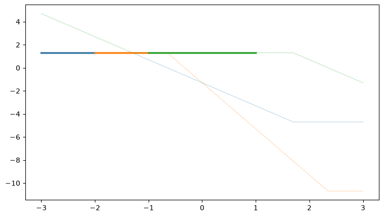

This notebook walks through `analytic_feasibility/period2_net.py` and
`period2_decode.py`, which solve the following puzzle: a residual MLP is
computing `y = sat(x, -c, c)`, and every **probed** residual layer must have
mean activations that don't depend on `c` (that's what makes a linear probe
unable to recover `c`). If probes only look at every *other* layer, the
network gets one hidden ("unprobed") layer per period to reconstruct `c` and
use it, as long as it cleans up after itself before the next probed layer.

The *encoding* side is simple: two channels `v1(x1, c)` and `v2(x1, c)`,
built from one input coordinate `x1`, that are mean-zero in `x1` for every
`c` (so they hide from a probe) but visibly move with `c`. The *decoding*
side is the subtle part — how do you get `c` back out of `(x1, v1, v2)`
using only **one** ReLU layer? That's what this notebook builds up,
step by step, with sliders so you can see the moving parts.

```python
%matplotlib inline
import numpy as np
import matplotlib.pyplot as plt
from ipywidgets import interact, FloatSlider

relu = lambda z: np.maximum(z, 0.0)
C_LO, C_HI = 1.0, 2.0
X_LO, X_HI = -3.0, 3.0
```

## Step 1 — the encoding: `v1(x1, c)` and `v2(x1, c)`

```
v1(x1, c) = -2*relu(-x1 - c)   + 2*relu(x1 - 3 + c)   - c + 1.5
v2(x1, c) = -4*relu(-x1 - c/2) + 4*relu(x1 + c/2 - 3) - c + 3.0
```

As functions of `x1` (fixed `c`), both are flat-bottomed "tents": a flat
plateau, with slope `+2` (for `v1`) or `+4` (for `v2`) outside it. The
plateau edges — the **kinks** — sit at:

- `v1`: `x1 = -c` and `x1 = 3-c`
- `v2`: `x1 = -c/2` and `x1 = 3-c/2`

Since `c` ranges over `[1,2]`, these four kink positions are *always* in the
same left-to-right order: `-c < -c/2 < 3-c < 3-c/2`. Moving the slider
below slides all four kinks left/right together (`v2`'s kinks move at half
the rate of `v1`'s), but never reorders them. That fixed ordering is what
carves `x1` into 5 bands that everything downstream depends on.

```python
def v1f(x, c):
    return -2 * relu(-x - c) + 2 * relu(x - 3 + c) - c + 1.5

def v2f(x, c):
    return -4 * relu(-x - c / 2) + 4 * relu(x + c / 2 - 3) - c + 3.0

x_grid = np.linspace(X_LO, X_HI, 601)

def plot_step1(c):
    v1, v2 = v1f(x_grid, c), v2f(x_grid, c)
    fig, ax = plt.subplots(figsize=(8, 4.5))
    ax.plot(x_grid, v1, label="v1(x1, c)", color="C0", lw=2)
    ax.plot(x_grid, v2, label="v2(x1, c)", color="C1", lw=2)
    kinks_v1 = [-c, 3 - c]
    kinks_v2 = [-c / 2, 3 - c / 2]
    for k in kinks_v1:
        ax.axvline(k, color="C0", ls=":", lw=1, alpha=0.6)
    for k in kinks_v2:
        ax.axvline(k, color="C1", ls=":", lw=1, alpha=0.6)
    ax.set_xlim(X_LO, X_HI)
    ax.set_ylim(-6, 8)
    ax.set_xlabel("x1")
    ax.set_title(f"c = {c:.2f}   (dotted lines: kink positions -c, 3-c, -c/2, 3-c/2)")
    ax.legend(loc="upper left")
    ax.grid(alpha=0.25)
    plt.show()

interact(plot_step1, c=FloatSlider(value=1.3, min=C_LO, max=C_HI, step=0.02, description="c"))
```

    interactive(children=(FloatSlider(value=1.3, description='c', max=2.0, min=1.0, step=0.02), Output()), _dom_cl…

    <function __main__.plot_step1(c)>

## Step 2 — the easy decode (but it needs "gating")

If you already knew which of the 5 bands `x1` was in, reading `c` back out
would be a one-line linear formula — just invert whichever channel is
sloped (or read the flat one directly). It turns out you can even use
**fixed**, `c`-independent windows on `x1` (chosen wide enough that the
true band is always inside them):

| window | formula for `c` |
|---|---|
| `x1 <= -2` | `v1 - 2*x1 - 1.5` |
| `-2 <= x1 <= -1` | `v2 - 4*x1 - 3` |
| `-1 <= x1 <= 1` | `1.5 - v1` |
| `1 <= x1 <= 2` | `3 - v2` |
| `x1 >= 2` | `v1 - 2*x1 + 4.5` |

Each of these 5 formulas, evaluated **everywhere** (not just its own
window), is a different piecewise-linear curve in `x1`. Only inside its own
window is it flat and equal to `c` — outside, it just tracks whatever
`v1`/`v2` are actually doing there. Slide `c` to see all 5 curves move, and
slide `x1` to see which one is "in charge" at that point (the vertical grey
line) — its value should land right on the black diamond marker at height
`c`.

The catch: to actually use this, the network would need to *select* which
of the 5 formulas applies based on `x1` — an if/else (a "min-tree"). That
selection can't be written as `affine + Σ relu(affine)`; it needs more than
one hidden layer. That's exactly the piece Step 3 replaces.

```python
windows = [
    (-3.0, -2.0, "x1<=-2:  v1-2x1-1.5", lambda x, v1, v2: v1 - 2 * x - 1.5),
    (-2.0, -1.0, "[-2,-1]: v2-4x1-3", lambda x, v1, v2: v2 - 4 * x - 3),
    (-1.0, 1.0, "[-1,1]:  1.5-v1", lambda x, v1, v2: 1.5 - v1),
    (1.0, 2.0, "[1,2]:   3-v2", lambda x, v1, v2: 3 - v2),
    (2.0, 3.0, "x1>=2:   v1-2x1+4.5", lambda x, v1, v2: v1 - 2 * x + 4.5),
]
colors = ["C0", "C1", "C2", "C3", "C4"]

def plot_step2(c, x1):
    v1, v2 = v1f(x_grid, c), v2f(x_grid, c)
    fig, ax = plt.subplots(figsize=(9, 5))
    active_label, active_val = None, None
    for (lo, hi, label, f), col in zip(windows, colors):
        y = f(x_grid, v1, v2)
        in_win = (x_grid >= lo) & (x_grid <= hi)
        ax.plot(x_grid[~in_win], y[~in_win], color=col, lw=1, alpha=0.25)
        ax.plot(x_grid[in_win], y[in_win], color=col, lw=2.5, label=label)
        if lo <= x1 <= hi:
            active_label = label
            active_val = f(np.array([x1]), v1f(x1, c), v2f(x1, c))[0]
    ax.axvline(x1, color="grey", lw=1, alpha=0.7)
    ax.scatter([x1], [c], color="black", marker="D", zorder=5, s=60, label="target (x1, c)")
    ax.set_xlim(X_LO, X_HI)
    ax.set_ylim(-4, 7)
    ax.set_xlabel("x1")
    ax.set_ylabel("candidate decode value")
    ax.set_title(
        f"c={c:.2f}, x1={x1:.2f}  ->  active formula '{active_label}' gives {active_val:.4f}"
    )
    ax.legend(loc="upper left", fontsize=8, ncol=1)
    ax.grid(alpha=0.25)
    plt.show()

interact(
    plot_step2,
    c=FloatSlider(value=1.3, min=C_LO, max=C_HI, step=0.02, description="c"),
    x1=FloatSlider(value=0.0, min=X_LO, max=X_HI, step=0.05, description="x1"),
)
```

    interactive(children=(FloatSlider(value=1.3, description='c', max=2.0, min=1.0, step=0.02), FloatSlider(value=…

    <function __main__.plot_step2(c, x1)>

    

    

## Step 3 — curve-vanishing atoms: a "which side" test with no gating

Instead of gating on `x1` directly, build **affine functions of
`(x1, v1, v2)`** — not of `c`! — that are identically zero along one entire
kink curve, for *every* `c`. E.g. for the curve `x1 = -c/2`:

```
P(x1, v1, v2) = -2*x1 + v1 - 1.5
```

Check it: at `x1 = -c/2`, `v1` is still on its flat plateau (`1.5 - c`), so
`P = c + (1.5 - c) - 1.5 = 0`, for *any* `c`. `P` doesn't need to know `c`
— it's already implied by where `v1`/`v2` are.

The useful part is `P`'s **sign** away from the curve: it tells you which
side of the (`c`-dependent, otherwise unknown) kink `x1` is on. Two of the
four kink curves (`x1=-c/2` and `x1=3-c/2`) admit affine combinations like
this that stay a *consistent* sign on each side, for every `c` simultaneously
(found below by a brute-force angle scan over the 2-parameter family of
curve-vanishing affines — the other two curves, `x1=-c` and `x1=3-c`, turn
out to be "creases" with no valid one-sided version, so they're not used).

**Aside — are these atoms monotonic in `x1`?** Not necessarily! The plots
below print a monotonic flag per atom. The two "pure" atoms (angle exactly
0°, i.e. just the raw curve-vanishing basis vector) are simple monotonic
ramps. But most of the 8 chosen atoms are optimized *combinations* of two
basis directions, and those can wobble in the middle — they were only
selected because they cross zero exactly **once**, staying one-signed
everywhere except at their own curve, not because they're monotonic.

```python
# same procedure as period2_net.py / period2_decode.py, at a coarser (but
# still exact-to-1e-13) grid so this cell runs in under a second.
bases = {2: [(-2, 1, 0, -1.5), (-2, 0, 1, -3)], 4: [(0, 1, 0, -1.5), (-2, 0, 1, 3)]}
xs_s = np.linspace(X_LO, X_HI, 401)
cs_s = np.linspace(C_LO, C_HI, 81)
Xg, Cg = np.meshgrid(xs_s, cs_s, indexing="ij")
V1g, V2g = v1f(Xg, Cg), v2f(Xg, Cg)
curve_pos = {2: -Cg / 2, 4: 3 - Cg / 2}

def combo(j, s1, s2):
    b1, b2 = bases[j]
    return tuple(s1 * u + s2 * v for u, v in zip(b1, b2))

def find_two_valid(j, side):
    got = []
    for ang in np.linspace(0, 2 * np.pi, 720, endpoint=False):
        s1, s2 = np.cos(ang), np.sin(ang)
        co = combo(j, s1, s2)
        P = co[0] * Xg + co[1] * V1g + co[2] * V2g + co[3]
        right, left = Xg > curve_pos[j] + 1e-6, Xg < curve_pos[j] - 1e-6
        pr, pl = (P[right] > 1e-9).mean(), (P[left] > 1e-9).mean()
        ok = (pr > 1 - 1e-9 and pl < 1e-9) if side == "R" else (pl > 1 - 1e-9 and pr < 1e-9)
        if ok:
            got.append((s1, s2))
    M = np.array(got)
    dots = M @ M[0]
    i1 = int(np.argmin(np.abs(dots)))
    return [tuple(M[0]), tuple(M[i1])]

atom_coeffs, atom_labels = [], []
for j in (2, 4):
    for side in ("L", "R"):
        for s1, s2 in find_two_valid(j, side):
            atom_coeffs.append(combo(j, s1, s2))
            atom_labels.append(f"curve x1={'-c/2' if j == 2 else '3-c/2'}, side {side}")

print(f"found {len(atom_coeffs)} sign-valid atoms:")
for lbl, co in zip(atom_labels, atom_coeffs):
    print(f"  {lbl:22s}  (a,b,g,d) = {tuple(round(v, 3) for v in co)}")
```

    found 8 sign-valid atoms:
      curve x1=-c/2, side L   (a,b,g,d) = (np.float64(-2.0), np.float64(1.0), np.float64(0.0), np.float64(-1.5))
      curve x1=-c/2, side L   (a,b,g,d) = (np.float64(-0.564), np.float64(0.834), np.float64(-0.552), np.float64(0.405))
      curve x1=-c/2, side R   (a,b,g,d) = (np.float64(0.564), np.float64(-0.834), np.float64(0.552), np.float64(-0.405))
      curve x1=-c/2, side R   (a,b,g,d) = (np.float64(2.345), np.float64(-0.982), np.float64(-0.191), np.float64(2.045))
      curve x1=3-c/2, side L  (a,b,g,d) = (np.float64(-1.414), np.float64(-0.707), np.float64(0.707), np.float64(3.182))
      curve x1=3-c/2, side L  (a,b,g,d) = (np.float64(0.313), np.float64(-0.988), np.float64(-0.156), np.float64(1.012))
      curve x1=3-c/2, side R  (a,b,g,d) = (np.float64(0.0), np.float64(1.0), np.float64(0.0), np.float64(-1.5))
      curve x1=3-c/2, side R  (a,b,g,d) = (np.float64(1.402), np.float64(0.713), np.float64(-0.701), np.float64(-3.173))

```python
def plot_step3(c):
    v1, v2 = v1f(x_grid, c), v2f(x_grid, c)
    kink_positions = [-c, -c / 2, 3 - c, 3 - c / 2]
    fig, axes = plt.subplots(2, 4, figsize=(16, 6), sharex=True, sharey=True)
    for ax, lbl, (a, b, g, d) in zip(axes.ravel(), atom_labels, atom_coeffs):
        P = a * x_grid + b * v1 + g * v2 + d
        signs = np.sign(P)
        nz = signs[signs != 0]
        n_sign_changes = int((np.diff(nz) != 0).sum())
        monotonic = bool(np.all(np.diff(P) >= -1e-9) or np.all(np.diff(P) <= 1e-9))
        ax.plot(x_grid, P, color="C4", lw=2)
        ax.axhline(0, color="black", lw=0.8)
        for k in kink_positions:
            ax.axvline(k, color="grey", ls=":", lw=0.8, alpha=0.6)
        ax.set_title(f"{lbl}\nsign changes={n_sign_changes}, monotonic={monotonic}", fontsize=9)
        ax.grid(alpha=0.2)
    fig.suptitle(f"the 8 curve-vanishing atoms P_j(x1) at c = {c:.2f}", y=1.03)
    fig.tight_layout()
    plt.show()

interact(plot_step3, c=FloatSlider(value=1.3, min=C_LO, max=C_HI, step=0.02, description="c"))
```

    interactive(children=(FloatSlider(value=1.3, description='c', max=2.0, min=1.0, step=0.02), Output()), _dom_cl…

    <function __main__.plot_step3(c)>

## Step 4 — summing ReLUs of the atoms to build `c`

Once the 8 atoms are one-sided, `c` is just the standard "piecewise-linear
function as base + Σ ReLU ramps" identity:

```
c = a*x1 + b*v1 + g*v2 + k + Σ_j  w_j * relu(P_j(x1, v1, v2))
```

The base affine coefficients `(a,b,g,k)` and the 8 weights `w_j` are found
by least-squares over the `(x1,c)` grid (this is exactly solvable — the
residual is ~`1e-14`, i.e. exact up to floating point).

In the plot: **dashed** lines show each term `w_j * P_j` *without* the ReLU
clip (i.e. what it would be if it kept going negative); **solid** lines show
what's actually used, `w_j * relu(P_j)` (zero on one side, linear on the
other). The thick black line is the running sum, which should sit flat on
the grey reference line at `c`.

```python
featg = [np.ones_like(Xg), Xg, V1g, V2g] + [
    relu(a * Xg + b * V1g + g * V2g + d) for (a, b, g, d) in atom_coeffs
]
A_mat = np.stack([f.ravel() for f in featg], axis=1)
w_dec, *_ = np.linalg.lstsq(A_mat, Cg.ravel(), rcond=None)
max_err = np.abs(A_mat @ w_dec - Cg.ravel()).max()
print(f"decode fit: c = base(x1,v1,v2) + sum w_j*relu(atom_j), max|error| = {max_err:.2e}")
print("base (const, x1, v1, v2):", np.round(w_dec[:4], 4))
print("atom weights w_j:", np.round(w_dec[4:], 4))
```

    decode fit: c = base(x1,v1,v2) + sum w_j*relu(atom_j), max|error| = 9.10e-15
    base (const, x1, v1, v2): [-0.3281 -0.7519  0.0184  0.1592]
    atom weights w_j: [ 2.0982 -1.5768 -1.7954  0.7272  0.119   0.7265  1.1686  0.0144]

```python
def plot_step4(c):
    v1, v2 = v1f(x_grid, c), v2f(x_grid, c)
    base = w_dec[0] + w_dec[1] * x_grid + w_dec[2] * v1 + w_dec[3] * v2
    fig, ax = plt.subplots(figsize=(9, 5))
    running = base.copy()
    ax.plot(x_grid, base, color="black", lw=1, ls="--", alpha=0.5, label="base affine")
    for j, ((a, b, g, d), w) in enumerate(zip(atom_coeffs, w_dec[4:])):
        Pj = a * x_grid + b * v1 + g * v2 + d
        unclipped = w * Pj
        clipped = w * relu(Pj)
        col = f"C{j % 10}"
        ax.plot(x_grid, unclipped, color=col, lw=1, ls=":", alpha=0.5)
        ax.plot(x_grid, clipped, color=col, lw=1.2, alpha=0.8)
        running = running + clipped
    ax.plot(x_grid, running, color="black", lw=2.5, label="running sum (= decoded c)")
    ax.axhline(c, color="grey", lw=1, alpha=0.7, label=f"target c = {c:.2f}")
    ax.set_xlim(X_LO, X_HI)
    ax.set_ylim(-2, 5)
    ax.set_xlabel("x1")
    ax.set_title(
        f"c={c:.2f}: dotted=w_j*P_j (unclipped), solid colored=w_j*relu(P_j), "
        f"black=sum (max dev from c: {np.abs(running - c).max():.1e})"
    )
    ax.legend(loc="upper right", fontsize=8)
    ax.grid(alpha=0.25)
    plt.show()

interact(plot_step4, c=FloatSlider(value=1.3, min=C_LO, max=C_HI, step=0.02, description="c"))
```

## Step 5 — wiring it into the network (bookkeeping, no plot needed)

Given the formula from Step 4, the network schedule (`period2_net.py`) is:

- **Block `2k`** (an unprobed layer): compute the 8
  `Q_j = relu(atom_j(x1, v1, v2))` and write them to 8 fresh residual
  dimensions. Everything on the right-hand side (`x1`, `v1`, `v2`) is
  already resident in the residual stream, so this is one ordinary MLP
  block (linear-in, ReLU, linear-out).
- **Block `2k+1`** (a probed layer): fold `c_hat = affine(x1, v1, v2,
  Q_1..Q_8)` directly into the *pre-activations* of the coordinate-finishing
  neurons — `relu(x_i - c_hat)` and `relu(-x_i - c_hat)` — rather than
  materializing `c_hat` as its own residual dimension. Since `c_hat` is a
  linear function of dimensions already in the residual, this needs no
  extra ReLU: it's a "linear read" that happens for free inside the next
  block's input projection. The same block also clears the 8 `Q_j` dims
  back to zero (one always-on neuron per dim) so the next probed layer sees
  no leftover trace of the decode — only `[finished coords, pending x, 0,
  v1, v2, 0]`, which is exactly the mean-constant content the probe sees at
  every probed layer.

