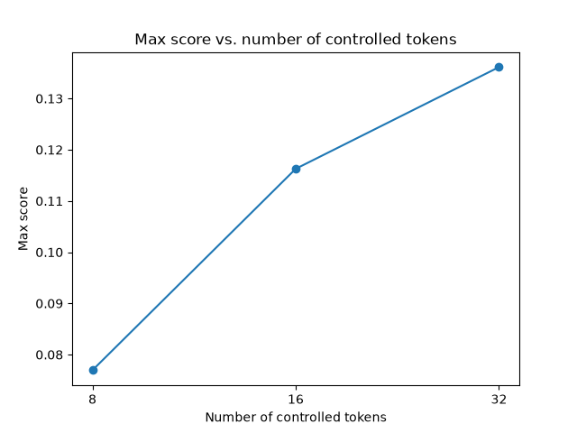
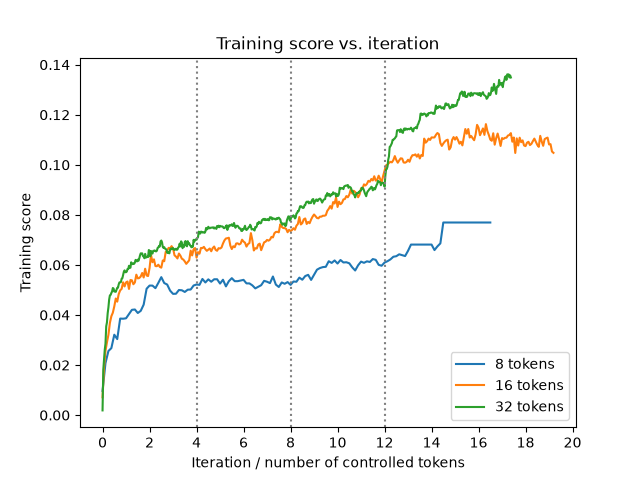
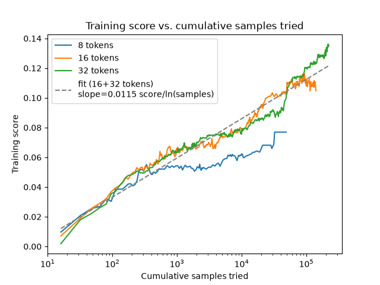

I stumbled upon [Steering Arena](https://sohampadianeu-steering-arena.hf.space/), a project by [Soham Padia](https://soham-padia.github.io/). This competition challenges people to find an LLM prompt prefix that increases the score of the rest of the prompt on a linear probe.

For those unaware: linear probes are an important basic tool in the mechanistic interpretability toolkit. Other sources explain them in more depth -- for example, [ARENA](https://learn.arena.education/chapter1_transformer_interp/11_probing/) -- but briefly, LLMs seem to store concepts as directions in a high-dimensional space. By contrasting prompts with and without a given concept (for example, whether a sentence is talking about cats, or whether a fact is true) and looking at the model's activations, we can infer what direction corresponds to that concept. We can then use that to monitor a model, to see if it's thinking about something -- particularly useful if you're trying to figure out, for example, if your model is about to give advice on how to build a bomb.

The idea of Steering Arena is, can we find some prefix string, to be prepended to a range of neutral prompts, that will consistently steer the model's activations in the probed direction? Aside from just being an interesting question, this also has applications in model security -- it's important to understand how robust monitoring techniques are to adversarial attacks. (As we'll see, linear probes probably aren't very robust.)

## Greedy Coordinate Gradients
I chose to tackle this problem with Greedy Coordinate Gradients, described in [Accelerating Greedy Coordinate Gradient and General Prompt Optimization via Probe Sampling](https://arxiv.org/abs/2307.15043). That paper optimizes a prompt in an attempt to find a universal jailbreak for LLMs, with a substantial amount of effort and insight dedicated to what the objective function even should be. Luckily for me, this project doesn't face that issue; my objective is simply the cosine similarity between the activations at a particular layer and a specified probe direction. (It is worth noting that this score is simply what Steering Arena implements; usually linear probe monitors evaluate activations by projecting onto the probe's direction and evaluating with respect to some threshold.)

Slightly more formally, the problem is as follows: We control a prefix string (`prefix`), which gets prepended to one of several uncontrolled but known prompts (`suffix`).
The most immediate problem is that optimizing over tokens is a discrete problem, whereas optimizers tend to prefer continuous spaces. However, we basically immediately embed the tokens into the continuous space $\mathbb{R}^v$ (using one-hot embedding, where $v$ is the vocabulary size), so the simple workaround is to get gradients in the one-hot embedding space, and "snap to" the valid points.
At a high level, each iteration of the optimization algorithm works like this (Algorithm 1 in the paper):
- Run a forward pass on your data, and evaluate the gradient of the score with respect to the one-hot embeddings.
- For each token position, find the tokens (which correspond to the vocab dimension) with the highest gradients. Pick the top $k$ such tokens.
- On each iteration, generate $B$ candidates (the "batch size").
    - Each candidate modifies a single token from the current `prefix`. Which token is modified is randomly selected (uniformly over token positions), and what it's modified to is also randomly selected (uniformly over the top $k$ tokens we found in the previous step).
- Across your $B$ candidates, pick the best performing one as your new `prefix`.

### Implementation details and tricks

- The actual evaluation score on Steering Arena includes a constant bias term, to compensate for the baseline probe score from the test prompts themselves -- but since those are constant, I don't include them when optimizing.
- The initial prompt doesn't really matter too much; I just repeat token ID 0 (which turns out to be "!") for however many tokens are controlled.
- To speed up convergence, I start with a smaller batch size $B$ and top-$k$ value.
    - I find that a good training schedule is to increase $B$ by a factor of 4 and $k$ by a factor of 2, every $4N$ iterations (where $N$ is the number of controlled tokens) -- although I didn't rigorously validate this.
- I hypothesize (mostly with intuition rather than actual justification) that after a certain point, the gradient doesn't really give you much signal anymore, since the loss landscape changes too quickly. At that point, using something like [simulated annealing (SA)](https://en.wikipedia.org/wiki/Simulated_annealing) might be more effective for further hill climbing. To that end, I did put in an SA-like check on when to accept a new candidate. If the new candidate scores better, it's always accepted; otherwise, the acceptance probability is less than 1, and decreases for worse candidate scores.
    - I didn't actually check to see if this is an improvement, although I figure it probably is.
- Optimizers tend to be really good at exploiting differences between your training metric and evaluation metric, and this project is no different.
    - I find that at later stages of optimization, the score reported by the local implementation (`transformers` library) can differ quite substantially from that reported by the Steering Arena website (which uses NDIF servers), possibly due to e.g. differences in order of specific floating-point operations.
        However, I didn't have time to look into the cause further.
        (This discrepancy is different from the constant bias term, since it differs on a per-submission basis.)
    - For reproducers: As of writing, I used `transformers` version 5.10.2; this is different from the latest version and turns out to have substantial impact on scored results. However, this is not sufficient to fully reproduce the NDIF values.

## Results
I didn't want to spend too much on compute, so I didn't make that many runs. I only have three runs in what I'd call a controlled experiment: runs for 8, 16, and 32 controlled tokens. For each run, I ran at least $4N$ iterations, following the training schedule mentioned earlier for batch size and top-$k$ tokens.

It's hard to get confident results with limited data, but there's still some hints of interesting conclusions. Note that because I don't have access to NDIF servers myself, reported scores here come from the `transformers` library implementation, and (as noted above) differ from the scores seen on Steering Arena.

First, unsurprisingly, more controlled tokens lead to higher scores:

Here's a plot of training score as a function of number of iterations:

However, what's more striking is if you plot score against cumulative number of samples (increases by the batch size on each iteration), on a semilog plot:

Training score seems to basically follow a straight line, although the 8 tokens run saturates and slows down after a bit. Of course, all runs eventually have to saturate, but it's plausible you could throw more compute at the 16 and 32 token runs to get even higher scores. I fit a line to the 16 and 32 token runs and get a slope of 0.115 score/ln(samples). I don't know how readily this generalizes (to steering in other directions, different test prompts, etc.), but it seems like a reasonable baseline to estimate compute requirements from.

## Future work
### Faster optimizers
There are definitely more performance gains to be made and directions to explore, in terms of convergence speed:
- First of all, it'd be ideal if the training schedule I tried was actually validated more carefully.
- You could probably try changing more than one token at a time, or sampling the top-$k$ choices non-uniformly so that candidates with higher gradients are more likely.
    - These might work better at earlier stages where the gradient provides a more accurate signal
- Overall optimization time is dominated by later stages of optimization, so it might be worth it to run multiple initial starts to see which one gives a better starting point, for later stages.
- There are algorithmic improvements to GCG in the literature, for example [this paper](https://arxiv.org/abs/2403.01251) which uses a smaller "draft" model to reduce the cost of sampling.
- More generally, the optimization literature has been around for a long time -- I'm sure the simulated annealing literature has more tricks that might apply here.

Also, there's a bit more work to improve reproducibility between the training and NDIF implementations -- or, barring that, some workaround to improve robustness to implementation differences (such as injecting small amounts of simulated numerical noise).

### Robustness
- Steering Arena only tests the results on 16 prompts. How overfitted is the prompt prefix to those exact prompts? How high of a score can you get when you need to work with a larger set of prompts?
    - Conversely, how high of a score can you get if you're only working with one prompt?
- Steering Arena scores results by cosine similarity, rather than absolute magnitude along the probe direction. So, what is the adversarial prompt doing to the magnitude of the activations? Is it driving the overall magnitude down, so that the direction corresponding to the probe contributes relatively more?
- The original GCG paper found that, surprisingly, their prompts transferred to other models that they didn't train against. Does that happen here too -- if you retrain the probe direction with a new model, and use the GCG-optimized prompt from the existing model, does the prompt still score highly on the probe?

## Code
[The code for this work is on GitHub](https://github.com/jesseli2002/steering-arena-optim).
