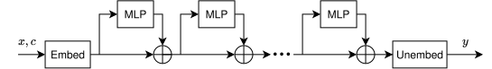

*I completed this work as part of the [BlueDot Impact Technical AI Safety Project](https://bluedot.org/courses/technical-ai-safety-project).*

Training against probes is considered a [forbidden technique](https://www.lesswrong.com/posts/mpmsK8KKysgSKDm2T/the-most-forbidden-technique), because the model might learn to obfuscate its activations instead of behaving better. Can we create a toy example of this? More specifically -- under optimization pressure, will a toy model learn to encode a feature to be challenging to detect with linear probes?

In this research, I give theoretical and empirical evidence that models can and will defeat adversarially-trained linear probes, in at least some configurations, when trained against those probes.
I investigated this problem with a simple residual-stream MLP architecture:

The model tries to learn $y = \text{sat}(x, -c, c)$ (the saturation function, equivalently $y = \max(-c, \min(c, x))$).
$x$ is a vector of dense features sampled uniformly from $[-3, 3]$, and $c$ is a scalar sampled uniformly in $[1, 2]$.
This is a fairly easy function to learn - it takes just $2 \cdot \text{len}(x)$ neurons to learn exactly if you use ReLUs. [^1]
The harder question is, can a model do this without storing $c$ in the residual stream, in a way that can be linearly probed?
Here:

- $c$ represents some safety-relevant behaviour we want to probe for - say, deception.
- $x$ represent various other features that a model might want to represent, uncorrelated with $c$.
- $y$ represents some sort of computation the model would like to make, dependent on $c$.
  - For example, based on how deceptive the model intends to be (represented at some earlier layer), the model might upweight misleading information at some later layer.
  - Such an action will ultimately come down to various computational primitives.
  - $\text{sat}$ is hopefully representative of such a primitive -- for example, it can be considered a rough approximation to the more common sigmoid function. (Note: $\text{sat}$ was primarily chosen for its theoretical properties, as discussed below, not because it's necessarily a natural computaitional primitive.)

## Why this task, and why this model?
- The toy architecture is at least vaguely similar to the transformer architecture.
It's missing attention (and the entire notion of a token sequence) and LayerNorm.
However, it doesn't really add anything new to a transformer, so any obfuscation that this model learns could plausibly also be learned by a transformer.

- The learned function is not linearly separable in $c$.
Thus, once the model has finished computing $y_i$ for one feature $x_i$, it can just leave $y_i$ in the residual stream.
This is vaguely analogous to how probe accuracy gets worse on the last layers of a transformer model, as the model starts shifting its representation from more abstract concepts to the exact text it wants to output.

- Because it takes at least $2 \cdot \text{len}(x)$ neurons to implement $y$, as long as the width of the MLP blocks is less than $2 \cdot \text{len}(x)$, we can be sure the model has represented $c$ somehow in the first layer (or the model hasn't actually learned the task fully).
More generally, the model needs to encounter at least $2 \cdot \text{len}(x)$ neurons before it can "forget" about $c$ and fully erase its representation.
We can use this property in experiments to guarantee that the model is representing $c$ at a particular early layer.

Note: for training and theoretical simplicity, this work fixes the embedding and unembedding matrices to be rectangular identity matrices (i.e. ones on the main diagonal, zero elsewhere)

## Related work
- [Neural Chameleons](https://arxiv.org/abs/2512.119490) find that you can fine-tune models to evade latent space linear probes, including for previously unseen probes
  - However, as far as I can tell, they use fixed probes, which don't rule out the model simply learning to apply a fixed translation or rotation to its representation.
   This is obfuscation in some sense, but not particularly complex obfuscation.
- [Training Against Harmfulness Probes Induces Harmlessness without Refusals](https://openreview.net/forum?id=MNyRHndSzH) train adaptive probes on harmfulness, where the probe is updated regularly along with model training, and find that this successfully improves harmlessness.
  - They do this on a real model.
  Plausibly, the task that their model learns can be accomplished with equally high scores without needing to be harmful.
  In contrast, since I use a toy model, it's easy to construct an environment where the model has to hide its activations to succeed.

## Posts
I present my results in parts:

- [Part 1: Analytic nonlinear feature obfuscation with two MLP blocks]()
  - An analytic construction using a small number of neurons, that fully defeat Difference-of-Means probes (by having the mean activations be a constant in $c$) and effectively defeat logistic regression probes, as long as the probes are spaced at least every 2 MLP blocks apart.
- [Part 2: Initial empirical results]()
  - The setup and results for a single training run, giving evidence that the trained model has successfully learned to reversibly obfuscate its activations from a linear probe at a single layer.
- Part 3: Sweeping hyperparameters (WIP)
  - The results of sweeping some hyperparameters, to see how robust the model's training is to different conditions.
- Part 4: Next steps (WIP)

[^1]: Specifically, use $y = x - \text{ReLU}(x - c) + \text{ReLU}(-x - c)$
